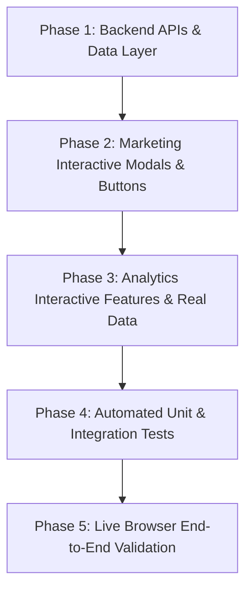

# Implementation Plan — Analytics & Marketing Features

## Overview
This document presents a comprehensive, step-by-step technical implementation plan for all missing features, interactive elements, database schemas, backend API routes, UI modals, and automated tests for the **Marketing & Store Growth** (`/marketing`) and **Store Insights & Analytics** (`/analytics`) modules.

---

## Findings from Live Browser & Code Inspection

### 1. Marketing Module (`/marketing`)
- ❌ **Share Shop Link ("Copy Link")**: Non-functional. Needs dynamic seller store link clipboard copy + toast alert.
- ❌ **WhatsApp Sharing ("Open WhatsApp")**: Non-functional. Needs pre-filled WhatsApp API intent link (`wa.me/?text=...`) to share store/products directly.
- ❌ **Referral Program ("Manage Invites")**: Non-functional. Needs `ReferralProgramModal` + API to manage seller referral codes, invite links, and customer rewards.
- ❌ **Coupons & Promos ("Create Coupon")**: Non-functional. Needs `CreateCouponModal` + `/api/seller/marketing/coupons` API to create percentage/flat discount codes, set usage limits, min order amounts, and expiry dates.
- ❌ **Dynamic QR Codes ("Generate PNG")**: Non-functional. Needs `QRCodeModal` rendering dynamic QR code of the shop URL with high-definition PNG download function.
- ❌ **Digital Business Cards ("Export PDF")**: Non-functional. Needs `BusinessCardModal` showing store branding, seller WhatsApp, shop URL, QR code, and print-ready PDF export.
- ❌ **Campaign Performance**: Currently static demo cards. Needs dynamic `/api/seller/marketing/campaigns` API to fetch real seller campaigns and a `CreateCampaignModal` to launch new campaigns.

### 2. Analytics Module (`/analytics`)
- ❌ **Timeframe Selector**: Header currently lacks interactive timeframe tabs (`7d`, `30d`, `90d`, `1y`) to switch metrics dynamically.
- ❌ **Top Products**: Hardcoded demo data in `InsightPanels`. Needs to display real seller products from `data.topProducts` fetched via `useAnalytics`.
- ❌ **Smart Recommendations**: Recommendation action buttons ("Create Restock Order", "Boost Campaigns") do not trigger actions. Needs interactive modals/links.
- ❌ **Export Analytics**: Missing "Export CSV" feature to download store performance reports.

---

## Phase-by-Phase Technical Implementation Steps

### Phase 1: Database Wiring, DTOs, Repositories, Services & APIs

1. **Marketing DTOs (`packages/modules/modules/marketing/dto/`)**:
   - `coupon.dto.ts`: Zod schema validation for creating promotions/coupons (code, discount type, value, min order amount, max usage, expiry date).
   - `campaign.dto.ts`: Zod schema for marketing campaigns.
   - `referral.dto.ts`: Zod schema for referral programs.

2. **Marketing Repositories & Services (`packages/modules/modules/marketing/repository/` & `services/`)**:
   - `coupons.repository.ts`: Database CRUD using `promotions` table in `packages/db/db/schema/marketing/promotion.ts`.
   - `campaigns.repository.ts`: Database queries for seller campaign stats.
   - `referrals.repository.ts`: Database queries using `referralCodes` and `referralRewards` schema tables.
   - `marketing.service.ts`: Business logic orchestrating coupons, campaigns, and referral actions.

3. **API Routes (`apps/seller/app/api/seller/marketing/`)**:
   - `coupons/route.ts` (GET list seller coupons, POST create new coupon, DELETE coupon).
   - `campaigns/route.ts` (GET active campaigns, POST launch new campaign).
   - `referrals/route.ts` (GET referral code & reward stats, POST update referral structure).

---

### Phase 2: Marketing UI Components, Modals & Button Handlers

1. **Custom React Hooks (`packages/modules/modules/marketing/hooks/`)**:
   - `use-coupons.ts`: Manage fetch, create, and delete states for seller coupons.
   - `use-campaigns.ts`: Manage active campaigns state.
   - `use-referrals.ts`: Manage referral program state.

2. **Modals & Dialog Components (`packages/modules/modules/marketing/view/modals/`)**:
   - **`CreateCouponModal`**: Form with auto-generate code button, discount type (percentage/flat), discount value, minimum order value, max usages, and expiry date.
   - **`QRCodeModal`**: Interactive canvas QR code preview with custom shop URL and downloadable high-definition PNG file.
   - **`BusinessCardModal`**: Digital business card design featuring store logo, shop URL, seller phone/WhatsApp, QR code, and print PDF button.
   - **`ReferralProgramModal`**: Form to configure customer referral discounts and view active customer invites.
   - **`CreateCampaignModal`**: Form to launch a new marketing push.

3. **Wire Growth Tools (`marketing-toolkit.tsx`)**:
   - **Share Shop Link**: Copy store URL (`${window.location.origin}/store/${sellerSlug}`) to clipboard with Toast alert feedback.
   - **WhatsApp Sharing**: Construct pre-formatted `https://wa.me/?text=...` message link and open in window.
   - **Referral Program**: Open `ReferralProgramModal`.
   - **Coupons & Promos**: Open `CreateCouponModal` and display active coupons table below.
   - **Dynamic QR Codes**: Open `QRCodeModal`.
   - **Digital Business Cards**: Open `BusinessCardModal`.

---

### Phase 3: Analytics Interactive Features & Real Data Wiring

1. **Time-frame Selector & Export (`analytics-page.tsx` & `analytics-grid.tsx`)**:
   - Add interactive timeframe pill filter (`7 Days`, `30 Days`, `90 Days`, `1 Year`) updating state in `useAnalytics(timeframe)`.
   - Add `Export CSV` button generating client CSV download of revenue and order breakdown.

2. **Dynamic Insight Panels (`insight-pannels.tsx`)**:
   - Bind `data.topProducts` to render real database products, sales volume, and earnings.
   - Wire action buttons on Smart Recommendations to open relevant modals (e.g., "Boost Campaigns" opens `CreateCampaignModal`).

---

### Phase 4: Automated Unit Testing

Write comprehensive unit tests in `packages/modules/tests/marketing.test.ts` and `packages/modules/tests/analytics.test.ts`:
- Test coupon creation validation (invalid code format, negative discount values, past dates).
- Test coupon discount calculation helper functions.
- Test referral code generation logic.
- Test analytics aggregation helper functions (revenue sum, AOV computation, timeframe date range filtering).

---

### Phase 5: End-to-End Live Browser Validation

Using browser testing tools:
1. Verify clicking every button on `/marketing` (Copy Link, Open WhatsApp, Manage Invites, Create Coupon, Generate PNG, Export PDF).
2. Verify form input, submission, and database persistence in `CreateCouponModal`.
3. Verify QR code rendering and PNG download.
4. Verify digital business card PDF export.
5. Verify timeframe switching on `/analytics` updates all revenue/order numbers dynamically.
6. Verify smart recommendation action triggers.

---

## User Input Options
If you have specific social media handles, email templates, or WhatsApp phone numbers/messages you would like pre-filled in the sharing tools, please specify. Otherwise, default dynamic store values from the authenticated seller profile will be used.
