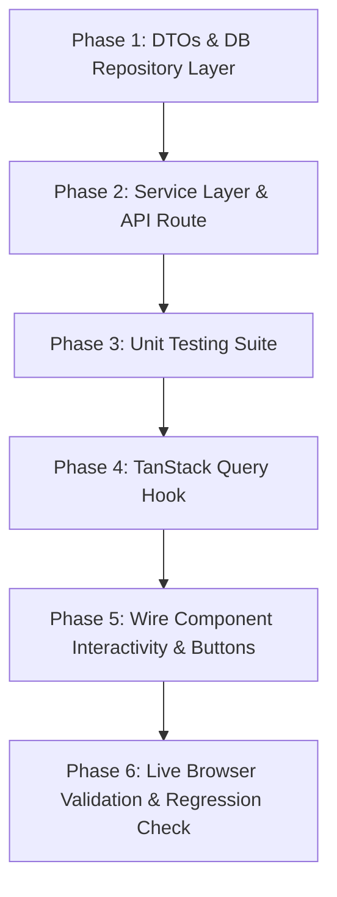

# Production-Grade Implementation Plan: Seller Dashboard

## 1. Executive Summary & Live Browser Audit Findings

A live inspection of the seller dashboard was conducted at `http://localhost:3000/dashboard` authenticated as `armanalam78578@gmail.com`.

### Current State Assessment
The dashboard currently presents an attractive, responsive UI layout across 8 major sections. However, **100% of the data is static or hardcoded**, and **all buttons across cards are dead placeholders** (rendered as `<button>` without `onClick` handlers or `<a>` tags without navigation).

| Component / Section | Current Source File | Current State | Missing Functionality / Broken Interactivity |
|---|---|---|---|
| **Welcome Card** | [`welcomeCard.tsx`](file:///d:/web%20development/project/needlon_sellor-main/needlon_sellor-main/packages/modules/modules/dashboard/ui/welcomeCard.tsx) | Hardcoded in [`welcomeData.ts`](file:///d:/web%20development/project/needlon_sellor-main/needlon_sellor-main/packages/modules/modules/dashboard/data/welcomeData.ts) | Cards have hover arrows but no click navigation to respective sub-modules (`/orders`, `/earnings`, `/analytics`, `/messages`). |
| **Quick Actions** | [`quickActions.tsx`](file:///d:/web%20development/project/needlon_sellor-main/needlon_sellor-main/packages/modules/modules/dashboard/ui/quickActions.tsx) | Hardcoded in [`quickActionData.ts`](file:///d:/web%20development/project/needlon_sellor-main/needlon_sellor-main/packages/modules/modules/dashboard/data/quickActionData.ts) | All 4 action buttons ("Add Product", "Share Shop", "View Orders", "Withdraw Earnings") do nothing when clicked. |
| **Earnings Summary** | [`Earnings.tsx`](file:///d:/web%20development/project/needlon_sellor-main/needlon_sellor-main/packages/modules/modules/dashboard/ui/Earnings.tsx) | Hardcoded in [`earningsData.ts`](file:///d:/web%20development/project/needlon_sellor-main/needlon_sellor-main/packages/modules/modules/dashboard/data/earningsData.ts) | "Withdraw funds" button is inert; 7-day bar chart shows hardcoded amounts and fixed height percentages (`h-[35%]`, etc.). |
| **Smart Insights** | [`BuisinessInsights.tsx`](file:///d:/web%20development/project/needlon_sellor-main/needlon_sellor-main/packages/modules/modules/dashboard/ui/BuisinessInsights.tsx) | Hardcoded in [`buisinessInsightData.ts`](file:///d:/web%20development/project/needlon_sellor-main/needlon_sellor-main/packages/modules/modules/dashboard/data/buisinessInsightData.ts) | "Restock now" and "Add item" buttons are dead; recommendations are static mock objects. |
| **Performance Snapshot** | [`performance-snapshot.tsx`](file:///d:/web%20development/project/needlon_sellor-main/needlon_sellor-main/packages/modules/modules/dashboard/ui/performance-snapshot.tsx) | Hardcoded in [`performance-snapData.ts`](file:///d:/web%20development/project/needlon_sellor-main/needlon_sellor-main/packages/modules/modules/dashboard/data/performance-snapData.ts) | Sparkline data points and metric values (+14.2%, 42 items, etc.) are fixed; cards lack drill-down links to `/analytics`. |
| **Recent Activity / Orders** | [`recent-orders.tsx`](file:///d:/web%20development/project/needlon_sellor-main/needlon_sellor-main/packages/modules/modules/dashboard/ui/recent-orders.tsx) | Hardcoded in [`recent-orderData.ts`](file:///d:/web%20development/project/needlon_sellor-main/needlon_sellor-main/packages/modules/modules/dashboard/data/recent-orderData.ts) | "View all orders" is dead; "Accept" (Check), "Reject" (X), and "Chat" buttons on each row do not mutate or route. |
| **Seller Growth** | [`seller-grawths.tsx`](file:///d:/web%20development/project/needlon_sellor-main/needlon_sellor-main/packages/modules/modules/dashboard/ui/seller-grawths.tsx) | Hardcoded in [`gamified-card.tsx`](file:///d:/web%20development/project/needlon_sellor-main/needlon_sellor-main/packages/modules/modules/dashboard/view/gamified-card.tsx) | Progress bar and milestone checklist are hardcoded (60%); clicking incomplete milestones does not open settings/profile. |
| **Products Overview** | [`products-overview.tsx`](file:///d:/web%20development/project/needlon_sellor-main/needlon_sellor-main/packages/modules/modules/dashboard/ui/products-overview.tsx) | Hardcoded in [`dashboard-productsData.ts`](file:///d:/web%20development/project/needlon_sellor-main/needlon_sellor-main/packages/modules/modules/dashboard/data/dashboard-productsData.ts) | "+ Add product", "Edit", "Duplicate" (Copy), and "Share link" buttons on product cards are dead. |

---

## 2. Dynamic Data & Database Schema Mapping

To make the dashboard production-grade, all data must be retrieved from `@needlon/db` scoped to `seller.id` (via `getCurrentSellerOrThrow()`).

### 2.1. Welcome Card (`WelcomeCard`)
- **Today's Sales**:
  - *Query*: `SUM(orders.grandTotal)` where `sellerId = seller.id AND orders.createdAt >= CURRENT_DATE AND orders.status NOT IN ('CANCELLED', 'RETURNED')`.
  - *Comparison*: Compared against yesterday's sales (`orders.createdAt >= YESTERDAY AND orders.createdAt < CURRENT_DATE`) to compute dynamic `+X%` or `-X%`.
- **Today's Orders**:
  - *Query*: `COUNT(orders.id)` placed today vs yesterday.
- **Visitors**:
  - *Query*: Storefront visits aggregated from analytics logs or product view counts for the seller's catalog over the last 24h.
- **Pending Messages / Notifications**:
  - *Query*: `COUNT(*)` unread messages from buyer conversations (`messages` table) or open support tickets.
- **Interactive Behavior**:
  - Today's Sales card click -> `router.push('/earnings')`
  - Orders card click -> `router.push('/orders')`
  - Visitors card click -> `router.push('/analytics')`
  - Pending Messages card click -> `router.push('/messages')`

### 2.2. Quick Actions (`QuickActions`)
- **Add Product** (Primary dark card):
  - *Action*: `router.push('/products/new')`
- **Share Shop** (Blue card):
  - *Dynamic Context*: Fetch `sellerStore.storeSlug` or `sellerStore.storeName`.
  - *Action*: Copies `${window.location.origin}/shop/${storeSlug}` to clipboard; displays toast: `"Store link copied to clipboard!"`. Uses native `navigator.share` if available on mobile.
- **View Orders** (Purple card):
  - *Action*: `router.push('/orders')`
- **Withdraw Earnings** (Emerald card):
  - *Action*: `router.push('/earnings')` or triggers Payout Request modal.

### 2.3. Earnings Summary (`Earnings`)
- **Available Balance**:
  - *Query*: Derived from existing financial calculations in [`getSellerEarningsSummary`](file:///d:/web%20development/project/needlon_sellor-main/needlon_sellor-main/packages/modules/modules/earnings/repository/earnings.repository.ts):
    `Net Delivered Sales - Total Settled Payouts - Total Pending Payouts`.
- **Growth Percentage**:
  - *Query*: Compare current 7-day revenue against previous 7-day revenue: `((currentWeek - prevWeek) / prevWeek) * 100`.
- **7-Day Dynamic Chart**:
  - *Query*: Group completed/paid orders by day over the last 7 calendar days (`Mon` through `Sun`).
  - *Dynamic Column Calculation*: Calculate max revenue in the 7 days: `heightPercent = Math.max(15, Math.round((dayRevenue / maxRevenue) * 100))`. Set bar `height: ${heightPercent}%`.
  - *Hover Popover*: Real currency-formatted amount `₹${dayRevenue.toLocaleString('en-IN')}`.
- **"Withdraw funds" Button**:
  - *Action*: If balance > 0, navigate to `/earnings` (or trigger payout request dialog); if balance <= 0, display toast: `"No available balance to withdraw."`.

### 2.4. Smart Insights (`BusinessInsights`)
Dynamic rule-based recommendation generator evaluated on load:
1. **Low Stock Detection**:
   - *Query*: Check if any product has `inventory.quantity <= 5`.
   - *Dynamic Card*: `"Your [Product Title] has only [X] items left in stock."`
   - *Action Button*: `"Restock now"` -> `router.push('/inventory')` or `/products/[id]/edit`.
2. **Pending Fulfillment Detection**:
   - *Query*: Check if count of orders with `status = 'PENDING'` is > 0.
   - *Dynamic Card*: `"[X] incoming orders require confirmation and packing."`
   - *Action Button*: `"Process orders"` -> `router.push('/orders?status=PENDING')`.
3. **Catalog Growth Suggestion**:
   - *Query*: If total active products < 5:
   - *Dynamic Card*: `"Add 5 more products this week to boost storefront discovery by 25%."`
   - *Action Button*: `"Add item"` -> `router.push('/products/new')`.
4. **Bank Account Setup Alert**:
   - *Query*: If seller has no verified bank account in `seller_bank_account`:
   - *Dynamic Card*: `"Link your bank account to enable automatic payouts."`
   - *Action Button*: `"Link bank"` -> `router.push('/settings/bank')`.

### 2.5. Performance Snapshot (`PerformanceSnapshot`)
- **Revenue**: 30-day sum of `orders.grandTotal`, trend % vs prior 30 days, 7-point sparkline array.
- **Products Sold**: 30-day sum of `order_items.quantity`, trend % vs prior 30 days, 7-point sparkline array.
- **Conversion Rate**: Orders count divided by total catalog views * 100 (default 3.2% if views = 0).
- **Returning Customers**: `(repeatCustomers / totalCustomers) * 100`, trend % vs prior month.
- **Sparklines**: Dynamically plotted SVG `<polyline>` / `<path>` from the real 7 data points (normalized between min and max).
- **Interactive Click**: Clicking each metric card navigates to `/analytics` with the respective metric view.

### 2.6. Recent Activity / Orders (`RecentOrders`)
- **Query**: Fetch 3 to 5 most recent orders from `orders` table ordered by `createdAt DESC`:
  - Customer name & initials (from customer profile or shipping address)
  - First product name (`order_items.productName`)
  - Total order amount (`orders.grandTotal`)
  - Relative time (`formatDistanceToNowStrict(order.createdAt, { addSuffix: true })`)
  - Order status badge (`Pending`, `Confirmed`, `Shipped`, `Completed`)
- **Buttons & Micro-Actions**:
  - **"View all orders" Header Button**: `router.push('/orders')`.
  - **Accept (Check) Button**:
    - Calls `POST /api/seller/orders/[orderId]/action` with `{ action: 'CONFIRM' }`.
    - Loading spinner on the button during mutation.
    - Toast notification: `"Order [orderId] confirmed!"`.
    - Invalidates query cache to refresh recent orders and dashboard stats immediately.
  - **Decline (X) Button**:
    - Opens confirmation dialog / calls action with `{ action: 'CANCEL', remarks: 'Seller declined' }`.
    - Toast notification: `"Order [orderId] declined."`.
    - Refreshes query cache.
  - **Chat Button**:
    - Navigates to `/messages?orderId=[orderId]` or creates conversation.
  - **Order Row Click**:
    - Navigates to `/orders/[orderId]`.
  - **Empty State**: Friendly production-grade placeholder if 0 orders found.

### 2.7. Seller Growth / Gamified Card (`SellerGrowth`)
- **Milestones Assessment** (Queried from `seller`, `seller_store`, `seller_verification`):
  1. *Shop Profile*: Completed if `sellerStore.storeName` and `sellerStore.shortDescription` exist.
  2. *Verified Phone*: Completed if `seller.isPhoneVerified === true`.
  3. *Verified Shop*: Completed if `sellerStore.isVerified === true` or verification submitted.
  4. *Add Logo*: Completed if `sellerStore.logoUrl !== null`.
  5. *Add Cover Photo*: Completed if `sellerStore.bannerUrl !== null`.
- **Calculations**:
  - `completedCount = milestones.filter(m => m.completed).length`
  - `percentage = Math.round((completedCount / 5) * 100)`
  - `level = percentage === 100 ? "Verified Pro Seller" : percentage >= 60 ? "Level 1 Seller" : "New Seller"`
- **Interactions**:
  - Clicking incomplete milestone items navigates directly to the relevant settings/profile screen:
    - Logo / Cover Photo -> `/settings/store`
    - Phone -> `/settings/security`
    - Verification -> `/verification`
    - Profile -> `/settings/profile`

### 2.8. Products Overview (`ProductsOverview`)
- **Query**: Fetch 5 latest or top-selling products for the seller from `products` / `order_items` tables:
  - Product title, category/initials
  - Stock count (`stock`), view count (`views`), likes count, total units sold (`sales`), unit price (`price`).
- **Buttons & Micro-Actions**:
  - **"+ Add product" Header Button**: `router.push('/products/new')`.
  - **Edit Button**: `router.push('/products/[id]/edit')`.
  - **Duplicate Product (Copy icon) Button**:
    - Calls existing `createCloneProductService` via `POST /api/seller/products/[id]/duplicate`.
    - Shows loading spinner, then toast: `"Product [Title] duplicated successfully!"`.
    - Automatically refetches dashboard product track.
  - **Share Link (Share2 icon) Button**:
    - Copies `${window.location.origin}/product/${product.slug}` to clipboard with toast: `"Product link copied to clipboard!"`.
  - **Empty State**: Friendly "No products added yet" card with "+ Add Product" button if seller catalog is empty.

---

## 3. Backend Architecture & Route Design

Following the repository's established standard (observed in [`apps/seller/app/api/seller/earnings/route.ts`](file:///d:/web%20development/project/needlon_sellor-main/needlon_sellor-main/apps/seller/app/api/seller/earnings/route.ts) and [`apps/seller/app/api/seller/orders/route.ts`](file:///d:/web%20development/project/needlon_sellor-main/needlon_sellor-main/apps/seller/app/api/seller/orders/route.ts)):

```
Client (React Query Hook)
       │
       ▼
Next.js Route Handler (`apps/seller/app/api/seller/dashboard/route.ts`)
       │ wrapped in `routeHandler(...)`
       ▼
Service Layer (`packages/modules/modules/dashboard/services/dashboard.service.ts`)
       │ authenticates via `getCurrentSellerOrThrow()`
       ▼
Repository Layer (`packages/modules/modules/dashboard/repository/dashboard.repository.ts`)
       │ Drizzle ORM queries & aggregations on PostgreSQL
       ▼
DTO & Mapper (`packages/modules/modules/dashboard/dto/dashboard.dto.ts`)
       │ returns strongly typed `DashboardOverviewResponseDto`
       ▼
Client receives `successResponse(data)` or standard `errorResponse(error)`
```

### 3.1. API Endpoints Specification

#### 1. `GET /api/seller/dashboard`
- **Purpose**: Unified high-performance endpoint providing all dashboard widgets in a single optimized response (prevents waterfall network latency).
- **Authentication**: Seller cookie session verified via `getCurrentSellerOrThrow()`.
- **Response Format**:
```json
{
  "success": true,
  "data": {
    "welcomeMetrics": {
      "todaySales": { "value": 4850, "formatted": "₹4,850", "change": "+12%", "isPositive": true },
      "todayOrders": { "value": 18, "formatted": "18", "change": "+4", "isPositive": true },
      "todayVisitors": { "value": 1240, "formatted": "1,240", "change": "+8%", "isPositive": true },
      "pendingMessages": { "value": 5, "formatted": "5", "change": "Action needed", "isDanger": true }
    },
    "earnings": {
      "availableBalance": 12450,
      "formattedBalance": "₹12,450",
      "growthRate": 18.4,
      "growthText": "+18.4% growth this week",
      "weeklyData": [
        { "day": "Mon", "amount": "₹1,200", "height": "35%", "value": 1200 },
        { "day": "Tue", "amount": "₹2,400", "height": "65%", "value": 2400 },
        { "day": "Wed", "amount": "₹1,850", "height": "50%", "value": 1850 },
        { "day": "Thu", "amount": "₹3,100", "height": "85%", "value": 3100 },
        { "day": "Fri", "amount": "₹950", "height": "25%", "value": 950 },
        { "day": "Sat", "amount": "₹4,200", "height": "100%", "value": 4200 },
        { "day": "Sun", "amount": "₹2,800", "height": "75%", "value": 2800 }
      ]
    },
    "insights": [
      {
        "id": "insight-1",
        "type": "alert",
        "message": "Pure Cotton Indigo Shirt has only 2 items left in stock.",
        "actionLabel": "Restock now",
        "targetUrl": "/inventory"
      }
    ],
    "performance": [
      { "title": "Revenue", "value": "₹24,850", "change": "+14.2%", "isPositive": true, "sparkline": [20, 35, 30, 45, 40, 55, 60] },
      { "title": "Products Sold", "value": "42 items", "change": "+8.1%", "isPositive": true, "sparkline": [15, 22, 18, 25, 30, 28, 42] },
      { "title": "Conversion Rate", "value": "3.4%", "change": "-0.5%", "isPositive": false, "sparkline": [4.0, 3.8, 3.9, 3.5, 3.6, 3.2, 3.4] },
      { "title": "Returning Customers", "value": "68%", "change": "+2.3%", "isPositive": true, "sparkline": [60, 62, 61, 63, 65, 66, 68] }
    ],
    "recentOrders": [
      {
        "id": "ORD-9421",
        "customer": "Priya Sharma",
        "initials": "PS",
        "product": "Handloom Chikankari Kurti",
        "amount": "₹2,450",
        "time": "12 mins ago",
        "status": "PENDING"
      }
    ],
    "sellerGrowth": {
      "level": "Level 1 Seller",
      "percentage": 60,
      "completedCount": 3,
      "totalCount": 5,
      "milestones": [
        { "id": 1, "label": "Shop Profile", "completed": true, "targetUrl": "/settings/profile" },
        { "id": 2, "label": "Verified Phone", "completed": true, "targetUrl": "/settings/security" },
        { "id": 3, "label": "Verified Shop", "completed": true, "targetUrl": "/verification" },
        { "id": 4, "label": "Add Logo", "completed": false, "targetUrl": "/settings/store" },
        { "id": 5, "label": "Add Cover Photo", "completed": false, "targetUrl": "/settings/store" }
      ]
    },
    "products": [
      {
        "id": "prod-1",
        "name": "Handloom Chikankari Kurti",
        "slug": "handloom-chikankari-kurti",
        "stock": 14,
        "views": 520,
        "likes": 84,
        "sales": 32,
        "price": "₹2,450",
        "initials": "CK"
      }
    ]
  }
}
```

#### 2. `POST /api/seller/orders/[orderId]/action` *(Already exists in routes)*
- Body: `{ "action": "CONFIRM" | "CANCEL", "remarks": string }`
- Used directly by RecentOrders Accept / Decline buttons.

#### 3. `POST /api/seller/products/[productId]/duplicate`
- Body: `{}`
- Clones product via `createCloneProductService` and returns the newly cloned product.

---

## 4. Testing Strategy (Strict Adherence to Rules)

Per user rule: **"Always write tests for new functions"**.

Test file: [`packages/modules/tests/dashboard.test.ts`](file:///d:/web%20development/project/needlon_sellor-main/needlon_sellor-main/packages/modules/tests/dashboard.test.ts)
Will include tests using `node:assert`:
1. **Zod Validation Tests**:
   - Validate DTO output schemas and error states.
2. **Milestone Computation Tests**:
   - Test level resolution ("New Seller" vs "Level 1 Seller" vs "Verified Pro Seller") based on completed checklist flags.
3. **Weekly Chart Normalization Tests**:
   - Test math calculation that converts raw daily earnings into percentage bar heights with minimum threshold (15% min height for aesthetics).
4. **Smart Insight Trigger Tests**:
   - Verify low-stock rule triggers alert insight when stock is below 5.
   - Verify pending order rule triggers when unconfirmed orders exist.

---

## 5. Phased Implementation Roadmap



### Phase 1: Data Contracts & Repository Layer
- Create `packages/modules/modules/dashboard/dto/dashboard.dto.ts` with Zod schemas and TypeScript types.
- Create `packages/modules/modules/dashboard/repository/dashboard.repository.ts` implementing optimized Drizzle ORM queries for metrics, orders, products, and milestones.

### Phase 2: Service Layer & API Route Handler
- Create `packages/modules/modules/dashboard/services/dashboard.service.ts` enforcing `getCurrentSellerOrThrow()`.
- Create `apps/seller/app/api/seller/dashboard/route.ts` using `routeHandler` and `successResponse`.
- Add `apps/seller/app/api/seller/products/[id]/duplicate/route.ts` if not already present.

### Phase 3: Unit Test Suite
- Create `packages/modules/tests/dashboard.test.ts` covering calculation utilities, milestone rules, and Zod schemas.
- Execute and verify tests pass.

### Phase 4: TanStack React Query Hooks
- Create `packages/modules/modules/dashboard/hooks/use-dashboard.ts` exposing `useDashboardOverview()`, `useConfirmOrder()`, `useDeclineOrder()`, and `useDuplicateProduct()`.

### Phase 5: Component Interactivity & Button Wire-up
- Update all 8 dashboard UI components to consume real data and hook up every button:
  - Wire `WelcomeCard` cards with router navigation.
  - Wire `QuickActions` buttons (Add Product, Share Shop with clipboard/navigator, View Orders, Withdraw Earnings).
  - Wire `Earnings` withdraw button and dynamic chart popover heights.
  - Wire `BusinessInsights` buttons with dynamic links.
  - Wire `PerformanceSnapshot` cards to `/analytics`.
  - Wire `RecentOrders` Accept, Decline, Chat, View All buttons with loading spinners and toasts.
  - Wire `SellerGrowth` milestone items with navigation to settings/verification.
  - Wire `ProductsOverview` Add Product, Edit, Duplicate, and Share Link buttons.
- *Strictly preserve all existing UI styles, classes, colors, animations, and Tailwind design.*

### Phase 6: Live Browser Audit & Verification
- Test all buttons and features in the browser using the provided seller credentials (`armanalam78578@gmail.com`).
- Confirm zero dead buttons, instant feedback (toasts/spinners), and zero console errors.
