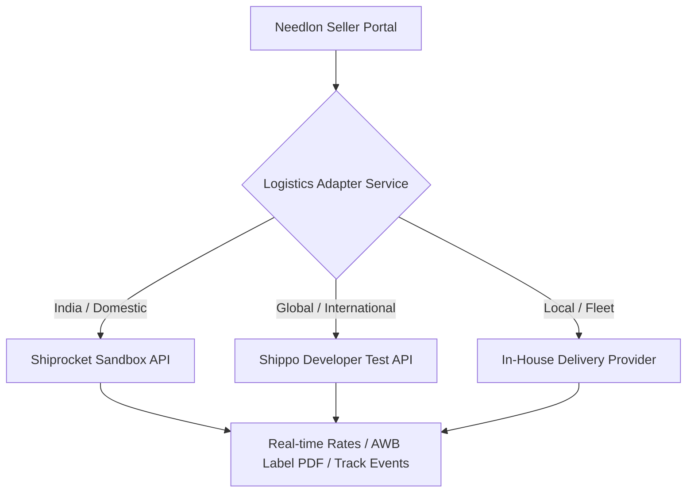

# Technical Implementation Plan — Delivery & Logistics Integration

## Overview
This document outlines a complete, step-by-step implementation plan for the **Fulfillment & Delivery Settings** (`/delivery`) module. It includes integration with free/sandbox courier partner APIs (Shiprocket Sandbox, Shippo Test API, FedEx Sandbox, and In-House Fleet), dynamic shipping profiles, local delivery radius controls, AWB label generation, real-time tracking, automated unit tests, and live browser validation.

---

## Analysis of Current Delivery State & Gaps

### 1. Delivery Overview (`delivery-overview.tsx`)
- ⚠️ **Partner Status Cards**: Currently displays demo partner cards (`FedEx Express`, `DHL International`, `In-House Local Fleet`).
- ❌ **Missing Feature**: Ability to connect/configure real carrier test credentials (API Key, Secret / Token for Shiprocket / Shippo Sandbox) and toggle active/inactive status.

### 2. Delivery Settings Tabs (`delivery-setting-tab.tsx`)
- ❌ **Tab 1: Local Delivery Radius**: Input fields (`Radius Range`, `Base Delivery Charge`) currently have no form submission or backend persistence.
- ❌ **Tab 2: Self Pickup Options**: Primary Pickup Address is static text. Needs an editable pickup hub manager with address, pincode, contact phone, and operating hours.
- ❌ **Tab 3: Shipping Zones & Charges**: Shipping zones table (`Domestic`, `International`) is static HTML. Needs interactive zone rate manager (Add/Edit zone, carrier mapping, weight-based rates, free shipping threshold).

### 3. Shipments & Label Generation System (New View Component & Modals)
- ❌ **Shipments Dispatch Table**: Needs interactive dispatch view listing orders ready for shipping, carrier selector, and AWB creation.
- ❌ **Shipping Label Modal (`ShippingLabelModal`)**: Render printable shipping invoice & barcode shipping label.
- ❌ **Tracking Timeline Drawer (`TrackingTimelineModal`)**: Real-time event log for package journey (Order Placed → Picked Up → In Transit → Out for Delivery → Delivered).

---

## Free & Sandbox Courier Provider Strategy

We will support **Sandbox / Test Courier Integrations** that provide free developer test keys:

1. **Shiprocket Sandbox API** (Domestic e-commerce):
   - **Test Credentials**: Free sandbox account support using sandbox email/password to retrieve JWT auth tokens (`/v1/external/auth/login`).
   - **Capabilities**: Rate estimation, order creation, AWB assignment, and shipping label URL generation.
2. **Shippo Test API** (Global / Multi-Carrier Sandbox):
   - **Test Credentials**: Free `shippo_test_*` API tokens.
   - **Capabilities**: Instant rate quotes across USPS, FedEx, and DHL sandbox environments.
3. **In-House / Simulated Carrier Provider**:
   - Built-in fallback provider generating valid AWB tracking numbers (`NDL-TRK-XXXXXXXX`) and instant test label PDFs.

---

## Step-by-Step Technical Execution Phases

### Phase 1: Database Wiring, DTOs, Repositories, Services & APIs

1. **DTO Schemas (`packages/modules/modules/delivery/dto/delivery.dto.ts`)**:
   - `updatePartnerApiSchema`: Validate carrier API credentials (API key, sandbox mode toggle).
   - `localDeliveryConfigSchema`: Radius (km), base charge, free shipping threshold.
   - `pickupHubSchema`: Address line, pincode, phone number, operating hours.
   - `shippingZoneSchema`: Zone name, country/state filters, carrier code, flat rate fee, estimated days.
   - `createShipmentSchema`: Order ID, carrier code, weight (kg), package dimensions.

2. **Repositories & Services (`packages/modules/modules/delivery/repository/` & `services/`)**:
   - `carrier-integration.service.ts`: Unified carrier adapter calling Shiprocket/Shippo sandbox or In-House carrier.
   - `delivery-settings.service.ts`: CRUD operations for shipping partners, pickup hubs, local radius, and shipping zones.

3. **API Routes (`apps/seller/app/api/seller/delivery/`)**:
   - `partners/route.ts` (GET active partners, PATCH update credentials & toggle status).
   - `settings/route.ts` (GET/POST local radius, pickup address, and shipping zones).
   - `shipments/route.ts` (GET shipments list, POST generate shipment AWB).
   - `shipments/[id]/route.ts` (PATCH update shipment status).
   - `track/route.ts` (GET live tracking event history by AWB).

---

### Phase 2: Delivery UI Enhancements & Interactive Modals

1. **Carrier Credentials Modal (`ConnectCarrierModal`)**:
   - Form to select carrier (Shiprocket, Shippo, FedEx, In-House), enter API Key / Sandbox Token, and toggle Sandbox vs Production mode.

2. **Interactive Delivery Settings (`delivery-setting-tab.tsx`)**:
   - **Local Delivery**: Wire form inputs with live backend saving & success toast notification.
   - **Self Pickup**: Add interactive "Edit Pickup Hub" modal allowing updates to address, pincode, and contact number.
   - **Shipping Zones**: Add "+ Add Zone Rate" modal allowing creation of custom shipping zones (e.g. Metro Cities, Rest of India, Express Overnight).

3. **Shipments & Shipping Label System (`shipment-list-table.tsx`)**:
   - Interactive table showing pending shipments with action buttons:
     - **"Generate Label"**: Opens `ShippingLabelModal` showing barcode, barcode number, origin/destination address, package weight, and PDF download button.
     - **"Track Package"**: Opens `TrackingTimelineModal` showing step-by-step transit checkpoints.

---

### Phase 3: Automated Unit & Integration Testing

Write tests in `packages/modules/tests/delivery.test.ts`:
- Test shipping rate calculation logic (flat rate, weight-based calculations, free shipping threshold override).
- Test Zod validation for local radius range and shipping zone creation.
- Test carrier API request payload builder (Shiprocket/Shippo DTO transformations).
- Test AWB tracking string generator format.

---

### Phase 4: Live Browser End-to-End Validation

Using browser testing tools:
1. Log in with seller account `armanalam78578@gmail.com` / `Arman@123`.
2. Navigate to `http://localhost:3000/delivery`.
3. Test carrier connection modal ("Connect Partner").
4. Test saving Local Delivery Radius & Base Charge.
5. Test updating Pickup Address Location.
6. Test adding a new Shipping Zone rate.
7. Test generating a printable Shipping Label AWB.
8. Test package tracking timeline drawer.

---

## User Input Options
If you have a specific Shiprocket Sandbox API key or Shippo test token you'd like inserted, please provide it. Otherwise, the system will use the built-in Sandbox Provider with simulated live tracking events.
