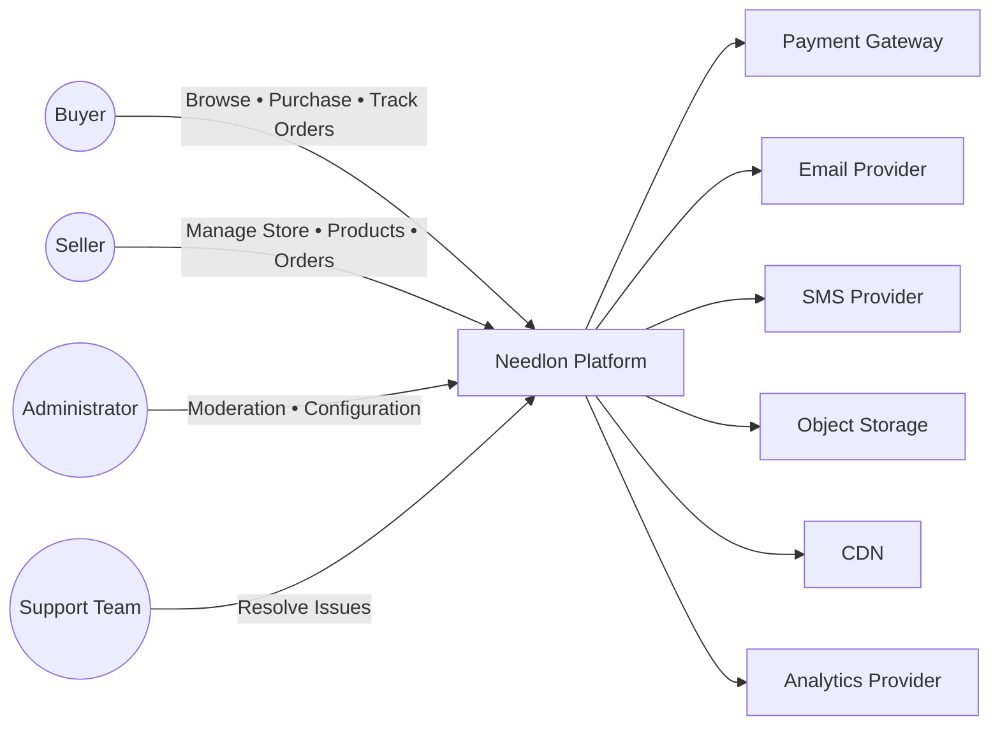
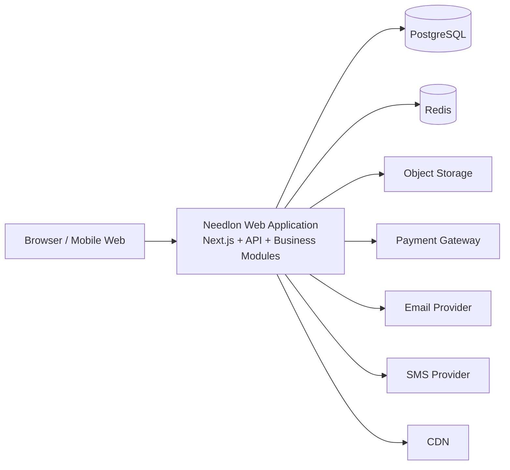
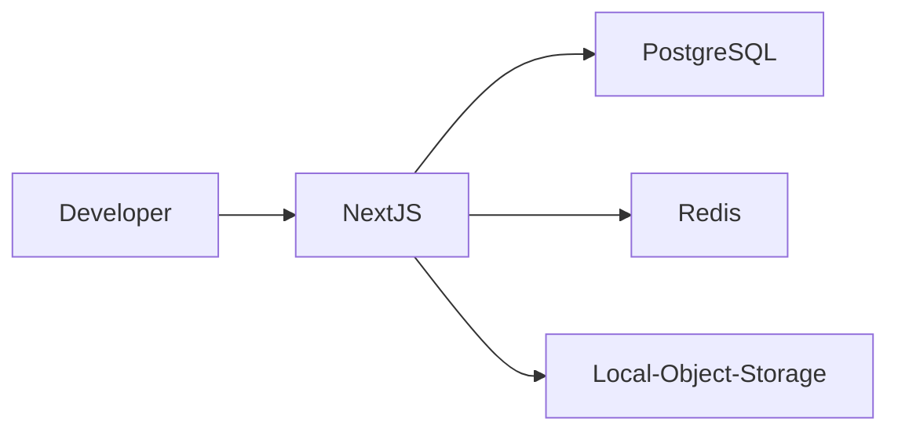
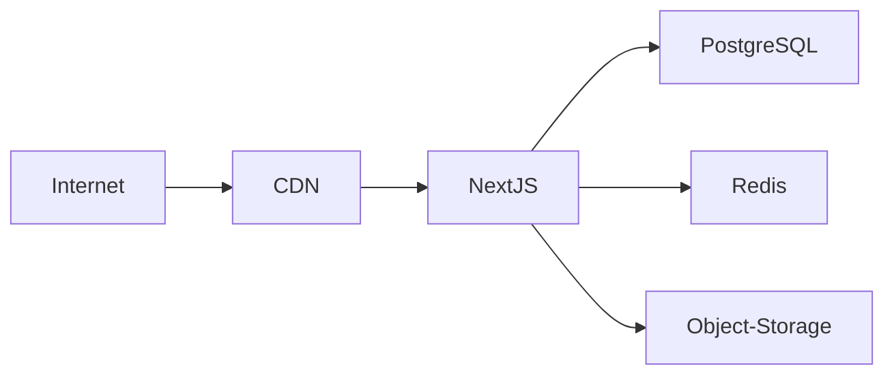
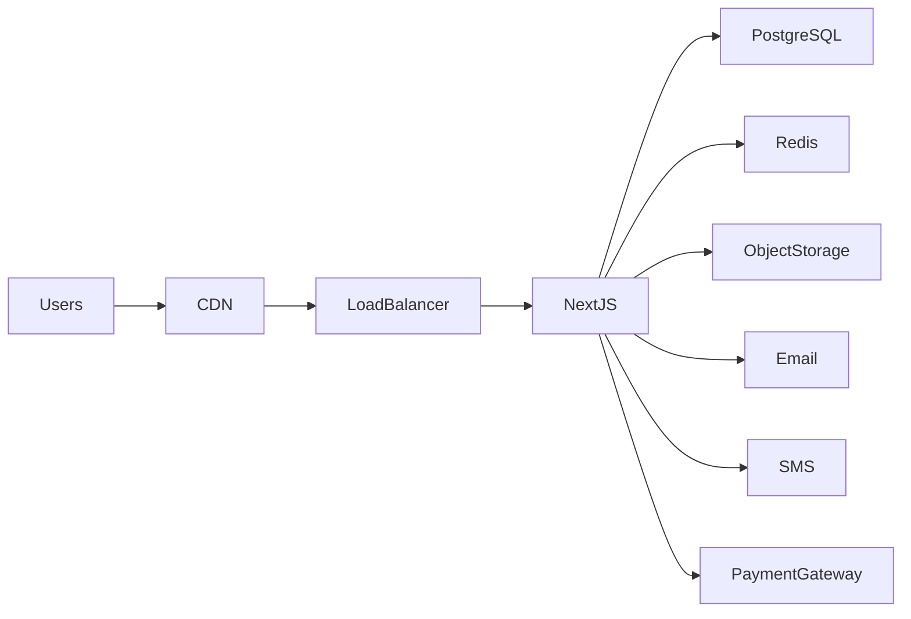
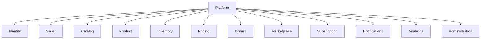
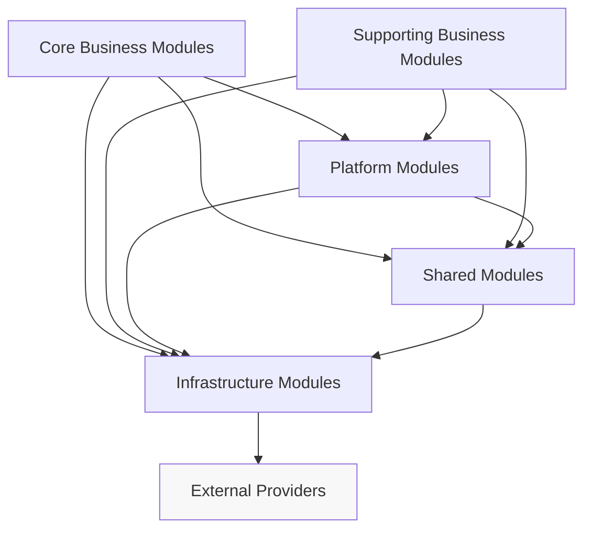
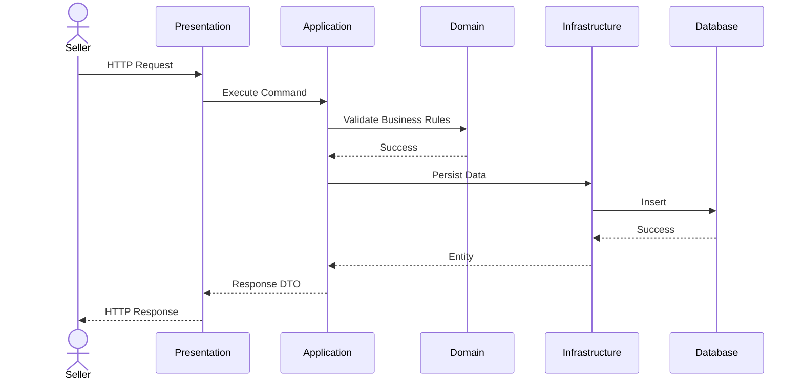
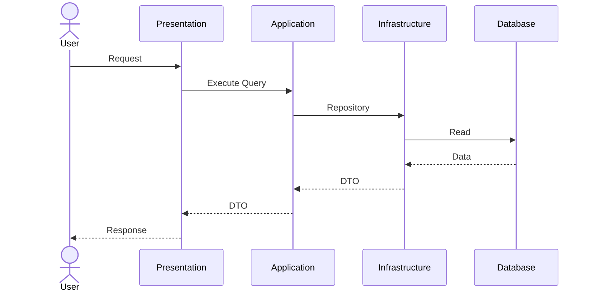
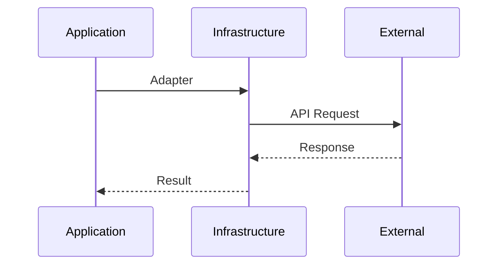

# Chapter 1 — Architecture Charter

> Parent Document: `docs/02-ARCHITECTURE.md`

---

# Document Information

| Property | Value |
|----------|-------|
| Chapter | 1 |
| Title | Architecture Charter |
| Version | 1.0 |
| Status | DRAFT |
| Depends On | 00-PROJECT-CONSTITUTION.md, 01-PRODUCT-VISION.md |
| Referenced By | Every Architecture Chapter |
| Owner | Needlon Engineering |

---

# 1. Purpose

This chapter establishes the architectural foundation for Needlon.

It defines the principles, constraints, terminology, responsibilities, and governance that every engineering decision must follow.

This chapter does **not** describe implementation.

Instead, it defines **how architecture is created, protected, and evolved**.

Every subsequent architecture chapter must conform to this charter.

---

# 2. Scope

This architecture governs every production system within the Needlon repository, including:

- Frontend Applications
- Backend Services
- API Layer
- Authentication
- Authorization
- Business Modules
- Database Design
- File Storage
- Infrastructure Integration
- Background Processing
- Shared Libraries
- UI System
- Deployment Strategy
- Testing Strategy
- Observability
- Documentation

Anything outside this scope is considered external to the platform.

---

# 3. Audience

This document is intended for:

- Software Engineers
- Technical Leads
- Architects
- DevOps Engineers
- QA Engineers
- Product Engineers
- AI Assistants contributing to the repository

Every contributor is expected to understand this chapter before modifying the architecture.

---

# 4. Architecture Vision

Needlon is designed as a **business-driven modular monolith**.

The architecture prioritizes:

- Business clarity over framework conventions.
- Long-term maintainability over short-term speed.
- Stable boundaries over rapid restructuring.
- Explicit design over hidden abstractions.
- Evolution through modular growth rather than architectural replacement.

Architecture exists to support the product—not to showcase design patterns.

---

# 5. Engineering Objectives

The architecture must enable:

1. Independent evolution of business modules.
2. High developer productivity.
3. Clear ownership of code.
4. Predictable project structure.
5. Stable APIs.
6. Production-grade security.
7. High testability.
8. Horizontal scalability when required.
9. Operational simplicity.
10. Long-term maintainability.

These objectives take precedence over architectural trends.

---

# 6. Architectural Principles

Every architectural decision must satisfy the following principles.

| Principle | Description |
|------------|-------------|
| Business First | Business capabilities define modules. |
| Modularity | Each module owns its business responsibility. |
| Explicit Dependencies | Hidden dependencies are prohibited. |
| High Cohesion | Related code lives together. |
| Low Coupling | Modules communicate through defined boundaries. |
| Simplicity | Prefer the simplest solution that satisfies production requirements. |
| Consistency | Similar problems should have similar solutions. |
| Replaceability | Internal implementations should be replaceable without affecting consumers. |
| Testability | Business logic must be independently testable. |
| Security by Design | Security is part of architecture, not an afterthought. |

---

# 7. Quality Attributes

Architectural decisions will be evaluated against the following quality attributes.

| Priority | Attribute | Description |
|----------|-----------|-------------|
| Critical | Maintainability | Easy to understand and modify. |
| Critical | Scalability | Supports long-term growth. |
| Critical | Security | Protects business and user data. |
| Critical | Reliability | Predictable production behavior. |
| High | Testability | Business logic can be validated independently. |
| High | Performance | Efficient resource utilization. |
| High | Developer Experience | Easy onboarding and development. |
| Medium | Flexibility | Supports future evolution without instability. |

When trade-offs are required, higher-priority attributes take precedence.

---

# 8. Business Capability Map

The architecture is organized around business capabilities rather than technical layers.

Primary business domains include:

- Identity & Authentication
- Seller Management
- Store Management
- Catalog
- Product
- Inventory
- Pricing
- Orders
- Payments
- Subscription
- Analytics
- Notifications
- Customer Support
- Marketplace
- Administration

Each capability is represented as an independent architectural module.

---

# 9. System Boundary

Needlon consists of the platform itself and its integrations.

## Internal Platform

- Frontend Applications
- Backend Application
- Database
- Object Storage
- Background Jobs
- Internal Modules

## External Systems

- Payment Gateway
- Email Provider
- SMS Provider
- Authentication Providers
- Analytics Providers
- CDN
- Cloud Infrastructure

External systems are integration points, not architectural modules.

---

# 10. Architectural Constraints

The following constraints are mandatory.

- Single deployable application.
- Modular Monolith architecture.
- Single primary relational database.
- Module ownership of business data.
- Explicit module boundaries.
- No circular dependencies.
- Shared code must remain business-agnostic.
- Business logic cannot exist inside infrastructure utilities.
- Cross-module communication must follow approved interfaces.

These constraints may only change through an approved Architecture Review.

---

# 11. Architectural Non-Goals

Needlon intentionally avoids:

- Premature microservices.
- Unnecessary distributed systems.
- Technology chosen solely for popularity.
- Over-engineering.
- Deep inheritance hierarchies.
- Shared "God" services.
- Business logic inside utility packages.
- Framework-driven architecture.

---

# 12. Architecture Governance

Architecture evolves through controlled change.

Every architectural modification must follow one of the following paths:

- Feature implementation (no architectural change)
- Architecture Review
- ADR
- RFC

Implementation work must never redefine approved architecture.

---

# 13. Architecture Decision Records (ADR)

Every significant architectural decision requires an ADR.

Each ADR contains:

- Context
- Problem
- Decision
- Alternatives
- Trade-offs
- Consequences
- Review Trigger

Architecture without documented reasoning is considered incomplete.

---

# 14. Request for Comments (RFC)

Major architectural evolution requires an RFC before implementation.

Examples include:

- Introducing event-driven communication.
- Splitting services.
- Database technology changes.
- Authentication redesign.
- Deployment strategy changes.

RFCs ensure architecture evolves deliberately rather than reactively.

---

# 15. Architecture Fitness Functions

Architecture quality must be continuously protected.

Examples include:

- No circular module dependencies.
- Business modules cannot directly modify another module's data.
- Shared modules contain no business logic.
- Public APIs validate input before business execution.
- Every database table has a single owning module.

Fitness functions should be enforceable through tooling where practical.

---

# 16. Architectural Terminology

| Term | Definition |
|------|------------|
| Module | A business capability with clear ownership and boundaries. |
| Layer | A logical responsibility within a module. |
| Component | A reusable implementation unit. |
| Shared | Framework-independent reusable functionality. |
| Infrastructure | Technical integrations with external systems. |
| Domain | Business concepts and rules. |
| Boundary | The public interface through which a module is accessed. |

These definitions are authoritative throughout the repository.

---

# 17. Architecture Success Criteria

The architecture is successful when:

- New developers can understand the project quickly.
- Features are implemented without architectural redesign.
- Modules evolve independently.
- Code ownership is obvious.
- Production incidents remain localized.
- Architectural rules are consistently followed.
- Growth does not require structural rewrites.

---

# 18. References

This chapter is governed by:

- `docs/00-PROJECT-CONSTITUTION.md`
- `docs/01-PRODUCT-VISION.md`

This chapter is expanded by every subsequent chapter within `docs/02-ARCHITECTURE.md`.

---

# 19. Decisions Introduced

| ADR | Title | Status |
|------|-------|--------|
| ADR-001 | Modular Monolith | Accepted |
| ADR-002 | C4 Architecture Documentation | Accepted |
| ADR-003 | Architecture Decision Records | Accepted |
| ADR-004 | Architecture Governance | Accepted |

---

# 20. Summary

This Architecture Charter establishes the immutable engineering foundation for Needlon.

It defines how architecture is evaluated, documented, governed, and evolved.

All future architectural decisions, implementation details, and engineering standards must conform to the principles defined in this chapter.

Once approved, this chapter becomes the architectural contract for the entire repository.


# Chapter 2 — System Context & Ecosystem (C4 Level 1)

> Parent Document: `docs/02-ARCHITECTURE.md`

---

# Document Information

| Property | Value |
|----------|-------|
| Chapter | 2 |
| Title | System Context & Ecosystem |
| Version | 1.0 |
| Status | DRAFT |
| Depends On | Chapter 1 – Architecture Charter |
| References | 00-PROJECT-CONSTITUTION.md, 01-PRODUCT-VISION.md |
| ADRs | ADR-001, ADR-002, ADR-003 |

---

# 1. Purpose

This chapter defines the highest-level view of Needlon.

It identifies:

- the system boundary
- external actors
- external integrations
- internal platform
- trust boundaries
- ownership boundaries

This chapter intentionally avoids implementation details.

Implementation belongs to later chapters.

---

# 2. System Overview

Needlon is a production-grade digital commerce platform dedicated to the fashion ecosystem.

The platform enables sellers to:

- create stores
- publish products
- manage inventory
- receive orders
- communicate with buyers
- grow their business

while enabling buyers to discover and purchase fashion products from trusted sellers.

Needlon acts as the platform connecting all participants.

---

# 3. Platform Responsibility

Needlon owns:

- Identity
- Seller Platform
- Marketplace
- Catalog
- Product Management
- Inventory
- Order Lifecycle
- Subscription Management
- Analytics
- Notifications
- Administration

Needlon does NOT own:

- Banking systems
- Payment gateway infrastructure
- Email infrastructure
- SMS infrastructure
- Cloud infrastructure
- Browser
- Operating systems

---

# 4. Primary Actors

## Seller

Primary business user.

Responsible for:

- onboarding
- store management
- catalog management
- inventory
- pricing
- orders

---

## Buyer

Marketplace customer.

Responsible for:

- browsing
- searching
- ordering
- reviewing
- communication

---

## Administrator

Internal platform operator.

Responsible for:

- moderation
- support
- compliance
- analytics
- seller verification
- platform configuration

---

## Support Team

Internal operational users.

Responsible for:

- issue resolution
- customer assistance
- dispute handling

---

# 5. External Systems

Needlon integrates with external providers but does not own them.

Examples include:

## Payment Gateway

Processes online payments.

Needlon never implements banking infrastructure.

---

## Email Provider

Used for:

- OTP
- verification
- notifications
- transactional emails

---

## SMS Provider

Used for:

- OTP
- alerts
- critical notifications

---

## Object Storage

Stores:

- product images
- seller logos
- banners
- documents

---

## Analytics Provider

Collects operational metrics.

---

## CDN

Accelerates static asset delivery.

---

## Cloud Infrastructure

Provides compute, networking and storage.

---

# 6. Internal Platform

The platform consists of multiple business capabilities.

These are architectural modules.

Identity

↓

Seller

↓

Store

↓

Catalog

↓

Product

↓

Inventory

↓

Orders

↓

Payments

↓

Subscription

↓

Marketplace

↓

Notifications

↓

Analytics

↓

Administration

Every capability has clear ownership.

---

# 7. System Boundary

Inside Needlon

- Business Rules
- APIs
- Authentication
- Authorization
- Database
- UI
- Business Modules
- Background Jobs
- Internal Events

Outside Needlon

- Payment Provider
- SMTP
- SMS
- Browser
- Cloud Services
- CDN
- External APIs

Anything outside the system boundary is treated as an integration.

---

# 8. Trust Boundaries

Needlon defines multiple trust zones.

## Public Zone

Unauthenticated traffic.

Examples:

Landing page

Public marketplace

Authentication pages

---

## Authenticated User Zone

Buyer

Seller

---

## Administrative Zone

Platform administrators.

Requires elevated permissions.

---

## Infrastructure Zone

Database

Storage

Queue

Secrets

Never directly accessible by end users.

---

## Third-Party Zone

External providers.

Communication occurs through controlled integrations only.

---

# 9. Business Capability Map

| Capability | Owner |
|------------|-------|
| Identity | Platform |
| Seller | Seller Module |
| Store | Seller Module |
| Catalog | Catalog Module |
| Product | Product Module |
| Inventory | Inventory Module |
| Orders | Order Module |
| Payments | Payment Module |
| Subscription | Subscription Module |
| Marketplace | Marketplace Module |
| Analytics | Analytics Module |
| Notifications | Notification Module |
| Administration | Admin Module |

Ownership is exclusive.

No capability may have multiple owning modules.

---

[//]: # ()
[//]: # (# 10. C4 Level 1 Context)

[//]: # ()
[//]: # (```text)

[//]: # (                    +----------------------+)

[//]: # (                    |      Buyer           |)

[//]: # (                    +----------+-----------+)

[//]: # (                               |)

[//]: # (                               |)

[//]: # (                    Browse / Purchase)

[//]: # (                               |)

[//]: # (                               v)

[//]: # ()
[//]: # (+-----------------------------------------------------------+)

[//]: # (|                                                           |)

[//]: # (|                    NEEDLON PLATFORM                       |)

[//]: # (|                                                           |)

[//]: # (|  Seller │ Catalog │ Products │ Orders │ Subscription      |)

[//]: # (|  Inventory │ Marketplace │ Notifications │ Admin          |)

[//]: # (|                                                           |)

[//]: # (+-----------------------------------------------------------+)

[//]: # (       ^              ^             ^             ^)

[//]: # (       |              |             |             |)

[//]: # (       |              |             |             |)

[//]: # ( Seller Portal   Payment      Email/SMS      Object Storage)

[//]: # (                 Gateway       Providers)

[//]: # ()
[//]: # (```)

[//]: # ()
[//]: # (The platform is represented as a single system because C4 Level 1 focuses on external relationships rather than internal implementation.)

[//]: # ()
[//]: # (---)

## 10. C4 Level 1 — System Context



---

# Context Interaction Matrix

| Actor   | Identity | Seller | Store  | Catalog  | Product  | Inventory | Orders      | Subscription | Marketplace | Admin   |
| ------- | -------- | ------ | ------ | -------- | -------- | --------- | ----------- | ------------ | ----------- | ------- |
| Buyer   | Login    | —      | View   | Browse   | View     | —         | Place Order | —            | Browse      | —       |
| Seller  | Login    | Manage | Manage | Manage   | Manage   | Manage    | Fulfill     | Manage       | Sell        | —       |
| Admin   | Login    | Verify | Review | Moderate | Moderate | Monitor   | Manage      | Manage       | Moderate    | Manage  |
| Support | Login    | Assist | Assist | —        | —        | —         | Assist      | Assist       | —           | Limited |


### Purpose

This matrix answers

Which business capability is used by which actor?

before writing a single line of code.

Later,

permission design,

RBAC,

navigation,

and UI

all derive from this matrix.

---

# Trust Boundary Matrix

| Zone               | Owner           | Trust Level | Authentication                | Examples                        | Failure Strategy                     |
| ------------------ | --------------- | ----------- | ----------------------------- | ------------------------------- | ------------------------------------ |
| Public             | Internet        | None        | No                            | Landing Page, Marketplace       | Validate Every Request               |
| Authenticated User | Needlon         | Medium      | JWT Session                   | Seller Dashboard, Buyer Account | Session Validation                   |
| Administrative     | Needlon         | High        | Elevated Roles + MFA (Future) | Admin Panel                     | Audit + Strict Authorization         |
| Internal Platform  | Needlon         | High        | Service/Internal              | Modules, Queue                  | Internal Monitoring                  |
| Infrastructure     | Needlon         | Critical    | Secrets                       | Database, Redis, Storage        | Restricted Network Access            |
| Third Party        | External Vendor | External    | API Keys / OAuth              | Payment, Email, SMS             | Retry + Circuit Breaker + Monitoring |


### Benefits

This table later drives

- middleware
- API security
- secret management
- infrastructure
- incident response

---

# External Integration Catalog

| Integration     | Purpose             | Mandatory | Replaceable | Owner               |
| --------------- | ------------------- | --------- | ----------- | ------------------- |
| Payment Gateway | Payments            | Yes       | Yes         | Payments Module     |
| Email Provider  | Transactional Email | Yes       | Yes         | Notification Module |
| SMS Provider    | OTP                 | Optional  | Yes         | Notification Module |
| Object Storage  | Images              | Yes       | Yes         | Media Module        |
| CDN             | Static Assets       | Yes       | Yes         | Platform            |
| Analytics       | Metrics             | Optional  | Yes         | Analytics Module    |


---

# System Ownership Matrix

| Resource   | Owning Module | Other Modules            |
| ---------- | ------------- | ------------------------ |
| Sellers    | Seller        | Read Only via Public API |
| Stores     | Seller        | Read Only                |
| Categories | Catalog       | Read Only                |
| Products   | Product       | Read Only                |
| Inventory  | Inventory     | Product (Query Only)     |
| Orders     | Orders        | Seller (Query Only)      |
| Payments   | Payments      | Orders (Query Only)      |


---


# 11. Architectural Constraints

The system context introduces the following constraints.

- External systems are never trusted implicitly.
- Business logic remains inside Needlon.
- Third-party services remain replaceable.
- External failures must not corrupt internal state.
- Internal modules must not expose implementation details externally.

---

# 12. Architecture Decisions

| ADR | Decision |
|------|----------|
| ADR-001 | Modular Monolith |
| ADR-002 | C4 Documentation |
| ADR-003 | Architecture Decision Records |

No new ADRs are introduced in this chapter.

---

# 13. Success Criteria

This chapter is successful if every engineer can answer:

- What belongs to Needlon?
- What does Needlon not own?
- Who interacts with Needlon?
- Which systems are external?
- Where are the trust boundaries?
- What business capabilities exist?

without reading implementation code.

---

# 14. Summary

Needlon is a modular commerce platform with clearly defined system boundaries, business capabilities, and external integrations.

This chapter establishes the ecosystem in which the architecture operates.

Subsequent chapters progressively zoom into the internal architecture using the C4 model.


# Chapter 3 — Container Architecture (C4 Level 2)

> Parent Document: `docs/02-ARCHITECTURE.md`

---

# Document Information

| Property | Value |
|----------|-------|
| Chapter | 3 |
| Title | Container Architecture (C4 Level 2) |
| Version | 1.0 |
| Status | DRAFT |
| Depends On | Chapter 1, Chapter 2 |
| References | ADR-001, ADR-002, ADR-003, AP-001~010, AC-001~008 |

---

# 1. Purpose

This chapter defines the deployable containers that collectively form the Needlon platform.

Unlike Chapter 2, which defines the system boundary, this chapter identifies the major runtime containers, their responsibilities, communication paths, ownership, and deployment constraints.

Each container represents a deployable or independently managed runtime boundary—not a business module.

Business modules are defined in later chapters.

---

# 2. Architectural Philosophy

Needlon is deployed as a **single production application** composed of multiple logical runtime containers.

These containers cooperate to deliver the complete marketplace platform while preserving clear operational responsibilities.

This architecture satisfies:

- AC-001 Single Deployable Application
- AC-002 Single Primary Database
- AP-002 Modularity
- QA-001 Maintainability
- QA-002 Scalability

---

# 3. Runtime Containers

Needlon consists of the following primary containers.

| Container | Type | Ownership | Purpose |
|------------|------|-----------|----------|
| Web Application | Internal | Platform | UI, API, Business Logic |
| PostgreSQL | Internal | Platform | Primary relational database |
| Redis | Internal | Platform | Cache, Rate Limit, Session Support |
| Object Storage | External Managed | Platform | Images & Documents |
| Email Service | External | Notification | Transactional Email |
| SMS Provider | External | Notification | OTP & Alerts |
| Payment Gateway | External | Payments | Payment Processing |
| CDN | External | Platform | Static Asset Delivery |

No additional runtime containers may be introduced without an approved ADR.

---

# 4. Primary Container

## Web Application

The Web Application is the core runtime of Needlon.

It hosts:

- Next.js App Router
- API Routes
- Server Components
- Client Components
- Authentication
- Business Modules
- Background Schedulers (lightweight)
- Validation
- Authorization

This is the only business container.

All business rules execute here.

---

# 5. Database Container

## PostgreSQL

PostgreSQL is the single source of truth.

Responsibilities include:

- Seller Data
- Buyer Data
- Products
- Orders
- Inventory
- Subscriptions
- Analytics Metadata
- Platform Configuration

Constraints:

- AC-002
- AC-003

No business logic exists inside the database.

---

# 6. Cache Container

## Redis

Redis provides transient storage.

Responsibilities:

- Rate Limiting
- OTP Storage
- Temporary Verification
- Token Blacklisting
- Distributed Locks (future)
- Short-lived Cache

Redis must never become the primary source of business data.

---

# 7. Object Storage Container

Object Storage manages binary assets.

Examples:

- Product Images
- Store Logos
- Store Banners
- Seller Documents

Business metadata remains in PostgreSQL.

Files remain in Object Storage.

---

# 8. External Service Containers

Needlon integrates with external providers.

These providers remain replaceable.

## Email

Purpose:

- Verification
- Notifications
- Password Reset

---

## SMS

Purpose:

- OTP
- Critical Alerts

---

## Payment Gateway

Purpose:

- Payment Authorization
- Payment Confirmation
- Refund Events

Business rules remain inside Needlon.

The gateway only processes transactions.

---

# 9. Container Communication

Containers communicate using well-defined interfaces.

```text
Browser
      │
      ▼
Next.js Application
      │
      ├────────► PostgreSQL
      │
      ├────────► Redis
      │
      ├────────► Object Storage
      │
      ├────────► Email Provider
      │
      ├────────► SMS Provider
      │
      └────────► Payment Gateway
```

Containers never communicate through shared databases owned by third parties.

---

# 10. C4 Level 2 Container Diagram



---

# 11. Container Responsibility Matrix

| Responsibility | Container |
|---------------|-----------|
| UI Rendering | Web Application |
| API Execution | Web Application |
| Business Logic | Web Application |
| Authentication | Web Application |
| Authorization | Web Application |
| Database | PostgreSQL |
| Caching | Redis |
| File Storage | Object Storage |
| Payments | Payment Gateway |
| Email | Email Provider |
| SMS | SMS Provider |
| Static Assets | CDN |

Responsibilities must remain exclusive.

---

# 12. Data Flow

Typical request lifecycle:

Browser

↓

Next.js Middleware

↓

Authentication

↓

Validation

↓

Business Module

↓

Repository

↓

PostgreSQL

↓

Response

External integrations occur only when required by business logic.

---

# 13. Failure Isolation

| Failure | Platform Behaviour |
|----------|-------------------|
| Redis Down | Continue with degraded caching where possible |
| Email Down | Queue / Retry notifications |
| SMS Down | Retry / Alternate provider (future) |
| Payment Gateway Down | Reject payment operations gracefully |
| Storage Down | Prevent uploads, preserve metadata |
| CDN Down | Serve assets directly if feasible |

A failure in one external container must not corrupt business data.

---

# 14. Security Boundaries

Each container has explicit trust boundaries.

| Container | Trust Level |
|-----------|-------------|
| Browser | Untrusted |
| Web Application | Trusted |
| PostgreSQL | Highly Trusted |
| Redis | Highly Trusted |
| Object Storage | Trusted |
| Payment Gateway | External Trusted Integration |
| Email | External Trusted Integration |
| SMS | External Trusted Integration |

All communication must use authenticated and encrypted channels where applicable.

---

# 15. Container Constraints

The following rules are mandatory.

- No business logic inside Redis.
- No business logic inside PostgreSQL.
- External services remain replaceable.
- Object Storage stores files only.
- Web Application owns orchestration.
- Single relational database.
- No direct browser access to infrastructure containers.

---

# 16. ADR References

| ADR | Description |
|------|-------------|
| ADR-001 | Modular Monolith |
| ADR-002 | C4 Documentation |
| ADR-003 | ADR Process |
| ADR-004 | Architecture Governance |

---

# 17. Success Criteria

This chapter is successful if every engineer can answer:

- What containers exist?
- Which container owns which responsibility?
- How do containers communicate?
- What happens when a dependency fails?
- Which data belongs where?
- Which systems are replaceable?

without reading implementation code.

---

# 18. Summary

Needlon is deployed as a modular monolithic web application supported by dedicated infrastructure containers for persistence, caching, storage, messaging, and payment integration.

Business logic remains centralized within the Web Application, while infrastructure containers provide specialized operational capabilities through well-defined interfaces.

---

# 19. Container Decision Table (ADR Mapping)

| Container       | Why It Exists                   | Alternatives Considered         | ADR     | Decision |
| --------------- | ------------------------------- | ------------------------------- | ------- | -------- |
| Web Application | Centralize business logic       | Backend API + Separate Frontend | ADR-001 | Accepted |
| PostgreSQL      | ACID business data              | MongoDB, MySQL                  | ADR-005 | Accepted |
| Redis           | Ephemeral cache & rate limiting | In-memory cache                 | ADR-006 | Accepted |
| Object Storage  | Binary asset storage            | Database BLOBs                  | ADR-007 | Accepted |
| Email Provider  | Transactional email             | Self-hosted SMTP                | ADR-008 | Accepted |
| SMS Provider    | OTP & alerts                    | Self-hosted gateway             | ADR-009 | Accepted |
| Payment Gateway | Secure payment processing       | Direct banking integration      | ADR-010 | Accepted |
| CDN             | Global asset delivery           | Direct origin serving           | ADR-011 | Accepted |


---


# Environment Deployment Topology

### Local Development


### Staging



### Production



---

# Container Communication Matrix

| From    | To         | Protocol  | Authentication      | Sync / Async    | Retry       |
| ------- | ---------- | --------- | ------------------- | --------------- | ----------- |
| Browser | Web App    | HTTPS     | JWT / Cookies       | Sync            | Browser     |
| Web App | PostgreSQL | TCP       | DB Credentials      | Sync            | Transaction |
| Web App | Redis      | TCP       | Redis Auth          | Sync            | Optional    |
| Web App | Storage    | HTTPS     | Service Credentials | Sync            | Yes         |
| Web App | Email      | HTTPS API | API Key             | Async Preferred | Yes         |
| Web App | SMS        | HTTPS API | API Key             | Async Preferred | Yes         |
| Web App | Payment    | HTTPS API | Signed Request      | Sync            | Idempotent  |


# Non-Functional Requirements (NFR)

| Container       | Availability | Backup               | Monitoring           | Scaling                           |
| --------------- | ------------ | -------------------- | -------------------- | --------------------------------- |
| Web Application | High         | Deployment Artifacts | APM + Logs           | Horizontal                        |
| PostgreSQL      | Critical     | Daily + PITR         | Metrics + Slow Query | Vertical + Read Replicas (Future) |
| Redis           | Medium       | None                 | Memory + Latency     | Horizontal (Future)               |
| Object Storage  | High         | Provider Managed     | Storage Metrics      | Provider Managed                  |
| Email           | Medium       | N/A                  | Delivery Metrics     | Provider Managed                  |
| SMS             | Medium       | N/A                  | Delivery Metrics     | Provider Managed                  |
| Payment         | Critical     | Provider Managed     | Webhook Monitoring   | Provider Managed                  |


# Operational Ownership Matrix

| Container       | Technical Owner     | Business Owner    |
| --------------- | ------------------- | ----------------- |
| Web Application | Platform Team       | Product           |
| PostgreSQL      | Platform            | Platform          |
| Redis           | Platform            | Platform          |
| Storage         | Platform            | Seller Experience |
| Email           | Notification Module | Platform          |
| SMS             | Notification Module | Platform          |
| Payment         | Payments Module     | Finance           |


# Failure Recovery Strategy

| Failure    | Detection       | Recovery                            | User Experience                      |
| ---------- | --------------- | ----------------------------------- | ------------------------------------ |
| Redis      | Health Check    | Reconnect                           | Temporary performance degradation    |
| PostgreSQL | Health Check    | Failover (Future)                   | Read-only / maintenance if necessary |
| Storage    | Upload Failure  | Retry                               | Inform user and preserve metadata    |
| Email      | API Failure     | Retry Queue                         | Notification delayed                 |
| SMS        | API Failure     | Retry / Alternate Provider (Future) | OTP delayed                          |
| Payment    | Webhook Timeout | Idempotent Retry                    | Payment status pending               |


# Secrets Management Policy

| Resource   | Secret Type       | Rotation  |
| ---------- | ----------------- | --------- |
| PostgreSQL | Connection String | Scheduled |
| Redis      | Password          | Scheduled |
| Payment    | API Keys          | Scheduled |
| Email      | API Keys          | Scheduled |
| SMS        | API Keys          | Scheduled |
| Storage    | Service Keys      | Scheduled |
| JWT        | Signing Keys      | Scheduled |


# Scalability Roadmap

| Stage   | Expected Scale       | Architecture                                |
| ------- | -------------------- | ------------------------------------------- |
| Stage 1 | MVP                  | Single Next.js Instance                     |
| Stage 2 | Thousands of Sellers | Multiple Web Instances + Managed PostgreSQL |
| Stage 3 | National Scale       | Read Replicas + Dedicated Workers           |
| Stage 4 | Very Large Scale     | Evaluate service extraction via RFC/ADR     |


# Chapter 4 — Platform Architecture (Module Architecture)

> Parent Document: `docs/02-ARCHITECTURE.md`

---

# Document Information

| Property | Value |
|----------|-------|
| Chapter | 4 |
| Title | Platform Architecture (Module Architecture) |
| Version | 1.0 |
| Status | DRAFT |
| Depends On | Chapter 1, Chapter 2, Chapter 3 |
| References | ADR-001~011 |

---

# 1. Purpose

This chapter defines the internal organization of the Needlon platform.

It introduces the architectural decomposition of the Web Application into independently owned business modules.

These modules represent business capabilities rather than technical layers.

This chapter intentionally avoids implementation details.

Repository structure, source code organization, database schemas, and APIs are documented in later chapters.

---

# 2. Architectural Philosophy

Needlon follows a **Business Capability Architecture**.

Every architectural module exists because of a business responsibility.

Modules are **not** created around:

- Framework features
- Database tables
- UI pages
- Services
- Teams

Instead,

they are created around stable business capabilities.

Business capability is the highest level of organization inside the platform.

---

# 3. Platform Decomposition

The platform is divided into five architectural groups.

```
Needlon Platform

├── Core Business Modules
├── Supporting Business Modules
├── Platform Modules
├── Shared Modules
└── Infrastructure Modules
```

Each group has a distinct responsibility.

---

# 4. Module Classification

## 4.1 Core Business Modules

These modules directly deliver business value.

Examples:

- Identity
- Seller
- Store
- Catalog
- Product
- Inventory
- Pricing
- Orders
- Subscription
- Marketplace

Characteristics

- Own business rules
- Own business data
- Expose public interfaces
- Independently evolvable

---

## 4.2 Supporting Business Modules

Provide supporting capabilities.

Examples

- Notifications
- Analytics
- Search
- Reviews
- Recommendation (Future)

These modules enhance the platform but are not the primary business workflow.

---

## 4.3 Platform Modules

Platform-wide capabilities.

Examples

- Authentication
- Authorization
- Configuration
- Feature Flags
- Audit
- Health

These modules support every business module.

---

## 4.4 Shared Modules

Reusable code.

Examples

- UI Components
- Validation
- Utilities
- Common Types
- Constants

Shared modules never contain business logic.

(AC-005)

---

## 4.5 Infrastructure Modules

External integrations.

Examples

- PostgreSQL
- Redis
- Storage
- Payment
- Email
- SMS

Infrastructure modules encapsulate technology.

Business modules never directly depend on vendors.

---

# 5. Platform Capability Map

```
Platform

│

├── Identity

├── Seller

│      ├── Profile

│      ├── Store

│      ├── Address

│      ├── Bank

│      └── Settings

├── Catalog

├── Product

├── Inventory

├── Pricing

├── Orders

├── Marketplace

├── Subscription

├── Notification

├── Analytics

└── Administration
```

This capability map is authoritative.

Future modules require ADR approval.

---

# 6. Platform Module Diagram



This diagram intentionally shows ownership rather than communication.

---

# 7. Module Responsibilities

Every module has one owner.

| Module | Responsibility |
|----------|---------------|
| Identity | Authentication & Identity |
| Seller | Seller Lifecycle |
| Store | Store Management |
| Catalog | Categories |
| Product | Product Management |
| Inventory | Inventory Control |
| Pricing | Pricing Rules |
| Orders | Order Lifecycle |
| Marketplace | Discovery |
| Subscription | Plans & Billing |
| Notifications | Communication |
| Analytics | Business Insights |
| Administration | Platform Operations |

No responsibility may have multiple owning modules.

---

# 8. Module Ownership Rules

Ownership is exclusive.

Each module owns

- Business rules
- Database tables
- APIs
- Validation
- Domain events

Other modules access data only through public contracts.

Direct database access across modules is prohibited.

(AC-003)

---

# 9. Module Dependency Rules

Modules communicate through approved interfaces.

Allowed

```
Module

↓

Public API

↓

Another Module
```

Forbidden

```
Module

↓

Repository

↓

Another Module Database
```

Dependencies must always point inward.

Circular dependencies are prohibited.

(AC-004)

---

# 10. Module Communication Model

Needlon currently uses synchronous communication.

Patterns

- Method Calls
- Public Services
- Internal APIs

Future asynchronous messaging requires ADR approval.

---

# 11. Internal Public Contracts

Every module exposes only:

- Commands
- Queries
- Events (Future)
- DTOs

Implementation details remain private.

Consumers depend only on contracts.

---

# 12. Cross-Cutting Services

Platform-wide services include:

- Authentication
- Authorization
- Validation
- Logging
- Auditing
- Error Handling
- Configuration
- Observability

These services are consumed by modules but do not own business workflows.

---

# 13. Module Lifecycle

Every module progresses through the following lifecycle:

1. Proposal (RFC)
2. Architecture Review
3. ADR Approval
4. Implementation
5. Production
6. Evolution
7. Deprecation
8. Removal

Modules cannot bypass this lifecycle.

---

# 14. Architecture Fitness Functions

The following architectural rules are continuously enforced.

AFF-001

No circular module dependencies.

AFF-002

Business logic never exists inside Shared modules.

AFF-003

Infrastructure is replaceable.

AFF-004

Every table has exactly one owning module.

AFF-005

Every public API validates input.

AFF-006

Cross-module communication occurs only through public contracts.

---

# 15. Module Evolution Policy

Adding a new module requires:

- Business justification
- Architecture Review
- RFC
- ADR
- Capability ownership
- Dependency review

No engineer may introduce a new module without approval.

---

# 16. Architectural Boundaries

Modules own:

- Business logic
- Domain models
- Persistence
- Validation
- Public contracts

Modules never own:

- Another module's database
- Another module's services
- Another module's repositories

---

# 17. Success Criteria

This chapter is successful when every engineer can answer:

- What modules exist?
- Why does each module exist?
- Who owns each capability?
- How do modules communicate?
- What dependencies are allowed?
- How are new modules introduced?

without reading implementation code.

---

# 18. Summary

Needlon is internally organized as a business-capability-driven modular platform.

Each module owns a clearly defined business responsibility, evolves independently, communicates through explicit contracts, and follows strict ownership and dependency rules.

This architecture provides the foundation for all repository structure, source code organization, APIs, database design, and implementation details described in subsequent chapters.


# 19. Platform Dependency Graph



### Dependency Rules

| From           | Allowed To                       |
| -------------- | -------------------------------- |
| Core Business  | Platform, Shared, Infrastructure |
| Supporting     | Platform, Shared, Infrastructure |
| Platform       | Shared, Infrastructure           |
| Shared         | Infrastructure only              |
| Infrastructure | External Providers only          |


### Forbidden

- Shared → Core
- Shared → Supporting
- Infrastructure → Core
- Infrastructure → Supporting
- Circular dependencies

---

# 20. Module Interaction Matrix

| From Module | To Module                 | Interaction Type         | Contract             | Allowed |
|-------------|---------------------------|--------------------------|----------------------|---------|
| Seller      | Store                     | Command                  | Public Service       | ✅      |
| Seller      | Product                   | Command                  | Public Service       | ✅      |
| Product     | Inventory                 | Query                    | Public Query         | ✅      |
| Orders      | Inventory                 | Command                  | Reservation Service  | ✅      |
| Orders      | Pricing                   | Query                    | Price Service        | ✅      |
| Orders      | Notifications             | Event / Command          | Notification Service | ✅      |
| Marketplace | Catalog                   | Query                    | Public Query         | ✅      |
| Marketplace | Product                   | Query                    | Public Query         | ✅      |
| Analytics   | Orders                    | Read Model               | Public Analytics API | ✅      |
| Any Module  | Another Module Repository | Direct Repository Access | —                    | ❌      |

### Rule

All cross-module interaction must pass through a published contract.

---

# 21. Capability Ownership Matrix

| Business Capability | Owning Module | Owns Database | Owns API | Owns UI  | Public Contract      |
|---------------------|---------------|---------------|----------|----------|----------------------|
| Identity            | Identity      | ✅            | ✅       | ✅       | Identity API         |
| Seller Profile      | Seller        | ✅            | ✅       | ✅       | Seller Service       |
| Store               | Store         | ✅            | ✅       | ✅       | Store Service        |
| Catalog             | Catalog       | ✅            | ✅       | ✅       | Catalog Service      |
| Product             | Product       | ✅            | ✅       | ✅       | Product Service      |
| Inventory           | Inventory     | ✅            | ✅       | Optional | Inventory Service    |
| Pricing             | Pricing       | ✅            | ✅       | Optional | Pricing Service      |
| Orders              | Orders        | ✅            | ✅       | ✅       | Order Service        |
| Subscription        | Subscription  | ✅            | ✅       | ✅       | Subscription Service |
| Notifications       | Notification  | Optional      | ✅       | ❌       | Notification Service |
| Analytics           | Analytics     | Read Models   | ✅       | ✅       | Analytics Service    |


### Ownership Rule

Each capability has exactly one owning module.

No exceptions.

---

# 22. Module Maturity Model

| Stage      | Description           | Entry Criteria                     | Exit Criteria          |
| ---------- | --------------------- | ---------------------------------- | ---------------------- |
| Proposed   | RFC created           | Business need identified           | ADR approved           |
| Planned    | Architecture approved | ADR accepted                       | Implementation started |
| Active     | Under development     | Repository created                 | Production deployment  |
| Stable     | Production ready      | Monitoring + Tests + Documentation | Major redesign         |
| Deprecated | Scheduled for removal | Replacement exists                 | Removal completed      |
| Retired    | Removed               | Data migrated                      | Documentation archived |


### Rule

Every module must have exactly one maturity state.

---

# 23. Module Blueprint Template

``` 
Module Name

Purpose

Business Capability

Responsibilities

Public Contracts

Commands

Queries

Events (Future)

Owned Database Tables

Owned APIs

Owned UI

Dependencies

Allowed Consumers

Security Model

Validation Rules

Observability

Testing Requirements

Performance Requirements

Scalability Considerations

Future Roadmap

```

### This blueprint becomes mandatory for:

- Seller
- Store
- Product
- Orders
- Inventory
- Pricing
- Subscription
- Notifications
- Analytics
- Administration

---

# 24. Platform Fitness Dashboard

| Metric                           | Target                   | Enforcement                      |
| -------------------------------- | ------------------------ | -------------------------------- |
| Circular Dependencies            | 0                        | Static Analysis                  |
| Cross-Module Repository Access   | 0                        | Code Review + Architecture Tests |
| Shared Business Logic Violations | 0                        | Architecture Tests               |
| Module Ownership Violations      | 0                        | ADR Review                       |
| Public API Validation Coverage   | 100%                     | Automated Tests                  |
| Authentication Coverage          | 100%                     | Security Tests                   |
| Authorization Coverage           | 100%                     | Security Tests                   |
| Logging Coverage                 | 100% Critical Operations | Observability Review             |
| Audit Coverage                   | 100% Sensitive Actions   | Audit Tests                      |
| Documentation Coverage           | 100% Modules             | Architecture Review              |


### Architecture Health Levels

| Score  | Status             |
| ------ | ------------------ |
| 95–100 | Excellent          |
| 85–94  | Healthy            |
| 70–84  | Needs Review       |
| <70    | Architectural Debt |

This allows architecture quality to be tracked over time.


# Chapter 5 — Engineering Module Standard

## Part I — Foundation

> Architecture Layer: Application / Domain
>
> Depends On:
>
> - Chapter 1 — Architecture Charter
> - Chapter 2 — System Context & Ecosystem
> - Chapter 3 — Container Architecture
> - Chapter 4 — Platform Architecture
>
> Architecture Stability Check
>
> Reviewed Against:
>
> ✅ Constitution
> ✅ Product Vision
> ✅ Chapter 1
> ✅ Chapter 2
> ✅ Chapter 3
> ✅ Chapter 4
>
> Result:
>
> No architectural conflicts detected.
>
> New ADR Required:
>
> No

---

# 1. Purpose

This chapter defines the engineering standard that every business module within Needlon must follow.

A module is the smallest independently owned architectural unit of the platform.

Every current and future module—including Seller, Store, Product, Inventory, Orders, Pricing, Subscription, Notifications, Analytics, and Administration—must comply with this standard.

This chapter establishes **how modules are designed**, not how individual features are implemented.

---

# 2. Definition of a Module

A module is a cohesive business capability that owns its own rules, data, contracts, and lifecycle.

A module is **not**:

- a folder
- a UI page
- a database table
- a service
- a collection of APIs
- a React component

A module exists only when it represents a stable business capability.

Examples of valid modules:

- Seller
- Store
- Product
- Inventory
- Orders
- Pricing
- Subscription

Examples of invalid modules:

- Forms
- Buttons
- Utils
- CRUD
- API
- Database

Modules represent the language of the business, not the language of the framework.

---

# 3. Engineering Objectives

Every module must satisfy the following objectives.

| Objective | Description |
|------------|-------------|
| EO-001 | Encapsulate one business capability. |
| EO-002 | Own its business rules. |
| EO-003 | Own its persistence model. |
| EO-004 | Expose explicit public contracts. |
| EO-005 | Prevent leakage of internal implementation. |
| EO-006 | Remain independently testable. |
| EO-007 | Remain replaceable internally without affecting consumers. |
| EO-008 | Support long-term evolution. |

These objectives are mandatory.

---

# 4. Module Philosophy

Needlon follows **Business Capability Engineering**.

Each module is treated as a small application within the platform.

A module should be understandable in isolation.

An engineer should be able to answer the following questions without reading another module:

- What problem does this module solve?
- What data does it own?
- Which rules does it enforce?
- Which contracts does it expose?
- Which modules may communicate with it?

If these questions cannot be answered, the module boundary is considered incorrect.

---

# 5. Core Characteristics

Every production module must exhibit the following characteristics.

| Characteristic | Requirement |
|----------------|-------------|
| Single Responsibility | One business capability only. |
| High Cohesion | Closely related logic remains together. |
| Low Coupling | Dependencies remain explicit and minimal. |
| Encapsulation | Internal implementation is private. |
| Explicit Contracts | Public interfaces are documented and stable. |
| Replaceability | Internal changes do not break consumers. |
| Testability | Business logic can be tested independently. |
| Observability | Module behavior can be monitored. |

---

# 6. Module Responsibilities

Every module owns:

- Business rules
- Domain concepts
- Validation rules
- Persistence model
- Public contracts
- Business workflows
- Business policies
- Domain-specific errors
- Module documentation

A module never owns another module's responsibilities.

---

# 7. Module Non-Responsibilities

A module must never:

- access another module's database directly
- modify another module's persistence layer
- expose internal repositories
- bypass public contracts
- contain unrelated business logic
- depend on implementation details of another module
- duplicate business rules already owned elsewhere

Violations of these rules constitute architectural defects.

---

# 8. Module Boundary

Every module has an explicit boundary.

The boundary separates:

- public behavior
- private implementation

Only the public boundary may be consumed by other modules.

Everything else is considered an implementation detail.

Changing internal implementation must not require changes in consuming modules.

---

# 9. Public Surface

Each module exposes a minimal public surface.

Permitted public elements include:

- Commands
- Queries
- DTOs
- Public Services
- Published Events (future)

Everything else remains private.

A smaller public surface reduces coupling and improves maintainability.

---

# 10. Ownership Model

Each module owns exactly one business capability.

Ownership includes:

- Business logic
- Database schema
- APIs
- UI flows
- Validation
- Domain policies
- Documentation

No ownership may be shared.

Cross-module ownership is prohibited.

---

# 11. Module Lifecycle

Every module follows the same lifecycle.

```text
Business Need
        ↓
RFC
        ↓
Architecture Review
        ↓
ADR Approval
        ↓
Implementation
        ↓
Testing
        ↓
Production
        ↓
Evolution
        ↓
Deprecation
        ↓
Retirement
```

Skipping lifecycle stages is not permitted.

---

# 12. Module Acceptance Criteria

A module is considered production-ready only when all of the following are true.

### Architecture

- Business capability is clearly defined.
- Responsibilities are exclusive.
- Boundaries are explicit.
- Dependencies follow Chapter 4.

### Engineering

- Public contracts documented.
- Internal implementation encapsulated.
- Validation complete.
- Authorization enforced.
- Error handling defined.
- Logging implemented.
- Observability configured.

### Quality

- Unit tests passing.
- Integration tests passing.
- Performance acceptable.
- Documentation complete.

A module failing any mandatory criterion cannot be classified as production-ready.

---

# 13. Module Evolution Principles

Modules are expected to evolve.

Evolution must preserve:

- public contracts
- business ownership
- dependency rules
- architectural boundaries

Breaking changes require:

- Architecture Review
- ADR (if architectural)
- Migration strategy
- Backward compatibility assessment

---

# 14. Module Engineering Principles

Every module inherits the platform principles defined in Chapter 1.

Additionally, every module must satisfy:

| Principle | Description |
|------------|-------------|
| MP-001 | Business capability first. |
| MP-002 | Minimize public surface. |
| MP-003 | Keep implementation private. |
| MP-004 | Depend on contracts, not implementations. |
| MP-005 | Prefer composition over duplication. |
| MP-006 | Avoid unnecessary abstractions. |
| MP-007 | Optimize for maintainability before cleverness. |
| MP-008 | Design for change without breaking consumers. |

These principles are mandatory for all modules.

---

# 15. Success Criteria

This foundation is successful if every engineer can answer:

- What is a module?
- Why does the module exist?
- What does it own?
- What must it never own?
- How does it evolve?
- When is it production-ready?

without referring to implementation details.

---

# 16. Summary

A Needlon module is an independently owned business capability with explicit boundaries, exclusive ownership, stable public contracts, and a defined engineering lifecycle.

This foundation establishes the standards that every module in the platform must follow.

All remaining sections of Chapter 5 build upon these principles.


## Part II — Internal Architecture

> Architecture Layer: Module
>
> Depends On:
>
> - Part I — Foundation
> - Chapter 4 — Platform Architecture
>
> Architecture Stability Check
>
> Reviewed Against:
>
> ✅ Constitution
> ✅ Product Vision
> ✅ Chapter 1
> ✅ Chapter 2
> ✅ Chapter 3
> ✅ Chapter 4
> ✅ Chapter 5 Part I
>
> Result:
>
> No architectural conflicts detected.
>
> New ADR Required:
>
> No

---

# 17. Purpose

This section defines the canonical internal architecture that every Needlon module must follow.

The architecture is independent of frameworks, libraries, and repository structure.

Its purpose is to ensure every module is built using the same engineering model.

---

# 18. Architectural Layers

Every module consists of four architectural layers.

```text
Presentation
      │
      ▼
Application
      │
      ▼
Domain
      │
      ▼
Infrastructure
```

Dependencies always flow downward.

Reverse dependencies are prohibited.

---

# 19. Layer Responsibilities

| Layer | Responsibility |
|--------|----------------|
| Presentation | Accept external requests and return responses. |
| Application | Coordinate business use cases and workflows. |
| Domain | Contain business rules and policies. |
| Infrastructure | Interact with external technologies. |

Each layer has one responsibility.

---

# 20. Presentation Layer

Purpose:

Provide the module's public entry points.

Examples:

- Route Handlers
- Server Actions
- UI Entry Points
- Webhooks
- Scheduled Jobs
- Public APIs

Presentation does **not** contain business rules.

Responsibilities:

- Authentication
- Authorization
- Request parsing
- Input validation trigger
- DTO conversion
- Response formatting

Presentation orchestrates but never decides business policy.

---

# 21. Application Layer

The Application layer implements business use cases.

Examples:

- Create Seller
- Update Store
- Publish Product
- Reserve Inventory
- Create Order

Responsibilities:

- Use case orchestration
- Transaction boundaries
- Calling domain services
- Calling repositories through interfaces
- Publishing module events (future)

Application coordinates.

It does not own business rules.

---

# 22. Domain Layer

The Domain layer is the heart of the module.

Responsibilities:

- Business rules
- Policies
- Invariants
- Domain services
- Domain models
- Value objects
- Business validation

The Domain layer must not know:

- HTTP
- React
- Database
- PostgreSQL
- Redis
- Supabase
- Next.js

It contains only business knowledge.

---

# 23. Infrastructure Layer

Infrastructure connects the module to technology.

Examples:

- Database implementation
- Redis implementation
- Storage implementation
- Email implementation
- Payment adapters
- External APIs

Responsibilities:

- Repository implementations
- ORM mapping
- Third-party SDKs
- Network communication
- Persistence

Infrastructure never owns business rules.

---

# 24. Dependency Rule

Allowed dependency direction

```text
Presentation
      │
      ▼
Application
      │
      ▼
Domain
      │
      ▼
Infrastructure
```

Forbidden

```text
Infrastructure
        │
        ▼
Presentation
```

```text
Domain
      │
      ▼
Presentation
```

```text
Presentation
      │
      ▼
Database
```

Every dependency violation is an architecture defect.

---

# 25. Layer Interaction Matrix

| From | To | Allowed | Reason |
|------|----|----------|--------|
| Presentation | Application | ✅ | Execute use cases |
| Application | Domain | ✅ | Apply business rules |
| Application | Infrastructure | ✅ (through contracts) | Persistence and integrations |
| Domain | Infrastructure | ❌ | Preserve business purity |
| Infrastructure | Domain | ❌ Direct dependency on implementation | Use domain contracts only |
| Presentation | Domain | ❌ | Prevent bypassing use cases |
| Presentation | Infrastructure | ❌ | Prevent technology coupling |

---

# 26. Internal Flow

Every request follows the same lifecycle.

```text
Request
    │
    ▼
Presentation
    │
    ▼
Application
    │
    ▼
Domain
    │
    ▼
Infrastructure
    │
    ▼
Persistence / External System
    │
    ▼
Response
```

No layer may skip another layer unless explicitly documented by an ADR.

---

# 27. Cross-Layer Rules

The following rules are mandatory.

- Layers communicate only with adjacent layers.
- Each layer exposes only its intended contracts.
- Business decisions occur only in the Domain layer.
- Workflows are coordinated only in the Application layer.
- Technology-specific code remains in Infrastructure.
- Presentation remains framework-facing, not business-facing.

---

# 28. Layer Ownership Matrix

| Concern | Presentation | Application | Domain | Infrastructure |
|---------|--------------|-------------|---------|----------------|
| HTTP | ✅ | ❌ | ❌ | ❌ |
| Authentication Context | ✅ | ❌ | ❌ | ❌ |
| Workflow | ❌ | ✅ | ❌ | ❌ |
| Business Rules | ❌ | ❌ | ✅ | ❌ |
| Domain Models | ❌ | ❌ | ✅ | ❌ |
| Transactions | ❌ | ✅ | ❌ | ❌ |
| Database | ❌ | ❌ | ❌ | ✅ |
| Third-party APIs | ❌ | ❌ | ❌ | ✅ |

---

# 29. Layer Fitness Functions

Every module must satisfy:

LFF-001

Business rules outside Domain = 0

LFF-002

Presentation directly accessing persistence = 0

LFF-003

Infrastructure containing business policies = 0

LFF-004

Cross-layer violations = 0

LFF-005

Public workflows implemented in Application = 100%

---

# 30. Success Criteria

Every engineer can answer:

- Which layer owns business rules?
- Which layer owns workflows?
- Which layer owns persistence?
- Which layer owns external integrations?
- Which layer owns HTTP?

without reading implementation code.

---

# 31. Summary

Every Needlon module follows a four-layer architecture.

Presentation receives requests.

Application coordinates workflows.

Domain enforces business rules.

Infrastructure integrates with technology.

This structure provides a consistent engineering model for every module in the platform while preserving maintainability, testability, and clear architectural boundaries.

# 32. Canonical Module Sequence Diagrams

Every module interaction must follow approved request lifecycles.

These diagrams define the canonical execution order.

---

## 32.1 Standard Command Flow

Example: Create Product



---

## 32.2 Standard Query Flow



Queries never execute business state changes.

---

## 32.3 Standard External Integration Flow



Business modules never communicate directly with vendors.

---

# 33. Transaction Ownership Policy

Transactions are owned exclusively by the **Application Layer**.

## Ownership Rules

| Layer | May Start Transaction | May Commit | May Rollback |
|--------|-----------------------|------------|--------------|
| Presentation | ❌ | ❌ | ❌ |
| Application | ✅ | ✅ | ✅ |
| Domain | ❌ | ❌ | ❌ |
| Infrastructure | ❌ | ❌ | ❌ |

---

## Transaction Rules

TR-001

One business use case = one transaction.

TR-002

Nested transactions are prohibited unless explicitly approved by ADR.

TR-003

Infrastructure never starts transactions.

TR-004

Domain never knows a transaction exists.

TR-005

Failed business validation aborts the transaction.

TR-006

External API failures must not leave partially committed business state.

---

# 34. Domain Purity Rules

The Domain Layer represents pure business knowledge.

It must remain completely independent of frameworks and infrastructure.

## Forbidden Dependencies

The Domain Layer must never depend on:

- Next.js
- React
- Drizzle ORM
- PostgreSQL
- Redis
- Supabase
- Browser APIs
- HTTP
- Cookies
- Headers
- Request objects
- Response objects
- Environment variables
- Third-party SDKs

---

## Allowed Concepts

The Domain Layer may contain:

- Entities
- Value Objects
- Aggregates (future)
- Business Policies
- Domain Services
- Specifications
- Business Exceptions
- Domain Events (future)

---

## Domain Purity Principle

If the Domain Layer cannot be unit tested without infrastructure, it violates architectural purity.

---

# 35. Application Service Classification

The Application Layer exposes four standardized service categories.

---

## Command Services

Purpose

Modify business state.

Examples

- Create Seller
- Publish Product
- Reserve Inventory
- Place Order

Commands may start transactions.

---

## Query Services

Purpose

Read business information.

Queries never modify business state.

---

## Background Services

Purpose

Internal asynchronous work.

Examples

- Cleanup
- Retry
- Synchronization

Background services must still respect module boundaries.

---

## Scheduled Services

Purpose

Time-driven execution.

Examples

- Subscription Renewal
- Expired OTP Cleanup
- Analytics Aggregation

Scheduled services are initiated by the platform scheduler, not users.

---

# 36. Architecture Test Specification

Architecture is enforceable.

Every module must satisfy automated architectural tests.

## Required Architecture Rules

| Rule | Expected Result |
|------|-----------------|
| No Circular Dependencies | PASS |
| No Shared Business Logic | PASS |
| Domain Framework Dependency | NONE |
| Presentation Direct Repository Access | NONE |
| Cross Module Repository Access | NONE |
| Business Rules Outside Domain | NONE |
| Infrastructure Business Logic | NONE |
| Public Contracts Documented | 100% |
| Public Commands Tested | 100% |
| Public Queries Tested | 100% |

---

## Continuous Verification

Architecture validation should execute in CI.

Violations fail the pipeline.

Architecture quality is treated as a build requirement rather than documentation.

---

# 37. Internal Architecture Compliance Checklist

Before a module is approved for production, verify:

### Layering

- [ ] Four-layer architecture implemented
- [ ] No forbidden dependencies
- [ ] Dependency direction validated

### Domain

- [ ] Business rules isolated
- [ ] Framework-independent
- [ ] Domain unit tests passing

### Application

- [ ] Use cases implemented
- [ ] Transactions correctly owned
- [ ] Public contracts documented

### Infrastructure

- [ ] External integrations isolated
- [ ] Repository implementations complete
- [ ] Vendor abstractions respected

### Presentation

- [ ] Authentication enforced
- [ ] Authorization enforced
- [ ] Request validation completed
- [ ] Response contracts documented

A module cannot progress to production unless every mandatory item is satisfied.


## Part III — Engineering Standards

> Architecture Layer: Cross-Cutting Engineering
>
> Depends On:
>
> - Chapter 1 — Architecture Charter
> - Chapter 4 — Platform Architecture
> - Chapter 5 Part I
> - Chapter 5 Part II
>
> Architecture Stability Check
>
> Reviewed Against
>
> ✅ Constitution
> ✅ Product Vision
> ✅ Chapter 1
> ✅ Chapter 2
> ✅ Chapter 3
> ✅ Chapter 4
> ✅ Chapter 5 Part I
> ✅ Chapter 5 Part II
>
> Result
>
> No architectural conflicts detected.
>
> New ADR Required
>
> No

---

# 38. Purpose

Engineering Standards define mandatory implementation rules that apply to every Needlon module.

These standards are technology-independent and remain valid even if frameworks or libraries change.

No module may opt out of these standards.

---

# 39. Request Processing Standard

Every external request must follow the same lifecycle.

```text
Request
    │
    ▼
Authentication
    │
    ▼
Authorization
    │
    ▼
Input Validation
    │
    ▼
Application Use Case
    │
    ▼
Domain Rules
    │
    ▼
Persistence / Integration
    │
    ▼
Output Mapping
    │
    ▼
Response
```

No step may be skipped.

---

# 40. Validation Standard

Validation is performed at multiple levels.

| Validation Type | Layer | Purpose |
|-----------------|-------|----------|
| Transport Validation | Presentation | Request format |
| Business Validation | Domain | Business invariants |
| Persistence Validation | Infrastructure | Database constraints |

### Rules

VS-001

Never trust client input.

VS-002

Business validation belongs only in the Domain layer.

VS-003

Database constraints complement—not replace—business validation.

---

# 41. Authentication Standard

Authentication establishes identity.

Responsibilities:

- Verify credentials
- Establish session
- Resolve current user
- Reject anonymous requests where required

Authentication is completed **before** entering the Application layer.

---

# 42. Authorization Standard

Authorization determines what an authenticated user may do.

Rules:

- Authorization is explicit.
- Default deny.
- Least privilege.
- Module ownership respected.
- Sensitive operations require authorization checks.

Business rules are not authorization rules.

---

# 43. Error Handling Standard

Errors are classified into categories.

| Type | Example |
|------|---------|
| Validation Error | Invalid input |
| Business Error | Out of stock |
| Authorization Error | Forbidden action |
| Infrastructure Error | Database unavailable |
| External Integration Error | Payment timeout |
| Unexpected Error | Unknown failure |

Rules:

- Errors must be structured.
- Internal details must never leak to clients.
- Business errors are recoverable.
- Unexpected errors must be logged.

---

# 44. Logging Standard

Logging supports debugging and auditing.

Mandatory logging:

- Authentication events
- Authorization failures
- Business-critical actions
- External integrations
- System failures

Rules:

- No sensitive data in logs.
- Correlation identifiers included.
- Logs are structured.

---

# 45. Observability Standard

Every module must expose operational visibility.

Required telemetry:

- Metrics
- Structured logs
- Health checks
- Error rates
- Latency
- Success rates

Observability is a production requirement.

---

# 46. Configuration Standard

Configuration is externalized.

Rules:

- No hardcoded environment values.
- Configuration is immutable at runtime unless explicitly designed otherwise.
- Business rules are not configuration.
- Secrets are never stored in source code.

---

# 47. Secret Management Standard

Secrets include:

- API keys
- JWT signing keys
- Database credentials
- Storage credentials
- Payment credentials

Rules:

- Read from secure configuration.
- Rotate periodically.
- Never expose to clients.
- Never commit to version control.

---

# 48. Idempotency Standard

Operations that may be retried must be idempotent.

Examples:

- Payment confirmation
- Webhook processing
- Subscription renewal
- Order confirmation

Repeated execution must not create inconsistent business state.

---

# 49. Resilience Standard

External dependencies are unreliable by default.

Rules:

- Timeouts are mandatory.
- Retries are controlled.
- Failures are isolated.
- Graceful degradation where appropriate.
- Critical operations are recoverable.

---

# 50. Cross-Cutting Engineering Principles

| Principle | Description |
|-----------|-------------|
| ES-001 | Validate all external input. |
| ES-002 | Authenticate before authorizing. |
| ES-003 | Authorize before executing business logic. |
| ES-004 | Log significant events. |
| ES-005 | Never expose sensitive information. |
| ES-006 | Fail safely. |
| ES-007 | Prefer deterministic behavior. |
| ES-008 | Design for observability. |
| ES-009 | Externalize configuration. |
| ES-010 | Keep infrastructure concerns out of the Domain layer. |

---

# 51. Engineering Success Criteria

Every module satisfies:

- Validation complete.
- Authentication enforced.
- Authorization enforced.
- Structured errors implemented.
- Logging implemented.
- Observability available.
- Configuration externalized.
- Secrets protected.
- Idempotency where required.
- Resilience for external integrations.

These standards are mandatory for production readiness.

---

# 52. Summary

Engineering Standards define the mandatory operational behavior of every Needlon module.

Regardless of the feature being implemented, every module must process requests, validate data, authenticate users, authorize actions, handle failures, log events, expose telemetry, manage configuration securely, and integrate with external systems using consistent engineering practices.


# 53. Error Catalog & Error Code Convention

Every error exposed by a module must follow a standardized taxonomy.

Errors are classified by domain rather than implementation.

## Error Categories

| Category | Prefix | Example |
|----------|--------|---------|
| Validation | VAL | VAL-1001 |
| Authentication | AUTH | AUTH-1001 |
| Authorization | PERM | PERM-1001 |
| Business Rule | BIZ | BIZ-1001 |
| Resource | RES | RES-1001 |
| Infrastructure | INF | INF-1001 |
| External Integration | EXT | EXT-1001 |
| Concurrency | CON | CON-1001 |
| Configuration | CFG | CFG-1001 |
| Unexpected | SYS | SYS-0001 |

---

## Error Structure

Every error must include:

```json
{
  "code": "BIZ-1003",
  "category": "BusinessRule",
  "message": "Product is already published.",
  "correlationId": "...",
  "retryable": false,
  "timestamp": "...",
  "details": {}
}
```

---

## Error Rules

EC-001

Error codes are immutable.

EC-002

Messages are user-friendly.

EC-003

Stack traces never leave the server.

EC-004

Errors are machine-readable.

EC-005

Every public API documents possible error codes.

---

# 54. Structured Logging Standard

Logging exists for diagnostics, operations, and auditing.

Logs must be structured rather than free-form text.

## Mandatory Fields

| Field | Required |
|--------|----------|
| Timestamp | ✅ |
| Correlation ID | ✅ |
| Request ID | ✅ |
| Module | ✅ |
| Layer | ✅ |
| Operation | ✅ |
| Actor | Optional |
| Outcome | ✅ |
| Duration | Optional |
| Severity | ✅ |
| Environment | ✅ |

---

## Severity Levels

- TRACE
- DEBUG
- INFO
- WARN
- ERROR
- FATAL

---

## Logging Rules

LS-001

Sensitive data is never logged.

LS-002

Passwords, OTPs, tokens, secrets, and payment credentials are prohibited.

LS-003

Every external integration includes correlation identifiers.

LS-004

Business events are logged once.

LS-005

Unexpected failures always generate ERROR or FATAL logs.

---

# 55. Audit Trail Standard

Auditing is different from logging.

Logs explain **what happened**.

Audit records explain **who changed what and when**.

---

## Mandatory Audit Events

- Login
- Logout
- Password Reset
- Email Verification
- Permission Changes
- Seller Verification
- Store Creation
- Product Publish
- Product Delete
- Order Cancellation
- Refund
- Subscription Purchase
- Subscription Cancellation
- Bank Account Update
- Sensitive Configuration Changes

---

## Audit Record

Every audit entry contains:

- Timestamp
- Actor
- Action
- Target Resource
- Before State (when applicable)
- After State (when applicable)
- IP Address (if applicable)
- Correlation ID

Audit records are immutable.

---

# 56. Observability SLO & SLI Standard

Every production module defines measurable objectives.

## Core SLIs

| Indicator | Description |
|-----------|-------------|
| Availability | Successful requests |
| Latency | Response time |
| Error Rate | Failed requests |
| Throughput | Requests per second |
| Queue Time | Async processing delay |
| External Dependency Success | Third-party reliability |

---

## Default SLO Targets

| Metric | Target |
|---------|--------|
| Availability | ≥99.9% |
| API Success Rate | ≥99.5% |
| P95 Latency | ≤300 ms (internal target) |
| Critical Operations | ≥99.99% success |
| Error Budget | Defined per release |

---

## Alerting Principles

Alerts are based on user impact.

Avoid alert fatigue.

Critical alerts require on-call notification.

---

# 57. Configuration Classification Matrix

Configuration is classified by purpose.

| Type | Examples | Storage | Runtime Change |
|------|----------|----------|----------------|
| Static Configuration | Application constants | Source | No |
| Runtime Configuration | Timezone, currency | Database / Config Service | Yes |
| Feature Flags | New functionality rollout | Feature Flag Service | Yes |
| Secrets | API Keys, JWT Secrets | Secret Manager | Yes (rotation) |
| Environment Configuration | Database URL | Environment | Restart Required (unless designed otherwise) |

---

## Configuration Rules

CFG-001

Business rules are not configuration.

CFG-002

Secrets are never exposed to clients.

CFG-003

Configuration must have sane defaults where appropriate.

CFG-004

Feature flags are temporary and must include an owner and planned removal date.

---

# 58. Resilience Pattern Catalog

External systems are unreliable.

Modules must use appropriate resilience patterns.

## Supported Patterns

| Pattern | Use Case |
|----------|----------|
| Timeout | Prevent hanging requests |
| Retry | Transient failures |
| Exponential Backoff | Controlled retries |
| Circuit Breaker | Repeated dependency failures |
| Fallback | Graceful degradation |
| Bulkhead | Isolate failures between resources |
| Idempotency | Safe request replay |
| Health Checks | Dependency monitoring |

---

## Resilience Rules

RP-001

Retries are never infinite.

RP-002

Retries are idempotent.

RP-003

Circuit breakers protect critical dependencies.

RP-004

Fallback behavior is explicitly documented.

RP-005

Failures degrade gracefully whenever possible.

---

# 59. Data Classification & Privacy Standard

Every data element belongs to exactly one classification.

## Data Classes

| Classification | Examples | Logging | Encryption |
|---------------|----------|---------|------------|
| Public | Product catalog | Allowed | Optional |
| Internal | Operational metrics | Limited | Recommended |
| Confidential | Seller profile | Masked | Required |
| Restricted | Passwords, tokens, payment secrets | Never | Mandatory |

---

## Privacy Rules

DP-001

Collect only necessary data.

DP-002

Sensitive fields are masked in logs.

DP-003

Restricted data is never exposed through public APIs.

DP-004

Retention policies are defined per data class.

DP-005

Deletion and anonymization must comply with applicable legal and business requirements.

DP-006

Data access follows the principle of least privilege.

---

# 60. Engineering Standards Compliance Matrix

Every module must satisfy the following before production deployment.

| Standard | Mandatory |
|----------|-----------|
| Validation Standard | ✅ |
| Authentication Standard | ✅ |
| Authorization Standard | ✅ |
| Error Code Convention | ✅ |
| Structured Logging | ✅ |
| Audit Trail | ✅ |
| Observability | ✅ |
| Configuration Management | ✅ |
| Secret Management | ✅ |
| Idempotency | ✅ |
| Resilience Patterns | ✅ |
| Data Classification | ✅ |

Failure to comply with any mandatory standard blocks production readiness.


## Part IV — Engineering Quality & Production Readiness

> Architecture Layer: Engineering Governance
>
> Depends On:
>
> - Chapter 1
> - Chapter 4
> - Chapter 5 Parts I–III
>
> Architecture Stability Check
>
> Reviewed Against
>
> ✅ Constitution
> ✅ Product Vision
> ✅ Chapter 1
> ✅ Chapter 2
> ✅ Chapter 3
> ✅ Chapter 4
> ✅ Chapter 5 Part I
> ✅ Chapter 5 Part II
> ✅ Chapter 5 Part III
>
> Result
>
> No architectural conflicts detected.
>
> New ADR Required
>
> No

---

# 61. Purpose

Engineering quality defines the minimum standards that every Needlon module must satisfy before it can be deployed to production.

Quality is evaluated across architecture, correctness, security, performance, maintainability, observability, accessibility, and operational readiness.

Passing tests alone does not constitute production readiness.

---

# 62. Engineering Quality Model

Every module is evaluated across nine quality dimensions.

| Dimension | Objective |
|-----------|-----------|
| Functional Correctness | Features work as intended |
| Architecture Compliance | Follows approved architecture |
| Security | Protects users and platform |
| Reliability | Handles failures predictably |
| Performance | Meets response-time objectives |
| Maintainability | Easy to understand and evolve |
| Observability | Supports monitoring and diagnosis |
| Accessibility | Inclusive user experience |
| Documentation | Accurate and complete engineering documentation |

Every dimension is mandatory.

---

# 63. Testing Strategy

Needlon adopts a layered testing strategy.

| Test Type | Purpose | Owner |
|-----------|----------|-------|
| Unit Tests | Business logic | Module |
| Integration Tests | Module boundaries | Module |
| Contract Tests | Public interfaces | Platform |
| End-to-End Tests | User journeys | QA / Platform |
| Performance Tests | Response characteristics | Platform |
| Security Tests | Vulnerability detection | Security |
| Regression Tests | Prevent feature breakage | Platform |

---

## Testing Principles

TS-001

Business rules require unit tests.

TS-002

Public APIs require integration tests.

TS-003

Critical user journeys require E2E tests.

TS-004

Public contracts require contract tests.

TS-005

Security-sensitive functionality requires dedicated security testing.

---

# 64. Code Quality Standards

Every module must satisfy the following:

- No compiler errors.
- No linter errors.
- No circular dependencies.
- No dead code.
- No duplicated business logic.
- No undocumented public APIs.
- No ignored errors.
- No TODOs in production code without linked work items.

---

# 65. Static Analysis Requirements

Static analysis is mandatory.

Required automated checks include:

- Type checking
- Linting
- Dependency analysis
- Secret scanning
- License compliance
- Formatting validation

Build pipelines fail on mandatory violations.

---

# 66. Test Coverage Policy

Coverage is a quality signal, not the quality goal.

Minimum expectations:

| Artifact | Target |
|----------|--------|
| Domain Logic | High coverage |
| Application Services | High coverage |
| Critical Workflows | Comprehensive coverage |
| Infrastructure Adapters | Risk-based coverage |
| UI Components | Risk-based coverage |

Coverage percentages must not be used to justify poor test quality.

---

# 67. Performance Standards

Performance is defined through measurable objectives.

Examples include:

- Fast page rendering
- Efficient database access
- Minimal unnecessary network calls
- Predictable memory usage
- Stable response times under expected load

Performance regressions must be detected before release.

---

# 68. Accessibility Standards

All user-facing experiences must meet accessibility requirements.

Requirements include:

- Keyboard navigation
- Visible focus indicators
- Semantic HTML
- Accessible forms
- Sufficient color contrast
- Screen reader compatibility
- Meaningful error messaging

Accessibility is a release requirement, not an enhancement.

---

# 69. Security Verification

Every module undergoes security verification.

Checklist includes:

- Input validation
- Output encoding where applicable
- Authorization testing
- Authentication testing
- Dependency vulnerability scanning
- Secret scanning
- Session security validation

Critical findings block release.

---

# 70. Architecture Compliance Verification

Every module is validated against the approved architecture.

Mandatory checks:

- Layer boundaries respected.
- Dependency rules followed.
- No cross-module repository access.
- Domain purity maintained.
- Public contracts documented.

Architecture violations are treated as build failures where automated enforcement exists.

---

# 71. Documentation Requirements

Before release, every module must provide:

- Module overview
- Public contracts
- Configuration requirements
- Operational considerations
- Known limitations
- Change history

Documentation is version-controlled alongside the code.

---

# 72. Release Readiness Checklist

A production release requires confirmation that:

- Architecture checks pass.
- Tests pass.
- Security verification passes.
- Performance validation passes.
- Accessibility verification passes.
- Documentation is complete.
- Monitoring and alerting are configured.
- Rollback strategy exists.
- Migration steps (if any) are documented.

No module may be released if any mandatory gate fails.

---

# 73. Engineering Quality Scorecard

Each module is evaluated using a weighted score.

| Category | Weight |
|----------|-------:|
| Architecture | 20% |
| Functional Correctness | 20% |
| Security | 15% |
| Reliability | 10% |
| Performance | 10% |
| Maintainability | 10% |
| Observability | 5% |
| Accessibility | 5% |
| Documentation | 5% |

Suggested interpretation:

| Score | Status |
|-------:|--------|
| 95–100 | Production Excellence |
| 90–94 | Production Ready |
| 80–89 | Requires Improvement |
| <80 | Release Blocked |

The scorecard supports engineering reviews but does not override mandatory release gates.

---

# 74. Continuous Improvement

Quality is continuously measured.

Every release should improve at least one of:

- Maintainability
- Performance
- Reliability
- Security
- Developer Experience
- Operational Excellence

Engineering quality is treated as an ongoing practice rather than a one-time certification.

---

# 75. Summary

Engineering Quality & Production Readiness establishes the objective standards that every Needlon module must satisfy before production deployment.

By combining architecture compliance, testing, security, performance, accessibility, observability, documentation, and operational readiness into a unified governance model, Needlon ensures consistent engineering excellence across every module throughout the platform lifecycle.


# 76. CI/CD Quality Gates Matrix

Every change passes predefined engineering gates before reaching production.

## Deployment Pipeline

```text
Developer
      │
      ▼
Pull Request
      │
      ▼
Quality Gates
      │
      ▼
Merge
      │
      ▼
Staging
      │
      ▼
Operational Review
      │
      ▼
Production
```

---

## Mandatory Gates

| Stage | Required Gates |
|---------|----------------|
| Pull Request | Type Check, Lint, Formatting, Unit Tests, Secret Scan |
| Merge | Integration Tests, Architecture Tests, Contract Tests |
| Staging | E2E Tests, Performance Tests, Security Tests |
| Production | Operational Readiness Review, Monitoring Verification |

---

## CI Rules

CI-001

No failed quality gate may be bypassed.

CI-002

Production deployments originate only from approved branches.

CI-003

Every deployment is traceable to a reviewed commit.

CI-004

Every deployment generates a release record.

CI-005

Emergency bypasses require documented approval.

---

# 77. Performance Budget Policy

Performance is treated as an engineering budget rather than an optimization task.

---

## Frontend Budget

| Metric | Target |
|---------|---------|
| Initial JS | Project-defined budget |
| Largest Contentful Paint | Within UX target |
| Interaction Responsiveness | Within UX target |
| Cumulative Layout Shift | Minimal |

Budgets should be defined per application and reviewed as the product evolves rather than hard-coded in this handbook.

---

## Backend Budget

| Metric | Target |
|---------|---------|
| P95 Internal API | ≤300 ms (default target) |
| P99 Internal API | ≤800 ms (default target) |
| Database Round Trips | Minimized |
| External API Timeout | Defined per integration |

---

## Performance Rules

PB-001

Performance regressions fail release review.

PB-002

Database queries must be measured.

PB-003

Expensive operations require benchmarking.

PB-004

Caching requires documented invalidation strategy.

PB-005

Performance budgets are reviewed every release.

---

# 78. Database Engineering Standard

Database quality is part of software quality.

---

## Migration Policy

Every schema change must be:

- Versioned
- Reversible where practical
- Reviewed
- Tested before production

---

## Query Standards

Every query should be evaluated for:

- Correctness
- Index usage
- Expected execution plan
- Scalability
- Locking behavior

---

## Index Policy

Indexes exist to support actual access patterns.

Unused or duplicate indexes should be periodically reviewed.

---

## Database Rules

DB-001

No manual production schema changes.

DB-002

All schema modifications use migrations.

DB-003

Destructive migrations require an approved rollout strategy.

DB-004

Large data migrations should be executed in controlled batches where appropriate.

DB-005

Database ownership remains with the owning module.

---

# 79. API Compatibility Policy

Public APIs are long-term contracts.

Compatibility is preserved whenever reasonably possible.

---

## Versioning Principles

- Prefer additive changes.
- Avoid breaking existing consumers.
- Deprecate before removal.
- Publish migration guidance.

---

## API Rules

API-001

Breaking changes require an approved migration strategy.

API-002

Deprecated endpoints include removal timelines.

API-003

Public contracts are version controlled.

API-004

Contract tests protect compatibility.

API-005

Consumers receive advance notice of planned removals.

---

# 80. Dependency Management Policy

Third-party libraries introduce operational and security risk.

Dependencies are managed intentionally.

---

## Evaluation Criteria

Every dependency should be reviewed for:

- Maintenance activity
- Community adoption
- Security history
- License compatibility
- Long-term sustainability

---

## Update Policy

| Dependency Type | Review Frequency |
|-----------------|------------------|
| Security Updates | As soon as practical based on severity |
| Minor Updates | Regular engineering cadence |
| Major Updates | Architecture review |

---

## Dependency Rules

DEP-001

Duplicate libraries should be avoided.

DEP-002

Unmaintained libraries require replacement planning.

DEP-003

Every dependency has an identified owner within the engineering team.

---

# 81. Release Strategy Standard

Releases prioritize user safety over deployment speed.

---

## Supported Strategies

- Rolling Deployment
- Blue-Green Deployment
- Canary Release
- Feature Flag Rollout

The appropriate strategy depends on system risk and deployment context.

---

## Rollback Policy

Every production deployment must have:

- Rollback procedure
- Monitoring window
- Verification checklist
- Responsible engineer

Rollback capability is validated before production rollout.

---

# 82. Operational Readiness Review (ORR)

Every production release requires an Operational Readiness Review.

---

## ORR Checklist

Architecture

- [ ] Approved architecture

Testing

- [ ] All required tests passing

Security

- [ ] Security review complete

Performance

- [ ] Performance validated

Observability

- [ ] Dashboards available
- [ ] Alerts configured

Operations

- [ ] Runbook updated
- [ ] Rollback plan verified

Documentation

- [ ] Release notes prepared
- [ ] Operational documentation updated

Business

- [ ] Stakeholder approval obtained where required

Production deployment may proceed only after mandatory ORR items are complete.

---

# 83. Engineering Maturity Model

Modules continuously improve over time.

---

## Bronze

Characteristics

- Functional
- Basic tests
- Meets minimum architecture

Suitable for controlled internal use.

---

## Silver

Characteristics

- Stable
- Reliable
- Good observability
- Automated testing
- Production deployment

Suitable for general production use.

---

## Gold

Characteristics

- High reliability
- Excellent documentation
- Strong performance
- Comprehensive automation
- Operational excellence

Suitable for business-critical workloads.

---

## Platinum

Characteristics

- Proven scalability
- Advanced resilience
- Exceptional engineering quality
- Mature operational practices
- Continuous optimization

Represents the target standard for mature core platform modules.

---

## Maturity Principles

EM-001

Modules advance based on demonstrated engineering quality.

EM-002

Maturity assessments are evidence-based.

EM-003

Regression in engineering quality may reduce maturity level.

EM-004

Core platform modules should target Gold or Platinum over time.


## Part V — Canonical Module Blueprint

> Architecture Layer: Reference Architecture
>
> Depends On:
>
> - Chapter 1
> - Chapter 4
> - Chapter 5 Parts I–IV
>
> This blueprint is mandatory for every business module.

---

# 84. Purpose

This blueprint defines the canonical structure for every Needlon business module.

Every module—current and future—must conform to this standard unless an Architecture Decision Record (ADR) explicitly approves an exception.

The blueprint is intentionally technology-independent. It describes architectural responsibilities rather than framework-specific directories or files.

---

# 85. Canonical Module Structure

Every module is composed of seven architectural areas.

```text
Module

├── Public Interface
│
├── Presentation
│
├── Application
│
├── Domain
│
├── Infrastructure
│
├── Quality
│
└── Documentation
```

Each area has a single, well-defined responsibility.

---

# 86. Module Responsibility Map

| Area | Owns |
|-------|------|
| Public Interface | Commands, Queries, DTOs, Public Contracts |
| Presentation | External entry points |
| Application | Use cases & workflows |
| Domain | Business rules |
| Infrastructure | Persistence & integrations |
| Quality | Tests & architecture verification |
| Documentation | Module documentation |

Responsibilities never overlap.

---

# 87. Canonical Request Flow

Every command follows the same execution path.

```text
Client
        │
        ▼
Presentation
        │
Authentication
        │
Authorization
        │
Validation
        │
Application Use Case
        │
Domain Rules
        │
Infrastructure
        │
Persistence / External System
        │
Response Mapping
        │
Client
```

No business logic may bypass this flow.

---

# 88. Canonical Query Flow

Read operations follow a simplified path.

```text
Client
      │
Presentation
      │
Authorization
      │
Application Query
      │
Infrastructure
      │
Read Model / Repository
      │
Response DTO
      │
Client
```

Queries must not modify business state.

---

# 89. Public Contract Blueprint

Every module publishes only stable contracts.

Allowed contract types:

- Commands
- Queries
- Response DTOs
- Public Services
- Published Events (future)

Everything else remains private.

Public contracts are versioned and documented.

---

# 90. Repository Contract Blueprint

Repository interfaces belong to the business module.

Rules:

- Business-oriented methods only.
- No framework-specific abstractions.
- No HTTP concerns.
- No UI concerns.
- No business workflows.

Repositories abstract persistence, not business policy.

---

# 91. Application Service Blueprint

Application services coordinate use cases.

Responsibilities include:

- Orchestrating workflows
- Managing transactions
- Calling domain logic
- Invoking repositories
- Preparing responses

Application services never contain core business policy.

---

# 92. Domain Blueprint

The Domain layer contains:

- Entities
- Value Objects
- Domain Services
- Business Policies
- Specifications
- Business Exceptions

The Domain layer must remain independent of frameworks and infrastructure.

---

# 93. Infrastructure Blueprint

Infrastructure implements technical concerns.

Examples include:

- Database access
- Storage
- Messaging
- Cache
- Email
- Payment providers
- External APIs

Infrastructure implements contracts defined by the module; it does not define business behavior.

---

# 94. Testing Blueprint

Every module maintains tests appropriate to its responsibilities.

Minimum expectations include:

- Domain unit tests
- Application integration tests
- Public contract tests
- End-to-end coverage for critical user journeys
- Architecture rule verification

Testing strategy follows the standards defined in Part IV.

---

# 95. Module Documentation Blueprint

Every module maintains:

- Purpose
- Business capability
- Public contracts
- Dependencies
- Configuration
- Operational notes
- Known limitations
- Change history

Documentation evolves with the module.

---

# 96. New Module Creation Checklist

Before implementation begins:

- [ ] Business capability identified
- [ ] Module owner assigned
- [ ] Responsibilities defined
- [ ] Public contracts designed
- [ ] Dependencies reviewed
- [ ] ADR completed (if required)

Before production release:

- [ ] Parts I–IV standards satisfied
- [ ] Architecture verification passed
- [ ] Quality gates passed
- [ ] Documentation completed
- [ ] Operational readiness approved

---

# 97. Module Review Checklist

During architecture review, confirm:

### Business

- [ ] Single business capability
- [ ] Clear ownership
- [ ] No responsibility overlap

### Architecture

- [ ] Correct layer separation
- [ ] Approved dependency direction
- [ ] Stable public contracts

### Engineering

- [ ] Validation complete
- [ ] Security requirements met
- [ ] Observability implemented
- [ ] Error handling standardized

### Quality

- [ ] Testing complete
- [ ] Documentation complete
- [ ] Performance reviewed

---

# 98. Canonical Module Lifecycle

```text
Business Need
        │
RFC
        │
Architecture Review
        │
ADR (if required)
        │
Module Design
        │
Implementation
        │
Verification
        │
Operational Readiness Review
        │
Production
        │
Continuous Improvement
        │
Retirement
```

Every module follows the same lifecycle.

---

# 99. Module Acceptance Standard

A module is accepted only when it:

- Complies with Chapters 1–5.
- Owns exactly one business capability.
- Exposes only approved public contracts.
- Passes all engineering quality gates.
- Meets operational readiness requirements.
- Includes complete documentation.

---

# 100. Engineering Commitment

Every Needlon module represents a long-term business capability rather than a temporary implementation.

Modules are designed to be:

- Understandable
- Testable
- Replaceable internally
- Observable
- Secure
- Maintainable
- Evolvable

The blueprint in this chapter is the canonical reference for all current and future modules.

Deviation from this blueprint requires an approved Architecture Decision Record (ADR).

# Chapter 6 — Cross-Cutting Architecture

## Part I — Foundation

> Architecture Layer: Platform Services
>
> Depends On:
>
> - Chapter 1 — Architecture Charter
> - Chapter 2 — System Context
> - Chapter 3 — Container Architecture
> - Chapter 4 — Platform Architecture
> - Chapter 5 — Engineering Module Standard
>
> Architecture Stability Check
>
> Reviewed Against:
>
> ✅ Constitution
> ✅ Product Vision
> ✅ Chapter 1
> ✅ Chapter 2
> ✅ Chapter 3
> ✅ Chapter 4
> ✅ Chapter 5
>
> Result:
>
> No architectural conflicts detected.
>
> New ADR Required:
>
> No

---

# 6.1 Purpose

Cross-Cutting Architecture defines platform capabilities that are shared by every business module.

Unlike business modules, cross-cutting capabilities do not represent business features.

Instead, they provide common infrastructure, security, operational, and communication services that enable business modules to operate consistently.

Examples include:

- Authentication
- Authorization
- Session Management
- Notifications
- Caching
- Event Publishing
- File Storage
- Search
- Audit
- Logging
- Observability

Every module consumes these capabilities through well-defined contracts.

---

# 6.2 Objectives

The objectives of Cross-Cutting Architecture are:

| ID | Objective |
|----|-----------|
| CCA-001 | Eliminate duplicated platform logic. |
| CCA-002 | Standardize platform-wide behavior. |
| CCA-003 | Reduce coupling between business modules. |
| CCA-004 | Centralize operational capabilities. |
| CCA-005 | Enable independent evolution of platform services. |
| CCA-006 | Improve security consistency. |
| CCA-007 | Improve maintainability and observability. |

These objectives are mandatory.

---

# 6.3 Definition

A Cross-Cutting Capability is a platform service that supports multiple modules without owning a business capability.

Examples:

- Identity
- Notification
- Audit
- Cache
- Storage
- Search
- Feature Flags

Non-examples:

- Seller
- Product
- Inventory
- Orders

Business capabilities belong to Chapter 4.

Cross-cutting capabilities belong to Chapter 6.

---

# 6.4 Design Principles

Every cross-cutting capability must satisfy the following principles.

| Principle | Description |
|-----------|-------------|
| CCP-001 | Shared by multiple modules. |
| CCP-002 | Technology implementation is replaceable. |
| CCP-003 | Exposes stable contracts. |
| CCP-004 | No business ownership. |
| CCP-005 | Independently testable. |
| CCP-006 | Observable. |
| CCP-007 | Secure by default. |

---

# 6.5 Cross-Cutting Capability Catalog

Needlon defines the following platform capabilities.

| Capability | Purpose |
|------------|---------|
| Identity | Authentication & Authorization |
| Session | Session lifecycle |
| Notification | Email, Push, SMS, In-App |
| Event Bus | Internal platform communication |
| Cache | Performance optimization |
| Storage | Object and media storage |
| Search | Search indexing & querying |
| Audit | Immutable business history |
| Logging | Operational diagnostics |
| Observability | Metrics, traces, health |
| Scheduler | Time-based execution |
| Background Jobs | Asynchronous processing |
| Configuration | Runtime configuration |
| Feature Flags | Controlled rollout |
| Localization | Multi-language support |

Every capability is documented in subsequent parts of this chapter.

---

# 6.6 Architectural Position

Cross-cutting capabilities exist alongside business modules rather than inside them.

```text
                 Business Modules
      ┌────────────────────────────────────┐
      │ Seller  Product  Order  Inventory │
      └────────────────────────────────────┘
                     ▲
                     │
     ───────────────────────────────────────
                     │
      Cross-Cutting Platform Services
 ┌───────────────────────────────────────────┐
 │ Identity │ Audit │ Cache │ Events │ Search│
 │ Storage │ Notifications │ Logging │ Config│
 └───────────────────────────────────────────┘
                     │
                     ▼
          Infrastructure & External Systems
```

Business modules depend on platform services through contracts.

Platform services never own business workflows.

---

# 6.7 Dependency Rules

Mandatory rules:

- Business modules may consume cross-cutting services.
- Cross-cutting services must not implement business rules.
- Cross-cutting services must not directly modify business state.
- Cross-cutting services communicate through published contracts.
- Cross-cutting services remain independent of one another wherever practical.

Violations require an Architecture Decision Record (ADR).

---

# 6.8 Capability Ownership Matrix

| Concern | Owner |
|---------|-------|
| Authentication | Identity |
| Authorization | Identity |
| Sessions | Session |
| Notifications | Notification |
| File Storage | Storage |
| Search | Search |
| Logging | Logging |
| Audit | Audit |
| Metrics | Observability |
| Background Processing | Background Jobs |
| Scheduling | Scheduler |
| Runtime Configuration | Configuration |
| Feature Rollout | Feature Flags |
| Localization | Localization |

Ownership is exclusive.

---

# 6.9 Cross-Cutting Engineering Principles

All platform capabilities inherit the engineering standards defined in Chapter 5.

Additionally:

| Principle | Description |
|-----------|-------------|
| CCE-001 | Business logic remains inside business modules. |
| CCE-002 | Platform services expose contracts only. |
| CCE-003 | Shared services remain framework-independent where practical. |
| CCE-004 | Operational capabilities are centralized. |
| CCE-005 | Platform capabilities evolve independently of business modules. |
| CCE-006 | Platform capabilities must support horizontal scalability. |
| CCE-007 | Every capability is observable and testable. |

---

# 6.10 Success Criteria

Cross-Cutting Architecture is considered successful when:

- Every shared concern exists in exactly one platform capability.
- No duplicated infrastructure logic exists across modules.
- Business modules remain focused on business capabilities.
- Platform services expose stable contracts.
- Cross-cutting services remain independently replaceable.
- Operational behavior is consistent across the platform.

---

# 6.11 Summary

Cross-Cutting Architecture defines the shared platform capabilities that support every Needlon business module.

These capabilities provide common operational, security, communication, and infrastructure services while remaining independent of business logic.

The following parts of this chapter define the architecture of each capability in detail.


# Chapter 6 — Cross-Cutting Architecture

## Part II — Identity & Access Architecture

> Architecture Layer: Platform Identity Services
>
> Depends On:
>
> - Chapter 1 — Architecture Charter
> - Chapter 4 — Platform Architecture
> - Chapter 5 — Engineering Module Standard
> - Chapter 6 Part I — Foundation
>
> Architecture Stability Check
>
> Reviewed Against:
>
> ✅ Constitution
> ✅ Product Vision
> ✅ Architecture Chapters 1–5
> ✅ Cross-Cutting Foundation
>
> Result:
>
> No architectural conflicts detected.
>
> New ADR Required:
>
> No

---

# 6.12 Purpose

Identity & Access Architecture defines how users establish identity, how permissions are enforced, and how secure access is maintained across the Needlon platform.

This architecture provides a unified identity system for all business modules.

Business modules never implement their own authentication or authorization mechanisms.

---

# 6.13 Objectives

| ID | Objective |
|----|-----------|
| IAA-001 | Single platform identity. |
| IAA-002 | Centralized authentication. |
| IAA-003 | Centralized authorization. |
| IAA-004 | Secure session lifecycle. |
| IAA-005 | Consistent permission enforcement. |
| IAA-006 | Independent evolution of identity services. |
| IAA-007 | Zero business logic inside identity services. |

---

# 6.14 Identity Domains

Identity consists of several independent but related capabilities.

| Capability | Responsibility |
|------------|----------------|
| Authentication | Verify identity |
| Authorization | Verify permissions |
| Session Management | Maintain authenticated state |
| Account Recovery | Restore account access |
| Identity Verification | Verify ownership of email/phone |
| Device Trust | Manage trusted sessions |
| Access Control | Enforce permissions |

Each capability has exclusive ownership.

---

# 6.15 Identity Responsibility Matrix

| Concern | Identity Service | Business Module |
|----------|------------------|-----------------|
| Login | ✅ | ❌ |
| Logout | ✅ | ❌ |
| Session Creation | ✅ | ❌ |
| Session Validation | ✅ | ❌ |
| Permission Evaluation | ✅ | ❌ |
| Business Rules | ❌ | ✅ |
| Seller Policies | ❌ | ✅ |
| Product Policies | ❌ | ✅ |

Identity authenticates.

Business modules decide business behavior.

---

# 6.16 Identity Architecture

```text
                  User
                    │
                    ▼
        Identity Entry Point
                    │
      ┌─────────────┼─────────────┐
      ▼             ▼             ▼
Authentication  Authorization  Session Manager
      │             │             │
      └─────────────┼─────────────┘
                    ▼
          Identity Platform
                    │
                    ▼
          Business Modules
```

Identity acts as a platform service.

Business modules consume identity through published contracts.

---

# 6.17 Authentication Architecture

Authentication establishes identity.

Authentication is responsible for:

- Credential verification
- Identity verification
- Session creation
- Session renewal
- Session termination

Authentication is **not** responsible for:

- Seller verification
- Business approval
- Product ownership
- Business policies

---

# 6.18 Authorization Architecture

Authorization determines whether an authenticated identity may perform a requested action.

Authorization evaluates:

- Identity
- Role
- Permission
- Resource ownership
- Policy

Authorization never modifies business data.

---

# 6.19 Session Architecture

Sessions represent authenticated continuity.

Session responsibilities include:

- Session creation
- Session validation
- Session renewal
- Session revocation
- Device tracking
- Expiration management

Business modules never create sessions.

---

# 6.20 Identity Verification

Identity verification confirms ownership of identity attributes.

Supported verification domains include:

- Email
- Phone (future)
- Multi-factor authentication (future)

Verification proves ownership of an identity attribute.

It does not grant business permissions.

---

# 6.21 Access Control Principles

Needlon follows these access principles:

- Default deny.
- Least privilege.
- Explicit authorization.
- Business ownership respected.
- Permission evaluation is deterministic.
- Authorization failures are auditable.

---

# 6.22 Authentication Lifecycle

```text
Unauthenticated
        │
Credential Verification
        │
Identity Verified
        │
Session Created
        │
Authenticated
        │
Session Refresh
        │
Logout / Expiration
        │
Unauthenticated
```

Every authenticated identity follows this lifecycle.

---

# 6.23 Authorization Lifecycle

```text
Authenticated Identity
        │
Permission Request
        │
Policy Evaluation
        │
Decision
      ┌───────┐
      │       │
Allow  │       │ Deny
      ▼       ▼
Business     Error
Operation
```

Authorization decisions are deterministic and reproducible.

---

# 6.24 Security Principles

Identity services follow these mandatory principles:

| Principle | Description |
|-----------|-------------|
| ISP-001 | Never trust client input. |
| ISP-002 | Authenticate before authorizing. |
| ISP-003 | Sessions are centrally managed. |
| ISP-004 | Identity is immutable during a session. |
| ISP-005 | Authorization is explicit. |
| ISP-006 | Security events are auditable. |
| ISP-007 | Secrets are never exposed. |
| ISP-008 | Identity services remain stateless where practical. |

---

# 6.25 Identity Interaction Matrix

| Consumer | Identity |
|-----------|----------|
| Seller Module | Authenticate & Authorize |
| Store Module | Authenticate & Authorize |
| Product Module | Authenticate & Authorize |
| Inventory Module | Authenticate & Authorize |
| Orders Module | Authenticate & Authorize |
| Subscription Module | Authenticate & Authorize |
| Admin Module | Authenticate & Authorize |

Identity is a shared platform capability.

---

# 6.26 Success Criteria

Identity & Access Architecture is successful when:

- One identity system serves the entire platform.
- Authentication is implemented once.
- Authorization is implemented once.
- Sessions are centrally managed.
- Business modules contain no authentication logic.
- Identity evolves independently of business modules.

---

# 6.27 Summary

Identity & Access Architecture establishes a centralized platform service responsible for authentication, authorization, session management, identity verification, and access control.

Business modules consume identity services through stable contracts while remaining focused exclusively on business capabilities.

# 6.28 Identity Domain Model

Identity is modeled as a collection of independent but related domain objects.

Business modules never own these objects.

---

## Identity Aggregate

```text
Identity

├── Account
│
├── Credentials
│
├── Roles
│
├── Permissions
│
├── Sessions
│
├── Trusted Devices
│
├── Identity Verification
│
└── Security Policies
```

---

## Domain Relationships

```text
Account
    │
    ├────── Credentials
    │
    ├────── Sessions
    │
    ├────── Trusted Devices
    │
    ├────── Roles
    │
    └────── Identity Verification
                 │
                 ▼
          Verified Identity
                 │
                 ▼
        Business Modules
```

---

## Ownership Matrix

| Domain Object | Owner |
|---------------|-------|
| Account | Identity |
| Credential | Identity |
| Session | Identity |
| Device | Identity |
| Role | Identity |
| Permission | Identity |
| Verification | Identity |

Business modules reference identities but never own them.

---

# 6.29 Permission Architecture

Needlon adopts a layered authorization model.

```text
Identity
      │
      ▼
Role
      │
      ▼
Permission
      │
      ▼
Policy
      │
      ▼
Resource Ownership
      │
      ▼
Authorization Decision
```

---

## Authorization Layers

### Layer 1

Identity

"Who is requesting?"

---

### Layer 2

Role

"What category of user?"

Examples

- Seller

- Buyer

- Admin

---

### Layer 3

Permission

"What actions are allowed?"

Examples

- product:create

- product:update

- order:view

---

### Layer 4

Policy

Additional business-independent rules.

Examples

- Account active

- Email verified

- Session valid

---

### Layer 5

Resource Ownership

Examples

Seller owns Product A

Seller does not own Product B

---

## Permission Principles

PERM-001

Default deny.

PERM-002

Permissions are additive.

PERM-003

Policies remain deterministic.

PERM-004

Business modules define ownership rules.

Identity evaluates access.

---

# 6.30 Credential Architecture

Identity supports multiple authentication methods.

Current implementation:

- Password
- Email OTP

Future-ready architecture:

```text
Credential Provider

├── Password

├── Email OTP

├── Phone OTP

├── OAuth

├── Passkeys (WebAuthn)

├── MFA

├── API Keys

└── Service Accounts
```

Each credential provider implements the same authentication contract.

Adding a new provider must not require changes to business modules.

---

## Credential Rules

CRD-001

Credentials are replaceable.

CRD-002

Credential providers are isolated.

CRD-003

Business modules never authenticate users.

CRD-004

Credential verification occurs only within the Identity capability.

---

# 6.31 Session Topology

Identity manages authenticated continuity.

---

## Session Model

```text
Authenticated Identity
          │
          ▼
     Access Session
          │
          ▼
 Refresh Session
          │
          ▼
 Trusted Device
```

---

## Session Components

| Component | Purpose |
|-----------|----------|
| Access Session | Short-lived authorization |
| Refresh Session | Long-lived continuity |
| Device | Trusted endpoint |
| Revocation | Immediate invalidation |
| Rotation | Session renewal |
| Expiration | Automatic lifecycle completion |

---

## Session Lifecycle

```text
Login

↓

Access Session

↓

Refresh

↓

Rotation

↓

Logout / Expire

↓

Revoked
```

---

## Session Principles

SES-001

Session creation is centralized.

SES-002

Refresh rotates session state.

SES-003

Revocation is immediate.

SES-004

Concurrent session limits are configurable.

SES-005

Trusted devices are independently manageable.

---

# 6.32 Identity Threat Model

Identity architecture assumes hostile environments.

---

## Threat Categories

| Threat | Mitigation |
|----------|------------|
| Brute Force | Rate limiting |
| Credential Stuffing | Detection + throttling |
| Session Hijacking | Rotation + revocation |
| Replay Attack | One-time tokens / nonce |
| CSRF | Appropriate token strategy |
| XSS | Secure token handling + CSP |
| Privilege Escalation | Explicit authorization |
| Session Fixation | Session regeneration |
| Refresh Token Theft | Rotation + revocation |
| Device Theft | Device revocation |

---

## Security Principles

TM-001

Assume every request may be malicious.

TM-002

Assume every credential may eventually leak.

TM-003

Assume compromised sessions can occur.

TM-004

Minimize attack impact.

TM-005

Every security event is auditable.

---

# 6.33 Canonical Identity Sequence Diagrams

---

## Login

```text
User

↓

Credential Provider

↓

Authentication

↓

Identity Verification

↓

Session Creation

↓

Authenticated User
```

---

## Access Token Refresh

```text
Session

↓

Refresh Validation

↓

Rotation

↓

New Access Session

↓

Old Session Invalidated
```

---

## Logout

```text
Authenticated Session

↓

Revocation

↓

Session Removed

↓

Unauthenticated
```

---

## Password Reset

```text
Identity

↓

Verification

↓

Credential Update

↓

Session Revocation

↓

New Login Required
```

---

## Email Verification

```text
Identity

↓

Verification Token

↓

Ownership Confirmed

↓

Verified Identity
```

---

## Authorization Evaluation

```text
Identity

↓

Role

↓

Permission

↓

Policy

↓

Ownership

↓

Decision
```

---

# 6.34 Identity Compliance Matrix

Every Identity implementation must satisfy:

| Requirement | Mandatory |
|-------------|-----------|
| Centralized Authentication | ✅ |
| Centralized Authorization | ✅ |
| Session Management | ✅ |
| Session Rotation | ✅ |
| Immediate Revocation | ✅ |
| Device Management | ✅ |
| Multiple Credential Providers | ✅ |
| Policy-Based Authorization | ✅ |
| Resource Ownership Evaluation | ✅ |
| Threat Mitigation | ✅ |
| Audit Logging | ✅ |
| Security Event Monitoring | ✅ |

---

# 6.35 Architecture Summary

The Identity & Access Architecture establishes a single, platform-wide identity capability responsible for authentication, authorization, session management, credential verification, and access control.

Business modules never implement authentication logic, never manage sessions, and never own permissions. They consume identity through stable platform contracts while remaining focused solely on business capabilities.

The architecture is designed to support future authentication methods, evolving security requirements, and platform growth without requiring changes to business modules.

# Chapter 6 — Cross-Cutting Architecture

## Part III — Communication Architecture

> Architecture Layer: Platform Communication Services
>
> Depends On:
>
> - Chapter 1 — Architecture Charter
> - Chapter 4 — Platform Architecture
> - Chapter 5 — Engineering Module Standard
> - Chapter 6 Part I — Foundation
> - Chapter 6 Part II — Identity & Access Architecture
>
> Architecture Stability Check
>
> Reviewed Against:
>
> ✅ Constitution
> ✅ Product Vision
> ✅ Chapters 1–5
> ✅ Chapter 6 Parts I–II
>
> Result:
>
> No architectural conflicts detected.
>
> New ADR Required:
>
> No

---

# 6.36 Purpose

Communication Architecture defines how information flows between business modules, platform services, users, and external systems.

Its objective is to ensure communication remains:

- Consistent
- Reliable
- Observable
- Loosely coupled
- Evolvable

Business modules never communicate through undocumented or ad-hoc mechanisms.

---

# 6.37 Objectives

| ID | Objective |
|----|-----------|
| COM-001 | Standardize platform communication. |
| COM-002 | Minimize coupling between modules. |
| COM-003 | Support synchronous and asynchronous communication. |
| COM-004 | Enable reliable event-driven workflows. |
| COM-005 | Centralize user notification delivery. |
| COM-006 | Improve observability of message flow. |
| COM-007 | Support future distributed deployment. |

---

# 6.38 Communication Types

Needlon recognizes four communication categories.

| Type | Purpose |
|------|---------|
| Request / Response | Immediate interaction |
| Events | Business state notification |
| Background Messaging | Deferred processing |
| User Notifications | Human communication |

Each category has distinct architectural responsibilities.

---

# 6.39 Communication Topology

```text
                Client
                  │
                  ▼
          Business Module
                  │
      ┌───────────┼───────────┐
      ▼           ▼           ▼
 Request      Publish      Schedule
Response       Event          Job
      │           │           │
      ▼           ▼           ▼
 Another      Event Bus   Background
 Module                     Worker
      │           │           │
      └───────────┼───────────┘
                  ▼
      Notification Service
                  │
                  ▼
        Email / SMS / Push / In-App
```

Business modules never communicate directly with delivery providers.

---

# 6.40 Communication Principles

| Principle | Description |
|-----------|-------------|
| CP-001 | Explicit contracts only. |
| CP-002 | No hidden communication paths. |
| CP-003 | Prefer loose coupling. |
| CP-004 | Communication is observable. |
| CP-005 | Delivery failures are recoverable. |
| CP-006 | Idempotent processing where applicable. |
| CP-007 | Platform services own message delivery. |

---

# 6.41 Request / Response Architecture

Synchronous communication is used when the caller requires an immediate result.

Typical examples:

- Product lookup
- Inventory availability
- Store information
- Seller profile retrieval

Characteristics:

- Immediate response
- Caller waits
- Short-lived execution
- Deterministic outcome

---

# 6.42 Event Architecture

Events communicate that something **has already happened**.

Examples:

- SellerRegistered
- StoreCreated
- ProductPublished
- OrderPlaced
- SubscriptionActivated

Events describe facts.

They do not request work.

---

# 6.43 Background Communication

Long-running operations should execute asynchronously.

Examples:

- Image processing
- Email delivery
- Search indexing
- Analytics aggregation
- Report generation

Background processing improves responsiveness and isolates failures.

---

# 6.44 User Notification Architecture

Notifications communicate with people, not modules.

Supported channels include:

- Email
- SMS (future)
- Push Notification (future)
- In-App Notification

Business modules request notifications through the Notification capability.

They never send notifications directly.

---

# 6.45 Communication Ownership Matrix

| Concern | Owner |
|----------|-------|
| API Request | Business Module |
| Event Publishing | Event Platform |
| Event Delivery | Event Platform |
| Notification Routing | Notification Service |
| Email Delivery | Notification Service |
| SMS Delivery | Notification Service |
| Push Delivery | Notification Service |
| Background Execution | Background Job Platform |

Ownership is exclusive.

---

# 6.46 Communication Lifecycle

```text
Business Action
        │
        ▼
Application Service
        │
        ▼
Communication Decision
 ┌────────┼─────────┐
 ▼        ▼         ▼
Response Event   Background
 │        │         │
 ▼        ▼         ▼
Client  Event Bus Worker
                 │
                 ▼
         Notification
```

Every communication follows a defined path.

---

# 6.47 Reliability Principles

Communication services must support:

- Retry where appropriate
- Idempotent processing
- Failure isolation
- Timeout management
- Dead-letter handling (future)
- Delivery monitoring

Reliability mechanisms are owned by platform services, not business modules.

---

# 6.48 Observability Requirements

Every communication should be observable.

Minimum capabilities:

- Request tracing
- Event tracing
- Job execution status
- Notification delivery status
- Error logging
- Metrics collection

Communication must never become a "black box."

---

# 6.49 Success Criteria

Communication Architecture is successful when:

- Modules communicate only through approved contracts.
- Events are business facts.
- Long-running work is asynchronous.
- User notifications are centralized.
- Failures are observable and recoverable.
- Communication remains independent of implementation technology.

---

# 6.50 Summary

Communication Architecture establishes a unified platform for synchronous requests, business events, background processing, and user notifications.

It enables business modules to exchange information through stable contracts while maintaining loose coupling, operational reliability, and future scalability.

# 6.51 Canonical Event Architecture

Events communicate immutable business facts.

An event represents something that has already occurred.

Events must never be used as commands or requests.

---

## Event Lifecycle

```text
Business Action
        │
        ▼
Domain Event Created
        │
        ▼
Application Service
        │
        ▼
Event Published
        │
        ▼
Event Bus
        │
        ▼
Interested Consumers
        │
        ▼
Processing Completed
```

Every event follows this lifecycle.

---

## Event Classification

| Event Type | Purpose |
|------------|---------|
| Domain Event | Internal business fact |
| Integration Event | Shared across bounded contexts |
| Platform Event | Platform operational event |
| System Event | Infrastructure lifecycle |

---

## Event Ownership

Every event has exactly one publisher.

An event may have zero, one, or many consumers.

Consumers must never modify the published event.

---

## Event Versioning

Rules:

- Events are immutable.
- Existing fields are never repurposed.
- Breaking changes require a new version.
- Consumers should tolerate additive fields.
- Deprecated events follow the platform deprecation policy.

---

## Event Naming

Past tense only.

Examples

SellerRegistered

StoreCreated

ProductPublished

OrderPlaced

OrderCancelled

SubscriptionRenewed

Never:

CreateSeller

PublishProduct

UpdateInventory

Those are commands, not events.

---

# 6.52 Notification Architecture

Notifications communicate platform information to people.

Notifications are never business logic.

---

## Notification Pipeline

```text
Business Module
        │
Notification Request
        │
        ▼
Notification Platform
        │
Template Resolution
        │
Localization
        │
Preference Evaluation
        │
Channel Routing
        │
Delivery Provider
        │
Delivery Tracking
        │
Recipient
```

---

## Supported Channels

- Email
- SMS (Future)
- Push Notification (Future)
- In-App Notification

---

## Notification Components

| Component | Responsibility |
|-----------|----------------|
| Template Engine | Message rendering |
| Localization | Language selection |
| Preference Manager | User preferences |
| Channel Router | Delivery channel |
| Delivery Tracker | Delivery status |
| Retry Manager | Failed delivery recovery |

---

## Notification Principles

NOT-001

Templates are centralized.

NOT-002

Business modules never generate message content directly.

NOT-003

User preferences are respected.

NOT-004

Delivery is observable.

NOT-005

Channel implementations are replaceable.

---

# 6.53 Background Job Architecture

Background jobs execute work outside the request lifecycle.

---

## Job Lifecycle

```text
Request

↓

Job Created

↓

Queue

↓

Worker

↓

Execution

↓

Success / Retry / Failure
```

---

## Job Categories

| Type | Examples |
|------|----------|
| Immediate | Email |
| Scheduled | Subscription renewal |
| Batch | Analytics |
| Long-running | Image processing |

---

## Queue Principles

JOB-001

Jobs are idempotent.

JOB-002

Retries are configurable.

JOB-003

Jobs are independently observable.

JOB-004

Failed jobs remain traceable.

JOB-005

Execution is isolated from user requests.

---

# 6.54 External Integration Architecture

Needlon communicates with external providers through platform adapters.

Business modules never integrate with third-party providers directly.

---

## Integration Flow

```text
Business Module
        │
Platform Contract
        │
Integration Adapter
        │
Provider SDK / API
        │
External Provider
```

---

## Supported Integration Categories

- Payment Gateway
- Email Provider
- Storage Provider
- SMS Provider
- Analytics Provider
- Search Provider
- Future Marketplace Integrations

---

## Integration Principles

INT-001

Provider implementations are replaceable.

INT-002

Business modules depend only on platform contracts.

INT-003

Provider failures remain isolated.

INT-004

Every integration is monitored.

---

# 6.55 Communication Contract Standards

Every communication contract must be explicit.

---

## Contract Types

| Contract | Purpose |
|----------|---------|
| Request | Synchronous input |
| Response | Synchronous output |
| Event | Published business fact |
| Notification | Human communication |
| Background Job | Deferred execution |

---

## Contract Rules

CON-001

Contracts are version controlled.

CON-002

Contracts are immutable once published.

CON-003

Breaking changes require governance approval.

CON-004

Contracts are documented.

CON-005

Consumers depend only on published contracts.

---

# 6.56 Canonical Communication Sequences

---

## Seller Registration

```text
Seller Module

↓

SellerRegistered Event

↓

Notification Platform

↓

Welcome Email

↓

Analytics Event
```

---

## Product Publication

```text
Product Module

↓

ProductPublished Event

↓

Search Index

↓

Activity Feed

↓

Notification Platform
```

---

## Order Placement

```text
Orders Module

↓

OrderPlaced Event

↓

Inventory Update

↓

Notification

↓

Analytics

↓

Audit
```

---

## Password Reset

```text
Identity

↓

Verification

↓

Credential Update

↓

Session Revocation

↓

Notification
```

---

## Subscription Renewal

```text
Scheduler

↓

Subscription Service

↓

Payment Provider

↓

Subscription Renewed

↓

Receipt Notification
```

---

# 6.57 Reliability & Resilience Patterns

Communication must tolerate failure without compromising platform consistency.

---

## Reliability Mechanisms

| Pattern | Purpose |
|----------|---------|
| Timeout | Prevent indefinite waiting |
| Retry | Recover transient failures |
| Exponential Backoff | Controlled retry strategy |
| Circuit Breaker | Protect failing dependencies |
| Dead-Letter Queue | Preserve failed messages |
| Duplicate Detection | Prevent repeated processing |
| Idempotency | Safe retries |
| Delivery Tracking | End-to-end observability |

---

## Resilience Principles

REL-001

Failures are isolated.

REL-002

Retries are bounded.

REL-003

No message is silently discarded.

REL-004

Duplicate processing is tolerated safely.

REL-005

Every communication is traceable.

REL-006

Communication failures generate operational alerts.

REL-007

Recovery procedures are documented.

---

# 6.58 Communication Compliance Matrix

Every communication implementation must satisfy:

| Requirement | Mandatory |
|-------------|-----------|
| Explicit Contracts | ✅ |
| Event Ownership | ✅ |
| Event Versioning | ✅ |
| Centralized Notifications | ✅ |
| Queue-Based Background Jobs | ✅ |
| Replaceable External Integrations | ✅ |
| Retry Strategy | ✅ |
| Idempotent Processing | ✅ |
| Dead-Letter Handling | ✅ |
| End-to-End Observability | ✅ |
| Delivery Tracking | ✅ |
| Communication Documentation | ✅ |

---

# 6.59 Architecture Summary

The Communication Architecture establishes a unified platform for synchronous requests, business events, asynchronous processing, user notifications, and external integrations.

Business modules communicate only through stable, versioned contracts and never interact directly with delivery providers, queues, or third-party services.

By centralizing communication governance, Needlon ensures loose coupling, operational resilience, observability, and long-term scalability while allowing individual communication technologies to evolve independently.

# Chapter 6 — Cross-Cutting Architecture

## Part IV — Data & Performance Architecture

> Architecture Layer: Platform Data Services
>
> Depends On:
>
> - Chapter 1 — Architecture Charter
> - Chapter 4 — Platform Architecture
> - Chapter 5 — Engineering Module Standard
> - Chapter 6 Part I–III
>
> Architecture Stability Check
>
> Reviewed Against:
>
> ✅ Constitution
> ✅ Product Vision
> ✅ Chapters 1–5
> ✅ Chapter 6 Parts I–III
>
> Result:
>
> No architectural conflicts detected.
>
> New ADR Required:
>
> No

---

# 6.60 Purpose

Data & Performance Architecture defines how business data is accessed, cached, searched, stored, optimized, and delivered throughout the platform.

Business modules own business data.

Platform services optimize how that data is accessed.

The purpose of this architecture is to ensure:

- predictable performance
- scalable storage
- efficient retrieval
- provider independence
- operational consistency

---

# 6.61 Objectives

| ID | Objective |
|----|-----------|
| DPA-001 | Standardize data access patterns |
| DPA-002 | Eliminate duplicated caching logic |
| DPA-003 | Centralize storage abstraction |
| DPA-004 | Enable scalable search |
| DPA-005 | Support provider replacement |
| DPA-006 | Improve platform performance |
| DPA-007 | Preserve data consistency |

---

# 6.62 Platform Data Capabilities

The platform provides shared data capabilities.

| Capability | Responsibility |
|------------|----------------|
| Cache | Temporary data acceleration |
| Storage | Binary object management |
| Search | Indexing & retrieval |
| Configuration | Runtime configuration data |
| Read Models | Optimized query projections |
| CDN Integration | Global content delivery |

Business modules consume these services through contracts.

---

# 6.63 Data Ownership Principles

Business modules own their data.

Platform services never become owners.

```text
Seller Module
        │
Owns Seller Data
        │
        ▼
Cache
Storage
Search
CDN

(Consumers only)
```

Rules

DATA-001

Ownership never transfers.

DATA-002

Platform services never modify business state.

DATA-003

Business modules remain the source of truth.

---

# 6.64 Cache Architecture

Caching exists to improve performance—not to become the primary datastore.

---

## Cache Layers

```text
Browser Cache

↓

CDN Cache

↓

Application Cache

↓

Distributed Cache

↓

Database
```

Each layer has a distinct responsibility.

---

## Cache Categories

| Type | Example |
|------|----------|
| Request Cache | Current request |
| Session Cache | Identity/session data |
| Query Cache | Frequently read data |
| Computation Cache | Expensive calculations |
| Distributed Cache | Shared platform state |

---

## Cache Rules

CACHE-001

Cache is disposable.

CACHE-002

Database remains the source of truth.

CACHE-003

Every cache has an invalidation strategy.

CACHE-004

Cache expiration is explicit.

CACHE-005

No business rule depends solely on cached data.

---

# 6.65 Storage Architecture

Storage manages binary content independently of business modules.

Supported categories:

- Images
- Documents
- Videos
- Generated exports
- Reports
- Attachments

---

## Storage Pipeline

```text
Business Module

↓

Storage Contract

↓

Storage Platform

↓

Storage Provider

↓

CDN
```

Storage providers remain replaceable.

---

## Storage Principles

STORE-001

Business modules never call providers directly.

STORE-002

Storage is provider independent.

STORE-003

Metadata belongs to business modules.

STORE-004

Binary lifecycle is observable.

---

# 6.66 Search Architecture

Search is an optimized representation of business data.

Search never becomes the authoritative source.

---

## Search Lifecycle

```text
Business Change

↓

Domain Event

↓

Search Index Update

↓

Search Query

↓

Results
```

---

## Search Principles

SEARCH-001

Indexes are derived.

SEARCH-002

Search tolerates eventual consistency.

SEARCH-003

Search is independently rebuildable.

SEARCH-004

Business modules own searchable data.

---

# 6.67 Read Model Architecture

Read models optimize complex queries.

They never replace business entities.

Examples

- Seller dashboard
- Analytics
- Reports
- Product catalog
- Order history

Read models may aggregate multiple business sources.

---

# 6.68 Performance Principles

Performance is an architectural concern.

Every capability should minimize:

- unnecessary database access
- duplicate computation
- repeated network requests
- excessive serialization
- redundant storage operations

Optimization must never compromise correctness.

---

# 6.69 Data Flow

```text
Business Module

↓

Business Database

↓

Domain Events

↓

Cache

↓

Search

↓

Read Models

↓

Client
```

Every optimization originates from business data.

---

# 6.70 Data Consistency Principles

Needlon recognizes multiple consistency models.

| Model | Usage |
|--------|-------|
| Strong Consistency | Critical business transactions |
| Eventual Consistency | Search, analytics, projections |
| Cached Consistency | Performance optimization |

Each capability selects the appropriate consistency model.

---

# 6.71 Scalability Principles

Platform data services support horizontal growth.

Principles

- Stateless application servers
- Distributed caching
- Independent indexing
- Replaceable storage providers
- Independent scaling of search
- Independent scaling of background processing

---

# 6.72 Data Capability Interaction Matrix

| Capability | Uses |
|------------|------|
| Seller | Cache, Storage, Search |
| Product | Cache, Storage, Search |
| Orders | Cache, Read Models |
| Inventory | Cache |
| Notifications | Storage |
| Identity | Session Cache |

---

# 6.73 Success Criteria

Data & Performance Architecture is successful when:

- Business modules remain data owners.
- Cache improves performance without owning truth.
- Search is independently rebuildable.
- Storage providers are replaceable.
- Read models optimize queries.
- Performance remains measurable.

---

# 6.74 Summary

Data & Performance Architecture defines how the platform accelerates access to business data while preserving ownership, correctness, and scalability.

Platform services provide caching, storage, search, read models, and performance optimization through stable contracts without becoming the authoritative source of business information.

# 6.75 Canonical Cache Architecture

Caching is a platform optimization capability.

Business modules never own cache implementations.

---

## Cache Strategies

Needlon supports multiple cache strategies depending on the use case.

| Strategy | Usage |
|----------|-------|
| Cache-Aside | Default read optimization |
| Read-Through | Platform-managed retrieval |
| Write-Through | Immediate cache synchronization |
| Write-Behind | Deferred persistence (where appropriate) |
| Refresh-Ahead | Predictive cache warming |

The strategy is selected by the platform capability, not individual business modules.

---

## Cache Lifecycle

```text
Business Data
      │
      ▼
Read Request
      │
Cache Lookup
 ┌────┴────┐
 │         │
Hit       Miss
 │         │
 ▼         ▼
Response Database
            │
            ▼
      Cache Population
            │
            ▼
        Response
```

---

## Invalidation Rules

CACHE-006

Every cached item has a documented invalidation strategy.

CACHE-007

Cache invalidation is event-driven where possible.

CACHE-008

Cache warming must be deterministic.

CACHE-009

Expired cache must never corrupt business behavior.

CACHE-010

Cache eviction policies are centrally configured.

---

# 6.76 Storage Platform Architecture

Storage manages binary assets independently of business data.

Business modules own metadata.

The Storage capability owns binary lifecycle.

---

## Object Lifecycle

```text
Upload

↓

Validation

↓

Storage

↓

Versioning

↓

Distribution

↓

Retention

↓

Archive

↓

Deletion
```

---

## Storage Capabilities

| Capability | Responsibility |
|------------|----------------|
| Upload | Secure ingestion |
| Versioning | Object revisions |
| Distribution | CDN delivery |
| Retention | Lifecycle policy |
| Archive | Long-term preservation |
| Deletion | Controlled removal |

---

## Storage Rules

STORE-005

Objects are immutable after publication unless explicitly versioned.

STORE-006

Retention policies are centrally managed.

STORE-007

Soft deletion is preferred before permanent removal where business requirements demand recoverability.

STORE-008

CDN synchronization is managed by the platform.

STORE-009

Binary storage providers remain replaceable.

---

# 6.77 Search Platform Architecture

Search provides optimized discovery of business data.

Search is always a derived representation.

---

## Search Pipeline

```text
Business Change

↓

Domain Event

↓

Index Transformation

↓

Search Index

↓

Query

↓

Rank

↓

Filter

↓

Results
```

---

## Search Principles

SEARCH-005

Indexes are rebuildable.

SEARCH-006

Search ranking is configurable.

SEARCH-007

Filtering and sorting are independent of indexing.

SEARCH-008

Search failures never corrupt business data.

SEARCH-009

Search consumers tolerate eventual consistency.

---

# 6.78 Read Model / Projection Architecture

Read Models provide optimized views for querying.

They are projections, not authoritative data sources.

---

## Projection Lifecycle

```text
Business Transaction

↓

Domain Event

↓

Projection Update

↓

Read Model

↓

Query
```

---

## Projection Rules

CQRS-001

Read models are disposable.

CQRS-002

Read models can be rebuilt.

CQRS-003

Projection failures are recoverable.

CQRS-004

Read models never replace transactional data.

CQRS-005

Projection ownership remains with the originating business capability.

---

# 6.79 Performance Engineering Standards

Performance is governed through measurable engineering objectives.

---

## Performance Dimensions

| Dimension | Objective |
|-----------|-----------|
| Latency | Fast request completion |
| Throughput | Stable under load |
| Scalability | Linear growth where practical |
| Resource Usage | Efficient CPU and memory consumption |
| Payload Size | Minimized network transfer |

---

## Performance Principles

PERF-001

Performance budgets are defined before optimization work.

PERF-002

Every optimization must preserve correctness.

PERF-003

Performance regressions are measurable.

PERF-004

Expensive operations require benchmarking.

PERF-005

Performance monitoring is continuous.

---

# 6.80 Data Lifecycle Management

Business information progresses through defined lifecycle stages.

---

## Lifecycle

```text
Created

↓

Active

↓

Updated

↓

Archived

↓

Retention

↓

Deletion
```

---

## Lifecycle Rules

DATA-004

Lifecycle policies are explicit.

DATA-005

Deletion follows retention requirements.

DATA-006

Archived data remains traceable.

DATA-007

Permanent deletion is controlled and auditable.

DATA-008

Lifecycle transitions generate audit events where required.

---

# 6.81 Scalability & Capacity Architecture

The platform is designed for incremental growth.

---

## Scalability Principles

SCAL-001

Application servers remain stateless.

SCAL-002

Storage scales independently.

SCAL-003

Search scales independently.

SCAL-004

Caching scales independently.

SCAL-005

Background workers scale independently.

SCAL-006

Platform services support horizontal expansion.

---

## Capacity Planning

Capacity planning considers:

- Storage growth
- Search index growth
- Cache utilization
- Request volume
- Concurrent sessions
- Background workload
- Event throughput

Capacity assumptions are reviewed periodically.

---

# 6.82 Data Observability & Governance

Every platform data capability must be observable.

---

## Observability Matrix

| Capability | Monitoring |
|------------|------------|
| Cache | Hit ratio, eviction, latency |
| Storage | Uploads, failures, capacity |
| Search | Index health, query latency |
| Read Models | Projection lag, rebuild status |
| Database | Connections, query performance |
| CDN | Cache efficiency, delivery latency |

---

## Governance Principles

GOV-001

Data quality is continuously monitored.

GOV-002

Capacity trends are reviewed.

GOV-003

Critical data services expose health indicators.

GOV-004

Platform metrics support operational decision-making.

GOV-005

Every capability has an identified operational owner.

---

# 6.83 Data Platform Compliance Matrix

Every implementation of the Data & Performance Architecture must satisfy:

| Requirement | Mandatory |
|-------------|-----------|
| Business Data Ownership | ✅ |
| Canonical Cache Strategy | ✅ |
| Explicit Cache Invalidation | ✅ |
| Provider-Independent Storage | ✅ |
| Rebuildable Search Indexes | ✅ |
| Disposable Read Models | ✅ |
| Defined Data Lifecycle | ✅ |
| Performance Budgets | ✅ |
| Horizontal Scalability | ✅ |
| Continuous Observability | ✅ |
| Capacity Planning | ✅ |
| Operational Governance | ✅ |

---

# 6.84 Architecture Summary

The Data & Performance Architecture establishes a unified platform for caching, storage, search, read models, and performance optimization while preserving business ownership of data.

Business modules remain the authoritative source of truth, and platform capabilities provide reusable, observable, and replaceable optimization services through stable contracts.

This architecture enables Needlon to scale predictably while remaining technology-agnostic, operationally observable, and resilient to future infrastructure changes.

# Chapter 6 — Cross-Cutting Architecture

## Part V — Operations & Governance Architecture

> Architecture Layer: Platform Operational Services
>
> Depends On:
>
> - Chapter 1 — Architecture Charter
> - Chapter 4 — Platform Architecture
> - Chapter 5 — Engineering Module Standard
> - Chapter 6 Parts I–IV
>
> Architecture Stability Check
>
> Reviewed Against:
>
> ✅ Constitution
> ✅ Product Vision
> ✅ Chapters 1–5
> ✅ Chapter 6 Parts I–IV
>
> Result:
>
> No architectural conflicts detected.
>
> New ADR Required:
>
> No

---

# 6.85 Purpose

Operations & Governance Architecture defines how the platform is operated, monitored, governed, configured, and maintained throughout its lifecycle.

Business modules focus on business capabilities.

Operational capabilities ensure the platform remains:

- Observable
- Reliable
- Configurable
- Auditable
- Governed
- Maintainable

---

# 6.86 Objectives

| ID | Objective |
|----|-----------|
| OGA-001 | Centralize operational capabilities |
| OGA-002 | Standardize observability |
| OGA-003 | Enable safe platform configuration |
| OGA-004 | Ensure complete auditability |
| OGA-005 | Support controlled feature rollout |
| OGA-006 | Enable automated operations |
| OGA-007 | Improve operational governance |

---

# 6.87 Operational Capability Catalog

| Capability | Responsibility |
|------------|----------------|
| Logging | Structured operational logs |
| Audit | Immutable business history |
| Observability | Metrics, traces, dashboards |
| Health | Platform health reporting |
| Configuration | Runtime configuration |
| Feature Flags | Controlled rollout |
| Scheduler | Time-based execution |
| Governance | Operational compliance |

These capabilities are shared across the entire platform.

---

# 6.88 Logging Architecture

Logging captures operational events for diagnostics.

Logs are not business records.

---

## Logging Principles

LOG-001

Logs are structured.

LOG-002

Sensitive information is never logged.

LOG-003

Every log contains correlation metadata.

LOG-004

Log levels are standardized.

LOG-005

Logs support centralized aggregation.

---

## Log Categories

| Category | Purpose |
|----------|---------|
| Application | Business execution |
| Security | Authentication & authorization |
| Infrastructure | Platform operations |
| Integration | External provider interactions |
| Performance | Timing & resource usage |

---

# 6.89 Audit Architecture

Audit records business history.

Unlike logs, audit records are part of business accountability.

---

## Audit Principles

AUD-001

Audit entries are immutable.

AUD-002

Audit history is chronological.

AUD-003

Business actions requiring accountability generate audit records.

AUD-004

Audit data is retained according to governance policy.

AUD-005

Audit access is controlled.

---

## Canonical Audit Record

Every audit record should identify:

- Actor
- Action
- Target
- Timestamp
- Outcome
- Context

---

# 6.90 Observability Architecture

Observability enables understanding of platform behavior without modifying production systems.

---

## Observability Pillars

```text
Logs

+

Metrics

+

Distributed Traces

=

Observability
```

---

## Minimum Requirements

| Capability | Required |
|------------|----------|
| Metrics | ✅ |
| Logs | ✅ |
| Traces | ✅ |
| Health Checks | ✅ |
| Dashboards | ✅ |
| Alerts | ✅ |

---

## Principles

OBS-001

Critical services expose health indicators.

OBS-002

Performance metrics are continuously collected.

OBS-003

Alerts are actionable.

OBS-004

Dashboards represent operational state.

---

# 6.91 Health Architecture

Health reporting communicates operational readiness.

---

## Health Levels

| Level | Meaning |
|--------|---------|
| Healthy | Fully operational |
| Degraded | Reduced capability |
| Unhealthy | Service unavailable |

---

## Health Categories

- Application
- Database
- Cache
- Storage
- Search
- External Providers
- Background Workers

Health endpoints expose status without revealing sensitive information.

---

# 6.92 Configuration Architecture

Configuration defines runtime behavior without code modification.

---

## Configuration Principles

CFG-001

Configuration is externalized.

CFG-002

Secrets are separated from configuration.

CFG-003

Configuration is environment-aware.

CFG-004

Configuration changes are traceable.

CFG-005

Business modules consume configuration through platform contracts.

---

## Configuration Categories

| Category | Examples |
|----------|----------|
| Application | Runtime settings |
| Infrastructure | Provider endpoints |
| Security | Token lifetimes, policies |
| Feature | Rollout parameters |
| Operational | Limits & thresholds |

---

# 6.93 Feature Flag Architecture

Feature Flags enable controlled activation of platform capabilities.

---

## Feature Flag Principles

FF-001

Features default to disabled until explicitly enabled.

FF-002

Flags are evaluated consistently.

FF-003

Flags have defined ownership.

FF-004

Long-lived obsolete flags are removed.

FF-005

Business logic remains deterministic regardless of flag state.

---

## Rollout Strategies

- Global
- Environment
- User Segment
- Percentage
- Internal Only

---

# 6.94 Scheduler Architecture

The Scheduler coordinates time-based platform execution.

Business modules declare scheduled work through contracts.

The Scheduler owns execution timing.

---

## Scheduled Work Examples

- Subscription renewal
- Report generation
- Cleanup tasks
- Data synchronization
- Archive operations

---

## Scheduler Principles

SCH-001

Schedules are centrally managed.

SCH-002

Execution is observable.

SCH-003

Failures are retryable where appropriate.

SCH-004

Jobs are idempotent whenever practical.

---

# 6.95 Governance Architecture

Governance ensures consistent operational practices across the platform.

---

## Governance Areas

- Operational policies
- Compliance
- Ownership
- Documentation
- Review processes
- Quality verification

---

## Governance Principles

GOV-001

Every platform capability has an identified owner.

GOV-002

Operational changes are documented.

GOV-003

Architecture deviations require approved ADRs.

GOV-004

Standards are reviewed periodically.

GOV-005

Operational procedures are version controlled.

---

# 6.96 Operational Interaction Model

```text
Business Modules
        │
        ▼
Platform Services
        │
        ▼
Operational Capabilities
 ┌──────────────────────────────┐
 │ Logging                      │
 │ Audit                        │
 │ Observability                │
 │ Health                       │
 │ Configuration                │
 │ Feature Flags                │
 │ Scheduler                    │
 │ Governance                   │
 └──────────────────────────────┘
        │
        ▼
Operations Team
```

Operational services support every platform capability while remaining independent of business logic.

---

# 6.97 Operational Compliance Matrix

Every operational capability must satisfy:

| Requirement | Mandatory |
|-------------|-----------|
| Structured Logging | ✅ |
| Immutable Audit | ✅ |
| Metrics Collection | ✅ |
| Distributed Tracing | ✅ |
| Health Reporting | ✅ |
| Externalized Configuration | ✅ |
| Feature Flag Support | ✅ |
| Scheduler Governance | ✅ |
| Operational Ownership | ✅ |
| Documented Procedures | ✅ |

---

# 6.98 Success Criteria

Operations & Governance Architecture is successful when:

- Operational behavior is standardized.
- Every critical capability is observable.
- Configuration is centralized.
- Audit history is complete.
- Platform health is measurable.
- Governance processes are documented.
- Feature rollout is controlled.
- Scheduled execution is reliable.

---

# 6.99 Summary

Operations & Governance Architecture establishes the platform-wide operational capabilities required to run Needlon reliably in production.

By separating operational concerns from business logic, the platform remains observable, configurable, auditable, and maintainable while supporting long-term scalability and operational excellence.

This concludes **Chapter 6 — Cross-Cutting Architecture**.

# 6.100 Incident Management Architecture

The platform must detect, classify, respond to, and learn from operational incidents.

Incident management is a platform capability, not an ad hoc operational process.

---

## Incident Lifecycle

```text
Detection
      │
      ▼
Classification
      │
      ▼
Assignment
      │
      ▼
Investigation
      │
      ▼
Mitigation
      │
      ▼
Recovery
      │
      ▼
Post-Incident Review
      │
      ▼
Continuous Improvement
```

---

## Incident Severity Levels

| Severity | Description | Target Response |
|----------|-------------|----------------|
| SEV-1 | Complete platform outage | Immediate |
| SEV-2 | Critical business capability unavailable | High Priority |
| SEV-3 | Partial degradation | Planned Resolution |
| SEV-4 | Minor operational issue | Scheduled |

---

## Incident Principles

INC-001

Every incident receives a unique identifier.

INC-002

Incident ownership is explicit.

INC-003

Root Cause Analysis (RCA) is mandatory for SEV-1 and SEV-2 incidents.

INC-004

Post-incident actions are tracked until completed.

INC-005

Incidents drive platform improvements.

---

# 6.101 Disaster Recovery & Business Continuity Architecture

The platform must continue operating or recover within predefined objectives after catastrophic failures.

---

## Recovery Objectives

| Objective | Description |
|-----------|-------------|
| RTO | Maximum acceptable recovery time |
| RPO | Maximum acceptable data loss |

Target values are defined per environment and service.

---

## Recovery Strategy

```text
Failure
      │
      ▼
Detection
      │
      ▼
Failover / Recovery
      │
      ▼
Validation
      │
      ▼
Business Resumption
```

---

## Recovery Principles

DR-001

Backups are automated.

DR-002

Backups are periodically validated through restoration testing.

DR-003

Recovery procedures are documented.

DR-004

Recovery exercises are scheduled.

DR-005

Recovery ownership is clearly assigned.

---

# 6.102 Secrets & Key Management Architecture

Secrets are managed independently from application configuration.

Business modules never embed secrets.

---

## Secret Categories

- Database Credentials
- API Keys
- Encryption Keys
- JWT Signing Keys
- OAuth Credentials
- Third-Party Tokens

---

## Secret Lifecycle

```text
Creation

↓

Storage

↓

Distribution

↓

Rotation

↓

Revocation

↓

Retirement
```

---

## Secret Principles

SEC-001

Secrets are encrypted at rest.

SEC-002

Secrets are rotated according to policy.

SEC-003

Secrets are never committed to source control.

SEC-004

Access follows least privilege.

SEC-005

Secret usage is auditable.

---

# 6.103 Compliance & Data Governance Architecture

Governance ensures business data is managed responsibly throughout its lifecycle.

---

## Governance Areas

- Data Classification
- Personal Data (PII)
- Retention
- Deletion
- Privacy
- Consent
- Regulatory Compliance

---

## Data Classification

| Level | Examples |
|--------|----------|
| Public | Marketing content |
| Internal | Operational documents |
| Confidential | Business data |
| Restricted | Credentials, financial data, personal identifiers |

---

## Governance Principles

DATA-GOV-001

Data ownership is explicit.

DATA-GOV-002

Retention policies are documented.

DATA-GOV-003

Deletion policies are auditable.

DATA-GOV-004

Sensitive information is protected by default.

DATA-GOV-005

Compliance requirements are reviewed periodically.

---

# 6.104 Operational SLO / SLA Framework

Service reliability is measured through predefined objectives.

---

## Key Metrics

| Metric | Purpose |
|---------|----------|
| Availability | Service uptime |
| Latency | Request responsiveness |
| Error Rate | Operational quality |
| Throughput | Request capacity |
| Recovery Time | Operational resilience |

---

## Principles

SLO-001

Critical services define measurable objectives.

SLO-002

Operational metrics are continuously monitored.

SLO-003

Error budgets guide operational decisions.

SLO-004

Reliability improvements are prioritized based on measurement.

---

# 6.105 Platform Operations Sequence Diagrams

---

## Deployment

```text
Build

↓

Validation

↓

Deployment

↓

Health Verification

↓

Traffic Enabled
```

---

## Incident Response

```text
Alert

↓

Investigation

↓

Mitigation

↓

Recovery

↓

Review
```

---

## Configuration Change

```text
Configuration Update

↓

Validation

↓

Deployment

↓

Health Verification

↓

Operational Monitoring
```

---

## Scheduled Execution

```text
Scheduler

↓

Job Dispatch

↓

Worker

↓

Execution

↓

Completion
```

---

# 6.106 Architecture Governance Lifecycle

Architecture evolves through a controlled governance process.

---

## Lifecycle

```text
Proposal

↓

Architecture Review

↓

ADR Approval

↓

Implementation

↓

Verification

↓

Documentation Update

↓

Continuous Review
```

---

## Governance Principles

ARCH-001

Architectural changes require review.

ARCH-002

Breaking architectural changes require an approved ADR.

ARCH-003

Standards evolve through documented decisions.

ARCH-004

Architecture documentation is updated alongside implementation.

ARCH-005

Deprecated architectural patterns are formally retired.

---

# 6.107 Operational Readiness Checklist

Every new platform capability must satisfy the following before production enablement.

| Requirement | Required |
|-------------|----------|
| Architecture Approved | ✅ |
| Security Reviewed | ✅ |
| Logging Implemented | ✅ |
| Audit Supported | ✅ |
| Metrics Exposed | ✅ |
| Health Endpoint Available | ✅ |
| Alerting Configured | ✅ |
| Configuration Externalized | ✅ |
| Secrets Managed Securely | ✅ |
| Backup / Recovery Defined | ✅ |
| Operational Documentation Complete | ✅ |
| Runbook Available | ✅ |
| SLO Defined | ✅ |
| Ownership Assigned | ✅ |

---

# Chapter 6 Completion Statement

Chapter 6 establishes the complete Cross-Cutting Architecture for Needlon.

It defines the shared platform capabilities that support every business module while remaining independent of business logic.

The chapter covers:

- Foundation
- Identity & Access
- Communication
- Data & Performance
- Operations & Governance

Together, these capabilities provide a technology-agnostic, scalable, secure, observable, and governed platform architecture capable of supporting future growth without architectural drift.

All subsequent implementation standards, repository structure, coding practices, and infrastructure decisions must conform to the principles defined in this chapter.


# Chapter 7 — Runtime Architecture

## Part I — Runtime Foundation

> Architecture Layer: Runtime Execution Model
>
> Depends On:
>
> - Chapter 1 — Architecture Charter
> - Chapter 3 — Container Architecture
> - Chapter 4 — Platform Architecture
> - Chapter 5 — Module Internal Architecture
> - Chapter 6 — Cross-Cutting Architecture
>
> Architecture Stability Check
>
> Reviewed Against:
>
> ✅ Constitution
> ✅ Product Vision
> ✅ Chapters 1–6
>
> Result:
>
> No architectural conflicts detected.
>
> New ADR Required:
>
> No

---

# 7.1 Purpose

Runtime Architecture defines how the Needlon platform behaves while executing.

Static architecture explains **what exists**.

Runtime architecture explains **how those components collaborate** to process requests, execute business workflows, publish events, perform background work, and maintain platform consistency.

This chapter standardizes runtime behavior across the entire platform.

---

# 7.2 Objectives

| ID | Objective |
|----|-----------|
| RT-001 | Standardize execution flow |
| RT-002 | Separate synchronous and asynchronous work |
| RT-003 | Define runtime responsibilities |
| RT-004 | Ensure deterministic execution |
| RT-005 | Minimize runtime coupling |
| RT-006 | Improve observability |
| RT-007 | Enable horizontal scalability |

---

# 7.3 Runtime Philosophy

Needlon follows five fundamental runtime principles.

### Principle 1 — Predictable Execution

Every request follows a predefined execution path.

No business module may introduce undocumented runtime behavior.

---

### Principle 2 — Single Responsibility Per Stage

Each runtime stage has exactly one responsibility.

Examples:

- Middleware authenticates.
- Validation validates.
- Application Services orchestrate.
- Domain Services implement business rules.
- Repositories persist data.

Responsibilities never overlap.

---

### Principle 3 — Explicit Boundaries

Every transition between runtime stages is explicit.

Implicit execution paths are prohibited.

---

### Principle 4 — Business Before Infrastructure

Business logic always executes before operational optimizations.

Infrastructure services support business execution but never define business behavior.

---

### Principle 5 — Observable Execution

Every runtime stage must be observable through logging, tracing, metrics, or health monitoring.

---

# 7.4 Runtime Building Blocks

The runtime is composed of the following execution building blocks.

| Building Block | Responsibility |
|----------------|----------------|
| Entry Point | Accept external requests |
| Middleware | Cross-cutting processing |
| Authentication | Identity verification |
| Authorization | Permission evaluation |
| Validation | Input validation |
| Application Service | Use-case orchestration |
| Domain Service | Business rules |
| Repository | Persistence abstraction |
| Platform Services | Shared capabilities |
| Event Publisher | Publish domain events |
| Background Runtime | Deferred execution |
| Response Builder | Produce final response |

Each building block has exclusive ownership.

---

# 7.5 Runtime Layers

```text
┌──────────────────────────────────────────────┐
│ Client Runtime                               │
└──────────────────────────────────────────────┘
                    │
                    ▼
┌──────────────────────────────────────────────┐
│ Request Processing Runtime                   │
└──────────────────────────────────────────────┘
                    │
                    ▼
┌──────────────────────────────────────────────┐
│ Business Execution Runtime                   │
└──────────────────────────────────────────────┘
                    │
                    ▼
┌──────────────────────────────────────────────┐
│ Platform Runtime                             │
└──────────────────────────────────────────────┘
                    │
                    ▼
┌──────────────────────────────────────────────┐
│ Infrastructure Runtime                       │
└──────────────────────────────────────────────┘
```

Each layer communicates only through defined contracts.

---

# 7.6 Runtime States

Every request transitions through a finite set of runtime states.

```text
Received
    │
    ▼
Validated
    │
    ▼
Authenticated
    │
    ▼
Authorized
    │
    ▼
Executing
    │
    ▼
Persisted
    │
    ▼
Events Published
    │
    ▼
Completed
```

If an unrecoverable error occurs, execution transitions to **Failed**.

---

# 7.7 Runtime Execution Categories

Needlon defines four execution categories.

| Category | Description |
|----------|-------------|
| Synchronous | Immediate request/response execution |
| Asynchronous | Deferred execution through workers |
| Scheduled | Time-triggered execution |
| Reactive | Event-driven execution |

Each workflow belongs to exactly one primary category.

---

# 7.8 Runtime Responsibilities

### Client Runtime

Responsible for initiating requests.

Never contains business logic.

---

### Request Runtime

Responsible for request validation and security.

---

### Business Runtime

Responsible for business decisions and transactions.

---

### Platform Runtime

Responsible for cross-cutting capabilities.

---

### Infrastructure Runtime

Responsible for persistence and external providers.

---

# 7.9 Runtime Contracts

Every runtime interaction follows these rules.

RT-CON-001

Stages communicate only through published contracts.

RT-CON-002

No stage bypasses another stage.

RT-CON-003

Runtime contracts are versioned.

RT-CON-004

Breaking runtime changes require an approved ADR.

RT-CON-005

Execution order is deterministic.

---

# 7.10 Runtime Interaction Model

```text
Client
   │
   ▼
Entry Point
   │
   ▼
Middleware
   │
   ▼
Authentication
   │
   ▼
Authorization
   │
   ▼
Validation
   │
   ▼
Application Service
   │
   ▼
Domain Service
   │
   ▼
Repository
   │
   ▼
Database
   │
   ▼
Domain Events
   │
   ▼
Background Runtime
```

This interaction model is the canonical execution path for business requests.

---

# 7.11 Runtime Engineering Principles

| Principle | Description |
|-----------|-------------|
| RTE-001 | Runtime stages are loosely coupled |
| RTE-002 | Each stage has one responsibility |
| RTE-003 | Transactions are explicit |
| RTE-004 | Long-running work is asynchronous |
| RTE-005 | Failures propagate through defined error paths |
| RTE-006 | Every stage is observable |
| RTE-007 | Runtime behavior is deterministic |

---

# 7.12 Runtime Success Criteria

Runtime Architecture is considered successful when:

- Every request follows a documented execution path.
- Runtime responsibilities are clearly separated.
- Business execution remains deterministic.
- Asynchronous work is isolated.
- Cross-cutting capabilities remain centralized.
- Runtime behavior is observable.
- Execution scales horizontally without changing business logic.

---

# 7.13 Runtime Summary

The Runtime Foundation establishes the execution model that governs every request, workflow, event, and background process within Needlon.

It defines the canonical runtime stages, execution categories, responsibilities, and contracts that all subsequent runtime workflows must follow.

All request processing, business workflows, asynchronous execution, and platform lifecycle behavior described in the remaining parts of Chapter 7 inherit the principles established in this foundation.


# 7.14 Canonical Runtime State Machine

Every execution follows a finite and deterministic state machine.

---

## Runtime State Flow

```text
Received
    │
    ▼
Validated
    │
    ▼
Authenticated
    │
    ▼
Authorized
    │
    ▼
Executing
    │
    ▼
Persisting
    │
    ▼
Publishing Events
    │
    ▼
Completed
```

Failure may occur from any state.

Recoverable failures follow the defined recovery path.

Terminal states:

- Completed
- Failed
- Cancelled

---

## State Transition Principles

RT-STATE-001

State transitions are explicit.

RT-STATE-002

States are immutable once completed.

RT-STATE-003

No runtime stage may skip mandatory states.

RT-STATE-004

Terminal states cannot transition further.

RT-STATE-005

All transitions are observable.

---

# 7.15 Execution Context Architecture

Every runtime execution carries an execution context.

Execution context enables consistent processing without relying on global state.

---

## Canonical Context

Every request context may include:

- Request Identifier
- Correlation Identifier
- Authenticated Identity
- Store / Tenant Context
- Locale
- Time Zone
- Currency
- Request Timestamp
- Client Metadata

Execution context is propagated across synchronous and asynchronous boundaries where applicable.

---

## Context Principles

CTX-001

Execution context is immutable during a request unless explicitly extended.

CTX-002

Context propagation is automatic across platform boundaries.

CTX-003

Business logic consumes context through published contracts.

CTX-004

Sensitive context values are protected.

---

# 7.16 Transaction Boundary Architecture

Transactions protect business consistency.

Transaction scope is determined by the business use case rather than technical convenience.

---

## Canonical Transaction Flow

```text
Request

↓

Validation

↓

Transaction Begins

↓

Business Execution

↓

Persistence

↓

Commit

↓

Publish Domain Events

↓

Response
```

---

## Transaction Principles

TX-001

Transactions begin as late as practical.

TX-002

Transactions end as early as practical.

TX-003

Domain events are published only after a successful commit.

TX-004

External provider communication is never part of the primary business transaction.

TX-005

Nested transaction behavior follows platform policy.

---

# 7.17 Error Propagation & Recovery Architecture

Errors follow standardized propagation paths.

---

## Error Categories

| Category | Examples |
|----------|----------|
| Validation | Invalid input |
| Authentication | Invalid credentials |
| Authorization | Permission denied |
| Business | Domain rule violation |
| Infrastructure | Database failure |
| Integration | External provider failure |
| Unexpected | Unhandled runtime failure |

---

## Error Flow

```text
Failure

↓

Classification

↓

Logging

↓

Recovery Decision

↓

User Response

↓

Monitoring
```

---

## Recovery Principles

ERR-001

Business failures never expose internal implementation details.

ERR-002

Recoverable failures are retried according to platform policy.

ERR-003

Unexpected failures generate operational alerts.

ERR-004

Typed errors are preferred over generic exceptions.

ERR-005

Error responses are consistent across the platform.

---

# 7.18 Concurrency & Parallelism Model

Independent work may execute concurrently where business correctness is preserved.

---

## Execution Model

```text
Primary Request
        │
 ┌──────┼──────┐
 ▼      ▼      ▼
Task A Task B Task C
 └──────┼──────┘
        ▼
Synchronization
        │
        ▼
Continue Execution
```

---

## Concurrency Principles

CONC-001

Independent tasks may execute in parallel.

CONC-002

Shared mutable state is minimized.

CONC-003

Synchronization points are explicit.

CONC-004

Business correctness takes precedence over parallelism.

CONC-005

Race conditions are prevented through deterministic coordination.

---

# 7.19 Runtime Resource Management

Runtime resources are finite and centrally managed.

---

## Managed Resources

- Database connections
- Cache connections
- External service connections
- Background workers
- Memory
- CPU
- File handles

---

## Resource Principles

RES-001

Resources are acquired as late as possible.

RES-002

Resources are released promptly after use.

RES-003

Execution supports timeout and cancellation policies.

RES-004

Long-running operations are isolated from request processing.

RES-005

Resource exhaustion generates operational alerts.

---

# 7.20 End-to-End Runtime Sequence

```text
Client
    │
    ▼
Entry Point
    │
    ▼
Middleware
    │
    ▼
Authentication
    │
    ▼
Authorization
    │
    ▼
Validation
    │
    ▼
Transaction Begins
    │
    ▼
Application Service
    │
    ▼
Domain Service
    │
    ▼
Repository
    │
    ▼
Persistence
    │
    ▼
Transaction Commit
    │
    ▼
Publish Domain Events
    │
    ▼
Response Returned
    │
    ▼
Background Workers
    │
    ▼
Notifications / Search / Analytics / Audit
```

This sequence represents the canonical execution path for all request-driven workflows.

---

# 7.21 Runtime Compliance Matrix

Every runtime implementation must satisfy the following requirements.

| Requirement | Mandatory |
|-------------|-----------|
| Deterministic State Transitions | ✅ |
| Explicit Execution Context | ✅ |
| Defined Transaction Boundaries | ✅ |
| Standardized Error Propagation | ✅ |
| Typed Error Categories | ✅ |
| Controlled Concurrency | ✅ |
| Managed Runtime Resources | ✅ |
| End-to-End Observability | ✅ |
| Post-Commit Event Publication | ✅ |
| Asynchronous Isolation | ✅ |
| Runtime Contract Compliance | ✅ |
| Execution Documentation | ✅ |

---

# Part I Completion Statement

Part I establishes the Runtime Foundation for the Needlon platform.

It defines the canonical execution model, runtime state machine, execution context, transaction boundaries, error handling, concurrency model, resource management, and compliance requirements.

All request processing, business workflows, asynchronous execution, and operational runtime behaviors defined in the remaining parts of Chapter 7 inherit these principles and must conform to the runtime contracts established in this foundation.


# Chapter 7 — Runtime Architecture

## Part II — Request Processing Runtime

> Architecture Layer: Request Execution Pipeline
>
> Depends On:
>
> - Chapter 5 — Module Internal Architecture
> - Chapter 6 — Cross-Cutting Architecture
> - Chapter 7 Part I — Runtime Foundation
>
> Architecture Stability Check
>
> Reviewed Against:
>
> ✅ Constitution
> ✅ Product Vision
> ✅ Chapters 1–6
> ✅ Chapter 7 Part I
>
> Result:
>
> No architectural conflicts detected.
>
> New ADR Required:
>
> No

---

# 7.22 Purpose

The Request Processing Runtime defines the canonical execution pipeline for every inbound request handled by the Needlon platform.

A request may originate from:

- Web Application
- Mobile Application
- Internal Platform Service
- Scheduled Trigger
- External Integration
- Administrative Portal
- Public API (future)

Regardless of its origin, every request follows the same architectural pipeline.

---

# 7.23 Objectives

| ID | Objective |
|----|-----------|
| RPR-001 | Standardize request execution |
| RPR-002 | Ensure deterministic processing |
| RPR-003 | Centralize security enforcement |
| RPR-004 | Separate business logic from infrastructure |
| RPR-005 | Standardize error handling |
| RPR-006 | Improve observability |
| RPR-007 | Support future protocol evolution |

---

# 7.24 Canonical Request Lifecycle

Every request follows the same lifecycle.

```text
Receive Request
        │
        ▼
Request Context Creation
        │
        ▼
Middleware Pipeline
        │
        ▼
Authentication
        │
        ▼
Authorization
        │
        ▼
Input Validation
        │
        ▼
Application Service
        │
        ▼
Domain Execution
        │
        ▼
Repository
        │
        ▼
Transaction Commit
        │
        ▼
Publish Domain Events
        │
        ▼
Build Response
        │
        ▼
Return Response
```

This lifecycle is mandatory for every business request.

---

# 7.25 Request Entry Points

The runtime accepts requests through multiple entry points.

| Entry Point | Description |
|-------------|-------------|
| HTTP Request | Browser or mobile client |
| Internal Invocation | Platform-to-platform |
| Scheduled Invocation | Scheduler |
| Event Trigger | Event-driven execution |
| Administrative Action | Admin platform |
| Future APIs | Public integrations |

All entry points normalize into the same execution pipeline.

---

# 7.26 Request Context Initialization

Every request begins by creating an immutable execution context.

The context includes:

- Request Identifier
- Correlation Identifier
- Authenticated Identity (if available)
- Store / Tenant Context
- Locale
- Time Zone
- Currency
- Client Metadata
- Request Timestamp

This context accompanies the request throughout its lifetime.

---

# 7.27 Middleware Pipeline

Middleware performs cross-cutting processing before business execution.

Typical responsibilities include:

- Security headers
- Correlation ID generation
- Request logging
- Rate limiting
- Session resolution
- Localization
- Maintenance mode checks

Middleware must never execute business logic.

---

# 7.28 Authentication Runtime

Authentication verifies identity.

Responsibilities:

- Resolve session
- Verify credentials
- Validate tokens
- Load authenticated principal
- Attach identity to execution context

Authentication determines **who** is making the request.

---

# 7.29 Authorization Runtime

Authorization determines whether the authenticated identity may perform the requested action.

Authorization evaluates:

- Roles
- Permissions
- Ownership
- Store access
- Resource policies

Authorization never modifies business state.

---

# 7.30 Validation Runtime

Validation ensures the request is structurally and semantically valid before business execution.

Validation categories:

- Schema validation
- Type validation
- Format validation
- Business preconditions
- File validation

Invalid requests terminate before transaction creation.

---

# 7.31 Application Service Runtime

Application Services orchestrate use cases.

Responsibilities:

- Coordinate workflow
- Open transaction
- Invoke domain services
- Coordinate repositories
- Publish events after commit
- Build response DTOs

Application Services never contain persistence details.

---

# 7.32 Domain Execution Runtime

Domain Services implement business rules.

Responsibilities:

- Business validation
- Policy enforcement
- Aggregate coordination
- Business calculations
- Domain event creation

Domain Services remain independent of transport and infrastructure.

---

# 7.33 Persistence Runtime

Repositories abstract data persistence.

Responsibilities:

- Retrieve aggregates
- Persist changes
- Execute transactions
- Map domain to persistence model

Repositories never contain business rules.

---

# 7.34 Response Runtime

Responses are generated only after successful business execution.

Response responsibilities:

- DTO transformation
- Metadata generation
- Pagination metadata (where applicable)
- Error formatting
- Localization

Responses never expose internal implementation details.

---

# 7.35 Request Processing Sequence

```text
Client
   │
   ▼
Request
   │
   ▼
Context Initialization
   │
   ▼
Middleware
   │
   ▼
Authentication
   │
   ▼
Authorization
   │
   ▼
Validation
   │
   ▼
Application Service
   │
   ▼
Domain Service
   │
   ▼
Repository
   │
   ▼
Database
   │
   ▼
Commit
   │
   ▼
Publish Events
   │
   ▼
Response Builder
   │
   ▼
Client
```

This sequence is the canonical request pipeline for the platform.

---

# 7.36 Request Engineering Principles

RPR-001

Every request follows the canonical lifecycle.

RPR-002

Authentication precedes authorization.

RPR-003

Validation precedes transaction creation.

RPR-004

Business logic resides only within domain execution.

RPR-005

Repositories remain persistence-only.

RPR-006

Responses expose contracts, not implementation.

RPR-007

Events are published only after successful commit.

---

# 7.37 Request Success Criteria

The Request Processing Runtime is successful when:

- Every request follows a deterministic pipeline.
- Security is enforced consistently.
- Validation prevents invalid execution.
- Business logic remains isolated.
- Persistence remains abstracted.
- Responses are standardized.
- Domain events are published after successful transactions.

---

# 7.38 Summary

The Request Processing Runtime establishes the canonical execution pipeline for every inbound request within the Needlon platform.

By separating context initialization, middleware, security, validation, orchestration, business execution, persistence, and response generation into distinct runtime stages, the platform ensures predictable execution, consistent security, operational observability, and long-term maintainability.

All synchronous business requests described in later parts of Chapter 7 must conform to this runtime pipeline.


# 7.39 Canonical Middleware Pipeline

Middleware provides request-level cross-cutting behavior before business execution.

Middleware is ordered and deterministic.

---

## Canonical Pipeline

```text
Incoming Request
        │
        ▼
Request Size Validation
        │
        ▼
Request Identifier / Correlation Identifier
        │
        ▼
Security Headers
        │
        ▼
Rate Limiting
        │
        ▼
Maintenance Mode
        │
        ▼
Session Resolution
        │
        ▼
Localization
        │
        ▼
Request Logging
        │
        ▼
Request Forwarded
```

Middleware order is mandatory.

---

## Short-Circuit Rules

MW-001

Any middleware may terminate execution with a valid response.

MW-002

Business execution never begins after middleware termination.

MW-003

Middleware never performs business decisions.

MW-004

Middleware must remain stateless.

MW-005

Middleware execution is observable.

---

# 7.40 Authentication & Session Resolution Runtime

Authentication establishes the identity associated with a request.

Authentication precedes authorization.

---

## Authentication Flow

```text
Request

↓

Session Resolution

↓

Credential Validation

↓

Identity Resolution

↓

Session Validation

↓

Execution Context Updated
```

---

## Authentication Principles

AUTH-RT-001

Anonymous requests are explicitly supported where allowed.

AUTH-RT-002

Expired sessions follow the platform refresh policy.

AUTH-RT-003

Authentication never grants permissions.

AUTH-RT-004

Identity resolution is completed before authorization.

AUTH-RT-005

Authentication failures terminate request execution.

---

# 7.41 Authorization Decision Engine

Authorization evaluates whether an authenticated identity may perform the requested action.

---

## Decision Flow

```text
Identity

↓

Resource

↓

Role Evaluation

↓

Permission Evaluation

↓

Ownership Evaluation

↓

Policy Evaluation

↓

Decision
```

---

## Authorization Principles

AUTHZ-001

Authorization decisions are deterministic.

AUTHZ-002

Resource ownership is evaluated after identity verification.

AUTHZ-003

Least privilege is the default policy.

AUTHZ-004

Authorization never modifies business state.

AUTHZ-005

Authorization failures are auditable.

---

# 7.42 Validation Pipeline Architecture

Validation occurs before transactional business execution.

---

## Validation Stages

```text
Schema Validation

↓

Type Validation

↓

Format Validation

↓

Business Preconditions

↓

Security Validation

↓

Accepted
```

---

## Validation Principles

VAL-001

Validation fails fast.

VAL-002

Validation never modifies data.

VAL-003

Validation errors are deterministic.

VAL-004

Business execution never starts on invalid input.

VAL-005

Validation rules are version controlled.

---

# 7.43 Transaction & Unit of Work Runtime

Business consistency is maintained through explicit transaction boundaries.

---

## Transaction Lifecycle

```text
Validated Request

↓

Transaction Begins

↓

Repository Coordination

↓

Persistence

↓

Commit

↓

Domain Events Published

↓

Response
```

---

## Unit of Work Principles

UOW-001

One business use case owns one primary transaction.

UOW-002

Repositories participate in the current Unit of Work.

UOW-003

Rollback occurs on transaction failure.

UOW-004

Commit precedes event publication.

UOW-005

External provider communication occurs outside the primary transaction.

---

# 7.44 Canonical Error Runtime

Errors follow a standardized processing pipeline.

---

## Error Processing

```text
Failure

↓

Classification

↓

Logging

↓

Audit (where required)

↓

Response Mapping

↓

Client Response
```

---

## Error Categories

| Category | Retryable |
|----------|-----------|
| Validation | No |
| Authentication | No |
| Authorization | No |
| Business Rule | No |
| Infrastructure | Depends |
| External Provider | Depends |
| Unexpected | Platform Policy |

---

## Error Principles

ERR-RT-001

Internal failures never leak implementation details.

ERR-RT-002

Errors are mapped to stable response contracts.

ERR-RT-003

Unexpected failures generate operational alerts.

ERR-RT-004

Recoverable failures follow retry policy.

ERR-RT-005

All failures are correlated using the request identifier.

---

# 7.45 Request Cancellation & Timeout Architecture

The runtime supports graceful cancellation.

---

## Cancellation Flow

```text
Request

↓

Execution

↓

Cancellation / Timeout

↓

Resource Cleanup

↓

Termination

↓

Operational Metrics
```

---

## Cancellation Principles

CAN-001

Cancellation propagates across runtime boundaries where supported.

CAN-002

Resources are released promptly.

CAN-003

Timeout values are centrally governed.

CAN-004

Cancellation never leaves partially committed business state.

CAN-005

Cancellation events are observable.

---

# 7.46 Idempotency Runtime

Certain operations must safely tolerate retries.

Typical examples include:

- Seller registration
- Payment initiation
- Subscription activation
- Order placement
- Inventory reservation
- Webhook processing

---

## Idempotent Execution

```text
Request

↓

Idempotency Key

↓

Lookup

↓

Existing Result?
      │
 ┌────┴────┐
 │         │
Yes        No
 │         │
 ▼         ▼
Return   Execute
Result      │
            ▼
Store Result
```

---

## Idempotency Principles

IDEMP-001

Idempotency applies only to designated operations.

IDEMP-002

Duplicate execution never creates duplicate business state.

IDEMP-003

Idempotency records follow defined retention policies.

IDEMP-004

Business identifiers remain authoritative.

---

# 7.47 Complete Request Runtime Sequence

```text
Client
    │
    ▼
Entry Point
    │
    ▼
Middleware Pipeline
    │
    ▼
Authentication
    │
    ▼
Authorization
    │
    ▼
Validation
    │
    ▼
Transaction Begins
    │
    ▼
Application Service
    │
    ▼
Domain Service
    │
    ▼
Repositories
    │
    ▼
Persistence
    │
    ▼
Commit
    │
    ▼
Publish Domain Events
    │
    ▼
Response Builder
    │
    ▼
Client
             │
             ▼
Background Runtime
             │
             ▼
Notifications
Search Index
Analytics
Audit
```

---

## Failure Branch

```text
Failure

↓

Rollback (if active)

↓

Error Mapping

↓

Logging

↓

Monitoring

↓

Response
```

---

# 7.48 Request Processing Compliance Matrix

Every request-processing implementation must satisfy:

| Requirement | Mandatory |
|-------------|-----------|
| Canonical Middleware Order | ✅ |
| Request Context Initialization | ✅ |
| Authentication Before Authorization | ✅ |
| Explicit Authorization Decision | ✅ |
| Multi-Stage Validation Pipeline | ✅ |
| Explicit Transaction Boundary | ✅ |
| Repository Through Unit of Work | ✅ |
| Post-Commit Domain Events | ✅ |
| Standardized Error Runtime | ✅ |
| Request Timeout Handling | ✅ |
| Cancellation Support | ✅ |
| Idempotency for Designated Operations | ✅ |
| End-to-End Observability | ✅ |
| Stable Response Contracts | ✅ |
| Runtime Contract Compliance | ✅ |

---

# Part II Completion Statement

Part II defines the canonical Request Processing Runtime for the Needlon platform.

It standardizes middleware execution, authentication, authorization, validation, transaction management, persistence, error propagation, cancellation, idempotency, and response generation into a single deterministic execution pipeline.

Every synchronous endpoint, API route, server action, webhook entry point, and administrative operation must conform to this runtime model to ensure consistent behavior, predictable execution, and long-term architectural integrity across the platform.


# Chapter 7 — Runtime Architecture

## Part III — Business Workflow Runtime

> Architecture Layer: Business Process Execution
>
> Depends On:
>
> - Chapter 5 — Module Internal Architecture
> - Chapter 6 — Cross-Cutting Architecture
> - Chapter 7 Part I — Runtime Foundation
> - Chapter 7 Part II — Request Processing Runtime
>
> Architecture Stability Check
>
> Reviewed Against:
>
> ✅ Constitution
> ✅ Product Vision
> ✅ Chapters 1–6
> ✅ Chapter 7 Parts I–II
>
> Result:
>
> No architectural conflicts detected.
>
> New ADR Required:
>
> No

---

# 7.49 Purpose

Business Workflow Runtime defines how long-running business processes execute across the Needlon platform.

A request is temporary.

A workflow represents business progress.

A single workflow may span:

- multiple requests
- multiple users
- multiple services
- multiple background workers
- multiple days

The Business Workflow Runtime standardizes this execution model.

---

# 7.50 Objectives

| ID | Objective |
|----|-----------|
| BWR-001 | Standardize business workflows |
| BWR-002 | Separate workflow orchestration from business rules |
| BWR-003 | Support long-running processes |
| BWR-004 | Enable recoverable execution |
| BWR-005 | Ensure workflow observability |
| BWR-006 | Support workflow evolution |
| BWR-007 | Prevent duplicated orchestration logic |

---

# 7.51 Workflow Philosophy

Needlon adopts the following workflow principles.

---

## Principle 1 — Business Driven

Workflows exist to model business progress.

They never exist solely to coordinate technical operations.

---

## Principle 2 — Explicit State

Every workflow owns an explicit lifecycle.

Workflow state is never implicit.

---

## Principle 3 — Event-Oriented

Workflow transitions are triggered by business events.

Polling is avoided whenever practical.

---

## Principle 4 — Recoverable

Workflows tolerate interruption.

Execution may resume from the latest completed state.

---

## Principle 5 — Observable

Every transition is measurable, traceable, and auditable.

---

# 7.52 Canonical Workflow Model

```text
Business Trigger
        │
        ▼
Workflow Created
        │
        ▼
Current State
        │
        ▼
Business Action
        │
        ▼
State Transition
        │
        ▼
Domain Events
        │
        ▼
Next State
        │
        ▼
Completed
```

All workflows inherit this lifecycle.

---

# 7.53 Workflow Building Blocks

| Building Block | Responsibility |
|----------------|----------------|
| Workflow Definition | Declares business lifecycle |
| Workflow Instance | Represents one execution |
| Workflow State | Current business progress |
| Workflow Transition | Moves between states |
| Workflow Policy | Transition rules |
| Workflow Events | Trigger state changes |
| Workflow History | Chronological record |
| Workflow Completion | Final business outcome |

---

# 7.54 Workflow Categories

| Category | Examples |
|----------|----------|
| Registration | Seller onboarding |
| Commerce | Order lifecycle |
| Subscription | Plan activation & renewal |
| Financial | Payouts, settlements |
| Moderation | Review & approval |
| Inventory | Stock synchronization |
| Customer Support | Returns & dispute handling |
| Platform | Internal operational workflows |

Each workflow category follows the same architectural model.

---

# 7.55 Workflow States

Every workflow defines explicit states.

Example lifecycle:

```text
Created
    │
    ▼
Active
    │
    ▼
Waiting
    │
    ▼
Processing
    │
    ▼
Completed
```

Alternative terminal states:

- Cancelled
- Failed
- Expired

State names may vary by workflow, but the lifecycle model remains consistent.

---

# 7.56 Workflow Transitions

Transitions move workflows between valid states.

Transitions are always initiated by:

- User action
- Business rule
- Domain event
- Scheduled trigger
- Administrative action

Transitions are never implicit.

---

# 7.57 Workflow Ownership

Business modules own workflow definitions.

Platform services execute supporting capabilities.

Ownership never transfers to infrastructure.

Examples:

- Seller Module owns Seller Onboarding Workflow.
- Subscription Module owns Subscription Lifecycle Workflow.
- Orders Module owns Order Lifecycle Workflow.

---

# 7.58 Workflow Execution Model

```text
Business Trigger
        │
        ▼
Workflow Engine
        │
        ▼
Business Module
        │
        ▼
State Evaluation
        │
        ▼
Transition
        │
        ▼
Events Published
        │
        ▼
Next Execution
```

The runtime coordinates execution while business modules retain decision-making authority.

---

# 7.59 Workflow Principles

WF-001

Every workflow has a unique identifier.

WF-002

Workflow state transitions are deterministic.

WF-003

Transitions are validated before execution.

WF-004

Completed workflows become immutable.

WF-005

Workflow history is retained for audit.

WF-006

Workflow execution is observable.

WF-007

Business modules own workflow policies.

---

# 7.60 Workflow Success Criteria

Business Workflow Runtime is successful when:

- Business progress is explicit.
- Workflow state is deterministic.
- Long-running execution is recoverable.
- Business ownership remains clear.
- Transitions are observable.
- Workflow history is complete.
- Workflow behavior is reusable across modules.

---

# 7.61 Summary

The Business Workflow Runtime establishes the canonical execution model for long-running business processes within Needlon.

It separates workflow orchestration from business rules, standardizes state management, ensures recoverability, and provides a consistent execution model that every business workflow across the platform must follow.

Subsequent workflow implementations—such as Seller Onboarding, Store Creation, Product Publishing, Order Lifecycle, Subscription Management, Returns, and Payouts—inherit the principles defined in this runtime foundation.

# 7.62 Canonical Workflow State Machine

Every workflow is governed by an explicit finite state machine.

State transitions are deterministic and validated.

---

## Canonical State Model

```text
Created
    │
    ▼
Ready
    │
    ▼
Executing
    │
    ▼
Waiting
    │
    ▼
Executing
    │
    ▼
Completed
```

Alternative terminal states:

```text
Cancelled

Failed

Expired
```

---

## State Transition Principles

WF-STATE-001

Every transition is explicit.

WF-STATE-002

Invalid transitions are rejected.

WF-STATE-003

Terminal states are immutable.

WF-STATE-004

Every transition is timestamped.

WF-STATE-005

Transitions generate workflow history.

---

# 7.63 Workflow Context Architecture

Every workflow instance owns an immutable execution context.

The context accompanies the workflow throughout its lifetime.

---

## Canonical Workflow Context

Each workflow may contain:

- Workflow Identifier
- Correlation Identifier
- Business Module
- Actor Identity
- Store / Tenant Context
- Locale
- Currency
- Creation Timestamp
- Trigger Source
- Current Version

Context is propagated across requests, background jobs, and event processing.

---

## Context Principles

CTX-WF-001

Workflow context is immutable except for documented extensions.

CTX-WF-002

Business logic never depends on hidden runtime state.

CTX-WF-003

Correlation identifiers remain stable.

CTX-WF-004

Workflow context is observable.

---

# 7.64 Workflow Persistence Architecture

Workflow execution data is persisted separately from business entities.

---

## Persistence Components

| Component | Responsibility |
|-----------|----------------|
| Workflow Definition | Canonical lifecycle |
| Workflow Instance | Current execution |
| Workflow History | Immutable transition log |
| Workflow Snapshot | Optimized recovery state |

---

## Persistence Principles

WF-PERSIST-001

Workflow history is append-only.

WF-PERSIST-002

Snapshots accelerate recovery.

WF-PERSIST-003

Definitions are versioned.

WF-PERSIST-004

Business entities remain the source of truth.

WF-PERSIST-005

Workflow state is rebuildable from history.

---

# 7.65 Compensation & Saga Architecture

Some business workflows span multiple transactions and services.

Such workflows require compensation rather than database rollback.

---

## Compensation Model

```text
Step A ✓

↓

Step B ✓

↓

Step C ✗

↓

Compensate Step B

↓

Compensate Step A

↓

Workflow Failed
```

---

## Compensation Principles

SAGA-001

Compensation is explicit.

SAGA-002

Compensation is business-defined.

SAGA-003

Completed compensations are auditable.

SAGA-004

Compensation does not guarantee restoration of external systems unless explicitly supported.

SAGA-005

Distributed workflows never rely on global transactions.

---

# 7.66 Human Task Architecture

Not every workflow step is automated.

Some transitions require human action.

---

## Human Task Examples

- Seller verification
- Store approval
- Product moderation
- Return approval
- Dispute resolution
- Manual payout review

---

## Human Task Lifecycle

```text
Assigned

↓

Pending

↓

Claimed

↓

Completed
```

Alternative outcomes:

- Rejected
- Cancelled
- Escalated

---

## Human Task Principles

TASK-001

Human tasks have explicit owners.

TASK-002

Pending tasks are observable.

TASK-003

Escalation policies are documented.

TASK-004

Task decisions are auditable.

---

# 7.67 Workflow Versioning & Migration

Business workflows evolve over time.

Workflow definitions are versioned independently from workflow instances.

---

## Versioning Principles

WF-VERSION-001

Existing instances continue using the version under which they started unless an approved migration strategy exists.

WF-VERSION-002

New instances use the latest approved definition.

WF-VERSION-003

Migration rules are documented.

WF-VERSION-004

Version history is retained.

WF-VERSION-005

Breaking workflow changes require an ADR.

---

# 7.68 Workflow Timeout, Retry & Escalation

Long-running workflows require operational controls.

---

## Retry Flow

```text
Execution

↓

Failure

↓

Retry Policy

↓

Retry

↓

Success

or

Escalation
```

---

## Operational Policies

WF-OPS-001

Retries are bounded.

WF-OPS-002

Timeouts are explicit.

WF-OPS-003

Escalation policies are documented.

WF-OPS-004

Expired workflows are observable.

WF-OPS-005

Retries never violate business correctness.

---

# 7.69 Canonical Workflow Sequences

---

## Seller Onboarding

```text
Registration

↓

Seller Profile

↓

Identity Verification

↓

Store Creation

↓

Subscription Activation

↓

Seller Ready
```

---

## Order Lifecycle

```text
Order Created

↓

Payment

↓

Inventory Reserved

↓

Confirmed

↓

Fulfilled

↓

Completed
```

---

## Subscription Lifecycle

```text
Subscription Created

↓

Trial

↓

Active

↓

Renewal

↓

Expired
```

All business workflows derive from the canonical workflow architecture.

---

# 7.70 Workflow Observability Architecture

Workflow execution must be observable throughout its lifecycle.

---

## Observability Dimensions

| Capability | Purpose |
|------------|----------|
| Metrics | Throughput, duration, completion |
| Audit | Business accountability |
| Tracing | Cross-service execution |
| History | State transitions |
| Dashboard | Operational visibility |

---

## Observability Principles

WF-OBS-001

Every workflow transition is logged.

WF-OBS-002

Workflow duration is measurable.

WF-OBS-003

Failed workflows generate alerts.

WF-OBS-004

Workflow history supports troubleshooting.

WF-OBS-005

Operational dashboards expose workflow health.

---

# 7.71 Business Workflow Compliance Matrix

Every workflow implementation must satisfy:

| Requirement | Mandatory |
|-------------|-----------|
| Explicit Workflow Definition | ✅ |
| Deterministic State Machine | ✅ |
| Immutable Workflow Context | ✅ |
| Versioned Workflow Definitions | ✅ |
| Append-Only History | ✅ |
| Recoverable Execution | ✅ |
| Compensation Strategy (where applicable) | ✅ |
| Human Task Support (where applicable) | ✅ |
| Timeout & Retry Policy | ✅ |
| Workflow Observability | ✅ |
| Audit Trail | ✅ |
| Business Ownership | ✅ |
| ADR for Breaking Workflow Changes | ✅ |

---

# Part III Completion Statement

Part III establishes the canonical Business Workflow Runtime for the Needlon platform.

It defines workflow state machines, execution context, persistence, compensation, human task management, versioning, operational controls, observability, and compliance requirements.

Every long-running business process—including seller onboarding, store creation, product publishing, subscriptions, orders, returns, payouts, and future business capabilities—must inherit these architectural principles to ensure deterministic execution, recoverability, operational visibility, and long-term maintainability.

# Chapter 7 — Runtime Architecture

## Part IV — Asynchronous Runtime

> Architecture Layer: Asynchronous Execution Platform
>
> Depends On:
>
> - Chapter 6 — Cross-Cutting Architecture
> - Chapter 7 Part I — Runtime Foundation
> - Chapter 7 Part II — Request Processing Runtime
> - Chapter 7 Part III — Business Workflow Runtime
>
> Architecture Stability Check
>
> Reviewed Against:
>
> ✅ Constitution
> ✅ Product Vision
> ✅ Chapters 1–6
> ✅ Chapter 7 Parts I–III
>
> Result:
>
> No architectural conflicts detected.
>
> New ADR Required:
>
> No

---

# 7.72 Purpose

The Asynchronous Runtime defines how work executes after the synchronous request lifecycle has completed.

Business requests should complete as quickly as possible.

Work that does not contribute to the immediate response should execute asynchronously.

The asynchronous runtime standardizes how deferred work is scheduled, dispatched, processed, observed, retried, and completed.

---

# 7.73 Objectives

| ID | Objective |
|----|-----------|
| ART-001 | Standardize deferred execution |
| ART-002 | Separate user response from background work |
| ART-003 | Enable scalable workers |
| ART-004 | Guarantee reliable processing |
| ART-005 | Support event-driven architecture |
| ART-006 | Improve observability |
| ART-007 | Prevent duplicate background execution |

---

# 7.74 Asynchronous Philosophy

The Needlon platform adopts the following principles.

---

## Principle 1 — Response First

User responses should never wait for non-essential background work.

---

## Principle 2 — Event Driven

Background execution begins from business events rather than direct module invocation whenever practical.

---

## Principle 3 — Independent Scaling

Background workers scale independently from request processing.

---

## Principle 4 — Recoverable Execution

Failures are recoverable through retry or compensation.

---

## Principle 5 — Observable Execution

Every asynchronous execution is measurable.

---

# 7.75 Canonical Asynchronous Lifecycle

```text
Business Transaction
        │
        ▼
Commit
        │
        ▼
Publish Domain Event
        │
        ▼
Event Dispatcher
        │
        ▼
Queue
        │
        ▼
Worker
        │
        ▼
Business Handler
        │
        ▼
Completed
```

Every asynchronous operation follows this lifecycle.

---

# 7.76 Asynchronous Building Blocks

| Component | Responsibility |
|-----------|----------------|
| Domain Event | Announces completed business change |
| Event Dispatcher | Routes events |
| Queue | Buffers work |
| Worker | Executes background tasks |
| Job Handler | Implements business processing |
| Scheduler | Creates time-based work |
| Retry Engine | Re-executes recoverable failures |
| Dead Letter Queue | Stores failed executions |
| Monitoring | Operational visibility |

---

# 7.77 Asynchronous Execution Categories

| Category | Examples |
|----------|----------|
| Notification | Email, SMS, Push |
| Search | Index updates |
| Analytics | Event aggregation |
| Reporting | Report generation |
| Media | Image processing |
| Billing | Invoice generation |
| Subscription | Renewal processing |
| Cleanup | Data maintenance |

All categories inherit the same execution model.

---

# 7.78 Event Publication Model

Business modules publish domain events after successful transaction commit.

Domain events communicate business facts.

Examples:

- SellerRegistered
- StoreCreated
- ProductPublished
- OrderPlaced
- SubscriptionActivated
- PaymentCompleted

Events never expose internal implementation details.

---

# 7.79 Queue Architecture

Queues decouple producers from consumers.

---

## Queue Flow

```text
Producer

↓

Queue

↓

Worker

↓

Handler

↓

Result
```

---

## Queue Principles

QUEUE-001

Queues preserve reliable delivery according to platform guarantees.

QUEUE-002

Consumers remain independent of producers.

QUEUE-003

Queue implementation is replaceable.

QUEUE-004

Backpressure is managed centrally.

QUEUE-005

Queue metrics are observable.

---

# 7.80 Worker Architecture

Workers execute asynchronous jobs.

Workers remain stateless between executions.

---

## Worker Responsibilities

- Acquire job
- Restore execution context
- Execute business handler
- Report outcome
- Release resources

Workers never own business rules.

---

# 7.81 Scheduler Architecture

The scheduler creates work based on time rather than external requests.

Examples:

- Subscription renewal
- Daily reports
- Cleanup
- Archive
- Reminder notifications
- Retry windows

Scheduled work enters the same asynchronous pipeline.

---

# 7.82 Retry Runtime

Recoverable failures follow bounded retry policies.

Retries are governed centrally.

Retries never create duplicate business state.

---

## Retry Lifecycle

```text
Failure

↓

Retry Policy

↓

Delay

↓

Retry

↓

Success

or

Dead Letter Queue
```

---

# 7.83 Dead Letter Queue

Jobs that cannot complete successfully move to a Dead Letter Queue (DLQ).

DLQ entries remain available for investigation and replay according to operational policy.

---

# 7.84 Asynchronous Runtime Principles

ART-001

Background execution begins after transaction commit.

ART-002

Workers remain stateless.

ART-003

Background handlers are idempotent where required.

ART-004

Retries are bounded.

ART-005

Dead-letter processing is observable.

ART-006

Business modules own business logic.

ART-007

Infrastructure owns execution.

---

# 7.85 Canonical Asynchronous Sequence

```text
Business Transaction
        │
        ▼
Commit
        │
        ▼
Publish Event
        │
        ▼
Dispatcher
        │
        ▼
Queue
        │
        ▼
Worker
        │
        ▼
Handler
        │
        ▼
Success
```

Failure path:

```text
Failure

↓

Retry

↓

Retry Exhausted

↓

Dead Letter Queue

↓

Operations Review
```

---

# 7.86 Success Criteria

The Asynchronous Runtime is successful when:

- Deferred work never delays user responses.
- Workers execute independently.
- Events are published only after successful commits.
- Retry behavior is deterministic.
- Failed jobs are recoverable.
- Execution is observable.
- Business logic remains independent of infrastructure.

---

# 7.87 Summary

The Asynchronous Runtime establishes the canonical execution model for deferred work across the Needlon platform.

By separating event publication, queueing, worker execution, scheduling, retry handling, and dead-letter processing into standardized runtime components, the platform achieves scalability, resilience, and operational consistency while preserving business correctness.

# 7.88 Canonical Event Architecture

Events communicate facts that have already occurred.

Events never command another component to perform work.

---

## Event Categories

| Category | Purpose | Examples |
|----------|---------|----------|
| Domain Event | Business fact within Needlon | SellerRegistered, ProductPublished |
| Integration Event | Communication with external systems | PaymentCaptured, EmailRequested |
| System Event | Internal platform state | WorkerStarted, CacheWarmed |

---

## Event Lifecycle

```text
Business Action

↓

Transaction Commit

↓

Event Created

↓

Event Published

↓

Event Routed

↓

Event Consumed
```

---

## Event Principles

EVENT-001

Events describe completed facts.

EVENT-002

Events are immutable.

EVENT-003

Event schemas are versioned.

EVENT-004

Publishers never know consumers.

EVENT-005

Events remain technology independent.

---

# 7.89 Event Bus Architecture

The Event Bus routes events between producers and consumers.

It is responsible for delivery—not business execution.

---

## Event Flow

```text
Producer

↓

Event Bus

↓

Subscription Resolution

↓

Consumer A

Consumer B

Consumer C
```

---

## Event Bus Principles

BUS-001

Routing is configuration-driven.

BUS-002

Publishers remain unaware of subscribers.

BUS-003

Multiple consumers may process the same event independently.

BUS-004

Ordering guarantees are documented per event type.

BUS-005

The Event Bus is replaceable.

---

# 7.90 Job Lifecycle & State Machine

Every asynchronous job follows a deterministic lifecycle.

---

## Canonical Job States

```text
Created

↓

Queued

↓

Reserved

↓

Running

↓

Completed
```

Alternative terminal states:

- Failed
- Cancelled
- Dead Lettered

---

## Job Principles

JOB-001

Each job has one active state.

JOB-002

Terminal states are immutable.

JOB-003

Job transitions are observable.

JOB-004

Execution attempts are recorded.

JOB-005

Jobs have unique identifiers.

---

# 7.91 Execution Context Propagation

Background execution inherits runtime context from the originating business action.

---

## Propagated Context

Each asynchronous execution may include:

- Correlation Identifier
- Workflow Identifier
- Request Identifier
- Actor Identity (where appropriate)
- Store / Tenant Context
- Locale
- Currency
- Trigger Timestamp
- Event Version

---

## Context Principles

ASYNC-CTX-001

Execution context is immutable.

ASYNC-CTX-002

Correlation identifiers remain stable.

ASYNC-CTX-003

Sensitive values are protected.

ASYNC-CTX-004

Context propagation is standardized across asynchronous boundaries.

---

# 7.92 Delivery Guarantees & Idempotency

Different workloads require different delivery guarantees.

---

## Delivery Models

| Model | Typical Usage |
|--------|---------------|
| At Most Once | Non-critical notifications |
| At Least Once | Most business events |
| Exactly Once (Business Outcome) | Financially sensitive workflows using idempotency |

---

## Delivery Principles

DELIVERY-001

Business correctness is achieved through idempotent handlers rather than transport assumptions.

DELIVERY-002

Duplicate deliveries must not create duplicate business state.

DELIVERY-003

Consumers own deduplication.

DELIVERY-004

Delivery guarantees are documented per event category.

---

# 7.93 Worker Scaling & Concurrency Model

Workers scale independently from request-processing components.

---

## Scaling Model

```text
Queue

↓

Worker Pool

↓

Worker 1

Worker 2

Worker N
```

---

## Scaling Principles

WORKER-001

Workers remain stateless.

WORKER-002

Scaling is horizontal.

WORKER-003

Concurrency limits are configurable.

WORKER-004

Backpressure is managed centrally.

WORKER-005

Fair scheduling prevents starvation.

---

# 7.94 Poison Message & Dead Letter Governance

Some messages cannot be processed successfully.

These messages enter controlled quarantine.

---

## DLQ Lifecycle

```text
Processing Failure

↓

Retry Exhausted

↓

Dead Letter Queue

↓

Investigation

↓

Replay

or

Discard
```

---

## Governance Principles

DLQ-001

Dead-letter entries are retained according to policy.

DLQ-002

Replay is controlled.

DLQ-003

Discard operations are auditable.

DLQ-004

Operational ownership is explicit.

DLQ-005

Poison messages never block healthy workloads.

---

# 7.95 Event Replay & Rebuild Architecture

Some platform capabilities require replayable event history.

Examples:

- Search index rebuild
- Analytics regeneration
- Read model reconstruction
- Audit verification

---

## Replay Flow

```text
Historical Events

↓

Replay Controller

↓

Consumers

↓

Rebuilt State
```

---

## Replay Principles

REPLAY-001

Replay is deterministic.

REPLAY-002

Replay never corrupts authoritative business data.

REPLAY-003

Replay operations are observable.

REPLAY-004

Replay can be scoped to selected consumers.

REPLAY-005

Replay operations are operationally controlled.

---

# 7.96 Asynchronous Observability Architecture

Background execution is continuously monitored.

---

## Operational Metrics

| Metric | Purpose |
|---------|---------|
| Queue Depth | Backlog monitoring |
| Queue Latency | Waiting time |
| Worker Utilization | Capacity planning |
| Job Duration | Performance analysis |
| Retry Count | Reliability monitoring |
| DLQ Size | Operational health |
| Event Throughput | System activity |
| Replay Progress | Recovery visibility |

---

## Observability Principles

ASYNC-OBS-001

Every job execution is traceable.

ASYNC-OBS-002

Queue health is continuously monitored.

ASYNC-OBS-003

Worker failures generate alerts.

ASYNC-OBS-004

Operational dashboards expose asynchronous health.

ASYNC-OBS-005

Metrics support capacity planning.

---

# 7.97 Asynchronous Runtime Compliance Matrix

Every asynchronous implementation must satisfy:

| Requirement | Mandatory |
|-------------|-----------|
| Canonical Event Definition | ✅ |
| Versioned Event Contracts | ✅ |
| Event Bus Routing | ✅ |
| Deterministic Job Lifecycle | ✅ |
| Execution Context Propagation | ✅ |
| Explicit Delivery Guarantee | ✅ |
| Idempotent Consumers | ✅ |
| Horizontal Worker Scaling | ✅ |
| Retry & DLQ Governance | ✅ |
| Replay Support (where applicable) | ✅ |
| Queue & Worker Observability | ✅ |
| Operational Ownership | ✅ |
| Technology Independence | ✅ |

---

# Part IV Completion Statement

Part IV establishes the canonical Asynchronous Runtime for the Needlon platform.

It defines event architecture, event routing, job lifecycle, execution context propagation, delivery guarantees, worker scaling, dead-letter governance, replay capabilities, observability, and compliance requirements.

Every background capability—including notifications, search indexing, analytics, scheduled jobs, media processing, billing, subscriptions, integrations, and future asynchronous workloads—must conform to these architectural principles to ensure reliable, scalable, recoverable, and technology-agnostic execution.


# Chapter 7 — Runtime Architecture

## Part V — Platform Lifecycle Runtime

> Architecture Layer: Platform Runtime Lifecycle
>
> Depends On:
>
> - Chapter 6 — Cross-Cutting Architecture
> - Chapter 7 Parts I–IV
>
> Architecture Stability Check
>
> Reviewed Against:
>
> ✅ Constitution
> ✅ Product Vision
> ✅ Chapters 1–6
> ✅ Chapter 7 Parts I–IV
>
> Result:
>
> No architectural conflicts detected.
>
> New ADR Required:
>
> No

---

# 7.98 Purpose

The Platform Lifecycle Runtime defines how the Needlon platform behaves throughout its operational lifecycle.

Unlike request processing or business workflows, this chapter governs the lifecycle of the platform itself.

The platform progresses through defined operational states from startup until shutdown while maintaining reliability, observability, scalability, and operational consistency.

---

# 7.99 Objectives

| ID | Objective |
|----|-----------|
| PLR-001 | Standardize platform lifecycle |
| PLR-002 | Ensure predictable startup |
| PLR-003 | Support graceful shutdown |
| PLR-004 | Enable zero-downtime operations |
| PLR-005 | Standardize runtime health |
| PLR-006 | Support runtime scaling |
| PLR-007 | Improve operational resilience |

---

# 7.100 Platform Lifecycle Philosophy

Needlon follows five platform runtime principles.

---

## Principle 1 — Predictable Startup

Every runtime component initializes in a deterministic order.

---

## Principle 2 — Graceful Degradation

The platform should continue operating with reduced capability whenever possible instead of complete failure.

---

## Principle 3 — Zero-Downtime Evolution

Deployments, scaling, and configuration changes should minimize user impact.

---

## Principle 4 — Continuous Health

Runtime health is continuously evaluated rather than periodically assumed.

---

## Principle 5 — Operational Transparency

Every lifecycle transition is observable.

---

# 7.101 Canonical Platform Lifecycle

```text
Platform Starting

↓

Configuration Loaded

↓

Dependencies Initialized

↓

Health Verification

↓

Ready

↓

Serving Traffic

↓

Scaling

↓

Maintenance (Optional)

↓

Graceful Shutdown

↓

Stopped
```

Alternative lifecycle paths include:

- Recovery
- Failover
- Restart

---

# 7.102 Platform Runtime States

| State | Description |
|--------|-------------|
| Starting | Boot sequence in progress |
| Initializing | Dependencies loading |
| Healthy | Fully operational |
| Degraded | Reduced capability |
| Maintenance | Controlled service restrictions |
| Draining | Accepting no new work |
| Stopping | Shutdown in progress |
| Stopped | Runtime inactive |

---

# 7.103 Startup Runtime

Startup prepares the platform before accepting traffic.

---

## Startup Sequence

```text
Process Start

↓

Load Configuration

↓

Initialize Platform Services

↓

Initialize Infrastructure Connections

↓

Verify Dependencies

↓

Health Checks

↓

Ready
```

---

## Startup Principles

START-001

Startup order is deterministic.

START-002

Dependencies are validated before traffic.

START-003

Critical failures prevent startup completion.

START-004

Startup events are observable.

---

# 7.104 Readiness & Health Runtime

The platform exposes operational health independently of business functionality.

---

## Health Categories

| Category | Purpose |
|----------|---------|
| Liveness | Runtime is alive |
| Readiness | Runtime can accept traffic |
| Dependency | External service health |
| Business | Critical platform capability health |

---

## Health Principles

HEALTH-001

Health is continuously evaluated.

HEALTH-002

Health endpoints never expose sensitive data.

HEALTH-003

Readiness determines traffic eligibility.

HEALTH-004

Degraded health is measurable.

---

# 7.105 Runtime Scaling Architecture

The platform supports horizontal scaling.

Scaling does not alter business behavior.

---

## Scaling Model

```text
Traffic Increase

↓

Scaling Decision

↓

New Runtime Instance

↓

Initialization

↓

Health Verification

↓

Traffic Distribution
```

---

## Scaling Principles

SCALE-001

Runtime instances are stateless.

SCALE-002

Scaling decisions are observable.

SCALE-003

Scaling preserves deterministic execution.

SCALE-004

Scaling events are auditable.

---

# 7.106 Maintenance Mode Runtime

Maintenance mode temporarily restricts platform capabilities while preserving operational safety.

---

## Maintenance Flow

```text
Maintenance Enabled

↓

Complete Active Requests

↓

Reject Restricted Operations

↓

Allow Administrative Access

↓

Maintenance Complete

↓

Resume Normal Operation
```

---

## Maintenance Principles

MAINT-001

Maintenance is explicitly activated.

MAINT-002

Critical administrative operations remain available.

MAINT-003

Maintenance state is observable.

MAINT-004

Maintenance exit is controlled.

---

# 7.107 Graceful Shutdown Runtime

Shutdown completes active work before terminating execution.

---

## Shutdown Lifecycle

```text
Shutdown Signal

↓

Stop Accepting New Requests

↓

Drain Active Requests

↓

Complete Background Jobs (Policy)

↓

Release Resources

↓

Terminate Process
```

---

## Shutdown Principles

STOP-001

No new requests are accepted during draining.

STOP-002

Resource cleanup is deterministic.

STOP-003

Shutdown events are observable.

STOP-004

Forced termination is a last resort.

---

# 7.108 Recovery & Failover Runtime

Recovery restores service after failure.

Failover transfers execution to healthy runtime instances.

---

## Recovery Flow

```text
Failure

↓

Detection

↓

Isolation

↓

Recovery

↓

Health Verification

↓

Traffic Restored
```

---

## Recovery Principles

RECOVER-001

Failures are isolated.

RECOVER-002

Recovery is observable.

RECOVER-003

Recovery follows documented procedures.

RECOVER-004

Recovered instances pass readiness verification before serving traffic.

---

# 7.109 Runtime Governance

Operational lifecycle follows controlled governance.

---

## Governance Areas

- Startup validation
- Deployment readiness
- Runtime health
- Scaling policies
- Shutdown procedures
- Recovery procedures
- Operational reviews

---

## Governance Principles

PL-GOV-001

Operational lifecycle changes require documented approval.

PL-GOV-002

Runtime procedures are version controlled.

PL-GOV-003

Operational ownership is explicit.

PL-GOV-004

Lifecycle standards are periodically reviewed.

---

# 7.110 Platform Lifecycle Sequence

```text
Platform Startup
        │
        ▼
Configuration
        │
        ▼
Dependency Initialization
        │
        ▼
Health Verification
        │
        ▼
Ready
        │
        ▼
Traffic
        │
        ▼
Scaling
        │
        ▼
Maintenance (Optional)
        │
        ▼
Graceful Shutdown
        │
        ▼
Stopped
```

Recovery and failover may occur at any runtime stage.

---

# 7.111 Platform Lifecycle Compliance Matrix

Every runtime environment must satisfy:

| Requirement | Mandatory |
|-------------|-----------|
| Deterministic Startup | ✅ |
| Configuration Validation | ✅ |
| Dependency Verification | ✅ |
| Health Endpoints | ✅ |
| Readiness Checks | ✅ |
| Graceful Shutdown | ✅ |
| Horizontal Scaling Support | ✅ |
| Maintenance Mode | ✅ |
| Recovery Procedures | ✅ |
| Runtime Observability | ✅ |
| Operational Governance | ✅ |
| Technology Independence | ✅ |

---

# 7.112 Runtime Success Criteria

The Platform Lifecycle Runtime is successful when:

- Startup is predictable.
- Traffic is accepted only after readiness verification.
- Scaling is transparent.
- Maintenance is controlled.
- Shutdown is graceful.
- Recovery is reliable.
- Runtime health is continuously observable.
- Operational governance is consistently enforced.

---

# 7.113 Chapter 7 Summary

Chapter 7 establishes the complete Runtime Architecture for the Needlon platform.

It defines:

- Runtime Foundation
- Request Processing Runtime
- Business Workflow Runtime
- Asynchronous Runtime
- Platform Lifecycle Runtime

Together, these runtime models provide a deterministic, observable, recoverable, scalable, and technology-agnostic execution architecture for every request, workflow, background process, and operational lifecycle within the platform.

All implementation across the Needlon ecosystem must conform to the runtime principles, execution contracts, and compliance requirements established in this chapter.

# 7.114 Configuration Reload Architecture

Platform configuration evolves during operation.

Configuration changes should be applied safely without compromising platform stability.

---

## Configuration Reload Lifecycle

```text
Configuration Change

↓

Validation

↓

Compatibility Check

↓

Apply Configuration

↓

Health Verification

↓

Success

or

Rollback
```

---

## Configuration Principles

CFG-RT-001

Configuration changes are validated before activation.

CFG-RT-002

Invalid configuration never reaches production execution.

CFG-RT-003

Configuration updates are observable.

CFG-RT-004

Rollback procedures are documented.

CFG-RT-005

Configuration ownership is explicit.

---

# 7.115 Deployment Runtime Architecture

Deployment changes platform software while preserving operational continuity.

---

## Deployment Lifecycle

```text
Build Approved

↓

Deployment Started

↓

New Runtime Initialized

↓

Health Verification

↓

Traffic Shift

↓

Deployment Completed

or

Rollback
```

---

## Deployment Strategies

| Strategy | Purpose |
|----------|---------|
| Rolling | Gradual replacement |
| Blue-Green | Environment switching |
| Canary | Controlled rollout |
| Immediate | Development/testing only |

---

## Deployment Principles

DEPLOY-001

Deployments are reversible.

DEPLOY-002

Traffic shifts occur only after readiness verification.

DEPLOY-003

Deployment progress is observable.

DEPLOY-004

Rollback procedures are tested.

---

# 7.116 Service Discovery & Registration Architecture

Runtime components discover one another through published platform contracts rather than fixed assumptions.

---

## Service Lifecycle

```text
Runtime Started

↓

Service Registered

↓

Health Verified

↓

Traffic Accepted

↓

Service Deregistered

↓

Shutdown
```

---

## Discovery Principles

DISC-001

Service registration is automatic.

DISC-002

Unhealthy services are removed from traffic.

DISC-003

Discovery remains independent of implementation technology.

DISC-004

Registration changes are observable.

---

# 7.117 Traffic Management Architecture

Traffic management controls how requests reach healthy runtime instances.

---

## Traffic Flow

```text
Client

↓

Traffic Router

↓

Healthy Runtime

↓

Business Processing
```

---

## Traffic Management Principles

TRAFFIC-001

Only ready runtime instances receive traffic.

TRAFFIC-002

Draining instances stop accepting new requests.

TRAFFIC-003

Traffic policies are deterministic.

TRAFFIC-004

Routing decisions are observable.

TRAFFIC-005

Traffic management remains independent of business logic.

---

# 7.118 Platform Resilience Patterns

Operational resilience minimizes the impact of failures.

---

## Resilience Capabilities

| Capability | Purpose |
|------------|---------|
| Timeout | Prevent indefinite waiting |
| Retry | Recover transient failures |
| Circuit Breaker | Protect dependent services |
| Bulkhead | Isolate failures |
| Fallback | Preserve degraded functionality |
| Backpressure | Prevent overload |

---

## Resilience Principles

RESILIENCE-001

Failures are isolated.

RESILIENCE-002

Transient failures may be retried according to policy.

RESILIENCE-003

Cascading failures are prevented.

RESILIENCE-004

Degraded operation is preferred over complete outage when business rules allow.

---

# 7.119 Runtime Capacity & Resource Governance

Platform resources are finite and governed centrally.

---

## Governed Resources

- CPU
- Memory
- Network
- Database Connections
- Cache Connections
- Worker Capacity
- Queue Capacity
- Storage

---

## Capacity Principles

CAP-001

Resource limits are explicitly defined.

CAP-002

Capacity growth is measurable.

CAP-003

Resource exhaustion generates alerts.

CAP-004

Capacity planning is evidence-based.

CAP-005

Runtime fairness is preserved across workloads.

---

# 7.120 Operational Runbook Architecture

Every operational lifecycle activity has a documented runbook.

---

## Standard Runbooks

- Platform Startup
- Platform Shutdown
- Deployment
- Rollback
- Recovery
- Maintenance
- Scaling
- Incident Response

---

## Runbook Principles

RUNBOOK-001

Runbooks are version controlled.

RUNBOOK-002

Operational ownership is assigned.

RUNBOOK-003

Runbooks are periodically reviewed.

RUNBOOK-004

Operational procedures are reproducible.

---

# 7.121 Platform Lifecycle Observability

Operational lifecycle events are continuously measured.

---

## Lifecycle Metrics

| Metric | Purpose |
|---------|---------|
| Startup Duration | Boot performance |
| Deployment Duration | Release efficiency |
| Readiness Time | Traffic eligibility |
| Recovery Duration | Resilience |
| Scaling Frequency | Capacity analysis |
| Shutdown Duration | Operational quality |
| Maintenance Window | Operational planning |

---

## Observability Principles

PL-OBS-001

Lifecycle events are timestamped.

PL-OBS-002

Critical transitions generate operational events.

PL-OBS-003

Lifecycle metrics support continuous improvement.

PL-OBS-004

Operational dashboards expose runtime health.

---

# 7.122 Canonical Platform Lifecycle Sequences

---

## Startup

```text
Start Process

↓

Load Configuration

↓

Initialize Dependencies

↓

Verify Health

↓

Accept Traffic
```

---

## Deployment

```text
Deploy

↓

Initialize

↓

Verify

↓

Shift Traffic

↓

Complete
```

---

## Failover

```text
Failure

↓

Detect

↓

Route Traffic

↓

Recover

↓

Restore Capacity
```

---

## Shutdown

```text
Shutdown Requested

↓

Drain Traffic

↓

Complete Active Work

↓

Release Resources

↓

Stop Runtime
```

These lifecycle sequences represent the canonical operational behavior of the platform.

---

# 7.123 Platform Lifecycle Compliance Matrix v2

Before any runtime instance accepts production traffic, it must satisfy:

| Requirement | Mandatory |
|-------------|-----------|
| Configuration Validated | ✅ |
| Runtime Initialized | ✅ |
| Dependencies Healthy | ✅ |
| Service Registered | ✅ |
| Readiness Verified | ✅ |
| Health Endpoints Active | ✅ |
| Traffic Policies Applied | ✅ |
| Capacity Limits Configured | ✅ |
| Observability Enabled | ✅ |
| Runbooks Available | ✅ |
| Deployment Rollback Defined | ✅ |
| Recovery Procedures Tested | ✅ |
| Operational Ownership Assigned | ✅ |
| Runtime Governance Approved | ✅ |

---

# Chapter 7 Completion Statement

Chapter 7 defines the complete Runtime Architecture of the Needlon platform.

It establishes:

- Runtime Foundation
- Request Processing Runtime
- Business Workflow Runtime
- Asynchronous Runtime
- Platform Lifecycle Runtime

Together these components provide a deterministic, technology-agnostic execution model governing every request, workflow, background task, deployment, scaling event, and operational lifecycle transition.

All future implementation, infrastructure, and operational practices must conform to the runtime principles, execution contracts, and compliance requirements defined throughout this chapter.


# Chapter 8 — Deployment Architecture

## Part I — Deployment Foundation

> Architecture Layer: Physical Deployment Foundation
>
> Depends On:
>
> - Chapter 3 — Container Architecture
> - Chapter 6 — Cross-Cutting Architecture
> - Chapter 7 — Runtime Architecture
>
> Architecture Stability Check
>
> Reviewed Against:
>
> ✅ Constitution
> ✅ Product Vision
> ✅ Chapters 1–7
>
> Result:
>
> No architectural conflicts detected.
>
> New ADR Required:
>
> No

---

# 8.1 Purpose

Deployment Architecture defines how the Needlon platform is deployed into physical runtime environments.

Where previous chapters describe the logical structure and runtime behavior of the platform, this chapter describes how those architectural components become operational systems.

Deployment Architecture establishes a cloud-agnostic deployment model that remains valid regardless of infrastructure provider, orchestration platform, or hosting technology.

---

# 8.2 Objectives

| ID | Objective |
|----|-----------|
| DEP-001 | Standardize deployment architecture |
| DEP-002 | Support cloud-independent deployment |
| DEP-003 | Enable repeatable releases |
| DEP-004 | Minimize deployment risk |
| DEP-005 | Support operational scalability |
| DEP-006 | Ensure deployment observability |
| DEP-007 | Maintain deployment consistency |

---

# 8.3 Deployment Philosophy

Needlon adopts the following deployment principles.

---

## Principle 1 — Infrastructure Independence

Business architecture never depends on a specific infrastructure provider.

Deployment architecture remains portable.

---

## Principle 2 — Immutable Deployments

Runtime artifacts are immutable after release.

Changes require a new deployment rather than modifying existing runtime instances.

---

## Principle 3 — Repeatable Releases

The same deployment process must produce identical results regardless of environment.

---

## Principle 4 — Progressive Delivery

Production deployments should minimize operational risk through controlled rollout strategies.

---

## Principle 5 — Operational Safety

Deployment activities must prioritize platform availability and business continuity.

---

# 8.4 Deployment Scope

Deployment Architecture governs:

- Runtime environments
- Runtime instances
- Deployment artifacts
- Release lifecycle
- Infrastructure topology
- Runtime networking
- Scaling architecture
- Operational deployment governance

Deployment Architecture does not govern implementation tooling.

---

# 8.5 Deployment Building Blocks

| Component | Responsibility |
|-----------|----------------|
| Deployment Artifact | Immutable deployable package |
| Runtime Instance | Executing application instance |
| Environment | Logical deployment boundary |
| Deployment Controller | Coordinates releases |
| Traffic Router | Directs client traffic |
| Platform Services | Shared infrastructure capabilities |
| Infrastructure Provider | Physical compute resources |
| Monitoring Platform | Runtime visibility |

Each component has clearly defined ownership.

---

# 8.6 Deployment Layers

```text
┌──────────────────────────────────────────────┐
│ Client Layer                                 │
└──────────────────────────────────────────────┘
                    │
                    ▼
┌──────────────────────────────────────────────┐
│ Traffic Layer                                │
└──────────────────────────────────────────────┘
                    │
                    ▼
┌──────────────────────────────────────────────┐
│ Application Runtime Layer                    │
└──────────────────────────────────────────────┘
                    │
                    ▼
┌──────────────────────────────────────────────┐
│ Platform Services Layer                      │
└──────────────────────────────────────────────┘
                    │
                    ▼
┌──────────────────────────────────────────────┐
│ Infrastructure Layer                         │
└──────────────────────────────────────────────┘
```

Each layer communicates only through documented contracts.

---

# 8.7 Deployment Lifecycle

Every deployment follows a deterministic lifecycle.

```text
Build Approved
      │
      ▼
Artifact Created
      │
      ▼
Artifact Verified
      │
      ▼
Deployment Started
      │
      ▼
Runtime Initialization
      │
      ▼
Health Verification
      │
      ▼
Traffic Enabled
      │
      ▼
Deployment Completed
```

Failure at any stage invokes the platform rollback strategy.

---

# 8.8 Deployment Responsibilities

### Development Team

Responsible for producing deployable software artifacts.

---

### Platform Team

Responsible for deployment orchestration and runtime environments.

---

### Operations

Responsible for platform health, deployment monitoring, and operational readiness.

---

### Architecture

Responsible for deployment standards and governance.

Responsibilities remain separated throughout the deployment lifecycle.

---

# 8.9 Deployment Contracts

Deployment interactions follow explicit contracts.

DEP-CON-001

Deployment artifacts are immutable.

DEP-CON-002

Deployment contracts are versioned.

DEP-CON-003

Runtime compatibility is verified before deployment.

DEP-CON-004

Deployment failures never leave partially activated runtime instances.

DEP-CON-005

Deployment contracts remain technology independent.

---

# 8.10 Deployment States

Every deployment progresses through defined states.

```text
Planned
    │
    ▼
Validated
    │
    ▼
Deploying
    │
    ▼
Verifying
    │
    ▼
Active
```

Alternative terminal states:

- Failed
- Rolled Back
- Cancelled

No deployment may bypass required states.

---

# 8.11 Deployment Architecture Principles

| Principle | Description |
|-----------|-------------|
| DPA-001 | Deployments are deterministic |
| DPA-002 | Runtime artifacts are immutable |
| DPA-003 | Infrastructure remains replaceable |
| DPA-004 | Deployments are observable |
| DPA-005 | Runtime health determines activation |
| DPA-006 | Rollback is always possible |
| DPA-007 | Architecture remains cloud agnostic |

---

# 8.12 Deployment Success Criteria

Deployment Architecture is considered successful when:

- Every deployment follows the canonical lifecycle.
- Deployments are repeatable across environments.
- Runtime activation occurs only after successful verification.
- Infrastructure choices remain implementation details.
- Operational risk is minimized through controlled deployment.
- Platform availability is preserved during releases.
- Deployment activities are fully observable.

---

# 8.13 Foundation Summary

The Deployment Foundation establishes the architectural principles governing how the Needlon platform is released into operational environments.

It defines deployment philosophy, lifecycle, responsibilities, contracts, runtime states, and architectural principles while remaining independent of deployment technologies and cloud providers.

All subsequent sections of Chapter 8 inherit the deployment standards established in this foundation.

# 8.14 Deployment Artifact Architecture

Deployment artifacts are immutable representations of deployable software.

Artifacts are produced once and promoted across environments without modification.

---

## Artifact Lifecycle

```text
Source Code

↓

Build

↓

Artifact Creation

↓

Artifact Verification

↓

Artifact Repository

↓

Environment Promotion

↓

Deployment
```

---

## Artifact Metadata

Every deployment artifact shall have:

- Artifact Identifier
- Artifact Version
- Build Identifier
- Source Revision
- Build Timestamp
- Compatibility Version
- Integrity Signature
- Provenance Metadata

---

## Artifact Principles

ARTIFACT-001

Artifacts are immutable.

ARTIFACT-002

Artifacts are uniquely identifiable.

ARTIFACT-003

Artifacts are cryptographically verifiable where platform policy requires.

ARTIFACT-004

The same artifact is promoted across all environments.

ARTIFACT-005

Artifacts are never rebuilt for different environments.

---

# 8.15 Runtime Configuration Architecture

Deployment artifacts remain environment-neutral.

Environment-specific behavior is provided through runtime configuration.

---

## Configuration Model

```text
Deployment Artifact

+

Runtime Configuration

+

Secrets

↓

Running Platform
```

---

## Configuration Categories

| Category | Examples |
|----------|----------|
| Platform | Region, timezone |
| Infrastructure | Database endpoints |
| Feature | Feature flags |
| Security | Authentication settings |
| External Services | Payment providers |

---

## Configuration Principles

CONFIG-001

Configuration is external to artifacts.

CONFIG-002

Secrets are never embedded within artifacts.

CONFIG-003

Configuration changes follow governance.

CONFIG-004

Configuration compatibility is validated before activation.

---

# 8.16 Deployment Dependency Architecture

Deployment depends upon validated runtime dependencies.

Dependencies are verified before traffic activation.

---

## Dependency Categories

- Platform Services
- Database
- Cache
- Object Storage
- Email Provider
- Payment Provider
- Search Services
- Monitoring Services

---

## Dependency Lifecycle

```text
Dependency Discovery

↓

Compatibility Validation

↓

Connectivity Verification

↓

Health Verification

↓

Deployment Activation
```

---

## Dependency Principles

DEPENDENCY-001

Critical dependencies are validated before activation.

DEPENDENCY-002

Dependency failures prevent deployment completion where required.

DEPENDENCY-003

Dependency compatibility is documented.

DEPENDENCY-004

Dependency health remains observable.

---

# 8.17 Trust Boundary Architecture

Deployment environments are divided into explicit trust boundaries.

Trust boundaries define security, communication, and operational isolation.

---

## Canonical Trust Model

```text
Internet

↓

Public Zone

↓

Application Zone

↓

Platform Services Zone

↓

Data Zone

↓

Management Zone
```

---

## Trust Principles

TRUST-001

Communication between zones is explicitly authorized.

TRUST-002

Internal services are not implicitly trusted.

TRUST-003

Administrative access follows least privilege.

TRUST-004

Trust boundary changes require architectural review.

---

# 8.18 Deployment State Machine

Every deployment follows a deterministic state machine.

---

## Canonical States

```text
Planned

↓

Validated

↓

Prepared

↓

Deploying

↓

Verifying

↓

Activating

↓

Active
```

Alternative terminal states:

- Cancelled
- Failed
- Rolled Back

---

## State Principles

DEPLOY-STATE-001

State transitions are explicit.

DEPLOY-STATE-002

Rollback transitions are documented.

DEPLOY-STATE-003

Terminal states are immutable.

DEPLOY-STATE-004

State history is retained.

---

# 8.19 Deployment Risk Classification

Deployments are categorized according to operational impact.

---

## Risk Levels

| Level | Examples |
|--------|----------|
| Low | Static assets, documentation |
| Medium | Minor business logic changes |
| High | Schema changes, payment flows, authentication, infrastructure changes |

---

## Risk Principles

RISK-001

High-risk deployments require additional approval.

RISK-002

Deployment plans include rollback strategies.

RISK-003

Risk classification is documented before release.

RISK-004

Operational stakeholders are informed of high-risk deployments.

---

# 8.20 Release Governance Architecture

Releases follow controlled governance throughout their lifecycle.

---

## Release Lifecycle

```text
Release Planned

↓

Architecture Approval

↓

Quality Verification

↓

Operational Approval

↓

Deployment

↓

Post-Deployment Review
```

---

## Governance Principles

RELEASE-001

Every release has a designated owner.

RELEASE-002

Release approvals are documented.

RELEASE-003

Release windows follow operational policy.

RELEASE-004

Emergency releases follow a defined exception process.

---

# 8.21 Deployment Observability Architecture

Deployment execution is continuously monitored.

---

## Deployment Metrics

| Metric | Purpose |
|---------|---------|
| Deployment Duration | Release efficiency |
| Activation Time | Readiness analysis |
| Rollback Count | Deployment quality |
| Deployment Success Rate | Operational reliability |
| Verification Duration | Validation efficiency |
| Failed Activations | Operational monitoring |

---

## Observability Principles

DEPLOY-OBS-001

Every deployment generates lifecycle events.

DEPLOY-OBS-002

Deployment metrics are retained.

DEPLOY-OBS-003

Deployment failures trigger operational alerts.

DEPLOY-OBS-004

Deployment dashboards support operational analysis.

---

# 8.22 Canonical Deployment Sequence

```text
Build Approved

↓

Artifact Created

↓

Artifact Verified

↓

Artifact Repository

↓

Deployment Started

↓

Runtime Initialized

↓

Dependency Verification

↓

Health Verification

↓

Traffic Activation

↓

Monitoring

↓

Deployment Complete
```

---

## Failure Sequence

```text
Deployment Failure

↓

Rollback Decision

↓

Rollback Execution

↓

Health Verification

↓

Operational Review
```

---

# 8.23 Deployment Compliance Matrix

Every deployment must satisfy:

| Requirement | Mandatory |
|-------------|-----------|
| Immutable Artifact | ✅ |
| Versioned Artifact | ✅ |
| Configuration Externalized | ✅ |
| Secrets Externalized | ✅ |
| Dependency Validation | ✅ |
| Trust Boundaries Defined | ✅ |
| Deployment State Machine Followed | ✅ |
| Risk Classification Completed | ✅ |
| Release Governance Approved | ✅ |
| Deployment Observability Enabled | ✅ |
| Rollback Strategy Available | ✅ |
| Health Verification Passed | ✅ |
| Operational Ownership Assigned | ✅ |
| Cloud Independence Preserved | ✅ |

---

# Part I Completion Statement

Part I establishes the Deployment Foundation for the Needlon platform.

It defines deployment artifacts, runtime configuration, dependency validation, trust boundaries, deployment state management, release governance, observability, and compliance requirements.

Every deployment across development, staging, production, disaster recovery, and future environments must conform to these architectural principles to ensure repeatable, secure, observable, and cloud-agnostic software delivery.

# Chapter 8 — Deployment Architecture

## Part II — Environment Architecture

> Architecture Layer: Environment Strategy
>
> Depends On:
>
> - Chapter 7 — Runtime Architecture
> - Chapter 8 Part I — Deployment Foundation
>
> Architecture Stability Check
>
> Reviewed Against:
>
> ✅ Constitution
> ✅ Product Vision
> ✅ Chapters 1–8 Part I
>
> Result:
>
> No architectural conflicts detected.
>
> New ADR Required:
>
> No

---

# 8.24 Purpose

Environment Architecture defines the logical operational environments in which the Needlon platform is deployed throughout its software delivery lifecycle.

Each environment has a distinct responsibility, governance model, data policy, access policy, and deployment strategy.

Environment Architecture ensures controlled software promotion while minimizing operational risk.

---

# 8.25 Objectives

| ID | Objective |
|----|-----------|
| ENV-001 | Standardize deployment environments |
| ENV-002 | Isolate operational risk |
| ENV-003 | Support progressive software promotion |
| ENV-004 | Protect production data |
| ENV-005 | Ensure repeatable validation |
| ENV-006 | Define environment governance |
| ENV-007 | Maintain environment consistency |

---

# 8.26 Environment Philosophy

Needlon follows the following environment principles.

---

## Principle 1 — Purpose-Driven Environments

Every environment exists for one clearly defined purpose.

No environment performs multiple unrelated responsibilities.

---

## Principle 2 — Progressive Promotion

Software moves progressively through environments rather than skipping validation stages.

---

## Principle 3 — Operational Isolation

Failures within one environment never affect another.

---

## Principle 4 — Environment Consistency

Application architecture remains identical across environments.

Differences exist only through runtime configuration.

---

## Principle 5 — Production Protection

Production remains the most restricted environment.

---

# 8.27 Canonical Environment Model

```text
Developer Workstation

↓

Local

↓

Development

↓

Testing

↓

Preview

↓

Staging

↓

Production

↓

Disaster Recovery
```

Optional environments:

- Sandbox
- Performance Testing
- Security Testing

---

# 8.28 Environment Responsibilities

| Environment | Primary Responsibility |
|-------------|------------------------|
| Local | Individual developer productivity |
| Development | Team integration |
| Testing | Functional validation |
| Preview | Feature validation before merge |
| Staging | Production simulation |
| Production | Live business operations |
| Disaster Recovery | Business continuity |

Each environment owns exactly one primary responsibility.

---

# 8.29 Local Environment

Purpose:

Provide isolated developer workspaces for implementation and debugging.

Characteristics:

- Individual ownership
- Local services
- Disposable data
- No production integrations
- Rapid feedback cycle

Production traffic never reaches Local environments.

---

# 8.30 Development Environment

Purpose:

Support collaborative feature integration.

Characteristics:

- Shared team environment
- Frequent deployments
- Integration testing
- Mock or non-production services
- Developer access

Development prioritizes rapid iteration over stability.

---

# 8.31 Testing Environment

Purpose:

Validate functional correctness.

Characteristics:

- Controlled deployments
- Stable test datasets
- Automated testing
- Integration verification
- Regression validation

Testing environments remain reproducible.

---

# 8.32 Preview Environment

Purpose:

Provide temporary environments for feature verification.

Characteristics:

- Short-lived
- Feature-specific
- Automatically provisioned
- Automatically destroyed
- Business stakeholder review

Preview environments never become permanent runtime environments.

---

# 8.33 Staging Environment

Purpose:

Simulate production as closely as practical.

Characteristics:

- Production-equivalent configuration
- Release candidate validation
- Operational verification
- Performance verification
- Deployment rehearsal

Staging is the final validation gate before Production.

---

# 8.34 Production Environment

Purpose:

Deliver live business services.

Characteristics:

- Highest availability requirements
- Strict operational governance
- Controlled deployments
- Continuous monitoring
- Full business accountability

Production changes follow formal release governance.

---

# 8.35 Disaster Recovery Environment

Purpose:

Maintain business continuity during major failures.

Characteristics:

- Operational standby
- Recovery procedures
- Data restoration capability
- Failover readiness
- Periodic validation

Disaster Recovery is activated only under defined operational policies.

---

# 8.36 Optional Specialized Environments

Depending on platform maturity, additional environments may exist.

Examples:

- Sandbox
- Performance Testing
- Security Validation
- User Acceptance Testing (UAT)
- Training

These environments remain isolated from the canonical promotion pipeline unless explicitly governed.

---

# 8.37 Environment Isolation Principles

ENV-ISO-001

Each environment is operationally isolated.

ENV-ISO-002

Environment failures never propagate.

ENV-ISO-003

Environment access follows least privilege.

ENV-ISO-004

Cross-environment communication is explicitly controlled.

ENV-ISO-005

Environment identity is unambiguous.

---

# 8.38 Environment Promotion Principles

Software promotion follows a controlled sequence.

```text
Local

↓

Development

↓

Testing

↓

Preview

↓

Staging

↓

Production
```

Promotion skips are prohibited unless approved through emergency governance.

---

# 8.39 Environment Architecture Principles

| Principle | Description |
|-----------|-------------|
| EA-001 | One purpose per environment |
| EA-002 | Progressive software promotion |
| EA-003 | Operational isolation |
| EA-004 | Configuration-driven differences |
| EA-005 | Production protection |
| EA-006 | Environment reproducibility |
| EA-007 | Environment governance |

---

# 8.40 Environment Success Criteria

Environment Architecture is successful when:

- Every environment has a clearly defined purpose.
- Promotion follows the canonical pipeline.
- Environment isolation is preserved.
- Production remains protected.
- Runtime behavior remains consistent.
- Configuration—not code—defines environment differences.
- Operational governance is consistently enforced.

---

# 8.41 Part II Summary

Environment Architecture establishes the canonical deployment environments for the Needlon platform.

It defines each environment's purpose, operational responsibilities, promotion order, isolation model, and governance principles while ensuring consistent software progression from development through production and disaster recovery.


# 8.42 Environment Data Governance

Each deployment environment manages data according to its operational purpose.

Data governance ensures that confidentiality, integrity, privacy, and operational safety are preserved throughout the software delivery lifecycle.

---

## Data Categories

| Category | Examples |
|----------|----------|
| Synthetic Data | Generated test datasets |
| Test Data | QA-managed validation datasets |
| Masked Production Data | Sanitized production snapshots |
| Reference Data | Static business configuration |
| Production Data | Live operational business data |

---

## Data Principles

DATA-ENV-001

Production data shall never be copied directly into lower environments unless explicitly sanitized according to security policy.

DATA-ENV-002

Sensitive personal information shall be masked or anonymized before non-production use.

DATA-ENV-003

Each environment owns its own data lifecycle.

DATA-ENV-004

Environment data retention follows platform governance.

DATA-ENV-005

Test data must remain reproducible.

---

# 8.43 Environment Access Control Architecture

Environment access follows the Principle of Least Privilege.

Access rights differ according to operational responsibility.

---

## Canonical Access Matrix

| Role | Local | Dev | Test | Preview | Staging | Production | DR |
|------|-------|-----|------|---------|----------|------------|----|
| Developer | Full | Full | Limited | Limited | Read | None* | None |
| QA | Limited | Limited | Full | Full | Limited | None | None |
| Product | None | Read | Read | Full | Read | None | None |
| Operations | None | Read | Read | Read | Full | Full | Full |
| Security | Audit | Audit | Audit | Audit | Audit | Audit | Audit |

\*Production access follows break-glass or approved operational procedures where required.

---

## Access Principles

ACCESS-ENV-001

Access is role-based.

ACCESS-ENV-002

Administrative privileges are time-bound where practical.

ACCESS-ENV-003

Access changes are auditable.

ACCESS-ENV-004

Production access follows formal approval.

---

# 8.44 Environment Configuration Hierarchy

Runtime configuration follows a hierarchical inheritance model.

---

## Configuration Hierarchy

```text
Global Configuration

↓

Environment Configuration

↓

Platform Service Configuration

↓

Application Configuration

↓

Runtime Instance Configuration
```

Higher-level configuration provides defaults.

Lower levels override only where explicitly permitted.

---

## Configuration Principles

ENV-CONFIG-001

Configuration inheritance is deterministic.

ENV-CONFIG-002

Overrides are explicitly documented.

ENV-CONFIG-003

Configuration drift is monitored.

ENV-CONFIG-004

Runtime configuration remains external to deployment artifacts.

---

# 8.45 Environment Promotion Governance

Software promotion follows controlled governance.

---

## Promotion Flow

```text
Development

↓

Quality Verification

↓

Testing

↓

Business Approval

↓

Staging

↓

Release Approval

↓

Production
```

---

## Promotion Principles

PROMOTION-001

Promotion requires successful validation.

PROMOTION-002

Failed quality gates block promotion.

PROMOTION-003

Emergency promotions follow documented exception procedures.

PROMOTION-004

Rollback eligibility is verified before production promotion.

---

# 8.46 Environment Lifecycle Management

Environments have defined operational lifecycles.

---

## Lifecycle

```text
Provision

↓

Initialize

↓

Operate

↓

Refresh

↓

Archive

↓

Decommission
```

---

## Lifecycle Principles

LIFECYCLE-ENV-001

Environment creation follows platform standards.

LIFECYCLE-ENV-002

Refresh procedures preserve environment integrity.

LIFECYCLE-ENV-003

Retired environments are securely decommissioned.

LIFECYCLE-ENV-004

Lifecycle events are observable.

---

# 8.47 Environment Dependency Matrix

Each environment interacts only with approved external dependencies.

---

## Example Dependency Policy

| Dependency | Local | Dev | Test | Staging | Production |
|------------|------|-----|------|----------|------------|
| Database | Local/Test | Dev | Test | Staging | Production |
| Redis | Local/Test | Dev | Test | Staging | Production |
| Email | Mock | Sandbox | Sandbox | Staging | Live |
| Payments | Mock | Sandbox | Sandbox | Sandbox/Controlled | Live |
| Object Storage | Test | Test | Test | Staging | Production |

---

## Dependency Principles

ENV-DEP-001

External integrations are environment-aware.

ENV-DEP-002

Production services are protected from lower environments unless explicitly authorized.

ENV-DEP-003

Dependency compatibility is validated before deployment.

---

# 8.48 Environment Cost & Capacity Governance

Each environment has defined resource and budget boundaries.

---

## Governed Resources

- Compute
- Memory
- Storage
- Database Capacity
- Network Bandwidth
- Worker Capacity
- Cache Capacity

---

## Governance Principles

COST-ENV-001

Environment quotas are documented.

COST-ENV-002

Temporary environments are automatically cleaned up according to policy.

COST-ENV-003

Capacity growth is monitored.

COST-ENV-004

Resource utilization informs future planning.

---

# 8.49 Environment Observability Architecture

Environment health is continuously monitored.

---

## Environment Metrics

| Metric | Purpose |
|---------|---------|
| Deployment Status | Release visibility |
| Environment Availability | Operational health |
| Resource Utilization | Capacity planning |
| Active Runtime Instances | Scaling visibility |
| Error Rate | Stability monitoring |
| Environment Drift | Configuration consistency |

---

## Observability Principles

ENV-OBS-001

Every environment exposes health information.

ENV-OBS-002

Operational dashboards present environment status independently.

ENV-OBS-003

Environment failures trigger operational alerts.

ENV-OBS-004

Observability standards remain consistent across environments.

---

# 8.50 Canonical Promotion Sequences

## Standard Release

```text
Local

↓

Development

↓

Testing

↓

Preview

↓

Staging

↓

Production
```

---

## Hotfix Release

```text
Production Issue

↓

Hotfix Branch

↓

Testing

↓

Staging Validation

↓

Production
```

---

## Emergency Rollback

```text
Deployment Failure

↓

Rollback Decision

↓

Previous Stable Release

↓

Verification

↓

Production Restored
```

All promotion paths follow documented governance and approval rules.

---

# 8.51 Environment Compliance Matrix

Every environment participating in the software delivery lifecycle must satisfy:

| Requirement | Mandatory |
|-------------|-----------|
| Defined Purpose | ✅ |
| Isolated Data | ✅ |
| Governed Access Control | ✅ |
| Externalized Configuration | ✅ |
| Approved Dependencies | ✅ |
| Promotion Governance | ✅ |
| Lifecycle Management | ✅ |
| Capacity Governance | ✅ |
| Environment Observability | ✅ |
| Rollback Capability | ✅ |
| Operational Ownership | ✅ |
| Compliance with Platform Standards | ✅ |

---

# Part II Completion Statement

Part II establishes the Environment Architecture for the Needlon platform.

It defines environment responsibilities, data governance, access control, configuration hierarchy, promotion governance, lifecycle management, dependency policies, capacity governance, observability, and compliance requirements.

Together with Part I, it ensures that software progresses through isolated, governed, reproducible, and cloud-agnostic environments before reaching production, while preserving operational safety, business continuity, and architectural consistency.

# Chapter 8 — Deployment Architecture

## Part III — Infrastructure Topology

> Architecture Layer: Physical Infrastructure Topology
>
> Depends On:
>
> - Chapter 3 — Container Architecture
> - Chapter 7 — Runtime Architecture
> - Chapter 8 Parts I–II
>
> Architecture Stability Check
>
> Reviewed Against:
>
> ✅ Constitution
> ✅ Product Vision
> ✅ Chapters 1–8 Part II
>
> Result:
>
> No architectural conflicts detected.
>
> New ADR Required:
>
> No

---

# 8.52 Purpose

Infrastructure Topology defines the canonical physical organization of the Needlon platform.

It describes how runtime components, platform services, storage systems, networking layers, and external integrations are arranged into a secure, scalable, observable, and cloud-agnostic production topology.

This chapter defines architecture—not infrastructure implementation.

---

# 8.53 Objectives

| ID | Objective |
|----|-----------|
| INF-001 | Standardize production topology |
| INF-002 | Define physical trust boundaries |
| INF-003 | Support horizontal scalability |
| INF-004 | Improve operational resilience |
| INF-005 | Enable cloud portability |
| INF-006 | Simplify operational ownership |
| INF-007 | Preserve security isolation |

---

# 8.54 Infrastructure Philosophy

Needlon infrastructure follows the following principles.

---

## Principle 1 — Layered Architecture

Every infrastructure component belongs to one logical layer.

No component bypasses architectural layers.

---

## Principle 2 — Isolation

Critical infrastructure components remain isolated.

Failure in one layer should not cascade into unrelated layers.

---

## Principle 3 — Stateless Compute

Application runtimes remain stateless.

Persistent state belongs only to managed data services.

---

## Principle 4 — Horizontal Growth

Infrastructure scales horizontally before vertically whenever practical.

---

## Principle 5 — Provider Independence

Topology remains independent of cloud vendor implementation.

---

# 8.55 Canonical Production Topology

```text
                    Internet
                        │
                        ▼
                 DNS Provider
                        │
                        ▼
                 CDN / Edge Network
                        │
                        ▼
               Web Application Firewall
                        │
                        ▼
                 API Gateway / Edge Router
                        │
                        ▼
                  Load Balancer Layer
                        │
      ┌─────────────────┼─────────────────┐
      ▼                 ▼                 ▼
Application Runtime  Background Workers  Scheduled Jobs
      │                 │                 │
      └──────────────┬──┴─────────────────┘
                     ▼
             Platform Service Layer
                     │
      ┌──────────────┼───────────────┐
      ▼              ▼               ▼
 PostgreSQL      Redis Cache    Object Storage
      │
      ▼
 Backup & Recovery

External Services
───────────────
Payment
Email
SMS
Media
Search
Maps
Analytics

Observability
───────────────
Monitoring
Logging
Tracing
Alerting
Audit
```

This topology represents the canonical production deployment.

---

# 8.56 Infrastructure Layers

| Layer | Responsibility |
|--------|----------------|
| Edge Layer | Public traffic entry |
| Traffic Layer | Routing and balancing |
| Compute Layer | Business execution |
| Platform Layer | Shared platform capabilities |
| Data Layer | Persistent storage |
| Integration Layer | External providers |
| Observability Layer | Platform visibility |

Each layer communicates only through defined architectural contracts.

---

# 8.57 Edge Layer

Responsibilities:

- DNS resolution
- TLS termination (where applicable)
- CDN
- Edge caching
- DDoS protection
- WAF enforcement
- Request filtering

The Edge Layer is the only public entry point into the platform.

---

# 8.58 Traffic Layer

Responsibilities:

- Request routing
- Load balancing
- Traffic distribution
- Health-aware routing
- Traffic draining
- Failover routing

Traffic routing remains independent of business logic.

---

# 8.59 Compute Layer

The Compute Layer hosts executable platform workloads.

Categories:

- Web Applications
- API Services
- Background Workers
- Scheduled Jobs
- Administrative Services

Characteristics:

- Stateless
- Replaceable
- Horizontally scalable
- Observable

---

# 8.60 Platform Services Layer

Shared platform capabilities include:

- Authentication
- Cache
- Search
- Queue
- Notifications
- File Processing
- Feature Flags
- Configuration

Platform Services are reusable across all business modules.

---

# 8.61 Data Layer

Persistent business information resides only within the Data Layer.

Components include:

- Relational Database
- Cache
- Object Storage
- Backup Storage
- Archive Storage

The Data Layer owns persistence.

---

# 8.62 External Integration Layer

Needlon communicates with external providers through controlled integration boundaries.

Examples:

- Payment Gateway
- Email Provider
- SMS Provider
- Analytics Provider
- Search Provider
- Mapping Services
- AI Services (future)

Direct access from business modules is prohibited.

---

# 8.63 Observability Layer

The platform continuously observes itself through:

- Metrics
- Logs
- Distributed Traces
- Alerts
- Audit Records
- Dashboards

Observability remains independent of application logic.

---

# 8.64 Infrastructure Topology Principles

| Principle | Description |
|-----------|-------------|
| IT-001 | Layered topology |
| IT-002 | Stateless compute |
| IT-003 | Isolated persistence |
| IT-004 | Controlled integrations |
| IT-005 | Horizontal scalability |
| IT-006 | Continuous observability |
| IT-007 | Cloud-independent architecture |

---

# 8.65 Infrastructure Success Criteria

Infrastructure Topology is successful when:

- Public traffic enters only through approved edge services.
- Compute remains stateless.
- Persistent state is isolated.
- External integrations are controlled.
- Infrastructure scales predictably.
- Observability covers every infrastructure layer.
- Provider-specific implementation remains an implementation concern.

---

# 8.66 Part III Summary

Infrastructure Topology establishes the canonical physical organization of the Needlon platform.

It defines infrastructure layers, traffic flow, compute topology, platform services, persistent storage, external integrations, and observability while maintaining cloud independence, operational resilience, and architectural consistency.


# 8.67 Network Zone Architecture

Infrastructure is divided into logical network security zones.

Each zone has a clearly defined trust level and communication policy.

---

## Canonical Network Zones

```text
Internet

↓

Public Zone

↓

DMZ (Edge Zone)

↓

Application Zone

↓

Platform Services Zone

↓

Data Zone

↓

Management Zone
```

---

## Zone Responsibilities

| Zone | Purpose |
|-------|---------|
| Public | Internet-facing endpoints |
| DMZ | Traffic inspection, routing, WAF |
| Application | Stateless compute workloads |
| Platform Services | Shared infrastructure services |
| Data | Persistent storage systems |
| Management | Administrative operations |

---

## Network Zone Principles

ZONE-001

Every workload belongs to exactly one primary network zone.

ZONE-002

Higher-trust zones never expose services directly to lower-trust zones.

ZONE-003

Traffic between zones is explicitly authorized.

ZONE-004

Network segmentation is mandatory.

---

# 8.68 Ingress & Egress Architecture

All traffic entering or leaving the platform follows controlled paths.

---

## Ingress Flow

```text
Internet

↓

DNS

↓

CDN

↓

WAF

↓

API Gateway / Edge Router

↓

Load Balancer

↓

Application Runtime
```

---

## Egress Flow

```text
Application Runtime

↓

Platform Integration Layer

↓

External Providers
```

---

## Traffic Principles

INGRESS-001

Direct access to compute workloads is prohibited.

INGRESS-002

All public traffic enters through the Edge Layer.

EGRESS-001

Outbound communication is policy-controlled.

EGRESS-002

Business modules never communicate directly with external providers.

---

# 8.69 Trust Boundary Matrix

Infrastructure communication follows explicit trust contracts.

---

## Canonical Trust Matrix

| Source | Allowed Destination |
|---------|---------------------|
| Internet | Public Zone |
| Public Zone | DMZ |
| DMZ | Application Zone |
| Application Zone | Platform Services |
| Platform Services | Data Zone |
| Application Zone | Integration Layer |
| Management Zone | All (Administrative Only) |

---

## Trust Principles

TRUST-INF-001

Implicit trust is prohibited.

TRUST-INF-002

Administrative traffic is isolated.

TRUST-INF-003

Cross-zone communication is authenticated and authorized.

TRUST-INF-004

Trust boundaries are periodically reviewed.

---

# 8.70 Network Segmentation & East-West Traffic

Infrastructure protects internal communication through segmentation.

---

## Traffic Categories

| Type | Description |
|------|-------------|
| North-South | Client ↔ Platform |
| East-West | Service ↔ Service |
| Administrative | Operator ↔ Platform |

---

## Segmentation Principles

SEGMENT-001

East-West communication is explicitly controlled.

SEGMENT-002

Internal services authenticate each other.

SEGMENT-003

Lateral movement is minimized.

SEGMENT-004

Administrative traffic follows separate policies.

---

# 8.71 High Availability Topology

The platform is designed to tolerate localized infrastructure failures.

---

## Canonical HA Model

```text
Traffic

↓

Load Balancer

↓

Runtime Instance A

Runtime Instance B

Runtime Instance C

↓

Shared Platform Services

↓

Persistent Storage
```

---

## High Availability Principles

HA-001

No critical workload depends upon a single runtime instance.

HA-002

Traffic automatically avoids unhealthy instances.

HA-003

Platform services support redundancy according to operational policy.

HA-004

Availability objectives are documented.

---

# 8.72 Disaster Recovery Topology

Disaster Recovery protects against catastrophic failures.

---

## Recovery Model

```text
Primary Deployment

↓

Replication

↓

Secondary Deployment

↓

Recovery Activation
```

---

## Recovery Principles

DR-INF-001

Recovery environments remain operationally isolated.

DR-INF-002

Recovery procedures are periodically validated.

DR-INF-003

Recovery objectives are documented.

DR-INF-004

Disaster Recovery activation follows governance.

---

# 8.73 Database Topology Architecture

Persistent data follows a layered topology.

---

## Canonical Database Model

```text
Application Runtime

↓

Primary Database

↓

Read Replicas

↓

Backup Storage

↓

Archive Storage
```

---

## Database Principles

DB-INF-001

Write operations target authoritative data sources.

DB-INF-002

Read scaling follows documented policy.

DB-INF-003

Backups remain isolated from production runtime.

DB-INF-004

Recovery procedures are regularly verified.

---

# 8.74 Cache Topology Architecture

Caching improves performance while remaining non-authoritative.

---

## Cache Model

```text
Application Runtime

↓

Distributed Cache

↓

Persistent Storage
```

---

## Cache Principles

CACHE-INF-001

Cache loss never causes business data loss.

CACHE-INF-002

Cache consistency follows documented strategy.

CACHE-INF-003

Cache capacity is monitored.

CACHE-INF-004

Cache failures degrade performance—not correctness.

---

# 8.75 Storage Topology Architecture

Storage services are organized according to data lifecycle.

---

## Storage Categories

| Category | Purpose |
|----------|---------|
| Active Storage | Operational files |
| Media Storage | Images and videos |
| Backup Storage | Recovery |
| Archive Storage | Long-term retention |

---

## Storage Principles

STORAGE-INF-001

Storage classes follow lifecycle policy.

STORAGE-INF-002

Backup storage is isolated.

STORAGE-INF-003

Retention follows governance.

STORAGE-INF-004

Archived data remains recoverable.

---

# 8.76 Observability Topology

Infrastructure observability follows dedicated telemetry pipelines.

---

## Telemetry Flow

```text
Infrastructure

↓

Metrics

Logs

Traces

Audit Events

↓

Observability Platform

↓

Dashboards

↓

Alerts
```

---

## Observability Principles

OBS-INF-001

Telemetry is centralized.

OBS-INF-002

Operational events remain traceable.

OBS-INF-003

Audit information is immutable according to retention policy.

OBS-INF-004

Observability systems are operationally independent.

---

# 8.77 Infrastructure Capacity Model

Capacity planning follows independent scaling domains.

---

## Scaling Domains

- Edge Layer
- Traffic Layer
- Compute Layer
- Platform Services
- Database
- Cache
- Storage
- Integration Layer

Each domain scales independently where practical.

---

## Capacity Principles

CAP-INF-001

Capacity planning is evidence-driven.

CAP-INF-002

Scaling boundaries are documented.

CAP-INF-003

Resource saturation generates alerts.

CAP-INF-004

Growth projections are periodically reviewed.

---

# 8.78 Infrastructure Compliance Matrix

Every production topology must satisfy:

| Requirement | Mandatory |
|-------------|-----------|
| Network Zones Defined | ✅ |
| Controlled Ingress | ✅ |
| Controlled Egress | ✅ |
| Trust Boundaries Enforced | ✅ |
| Network Segmentation | ✅ |
| High Availability Strategy | ✅ |
| Disaster Recovery Topology | ✅ |
| Database Topology Defined | ✅ |
| Cache Topology Defined | ✅ |
| Storage Lifecycle Defined | ✅ |
| Centralized Observability | ✅ |
| Capacity Governance | ✅ |
| Operational Ownership | ✅ |
| Cloud Independence Preserved | ✅ |

---

# Part III Completion Statement

Part III establishes the canonical Infrastructure Topology of the Needlon platform.

It defines network zones, traffic architecture, trust boundaries, segmentation, high availability, disaster recovery, data topology, cache and storage architecture, observability, capacity planning, and production compliance.

Together with Parts I and II, it provides a complete cloud-agnostic physical deployment architecture that can be implemented on any compliant infrastructure platform while preserving security, resilience, scalability, and operational consistency.

# Chapter 8 — Deployment Architecture

## Part IV — Deployment Pipeline Architecture

> Architecture Layer: Software Delivery Pipeline
>
> Depends On:
>
> - Chapter 8 Part I — Deployment Foundation
> - Chapter 8 Part II — Environment Architecture
> - Chapter 8 Part III — Infrastructure Topology
> - Chapter 7 — Runtime Architecture
>
> Architecture Stability Check
>
> Reviewed Against:
>
> ✅ Constitution
> ✅ Product Vision
> ✅ Chapters 1–8 Part III
>
> Result:
>
> No architectural conflicts detected.
>
> New ADR Required:
>
> No

---

# 8.79 Purpose

Deployment Pipeline Architecture defines the canonical software delivery lifecycle of the Needlon platform.

It governs how software progresses from source code to production while ensuring repeatability, security, traceability, operational safety, and cloud independence.

The architecture defines logical delivery stages rather than implementation tooling.

---

# 8.80 Objectives

| ID | Objective |
|----|-----------|
| PIPE-001 | Standardize software delivery |
| PIPE-002 | Prevent defective releases |
| PIPE-003 | Enable repeatable deployments |
| PIPE-004 | Support controlled promotion |
| PIPE-005 | Preserve traceability |
| PIPE-006 | Enable rollback |
| PIPE-007 | Maintain deployment governance |

---

# 8.81 Pipeline Philosophy

Needlon follows seven software delivery principles.

---

## Principle 1 — Single Source of Truth

Source code repositories remain the authoritative origin of every deployment.

---

## Principle 2 — Build Once

Deployment artifacts are built once and promoted without modification.

---

## Principle 3 — Progressive Validation

Every stage increases confidence before promotion.

---

## Principle 4 — Immutable Promotion

Only verified artifacts may move through the pipeline.

---

## Principle 5 — Automation First

Delivery activities should be automated wherever practical.

Manual intervention occurs only through governance.

---

## Principle 6 — Security by Default

Security verification is integrated throughout the delivery lifecycle.

---

## Principle 7 — Observable Delivery

Every pipeline stage is measurable and auditable.

---

# 8.82 Canonical Deployment Pipeline

```text
Source Code

↓

Commit Validation

↓

Build

↓

Artifact Verification

↓

Quality Gates

↓

Security Verification

↓

Artifact Repository

↓

Environment Promotion

↓

Deployment

↓

Health Verification

↓

Production Release

↓

Continuous Monitoring
```

Every release follows this canonical progression.

---

# 8.83 Pipeline Stages

| Stage | Responsibility |
|--------|----------------|
| Source | Authoritative code |
| Validation | Basic correctness |
| Build | Artifact creation |
| Verification | Artifact integrity |
| Quality Gates | Engineering quality |
| Security | Security compliance |
| Repository | Artifact storage |
| Promotion | Environment progression |
| Deployment | Runtime activation |
| Monitoring | Post-release validation |

Each stage has a single architectural responsibility.

---

# 8.84 Source Control Architecture

Source control governs software evolution.

Responsibilities include:

- Version history
- Branch governance
- Merge strategy
- Release tagging
- Traceability

The pipeline always begins from an approved source revision.

---

# 8.85 Build Architecture

The build stage transforms source code into immutable deployment artifacts.

Characteristics:

- Deterministic
- Reproducible
- Versioned
- Verifiable

Builds never contain environment-specific configuration.

---

# 8.86 Verification Architecture

Artifacts undergo verification before promotion.

Verification includes:

- Integrity validation
- Metadata validation
- Compatibility checks
- Dependency validation
- Provenance verification

Only verified artifacts may continue.

---

# 8.87 Quality Gate Architecture

Quality Gates prevent defective software from progressing.

Typical quality gates include:

- Compilation
- Static analysis
- Automated tests
- Code quality metrics
- Architectural compliance

Failed quality gates terminate promotion.

---

# 8.88 Security Verification Architecture

Security validation occurs before deployment.

Verification may include:

- Dependency analysis
- Secret detection
- License compliance
- Vulnerability scanning
- Supply-chain verification

Security failures block release unless governed by documented exceptions.

---

# 8.89 Artifact Repository Architecture

Verified artifacts are stored within controlled repositories.

Repository responsibilities:

- Version management
- Artifact retention
- Integrity preservation
- Promotion history
- Audit support

Repositories never modify artifacts.

---

# 8.90 Promotion Architecture

Promotion moves verified artifacts between approved environments.

Canonical flow:

```text
Development

↓

Testing

↓

Preview

↓

Staging

↓

Production
```

Promotion follows governance rather than developer discretion.

---

# 8.91 Release Activation Architecture

Deployment activates software within the target runtime.

Activation occurs only after:

- Runtime initialization
- Dependency verification
- Health verification
- Operational approval (where required)

Traffic is enabled only after successful activation.

---

# 8.92 Pipeline Architecture Principles

| Principle | Description |
|-----------|-------------|
| PA-001 | Build once |
| PA-002 | Progressive validation |
| PA-003 | Immutable promotion |
| PA-004 | Security integrated |
| PA-005 | Observable delivery |
| PA-006 | Controlled activation |
| PA-007 | Cloud-independent architecture |

---

# 8.93 Pipeline Success Criteria

Deployment Pipeline Architecture is successful when:

- Every release follows the canonical delivery pipeline.
- Artifacts remain immutable.
- Quality and security gates prevent defective software.
- Promotion is controlled.
- Runtime activation follows health verification.
- Delivery remains fully observable.
- Rollback remains possible at every promotion stage.

---

# 8.94 Part IV Summary

Deployment Pipeline Architecture establishes the software delivery lifecycle of the Needlon platform.

It defines source control, build architecture, verification, quality gates, security validation, artifact repositories, promotion, release activation, and delivery governance while remaining independent of CI/CD tooling and cloud providers.

# 8.95 Branching & Release Strategy Architecture

Source control follows standardized branching and release governance.

Branching strategy remains independent of any Git hosting platform.

---

## Canonical Branch Types

| Branch | Purpose |
|----------|----------|
| Main | Production-ready source |
| Development | Ongoing integration |
| Feature | Isolated implementation |
| Release | Release stabilization |
| Hotfix | Emergency production correction |

---

## Release Flow

```text
Feature

↓

Development

↓

Release

↓

Main

↓

Production
```

---

## Branching Principles

BRANCH-001

Every change originates from version-controlled source.

BRANCH-002

Release branches are immutable after approval except governed fixes.

BRANCH-003

Hotfixes follow expedited governance.

BRANCH-004

Branch history remains traceable.

---

# 8.96 Artifact Provenance & Supply Chain Security

Every deployment artifact has a verifiable origin.

---

## Provenance Chain

```text
Developer

↓

Source Commit

↓

Build

↓

Artifact

↓

Verification

↓

Repository

↓

Deployment
```

---

## Artifact Metadata

Every artifact shall record:

- Source Revision
- Build Identifier
- Pipeline Identifier
- Artifact Identifier
- Version
- Build Timestamp
- Integrity Signature
- Software Bill of Materials (SBOM)
- Provenance Record

---

## Supply Chain Principles

SC-001

Artifacts are signed according to platform policy.

SC-002

Artifact origin is verifiable.

SC-003

Supply-chain integrity is continuously validated.

SC-004

Unauthorized artifacts are rejected.

---

# 8.97 Pipeline State Machine

Every delivery follows deterministic state transitions.

---

## Pipeline States

```text
Queued

↓

Running

↓

Built

↓

Verified

↓

Approved

↓

Promoted

↓

Deployed

↓

Completed
```

Alternative terminal states:

- Failed
- Cancelled
- Rolled Back

---

## State Principles

PIPELINE-STATE-001

State transitions are explicit.

PIPELINE-STATE-002

Pipeline history is retained.

PIPELINE-STATE-003

Rollback transitions are recorded.

PIPELINE-STATE-004

Completed releases are immutable.

---

# 8.98 Quality Gate Matrix

Quality expectations increase as software approaches production.

---

## Canonical Quality Gates

| Gate | Dev | Test | Staging | Production |
|------|-----|------|----------|------------|
| Compilation | ✅ | ✅ | ✅ | ✅ |
| Unit Tests | ✅ | ✅ | ✅ | ✅ |
| Integration Tests | Optional | ✅ | ✅ | ✅ |
| Regression Tests | Optional | ✅ | ✅ | ✅ |
| Performance Validation | Optional | Optional | ✅ | ✅ |
| Architecture Compliance | ✅ | ✅ | ✅ | ✅ |

---

## Quality Principles

QUALITY-001

Failed quality gates stop promotion.

QUALITY-002

Quality gates are deterministic.

QUALITY-003

Waivers require documented approval.

---

# 8.99 Security Gate Matrix

Security validation occurs throughout delivery.

---

## Security Gates

| Validation | Dev | Test | Staging | Production |
|------------|-----|------|----------|------------|
| Dependency Analysis | ✅ | ✅ | ✅ | ✅ |
| Secret Detection | ✅ | ✅ | ✅ | ✅ |
| Vulnerability Scan | Optional | ✅ | ✅ | ✅ |
| License Compliance | Optional | ✅ | ✅ | ✅ |
| Container/Image Verification | Optional | Optional | ✅ | ✅ |
| SBOM Verification | Optional | Optional | ✅ | ✅ |

---

## Security Principles

SECURITY-PIPE-001

Critical vulnerabilities block release.

SECURITY-PIPE-002

Exceptions follow governance.

SECURITY-PIPE-003

Security evidence remains auditable.

---

# 8.100 Release Approval Governance

Production releases require defined approvals.

---

## Approval Flow

```text
Engineering Approval

↓

QA Approval

↓

Product Approval

↓

Operations Approval

↓

Production Release
```

---

## Approval Principles

APPROVAL-001

Release ownership is explicit.

APPROVAL-002

Approvals are auditable.

APPROVAL-003

Emergency releases follow documented exception procedures.

---

# 8.101 Deployment Strategies Architecture

Deployment strategy is selected according to operational risk.

---

## Supported Strategies

| Strategy | Purpose |
|----------|---------|
| Rolling | Gradual replacement |
| Blue-Green | Environment switch |
| Canary | Limited exposure |
| Feature Flag | Controlled activation |
| Dark Launch | Hidden production validation |

---

## Strategy Principles

DEPLOYMENT-001

Strategy selection is risk-based.

DEPLOYMENT-002

Rollback capability exists for every strategy.

DEPLOYMENT-003

Traffic exposure is measurable.

---

# 8.102 Rollback & Roll-Forward Architecture

Release recovery follows controlled decision paths.

---

## Recovery Flow

```text
Deployment Issue

↓

Assessment

↓

Rollback

or

Roll-Forward

↓

Verification

↓

Monitoring
```

---

## Recovery Principles

RECOVERY-PIPE-001

Recovery decisions prioritize business continuity.

RECOVERY-PIPE-002

Rollback restores the last verified release.

RECOVERY-PIPE-003

Roll-forward follows governance.

---

# 8.103 Feature Flag Governance

Feature delivery is decoupled from software deployment.

---

## Feature Lifecycle

```text
Implemented

↓

Disabled

↓

Limited Rollout

↓

Progressive Rollout

↓

General Availability

↓

Retirement
```

---

## Feature Flag Principles

FLAG-001

Feature flags are governed assets.

FLAG-002

Flags have designated owners.

FLAG-003

Temporary flags are periodically removed.

FLAG-004

Emergency disablement is supported.

---

# 8.104 Pipeline Observability Architecture

Software delivery is continuously measured.

---

## DORA Metrics

| Metric | Purpose |
|----------|----------|
| Deployment Frequency | Delivery velocity |
| Lead Time for Changes | Delivery efficiency |
| Mean Time to Restore | Operational resilience |
| Change Failure Rate | Release quality |

---

## Additional Metrics

- Pipeline Duration
- Queue Time
- Build Success Rate
- Promotion Duration
- Approval Latency
- Rollback Frequency

---

## Observability Principles

OBS-PIPE-001

Pipeline events are timestamped.

OBS-PIPE-002

Delivery dashboards expose release health.

OBS-PIPE-003

Operational trends support continuous improvement.

---

# 8.105 Release Traceability Architecture

Every production release is fully traceable.

---

## Traceability Chain

```text
Requirement

↓

Architecture Decision

↓

Source Commit

↓

Build

↓

Artifact

↓

Deployment

↓

Runtime

↓

Monitoring
```

---

## Traceability Principles

TRACE-001

Every deployment maps to an approved source revision.

TRACE-002

Artifacts remain traceable throughout their lifecycle.

TRACE-003

Operational events reference deployment identity.

---

# 8.106 Emergency Release Architecture

Emergency releases protect business continuity.

---

## Emergency Flow

```text
Critical Incident

↓

Emergency Approval

↓

Expedited Validation

↓

Production Deployment

↓

Post-Release Review
```

---

## Emergency Principles

EMERGENCY-001

Emergency releases remain exceptional.

EMERGENCY-002

Reduced validation is compensated by post-release review.

EMERGENCY-003

Emergency deployments remain auditable.

---

# 8.107 Pipeline Failure Recovery Architecture

Pipeline failures follow deterministic recovery procedures.

---

## Recovery Options

- Resume
- Retry
- Restart
- Rollback
- Quarantine

---

## Recovery Principles

PIPELINE-RECOVERY-001

Failures are isolated.

PIPELINE-RECOVERY-002

Recovery actions are observable.

PIPELINE-RECOVERY-003

Repeated failures trigger investigation.

---

# 8.108 Software Delivery Compliance Matrix

Every software release must satisfy:

| Requirement | Mandatory |
|-------------|-----------|
| Approved Source | ✅ |
| Immutable Artifact | ✅ |
| Provenance Verified | ✅ |
| Quality Gates Passed | ✅ |
| Security Gates Passed | ✅ |
| Artifact Repository | ✅ |
| Promotion Governance | ✅ |
| Release Approval | ✅ |
| Deployment Strategy Selected | ✅ |
| Rollback Strategy Defined | ✅ |
| Feature Flags Governed | ✅ |
| Traceability Complete | ✅ |
| Pipeline Observability Enabled | ✅ |
| Emergency Process Defined | ✅ |

---

# 8.109 Part IV Completion Statement

Part IV establishes the Software Delivery Architecture of the Needlon platform.

It defines branching strategy, artifact provenance, supply-chain security, pipeline state management, quality and security gates, release approvals, deployment strategies, rollback governance, feature flag governance, observability, traceability, emergency releases, failure recovery, and compliance requirements.

Together with Parts I–III, it provides a complete, cloud-agnostic, secure, auditable, and repeatable software delivery architecture capable of supporting enterprise-scale continuous delivery while remaining independent of specific CI/CD technologies.

# Chapter 8 — Deployment Architecture

## Part V — Production Operations Architecture

> Architecture Layer: Production Operations
>
> Depends On:
>
> - Chapter 7 — Runtime Architecture
> - Chapter 8 Parts I–IV
>
> Architecture Stability Check
>
> Reviewed Against:
>
> ✅ Constitution
> ✅ Product Vision
> ✅ Chapters 1–8 Part IV
>
> Result:
>
> No architectural conflicts detected.
>
> New ADR Required:
>
> No

---

# 8.110 Purpose

Production Operations Architecture defines how the Needlon platform is operated after deployment.

While previous sections explain how software is built, promoted, and deployed, this part defines how the platform remains available, observable, resilient, secure, and maintainable throughout its operational lifecycle.

It establishes operational governance independent of cloud providers, infrastructure technologies, and monitoring tools.

---

# 8.111 Objectives

| ID | Objective |
|----|-----------|
| OPS-001 | Ensure continuous platform availability |
| OPS-002 | Standardize production operations |
| OPS-003 | Enable rapid incident response |
| OPS-004 | Protect business continuity |
| OPS-005 | Support operational scalability |
| OPS-006 | Govern production maintenance |
| OPS-007 | Ensure operational observability |

---

# 8.112 Operations Philosophy

Needlon follows seven operational principles.

---

## Principle 1 — Reliability First

Business continuity is prioritized over operational convenience.

---

## Principle 2 — Observe Everything

Every critical workload produces operational telemetry.

---

## Principle 3 — Automate Operations

Operational activities should be automated wherever practical.

---

## Principle 4 — Controlled Change

Production changes follow governance.

---

## Principle 5 — Fast Recovery

Operational failures are detected and recovered quickly.

---

## Principle 6 — Continuous Improvement

Operational metrics guide platform evolution.

---

## Principle 7 — Operational Ownership

Every production component has a clearly assigned owner.

---

# 8.113 Production Operations Lifecycle

```text
Deployment

↓

Health Monitoring

↓

Capacity Monitoring

↓

Incident Detection

↓

Diagnosis

↓

Recovery

↓

Post-Incident Review

↓

Continuous Improvement
```

Operations are continuous throughout the platform lifecycle.

---

# 8.114 Operational Domains

| Domain | Responsibility |
|---------|----------------|
| Monitoring | Platform visibility |
| Incident Management | Failure response |
| Reliability | Service continuity |
| Capacity | Resource planning |
| Maintenance | Controlled platform changes |
| Backup & Recovery | Data protection |
| Security Operations | Operational security |
| Governance | Operational compliance |

Each domain has independent operational ownership.

---

# 8.115 Monitoring Architecture

Continuous monitoring provides visibility into platform health.

Operational monitoring includes:

- Availability
- Performance
- Resource utilization
- Error rates
- Business KPIs
- Infrastructure health

Monitoring remains independent of implementation tooling.

---

# 8.116 Incident Management Architecture

Every production incident follows a standardized lifecycle.

```text
Incident Detected

↓

Classification

↓

Assignment

↓

Investigation

↓

Mitigation

↓

Recovery

↓

Closure

↓

Post-Incident Review
```

Incident handling prioritizes restoration of business services.

---

# 8.117 Reliability Architecture

Platform reliability is achieved through proactive engineering.

Reliability capabilities include:

- Health monitoring
- Automatic recovery
- Redundancy
- Failover
- Graceful degradation
- Preventive maintenance

Reliability objectives are defined independently from implementation technologies.

---

# 8.118 Capacity Management Architecture

Capacity planning ensures sustainable platform growth.

Governed resources include:

- Compute
- Memory
- Storage
- Database
- Cache
- Network
- Worker pools

Capacity planning follows measured utilization rather than assumptions.

---

# 8.119 Maintenance Architecture

Maintenance activities preserve platform quality.

Maintenance categories:

- Planned maintenance
- Emergency maintenance
- Security maintenance
- Infrastructure maintenance
- Dependency maintenance

Production maintenance follows controlled operational windows.

---

# 8.120 Backup & Recovery Architecture

Business continuity requires protected operational data.

Recovery architecture includes:

- Scheduled backups
- Backup verification
- Data restoration
- Recovery testing
- Retention management

Recovery capability is periodically validated.

---

# 8.121 Security Operations Architecture

Operational security continues throughout platform operation.

Security Operations includes:

- Threat monitoring
- Security alerts
- Audit review
- Access review
- Credential rotation
- Operational compliance

Security remains a continuous operational process.

---

# 8.122 Operational Governance

Production operations follow formal governance.

Governed activities include:

- Release windows
- Maintenance windows
- Emergency changes
- Operational approvals
- Production access
- Compliance reviews

Operational governance protects production stability.

---

# 8.123 Production Operations Principles

| Principle | Description |
|-----------|-------------|
| PO-001 | Reliability first |
| PO-002 | Continuous monitoring |
| PO-003 | Controlled maintenance |
| PO-004 | Measured capacity growth |
| PO-005 | Operational ownership |
| PO-006 | Continuous recovery readiness |
| PO-007 | Governance-driven operations |

---

# 8.124 Production Success Criteria

Production Operations Architecture is successful when:

- Platform health is continuously observable.
- Incidents follow standardized response procedures.
- Capacity planning prevents resource exhaustion.
- Maintenance follows governance.
- Backup and recovery capabilities remain validated.
- Security operations protect production assets.
- Operational metrics support continuous improvement.

---

# 8.125 Part V Summary

Production Operations Architecture establishes how the Needlon platform is operated after deployment.

It defines monitoring, incident management, reliability, capacity planning, maintenance, backup and recovery, security operations, and operational governance.

Together with Parts I–IV, it completes the Deployment Architecture by ensuring software is not only delivered safely but also operated reliably throughout its production lifecycle.

# 8.126 Service Level Objectives (SLO), Service Level Indicators (SLI) & Error Budget Architecture

Production reliability is governed through measurable objectives rather than subjective expectations.

---

## Reliability Model

```text
Business Objective

↓

Service Level Objective (SLO)

↓

Service Level Indicator (SLI)

↓

Operational Measurement

↓

Continuous Improvement
```

---

## Core Indicators

| Indicator | Purpose |
|-----------|---------|
| Availability | Service uptime |
| Latency | Response performance |
| Error Rate | Service quality |
| Throughput | Processing capacity |
| Durability | Data protection |

---

## Reliability Principles

SLO-001

Every production service defines measurable SLIs.

SLO-002

Each critical service has documented SLOs.

SLO-003

Error budgets guide release velocity and operational priorities.

SLO-004

Reliability metrics are reviewed periodically.

---

# 8.127 Operational Runbook Architecture

Operational activities follow standardized runbooks.

---

## Standard Runbooks

- Platform Startup
- Platform Shutdown
- Deployment Verification
- Incident Response
- Rollback
- Disaster Recovery
- Database Recovery
- Maintenance
- Capacity Expansion

---

## Runbook Principles

RUNBOOK-001

Runbooks are version-controlled.

RUNBOOK-002

Runbooks identify responsible owners.

RUNBOOK-003

Runbooks are periodically tested.

RUNBOOK-004

Operational procedures are reproducible.

---

# 8.128 On-Call & Escalation Architecture

Production support follows structured ownership.

---

## Escalation Levels

| Level | Responsibility |
|--------|----------------|
| L1 | Initial response |
| L2 | Platform investigation |
| L3 | Engineering resolution |
| L4 | Architecture & executive escalation |

---

## Escalation Principles

ESCALATION-001

Every production service has an assigned owner.

ESCALATION-002

Critical incidents follow predefined escalation paths.

ESCALATION-003

Escalation timelines are documented.

---

# 8.129 Alerting Architecture

Alerts notify operators of actionable operational events.

---

## Alert Categories

- Critical
- High
- Medium
- Informational

---

## Alert Lifecycle

```text
Detection

↓

Classification

↓

Notification

↓

Acknowledgement

↓

Resolution

↓

Closure
```

---

## Alerting Principles

ALERT-001

Alerts are actionable.

ALERT-002

Duplicate alerts are minimized.

ALERT-003

Alert fatigue is monitored.

ALERT-004

Every alert has an owner.

---

# 8.130 Business Continuity Architecture

Business continuity ensures critical services remain available during disruptive events.

---

## Continuity Lifecycle

```text
Risk Assessment

↓

Continuity Planning

↓

Operational Response

↓

Recovery

↓

Business Restoration

↓

Lessons Learned
```

---

## Continuity Principles

BC-001

Critical business capabilities are identified.

BC-002

Continuity plans are documented.

BC-003

Continuity exercises are performed periodically.

BC-004

Business priorities guide recovery.

---

# 8.131 Disaster Recovery Operations

Operational disaster recovery follows controlled procedures.

---

## DR Lifecycle

```text
Disaster Declared

↓

Failover

↓

Operational Validation

↓

Business Continuity

↓

Primary Restoration

↓

Failback

↓

Verification
```

---

## DR Principles

DR-OPS-001

Recovery procedures are documented.

DR-OPS-002

Recovery drills are periodically executed.

DR-OPS-003

Recovery objectives (RTO/RPO) are defined.

DR-OPS-004

Failback follows the same governance as failover.

---

# 8.132 Operational Change Management

Production changes follow formal governance.

---

## Change Categories

| Category | Example |
|----------|---------|
| Standard | Low-risk repeatable changes |
| Normal | Planned production changes |
| Emergency | Immediate business-critical changes |

---

## Change Principles

CHANGE-001

Every change is classified.

CHANGE-002

Risk assessment precedes implementation.

CHANGE-003

Emergency changes require post-implementation review.

CHANGE-004

Change history is retained.

---

# 8.133 Production Access Governance

Production access is tightly controlled.

---

## Access Model

```text
Access Request

↓

Approval

↓

Temporary Access

↓

Activity Monitoring

↓

Access Revocation

↓

Audit
```

---

## Access Principles

ACCESS-PROD-001

Least privilege applies to production.

ACCESS-PROD-002

Break-glass access is exceptional and auditable.

ACCESS-PROD-003

Production sessions are monitored where policy requires.

ACCESS-PROD-004

Access reviews occur periodically.

---

# 8.134 Operational Audit Architecture

Operational evidence supports governance and compliance.

---

## Audit Domains

- Deployments
- Production Access
- Configuration Changes
- Incidents
- Recovery Activities
- Security Events

---

## Audit Principles

AUDIT-001

Operational evidence is retained according to policy.

AUDIT-002

Audit records are tamper-evident where required.

AUDIT-003

Audit reporting supports compliance obligations.

---

# 8.135 Maintenance Window Governance

Maintenance activities follow controlled operational windows.

---

## Maintenance Lifecycle

```text
Planning

↓

Approval

↓

Stakeholder Communication

↓

Execution

↓

Verification

↓

Closure
```

---

## Maintenance Principles

MAINT-001

Planned maintenance is communicated in advance.

MAINT-002

Rollback procedures are prepared before maintenance begins.

MAINT-003

Maintenance outcomes are documented.

---

# 8.136 Production Health Dashboard Architecture

Operational dashboards provide role-specific visibility.

---

## Dashboard Categories

| Dashboard | Audience |
|-----------|----------|
| Executive | Business leadership |
| Operations | Platform operations |
| Engineering | Development teams |
| Security | Security operations |
| Support | Customer support |

---

## Dashboard Principles

DASH-001

Dashboards display actionable information.

DASH-002

Metrics remain consistent across audiences.

DASH-003

Critical services are continuously visible.

---

# 8.137 Operational KPI & Reliability Metrics

Operational excellence is measured continuously.

---

## Core KPIs

| KPI | Purpose |
|-----|---------|
| Availability | Reliability |
| MTTD | Detection efficiency |
| MTTR | Recovery efficiency |
| Incident Rate | Operational stability |
| Capacity Utilization | Growth planning |
| Backup Success Rate | Data protection |
| Change Success Rate | Operational quality |

---

## KPI Principles

KPI-001

KPIs support continuous improvement.

KPI-002

Operational trends are reviewed regularly.

KPI-003

Business and technical metrics remain aligned.

---

# 8.138 Operational State Machine

Every production service follows observable operational states.

---

## Canonical States

```text
Healthy

↓

Degraded

↓

Incident

↓

Recovery

↓

Stable
```

Alternative terminal state:

- Retired

---

## State Principles

STATE-OPS-001

Operational state transitions are observable.

STATE-OPS-002

Recovery is verified before returning to Healthy.

STATE-OPS-003

Historical state transitions are retained.

---

# 8.139 Production Compliance Matrix

Every production environment shall satisfy:

| Requirement | Mandatory |
|-------------|-----------|
| SLO/SLI Defined | ✅ |
| Operational Runbooks | ✅ |
| On-Call Ownership | ✅ |
| Alerting Configured | ✅ |
| Business Continuity Plan | ✅ |
| Disaster Recovery Tested | ✅ |
| Change Management Process | ✅ |
| Production Access Governance | ✅ |
| Operational Audit Enabled | ✅ |
| Maintenance Governance | ✅ |
| Health Dashboards Available | ✅ |
| Operational KPIs Measured | ✅ |
| Operational State Tracking | ✅ |
| Continuous Improvement Process | ✅ |

---

# 8.140 Chapter 8 Completion Statement

Chapter 8 defines the complete Deployment Architecture of the Needlon platform.

It establishes:

- **Part I — Deployment Foundation:** deployment principles, artifacts, governance, and contracts.
- **Part II — Environment Architecture:** environment strategy, promotion model, data governance, and access control.
- **Part III — Infrastructure Topology:** physical topology, network zones, trust boundaries, storage, and resilience.
- **Part IV — Deployment Pipeline Architecture:** software delivery, quality gates, supply-chain security, release governance, and traceability.
- **Part V — Production Operations Architecture:** operational governance, reliability engineering, monitoring, incident response, disaster recovery, maintenance, and continuous improvement.

Together, these five parts provide a complete, cloud-agnostic deployment architecture that governs how the Needlon platform is delivered, operated, protected, and evolved in production while remaining independent of specific infrastructure providers, orchestration platforms, or CI/CD technologies.

All future deployment, infrastructure, operational, and software delivery decisions must conform to the architectural principles, governance rules, and compliance requirements defined throughout this chapter.

# Chapter 9 — Architecture Governance & Evolution

> Architecture Layer: Governance
>
> Depends On:
>
> All Previous Chapters
>
> Architecture Stability Check
>
> Reviewed Against:
>
> ✅ Constitution
> ✅ Product Vision
> ✅ Chapters 1–8
>
> Result:
>
> This chapter governs the entire architecture handbook.

---

# Chapter Purpose

Architecture is a long-lived organizational asset.

Without governance, systems gradually become inconsistent, difficult to maintain, expensive to evolve, and increasingly risky to operate.

This chapter defines the governance model that preserves the architectural integrity of the Needlon platform throughout its lifecycle.

It establishes how architectural decisions are proposed, reviewed, approved, documented, implemented, measured, evolved, and retired.

Architecture Governance applies to every technical decision affecting the platform.

---

# Objectives

| ID | Objective |
|----|-----------|
| GOV-001 | Preserve architectural consistency |
| GOV-002 | Control architectural evolution |
| GOV-003 | Reduce long-term technical debt |
| GOV-004 | Standardize architectural decisions |
| GOV-005 | Enable predictable platform growth |
| GOV-006 | Improve engineering alignment |
| GOV-007 | Ensure sustainable architecture |

---

# Governance Philosophy

Needlon follows seven governance principles.

---

## Principle 1 — Architecture Before Implementation

Implementation follows architecture.

Architecture never follows implementation.

---

## Principle 2 — Decisions Must Be Documented

Every significant architectural decision becomes part of the permanent architectural record.

---

## Principle 3 — Controlled Evolution

Architecture evolves intentionally rather than organically.

---

## Principle 4 — Simplicity Wins

Complexity requires explicit justification.

---

## Principle 5 — Business Alignment

Architecture exists to support business goals.

---

## Principle 6 — Long-Term Thinking

Short-term optimization must never compromise long-term maintainability.

---

## Principle 7 — Continuous Improvement

Architecture is reviewed and improved continuously.

---

# Governance Scope

This governance model applies to:

- Platform Architecture
- Runtime Architecture
- Deployment Architecture
- Data Architecture
- Security Architecture
- API Standards
- Engineering Standards
- Shared Libraries
- Infrastructure Standards
- Operational Standards

Local implementation details remain outside governance unless they affect architectural integrity.

---

# Architecture Layers Under Governance

```text
Constitution

↓

Product Vision

↓

Architecture Handbook

↓

Architecture Decisions

↓

Engineering Standards

↓

Implementation

↓

Operations

↓

Continuous Improvement
```

Every lower layer inherits constraints from the layer above it.

---

# Governance Roles

| Role | Responsibility |
|------|----------------|
| CTO | Final architectural authority |
| Architecture Review Board | Architecture approval |
| Principal Engineers | Cross-platform design |
| Tech Leads | Team-level implementation alignment |
| Engineering Teams | Architectural compliance |
| Platform Team | Shared platform evolution |
| Security Team | Security governance |
| Operations Team | Operational governance |

Authority and responsibility remain clearly separated.

---

# Architecture Lifecycle

Every architectural change follows a defined lifecycle.

```text
Problem Identified

↓

Investigation

↓

Proposal

↓

Review

↓

Decision

↓

Implementation

↓

Verification

↓

Documentation

↓

Continuous Review
```

No architectural change bypasses governance.

---

# Governance Principles

| Principle | Description |
|-----------|-------------|
| AG-001 | Decisions are documented |
| AG-002 | Governance is transparent |
| AG-003 | Architecture evolves intentionally |
| AG-004 | Compliance is measurable |
| AG-005 | Architecture remains business-driven |
| AG-006 | Quality attributes are protected |
| AG-007 | Long-term sustainability is prioritized |

---

# Success Criteria

Architecture Governance is successful when:

- Architectural consistency is maintained across the platform.
- Technical debt remains controlled.
- Decisions are traceable.
- Platform evolution remains predictable.
- Engineering teams follow shared standards.
- Business goals continue to drive architectural decisions.
- Architecture remains maintainable over the long term.

---

# Chapter Summary

Architecture Governance establishes the decision-making framework for the Needlon platform.

It defines how architectural integrity is preserved, how decisions are managed, how governance responsibilities are assigned, and how the platform evolves while maintaining consistency, scalability, security, and long-term sustainability.


# Chapter 9 — Architecture Governance & Evolution

# Part I — Governance Foundation

> Architecture Layer: Enterprise Architecture Governance
>
> Depends On:
>
> - Constitution
> - Product Vision
> - Chapters 1–8
>
> Architecture Stability Check
>
> Reviewed Against:
>
> ✅ Constitution
> ✅ Product Vision
> ✅ Complete Architecture Handbook
>
> Result:
>
> No architectural conflicts detected.
>
> New ADR Required:
>
> No

---

# 9.1 Purpose

Architecture Governance establishes the decision-making framework that protects the long-term integrity, consistency, scalability, security, and maintainability of the Needlon platform.

While previous chapters define **what** the platform is and **how** it should be built, Governance defines **how architectural decisions are made, reviewed, enforced, evolved, and retired**.

Architecture Governance is independent of programming languages, frameworks, cloud providers, deployment technologies, and organizational structure.

---

# 9.2 Objectives

| ID | Objective |
|----|-----------|
| GOV-001 | Preserve architectural integrity |
| GOV-002 | Prevent architectural drift |
| GOV-003 | Standardize decision making |
| GOV-004 | Reduce uncontrolled technical debt |
| GOV-005 | Enable predictable evolution |
| GOV-006 | Improve engineering alignment |
| GOV-007 | Protect long-term maintainability |

---

# 9.3 Governance Philosophy

Architecture Governance follows seven foundational principles.

---

## Principle 1 — Architecture Before Implementation

Implementation must follow approved architecture.

Implementation never becomes architecture simply because it exists.

---

## Principle 2 — Decisions Over Opinions

Architectural decisions are based upon:

- Business objectives
- Engineering evidence
- Operational impact
- Security considerations
- Long-term maintainability

Personal preferences never constitute architectural justification.

---

## Principle 3 — Explicit Decisions

Every significant architectural decision shall be documented.

Undocumented architecture is considered non-governed architecture.

---

## Principle 4 — Evolution Without Chaos

Architecture evolves through controlled governance.

Large-scale architectural change follows structured review.

---

## Principle 5 — Business Alignment

Architecture exists to enable the business.

Every architectural decision shall demonstrate business value.

---

## Principle 6 — Simplicity Before Complexity

Complexity requires explicit justification.

The simplest solution satisfying all architectural constraints shall be preferred.

---

## Principle 7 — Continuous Improvement

Architecture is reviewed continuously.

Governance exists to improve—not restrict—engineering excellence.

---

# 9.4 Governance Scope

Architecture Governance applies to every architectural concern across the platform.

---

## Governed Areas

- Product Architecture
- Platform Architecture
- Runtime Architecture
- Deployment Architecture
- Security Architecture
- Data Architecture
- API Architecture
- Integration Standards
- Engineering Standards
- Infrastructure Standards
- Operational Standards
- Shared Libraries
- Internal Frameworks

---

## Out of Scope

The following are not governed unless they impact architecture:

- Personal coding preferences
- IDE configuration
- Local development workflow
- Code formatting preferences
- Team task management
- Sprint planning

---

# 9.5 Governance Hierarchy

Needlon follows a layered governance model.

```text
Business Vision
        │
        ▼
Project Constitution
        │
        ▼
Product Vision
        │
        ▼
Architecture Handbook
        │
        ▼
Architecture Decisions (ADR)
        │
        ▼
Engineering Standards
        │
        ▼
Implementation
        │
        ▼
Operations
```

Each layer inherits constraints from the layer above.

Lower layers shall not contradict higher layers.

---

# 9.6 Governance Domains

Architecture governance operates across independent domains.

| Domain | Responsibility |
|----------|---------------|
| Business Governance | Business alignment |
| Product Governance | Product direction |
| Architecture Governance | Platform structure |
| Security Governance | Security controls |
| Engineering Governance | Development standards |
| Infrastructure Governance | Platform operations |
| Data Governance | Information lifecycle |
| Operational Governance | Production operations |

Each domain owns clearly defined responsibilities.

---

# 9.7 Governance Responsibilities

Governance responsibilities remain separated from implementation responsibilities.

| Role | Responsibilities |
|------|------------------|
| CTO | Final architectural authority |
| Architecture Review Board | Architecture approvals |
| Principal Engineers | Cross-platform architecture |
| Staff Engineers | Architecture implementation guidance |
| Tech Leads | Team architecture alignment |
| Platform Team | Shared platform evolution |
| Security Team | Security governance |
| Operations Team | Operational governance |
| Engineering Teams | Architecture compliance |

Authority shall never be ambiguous.

---

# 9.8 Governance Decision Hierarchy

Architectural conflicts are resolved using the following order of precedence.

```text
Constitution

↓

Product Vision

↓

Architecture Handbook

↓

Approved ADR

↓

Engineering Standards

↓

Implementation
```

Lower-level decisions may never violate higher-level architectural authority.

---

# 9.9 Governance Principles

| Principle | Description |
|------------|-------------|
| AG-001 | Architecture precedes implementation |
| AG-002 | Decisions are documented |
| AG-003 | Governance remains transparent |
| AG-004 | Business value drives architecture |
| AG-005 | Complexity requires justification |
| AG-006 | Governance enables controlled evolution |
| AG-007 | Architectural integrity is continuously protected |

---

# 9.10 Governance Success Criteria

Architecture Governance is successful when:

- Architectural consistency is maintained across all platform modules.
- Engineering teams follow shared architectural principles.
- Major architectural decisions are documented and traceable.
- Architectural drift is identified early.
- Technical debt is consciously managed.
- Business strategy remains aligned with technical evolution.
- Architecture continues to scale without requiring uncontrolled redesign.

---

# 9.11 Foundation Summary

The Governance Foundation establishes the constitutional framework for the Needlon architecture.

It defines governance philosophy, scope, hierarchy, domains, responsibilities, decision precedence, and foundational principles.

All subsequent governance processes—including Architecture Decision Records (ADR), Request for Comments (RFC), compliance reviews, technical debt management, architecture evolution, and quality governance—inherit the standards established in this foundation.


# 9.12 Architecture Governance Operating Model

Architecture Governance operates across three complementary layers.

---

## Governance Layers

| Layer | Responsibility | Time Horizon |
|---------|---------------|--------------|
| Strategic Governance | Long-term architecture direction, principles, investment alignment | Years |
| Tactical Governance | Cross-team architectural decisions, platform evolution, standards | Months |
| Operational Governance | Daily implementation guidance, reviews, compliance | Days / Weeks |

---

## Governance Flow

```text
Business Strategy

↓

Strategic Governance

↓

Architecture Strategy

↓

Tactical Governance

↓

Engineering Standards

↓

Operational Governance

↓

Implementation
```

---

## Operating Model Principles

GOV-MODEL-001

Strategic governance defines direction.

GOV-MODEL-002

Tactical governance coordinates execution.

GOV-MODEL-003

Operational governance ensures compliance.

---

# 9.13 Decision Authority Matrix (RACI)

Architectural responsibilities shall be explicitly assigned.

---

## Example Decision Matrix

| Decision | CTO | ARB | Principal Engineer | Tech Lead | Engineering |
|-----------|-----|-----|-------------------|-----------|-------------|
| Architecture Principles | A | R | C | I | I |
| Platform Architecture | A | R | R | C | I |
| Major Technology Adoption | A | R | C | I | I |
| Module Design | I | C | C | A | R |
| Implementation | I | I | C | A | R |

Legend:

- **R** – Responsible
- **A** – Accountable
- **C** – Consulted
- **I** – Informed

---

## Decision Principles

AUTH-001

Every architectural decision has one accountable owner.

AUTH-002

Authority is documented before implementation.

AUTH-003

Decision ownership remains traceable.

---

# 9.14 Architecture Principles Hierarchy

Not all architectural guidance has the same permanence.

---

## Hierarchy

```text
Constitution

↓

Immutable Architecture Principles

↓

Architecture Handbook

↓

Engineering Standards

↓

Implementation Guidelines
```

---

## Classification

| Level | Change Frequency |
|---------|-----------------|
| Constitution | Extremely Rare |
| Principles | Rare |
| Architecture | Controlled |
| Standards | Periodic |
| Guidelines | Frequent |

---

## Hierarchy Principles

PRINCIPLE-001

Lower levels never contradict higher levels.

PRINCIPLE-002

Principles change only through governance.

---

# 9.15 Governance Lifecycle State Machine

Every governance artifact follows a controlled lifecycle.

---

## States

```text
Proposed

↓

Under Review

↓

Approved

↓

Active

↓

Deprecated

↓

Retired
```

---

## Lifecycle Principles

STATE-GOV-001

State transitions are documented.

STATE-GOV-002

Deprecated artifacts remain historically accessible.

STATE-GOV-003

Retired artifacts are never silently removed.

---

# 9.16 Architecture Exception Management

Occasionally, temporary deviations from architecture are necessary.

Exceptions are governed—not ignored.

---

## Exception Lifecycle

```text
Request

↓

Risk Assessment

↓

Approval

↓

Temporary Exception

↓

Expiration

↓

Compliance Restoration
```

---

## Exception Principles

EXCEPTION-001

Exceptions are temporary.

EXCEPTION-002

Every exception has an owner.

EXCEPTION-003

Every exception has an expiration date.

EXCEPTION-004

Compensating controls are documented where required.

---

# 9.17 Architecture Risk Classification

Architectural decisions are evaluated according to risk.

---

## Risk Levels

| Level | Description |
|---------|-------------|
| Low | Localized impact |
| Medium | Team-level impact |
| High | Platform-wide impact |
| Critical | Business-critical impact |

---

## Risk Principles

RISK-ARCH-001

Risk assessment precedes major architectural change.

RISK-ARCH-002

Critical risks require Architecture Review Board approval.

RISK-ARCH-003

Risk acceptance is documented.

---

# 9.18 Governance Review Cadence

Governance activities follow recurring review cycles.

---

## Recommended Cadence

| Review | Frequency |
|----------|-----------|
| Architecture Review Board | Weekly |
| Platform Review | Bi-weekly |
| Technical Debt Review | Monthly |
| Architecture Compliance Review | Quarterly |
| Strategic Architecture Review | Semi-annually |
| Architecture Handbook Review | Annually |

---

## Cadence Principles

CADENCE-001

Governance reviews are scheduled.

CADENCE-002

Review outcomes are documented.

CADENCE-003

Action items are tracked to completion.

---

# 9.19 Architecture Communication Model

Architectural decisions must be discoverable.

---

## Communication Flow

```text
Architecture Decision

↓

Approval

↓

Publication

↓

Engineering Awareness

↓

Implementation

↓

Feedback

↓

Continuous Improvement
```

---

## Communication Principles

COMM-001

Approved decisions are published promptly.

COMM-002

Stakeholders are informed of significant changes.

COMM-003

Feedback channels remain open.

---

# 9.20 Governance Inputs & Outputs

Governance continuously consumes and produces information.

---

## Inputs

- Business Strategy
- Product Roadmap
- Customer Feedback
- Incident Reviews
- Security Findings
- Performance Metrics
- Compliance Audits
- Technical Debt
- Engineering Proposals

---

## Outputs

- ADRs
- RFC Decisions
- Updated Standards
- Approved Exceptions
- Architecture Roadmap
- Compliance Reports
- Improvement Initiatives

---

## Information Principles

IO-001

Governance decisions are evidence-based.

IO-002

Outputs are version-controlled.

---

# 9.21 Architecture Knowledge Management

Architectural knowledge is a long-term organizational asset.

---

## Managed Assets

- Architecture Handbook
- ADR Repository
- RFC Repository
- Standards
- Reference Architectures
- Decision Logs
- Diagrams
- Governance Records

---

## Knowledge Principles

KNOWLEDGE-001

Documentation has designated owners.

KNOWLEDGE-002

Knowledge remains searchable.

KNOWLEDGE-003

Superseded documents remain archived.

KNOWLEDGE-004

Documentation follows version control.

---

# 9.22 Governance Compliance Matrix

Architecture Governance requires the following controls:

| Requirement | Mandatory |
|-------------|-----------|
| Governance Operating Model | ✅ |
| Decision Authority Defined | ✅ |
| Principles Hierarchy | ✅ |
| Governance Lifecycle | ✅ |
| Exception Management | ✅ |
| Risk Classification | ✅ |
| Review Cadence | ✅ |
| Communication Process | ✅ |
| Governance Inputs & Outputs | ✅ |
| Knowledge Management | ✅ |
| Governance Ownership | ✅ |
| Continuous Review | ✅ |

---

# 9.23 Governance Capability Maturity Model

Governance evolves as the organization grows.

| Level | Characteristics |
|--------|-----------------|
| Level 1 – Initial | Ad hoc decisions with minimal documentation |
| Level 2 – Managed | Basic standards, documented decisions, informal reviews |
| Level 3 – Defined | Standardized governance processes, ADRs, recurring reviews |
| Level 4 – Measured | Governance metrics, compliance tracking, automated reporting |
| Level 5 – Optimizing | Continuous improvement driven by evidence, feedback, and strategic planning |

---

## Maturity Principles

MATURITY-001

Governance maturity increases incrementally.

MATURITY-002

Process complexity should be proportional to organizational scale.

MATURITY-003

Higher maturity emphasizes consistency and measurable outcomes rather than bureaucracy.

---

# Part I Completion Statement

Part I establishes the Governance Foundation for the Needlon architecture.

It defines the governance operating model, decision authority, principles hierarchy, governance lifecycle, exception management, architectural risk classification, review cadence, communication model, governance information flow, knowledge management, compliance requirements, and governance maturity model.

These foundations govern every future architectural decision and provide the constitutional framework for all remaining governance processes in Chapter 9, ensuring that the Needlon platform evolves in a controlled, transparent, evidence-based, and sustainable manner.

# Chapter 9 — Architecture Governance & Evolution

# Part II — Architecture Decision Records (ADR) Architecture

> Architecture Layer: Architectural Decision Governance
>
> Depends On:
>
> - Chapter 9 Part I — Governance Foundation
> - Chapters 1–8
>
> Architecture Stability Check
>
> Reviewed Against:
>
> ✅ Governance Foundation
> ✅ Complete Architecture Handbook
>
> Result:
>
> No architectural conflicts detected.
>
> New ADR Required:
>
> No (This section defines the ADR process itself.)

---

# 9.24 Purpose

Architecture Decision Records (ADRs) establish the permanent decision history of the Needlon platform.

Every significant architectural decision shall be captured, reviewed, approved, versioned, and preserved throughout the platform lifecycle.

ADRs provide architectural traceability independent of implementation, personnel, or technology changes.

---

# 9.25 Objectives

| ID | Objective |
|----|-----------|
| ADR-001 | Preserve architectural knowledge |
| ADR-002 | Standardize architectural decisions |
| ADR-003 | Enable historical traceability |
| ADR-004 | Prevent repeated decision analysis |
| ADR-005 | Support architectural evolution |
| ADR-006 | Improve onboarding |
| ADR-007 | Ensure governance compliance |

---

# 9.26 ADR Philosophy

Needlon follows seven ADR principles.

---

## Principle 1 — Decisions Are Permanent Records

An ADR records a decision, not a discussion.

---

## Principle 2 — Context Before Solution

Every decision begins by describing the architectural problem.

---

## Principle 3 — Alternatives Matter

Rejected options are documented alongside the approved solution.

---

## Principle 4 — Consequences Are Explicit

Every ADR records both benefits and trade-offs.

---

## Principle 5 — Evidence Over Preference

Architectural decisions are supported by technical, operational, security, and business evidence.

---

## Principle 6 — One Decision Per ADR

Each ADR addresses exactly one architectural decision.

---

## Principle 7 — ADRs Never Disappear

Superseded ADRs remain part of the permanent architectural history.

---

# 9.27 What Requires an ADR

An ADR is mandatory when a decision affects platform architecture.

---

## Mandatory Categories

- Platform Architecture
- Runtime Architecture
- Deployment Architecture
- Security Architecture
- Data Architecture
- Authentication
- Authorization
- API Standards
- Integration Strategy
- Infrastructure Standards
- Cross-cutting Concerns
- Shared Libraries
- Distributed Systems
- Event Architecture
- Multi-tenancy
- Scalability Strategy
- Observability
- Disaster Recovery
- Compliance Architecture

---

## Normally Not Required

The following generally do not require ADRs unless they introduce architectural impact:

- Bug fixes
- UI adjustments
- Minor refactoring
- Dependency patch upgrades
- Local implementation optimizations
- Team workflow changes

---

# 9.28 ADR Lifecycle

Every ADR follows a controlled lifecycle.

```text
Idea

↓

Draft

↓

Architecture Review

↓

Approved

↓

Active

↓

Superseded

↓

Archived
```

---

## Lifecycle Rules

ADR-LIFE-001

Only approved ADRs influence architecture.

ADR-LIFE-002

Superseded ADRs remain accessible.

ADR-LIFE-003

Archived ADRs preserve historical context.

---

# 9.29 ADR Classification

Architectural decisions vary in scope.

| Classification | Scope |
|----------------|------|
| Strategic ADR | Organization-wide architectural direction |
| Platform ADR | Cross-platform architecture |
| Domain ADR | Business domain architecture |
| Module ADR | Individual platform modules |
| Infrastructure ADR | Runtime & deployment architecture |
| Security ADR | Security controls |
| Operational ADR | Production operations |

Classification determines review requirements.

---

# 9.30 ADR Numbering Standard

Every ADR receives a permanent identifier.

Recommended format:

```text
ADR-0001
ADR-0002
ADR-0003
```

Identifiers are:

- Sequential
- Immutable
- Unique
- Never reused

The identifier remains constant even if the ADR is superseded.

---

# 9.31 ADR Structure

Every ADR shall contain the following sections.

| Section | Required |
|----------|----------|
| Identifier | ✅ |
| Title | ✅ |
| Status | ✅ |
| Date | ✅ |
| Decision Owner | ✅ |
| Reviewers | ✅ |
| Context | ✅ |
| Problem Statement | ✅ |
| Decision | ✅ |
| Alternatives Considered | ✅ |
| Rationale | ✅ |
| Consequences | ✅ |
| Risks | ✅ |
| Dependencies | ✅ |
| Related ADRs | ✅ |
| Review History | ✅ |

This structure standardizes architectural knowledge.

---

# 9.32 ADR Status Model

Each ADR exists in one defined state.

| Status | Meaning |
|---------|---------|
| Draft | Under preparation |
| Proposed | Submitted for review |
| Approved | Accepted |
| Active | Governing architecture |
| Superseded | Replaced by another ADR |
| Rejected | Not adopted |
| Archived | Historical record |

Only one status may apply at a time.

---

# 9.33 ADR Relationships

ADRs may reference other ADRs.

Relationship types include:

- Supersedes
- Superseded By
- Depends On
- Related To
- Conflicts With
- Extends

These relationships create a navigable architectural knowledge graph.

---

# 9.34 ADR Ownership

Every ADR has clearly assigned ownership.

| Role | Responsibility |
|------|----------------|
| Decision Owner | Creates and maintains ADR |
| Architecture Review Board | Reviews |
| CTO | Final approval where required |
| Engineering Teams | Implement approved decision |
| Platform Team | Maintains architectural alignment |

Ownership remains active while the ADR governs the platform.

---

# 9.35 ADR Principles

| Principle | Description |
|-----------|-------------|
| ADR-P-001 | One architectural decision per ADR |
| ADR-P-002 | Context precedes solution |
| ADR-P-003 | Decisions remain traceable |
| ADR-P-004 | Historical records are preserved |
| ADR-P-005 | Consequences are explicit |
| ADR-P-006 | Alternatives are documented |
| ADR-P-007 | Governance determines approval |

---

# 9.36 ADR Success Criteria

The ADR system is successful when:

- Every major architectural decision has an approved ADR.
- Architectural history is preserved.
- Decisions are easy to discover.
- Superseded decisions remain accessible.
- Engineering teams understand architectural rationale.
- New engineers can reconstruct platform evolution.
- Future architectural decisions build upon documented history.

---

# 9.37 Part II Summary

Architecture Decision Records establish the permanent constitutional history of the Needlon architecture.

They define how architectural decisions are identified, documented, classified, reviewed, approved, versioned, related, governed, and preserved.

Together with the Governance Foundation, ADRs ensure that architectural evolution remains transparent, traceable, evidence-based, and sustainable throughout the lifetime of the Needlon platform.


# 9.38 ADR Repository Architecture

All Architecture Decision Records shall be maintained within a centralized Architecture Repository.

The repository is the authoritative source for architectural decision history.

---

## Recommended Repository Structure

```text
/docs
    /adr
        ADR-0001-architecture-principles.md
        ADR-0002-authentication-strategy.md
        ADR-0003-event-driven-communication.md

    INDEX.md

    TAGS.md

    CHANGELOG.md
```

---

## Repository Principles

ADR-REPO-001

Only approved ADRs are published into the primary repository.

ADR-REPO-002

Repository history is immutable.

ADR-REPO-003

Repository organization remains consistent.

ADR-REPO-004

Every ADR is uniquely addressable.

---

# 9.39 ADR Metadata Standard

Every ADR shall expose standardized metadata.

---

## Mandatory Metadata

| Field | Required |
|--------|----------|
| ADR Identifier | ✅ |
| Title | ✅ |
| Status | ✅ |
| Version | ✅ |
| Decision Owner | ✅ |
| Reviewers | ✅ |
| Approval Date | ✅ |
| Last Review Date | ✅ |
| Impact Classification | ✅ |
| Affected Domains | ✅ |
| Quality Attributes | ✅ |
| Implementation Status | ✅ |
| Related ADRs | ✅ |

---

## Metadata Principles

META-001

Metadata remains machine-readable.

META-002

Metadata changes are version controlled.

META-003

Missing mandatory metadata blocks approval.

---

# 9.40 ADR Decision State Machine

Every ADR progresses through defined governance states.

---

## Canonical State Machine

```text
Draft

↓

Proposed

↓

Architecture Review

↓

Approved

↓

Implementation

↓

Active

↓

Superseded

↓

Archived
```

Alternative terminal state:

- Rejected

---

## State Principles

STATE-ADR-001

Transitions require governance approval where applicable.

STATE-ADR-002

Historical states remain preserved.

STATE-ADR-003

No approved ADR returns to Draft.

---

# 9.41 ADR Impact Classification

Architectural decisions are categorized by organizational impact.

---

## Impact Levels

| Level | Scope |
|---------|------|
| Local | Single implementation |
| Module | One platform module |
| Domain | Business domain |
| Platform | Entire platform |
| Enterprise | Organization-wide |

---

## Impact Principles

IMPACT-001

Higher impact requires broader review.

IMPACT-002

Impact classification determines governance level.

IMPACT-003

Impact is reassessed when circumstances change.

---

# 9.42 ADR Quality Checklist

Every ADR shall satisfy minimum quality standards before approval.

---

## Required Review Criteria

- Problem clearly defined
- Business context documented
- Architectural context documented
- Alternatives evaluated
- Decision justified
- Trade-offs documented
- Risks identified
- Dependencies identified
- Consequences explained
- Review completed

---

## Quality Principles

QUALITY-ADR-001

Incomplete ADRs cannot be approved.

QUALITY-ADR-002

Review criteria remain standardized.

QUALITY-ADR-003

Quality reviews are repeatable.

---

# 9.43 ADR Review Workflow

Architectural decisions follow a structured review process.

---

## Review Lifecycle

```text
Author

↓

Submission

↓

Architecture Review

↓

Comments

↓

Revision

↓

Approval

↓

Publication
```

---

## Workflow Principles

WORKFLOW-001

Every ADR receives peer review.

WORKFLOW-002

Approval authority depends on impact classification.

WORKFLOW-003

Published ADRs become authoritative.

---

# 9.44 ADR Traceability Matrix

Architectural decisions connect business intent with implementation.

---

## Traceability Chain

```text
Business Objective

↓

Architecture Chapter

↓

ADR

↓

RFC

↓

Engineering Standard

↓

Implementation

↓

Deployment

↓

Operations
```

---

## Traceability Principles

TRACE-ADR-001

Every major implementation maps to an approved ADR.

TRACE-ADR-002

Architectural intent remains discoverable.

TRACE-ADR-003

Traceability supports audits and future evolution.

---

# 9.45 ADR Versioning Rules

Architecture evolves through controlled versioning.

---

## Versioning Guidelines

| Change Type | Action |
|-------------|--------|
| Editorial clarification | Update existing ADR version |
| Additional context | Minor version increment |
| Architectural decision changes | Create new ADR that supersedes the previous one |
| Decision retirement | Mark existing ADR as superseded or archived |

---

## Versioning Principles

VERSION-ADR-001

Approved decisions are not silently rewritten.

VERSION-ADR-002

Breaking architectural changes require new ADRs.

VERSION-ADR-003

Version history remains preserved.

---

# 9.46 ADR Deprecation & Retirement Policy

Architectural decisions may eventually become obsolete.

---

## Retirement Lifecycle

```text
Active

↓

Deprecated

↓

Superseded

↓

Archived
```

---

## Retirement Principles

RETIRE-001

Retirement reasons are documented.

RETIRE-002

Replacement ADRs are referenced.

RETIRE-003

Historical records remain permanently accessible.

---

# 9.47 ADR Search & Knowledge Architecture

The ADR repository supports efficient discovery.

---

## Discovery Mechanisms

- Sequential identifiers
- Categories
- Tags
- Domain classification
- Impact level
- Cross-references
- Full-text search
- Architecture chapter references

---

## Knowledge Principles

SEARCH-001

Architectural knowledge is searchable.

SEARCH-002

Related decisions are linked.

SEARCH-003

Knowledge organization remains consistent.

---

# 9.48 ADR Compliance Matrix

Every ADR shall satisfy the following controls.

| Requirement | Mandatory |
|-------------|-----------|
| Unique Identifier | ✅ |
| Standard Metadata | ✅ |
| Approved Lifecycle | ✅ |
| Impact Classification | ✅ |
| Quality Checklist Completed | ✅ |
| Review Workflow Completed | ✅ |
| Traceability Established | ✅ |
| Versioning Rules Applied | ✅ |
| Retirement Policy Defined | ✅ |
| Search Metadata Present | ✅ |
| Repository Publication | ✅ |
| Governance Approval | ✅ |

---

# 9.49 Canonical ADR Template

Every ADR shall follow the standardized template below.

```text
ADR-XXXX — <Title>

Status:
Version:
Date:
Decision Owner:
Reviewers:
Impact Classification:
Affected Domains:
Quality Attributes:

1. Context

2. Problem Statement

3. Decision

4. Alternatives Considered

5. Decision Rationale

6. Benefits

7. Trade-offs

8. Risks

9. Consequences

10. Dependencies

11. Related ADRs

12. Implementation Considerations

13. Operational Considerations

14. Review History

15. Approval Record
```

---

# Part II Completion Statement

Part II establishes the Architecture Decision Record (ADR) Architecture for the Needlon platform.

It defines the repository architecture, metadata standards, decision lifecycle, impact classification, quality review process, governance workflow, traceability model, versioning strategy, retirement policy, knowledge organization, compliance requirements, and canonical ADR template.

Together with Part I, it ensures that every architectural decision becomes a permanent, traceable, reviewable, and governed organizational asset that supports consistent platform evolution over the lifetime of the Needlon system.

# Chapter 9 — Architecture Governance & Evolution

# Part III — RFC & Architecture Review Process

> Architecture Layer: Architecture Proposal Governance
>
> Depends On:
>
> - Chapter 9 Part I — Governance Foundation
> - Chapter 9 Part II — Architecture Decision Records
>
> Architecture Stability Check
>
> Reviewed Against:
>
> ✅ Governance Foundation
> ✅ ADR Architecture
> ✅ Chapters 1–8
>
> Result:
>
> No architectural conflicts detected.
>
> New ADR Required:
>
> No (This section governs proposal and review processes.)

---

# 9.50 Purpose

The Request for Comments (RFC) process provides a structured mechanism for proposing, discussing, evaluating, and refining architectural changes before they become binding architectural decisions.

RFCs encourage collaboration, transparency, and evidence-based decision making while reducing implementation risk.

An RFC is a proposal—not an approved architectural decision.

---

# 9.51 Objectives

| ID | Objective |
|----|-----------|
| RFC-001 | Standardize architectural proposals |
| RFC-002 | Encourage cross-functional collaboration |
| RFC-003 | Evaluate alternatives before commitment |
| RFC-004 | Reduce architectural risk |
| RFC-005 | Improve decision quality |
| RFC-006 | Ensure transparent reviews |
| RFC-007 | Support controlled architectural evolution |

---

# 9.52 RFC Philosophy

Needlon follows seven RFC principles.

---

## Principle 1 — Discuss Before Deciding

Significant architectural changes are discussed before implementation.

---

## Principle 2 — Evidence Before Opinion

RFCs are evaluated using measurable technical, business, operational, and security evidence.

---

## Principle 3 — Open Collaboration

Relevant stakeholders may provide constructive feedback during the review period.

---

## Principle 4 — Problem First

RFCs explain the problem before proposing a solution.

---

## Principle 5 — Alternatives Matter

Competing approaches are documented and evaluated.

---

## Principle 6 — Decisions Follow Governance

RFC approval does not bypass ADR governance.

---

## Principle 7 — Transparency

RFC discussions remain discoverable for future reference.

---

# 9.53 When an RFC Is Required

An RFC is mandatory for proposals that may significantly influence architecture.

---

## Typical RFC Categories

- Platform architecture
- Security architecture
- Data architecture
- Runtime behavior
- Deployment strategy
- Distributed systems
- Multi-tenancy
- Event architecture
- Public APIs
- Authentication and authorization
- Infrastructure standards
- Major technology adoption
- Cross-cutting concerns
- Performance strategy
- Scalability strategy

---

## Normally Not Required

Examples that usually do not require an RFC:

- Minor bug fixes
- Small UI refinements
- Dependency patch releases
- Internal implementation details
- Documentation corrections
- Low-risk refactoring

---

# 9.54 RFC Lifecycle

Every RFC follows a controlled lifecycle.

```text
Idea

↓

Draft

↓

Open for Comments

↓

Revision

↓

Architecture Review

↓

Accepted

or

Rejected

↓

ADR Creation (if required)

↓

Implementation
```

---

## Lifecycle Principles

RFC-LIFE-001

Only accepted RFCs may proceed to ADR creation or implementation.

RFC-LIFE-002

Rejected RFCs remain archived for historical reference.

RFC-LIFE-003

Significant revisions restart the review process.

---

# 9.55 RFC Structure

Every RFC shall contain the following sections.

| Section | Required |
|----------|----------|
| Identifier | ✅ |
| Title | ✅ |
| Status | ✅ |
| Author | ✅ |
| Reviewers | ✅ |
| Date | ✅ |
| Background | ✅ |
| Problem Statement | ✅ |
| Proposed Solution | ✅ |
| Alternatives Considered | ✅ |
| Expected Benefits | ✅ |
| Risks | ✅ |
| Trade-offs | ✅ |
| Migration Strategy | ✅ |
| Open Questions | ✅ |
| Review Summary | ✅ |

---

# 9.56 Architecture Review Board (ARB)

The Architecture Review Board evaluates RFCs affecting platform architecture.

---

## Primary Responsibilities

- Review architectural proposals
- Evaluate alignment with the Architecture Handbook
- Assess risks and trade-offs
- Ensure cross-domain consistency
- Recommend acceptance, revision, or rejection

The ARB does not implement solutions; it governs architectural quality.

---

# 9.57 Review Criteria

RFCs are evaluated using standardized criteria.

| Criterion | Description |
|-----------|-------------|
| Business Alignment | Supports product objectives |
| Architectural Consistency | Aligns with handbook principles |
| Security | Meets security requirements |
| Scalability | Supports projected growth |
| Reliability | Maintains operational resilience |
| Maintainability | Reduces long-term complexity |
| Operational Impact | Supports production operations |
| Cost | Reasonable implementation and operational cost |

---

# 9.58 Review Outcomes

Every RFC concludes with one of the following outcomes.

| Outcome | Description |
|---------|-------------|
| Accepted | Approved to proceed |
| Accepted with Conditions | Approved after specified changes |
| Revision Required | Requires significant updates before reconsideration |
| Rejected | Proposal not approved |
| Deferred | Decision postponed pending additional information |

All outcomes are documented.

---

# 9.59 Review Principles

| Principle | Description |
|-----------|-------------|
| REVIEW-001 | Reviews are evidence-based |
| REVIEW-002 | Stakeholders receive equal opportunity to comment |
| REVIEW-003 | Feedback remains constructive and documented |
| REVIEW-004 | Decisions include rationale |
| REVIEW-005 | Architectural consistency has priority over convenience |
| REVIEW-006 | Review history remains discoverable |
| REVIEW-007 | Accepted RFCs define the basis for subsequent ADRs |

---

# 9.60 Success Criteria

The RFC process is successful when:

- Significant architectural changes are evaluated before implementation.
- Review decisions are transparent and documented.
- Alternatives are considered before commitment.
- Cross-team collaboration improves proposal quality.
- Architectural risk is reduced.
- Accepted proposals transition into governed ADRs where required.
- Platform evolution remains intentional and traceable.

---

# 9.61 Part III Summary

The RFC & Architecture Review Process establishes the proposal governance model for the Needlon platform.

It defines when RFCs are required, how proposals are structured, how they are reviewed, how decisions are made, and how accepted proposals transition into Architecture Decision Records.

Together with Parts I and II, this process ensures that architectural evolution is collaborative, evidence-based, transparent, and governed before implementation begins.

# Chapter 9 — Architecture Governance & Evolution

# Part IV — Technical Debt Governance

> Architecture Layer: Technical Debt Governance
>
> Depends On:
>
> - Chapter 9 Part I — Governance Foundation
> - Chapter 9 Part II — ADR Architecture
> - Chapter 9 Part III — RFC & Architecture Review Process
>
> Architecture Stability Check
>
> Reviewed Against:
>
> ✅ Governance Foundation
> ✅ ADR Architecture
> ✅ RFC Governance
> ✅ Chapters 1–8
>
> Result:
>
> No architectural conflicts detected.
>
> New ADR Required:
>
> Only when technical debt changes architectural direction.

---

# 9.62 Purpose

Technical Debt Governance establishes the framework for identifying, evaluating, approving, prioritizing, tracking, reducing, and retiring technical debt throughout the lifecycle of the Needlon platform.

Technical debt is treated as an intentional engineering investment or liability—not as undocumented shortcuts.

Governance ensures that debt remains visible, measurable, and aligned with long-term architectural sustainability.

---

# 9.63 Objectives

| ID | Objective |
|----|-----------|
| TD-001 | Make technical debt visible |
| TD-002 | Standardize debt classification |
| TD-003 | Prioritize debt using business impact |
| TD-004 | Prevent uncontrolled debt accumulation |
| TD-005 | Support long-term maintainability |
| TD-006 | Improve engineering planning |
| TD-007 | Preserve architectural integrity |

---

# 9.64 Technical Debt Philosophy

Needlon follows seven principles for managing technical debt.

---

## Principle 1 — Debt Is a Governance Concern

Technical debt affects architecture and therefore falls under governance.

---

## Principle 2 — Debt Must Be Explicit

Undocumented debt is considered unmanaged risk.

---

## Principle 3 — Intentional Debt Is Acceptable

Well-documented, approved, and time-bound technical debt may be accepted when justified by business priorities.

---

## Principle 4 — Hidden Debt Is Unacceptable

Architectural shortcuts without visibility or ownership violate governance.

---

## Principle 5 — Business Value Guides Repayment

Debt repayment is prioritized according to business value, operational risk, and architectural impact.

---

## Principle 6 — Continuous Reduction

The platform continuously reduces high-impact debt.

---

## Principle 7 — Architecture Before Convenience

Short-term implementation convenience shall never permanently compromise architectural quality.

---

# 9.65 What Constitutes Technical Debt

Technical debt includes any deliberate or accidental deviation from approved architectural standards that introduces future maintenance, operational, security, scalability, or reliability costs.

---

## Common Categories

- Architectural debt
- Design debt
- Code debt
- Data debt
- Infrastructure debt
- Security debt
- Operational debt
- Testing debt
- Documentation debt
- Dependency debt
- Performance debt
- Observability debt

---

# 9.66 Debt Classification

Technical debt is classified by impact.

| Classification | Description |
|----------------|-------------|
| Low | Localized impact |
| Medium | Team or module impact |
| High | Platform-wide impact |
| Critical | Business-critical architectural impact |

Classification determines governance requirements.

---

# 9.67 Debt Lifecycle

Every technical debt item follows a governed lifecycle.

```text
Identified

↓

Documented

↓

Assessment

↓

Prioritized

↓

Approved

↓

Scheduled

↓

Resolved

↓

Verified

↓

Closed
```

Alternative state:

- Accepted Risk

---

## Lifecycle Principles

TD-LIFE-001

Debt cannot be resolved without verification.

TD-LIFE-002

Accepted risk remains visible.

TD-LIFE-003

Resolved debt is retained for historical analysis.

---

# 9.68 Debt Ownership

Every technical debt item has assigned ownership.

| Role | Responsibility |
|------|----------------|
| Engineering Team | Identify and document debt |
| Tech Lead | Assess implementation impact |
| Principal Engineer | Evaluate architectural impact |
| Architecture Review Board | Review high-impact debt |
| CTO | Approve critical architectural debt |

Ownership remains active until closure.

---

# 9.69 Debt Prioritization

Technical debt is prioritized using multiple dimensions.

| Dimension | Consideration |
|-----------|---------------|
| Business Value | Customer and business impact |
| Architectural Impact | Structural integrity |
| Security Risk | Potential vulnerabilities |
| Operational Risk | Production stability |
| Scalability | Future growth constraints |
| Development Velocity | Engineering productivity |
| Compliance | Regulatory and governance impact |

Prioritization balances business needs with architectural sustainability.

---

# 9.70 Debt Governance Principles

| Principle | Description |
|-----------|-------------|
| TD-P-001 | Debt is documented |
| TD-P-002 | Debt has an owner |
| TD-P-003 | Debt has a priority |
| TD-P-004 | Debt has a review schedule |
| TD-P-005 | Debt is measurable |
| TD-P-006 | Debt repayment is planned |
| TD-P-007 | Architectural debt receives governance oversight |

---

# 9.71 Success Criteria

Technical Debt Governance is successful when:

- Technical debt is continuously visible.
- High-risk debt is prioritized and addressed.
- Architectural quality improves over time.
- Business decisions regarding debt are documented.
- Engineering teams understand debt ownership.
- Debt repayment is integrated into planning.
- Long-term maintainability is preserved.

---

# 9.72 Part IV Summary

Technical Debt Governance establishes the framework for managing engineering and architectural liabilities within the Needlon platform.

It defines what technical debt is, how it is classified, governed, prioritized, owned, reviewed, and retired.

Together with Governance Foundation, ADRs, and RFCs, this part ensures that technical debt is treated as a strategic architectural concern rather than an unmanaged consequence of software development.


# Chapter 9 — Architecture Governance & Evolution

# Part V — Architecture Compliance & Audits

> Architecture Layer: Compliance Governance
>
> Depends On:
>
> - Chapter 9 Part I — Governance Foundation
> - Chapter 9 Part II — ADR Architecture
> - Chapter 9 Part III — RFC Governance
> - Chapter 9 Part IV — Technical Debt Governance
>
> Architecture Stability Check
>
> Reviewed Against:
>
> ✅ Governance Foundation
> ✅ ADR Architecture
> ✅ RFC Process
> ✅ Technical Debt Governance
> ✅ Chapters 1–8
>
> Result:
>
> No architectural conflicts detected.
>
> New ADR Required:
>
> Only when compliance findings require architectural changes.

---

# 9.73 Purpose

Architecture Compliance ensures that the implemented platform continuously conforms to the approved architecture.

Architecture Audits provide structured assessments that verify adherence to architectural principles, standards, governance decisions, and quality attributes.

Compliance is a continuous engineering activity rather than a one-time verification.

---

# 9.74 Objectives

| ID | Objective |
|----|-----------|
| COMP-001 | Verify architectural conformance |
| COMP-002 | Detect architectural drift |
| COMP-003 | Improve engineering consistency |
| COMP-004 | Support governance transparency |
| COMP-005 | Reduce operational risk |
| COMP-006 | Enable measurable compliance |
| COMP-007 | Preserve long-term architectural integrity |

---

# 9.75 Compliance Philosophy

Architecture Compliance follows seven principles.

---

## Principle 1 — Continuous Verification

Compliance is continuously evaluated throughout the software lifecycle.

---

## Principle 2 — Architecture Is the Baseline

All compliance assessments compare implementations against approved architecture.

---

## Principle 3 — Evidence Over Assumption

Compliance decisions are supported by objective evidence.

---

## Principle 4 — Findings Drive Improvement

Audit findings initiate corrective actions rather than assigning blame.

---

## Principle 5 — Governance Is Transparent

Compliance results remain visible to appropriate stakeholders.

---

## Principle 6 — Risk-Based Prioritization

Critical architectural deviations receive immediate attention.

---

## Principle 7 — Continuous Improvement

Compliance activities strengthen architecture over time.

---

# 9.76 Compliance Scope

Architecture compliance applies to every governed architectural domain.

---

## Covered Domains

- Platform Architecture
- Runtime Architecture
- Deployment Architecture
- Security Architecture
- Data Architecture
- API Architecture
- Infrastructure Architecture
- Operational Architecture
- Cross-cutting Architecture
- Engineering Standards
- Shared Libraries
- Platform Services

---

## Excluded Areas

The following are outside architectural compliance unless they introduce architectural impact:

- Coding style
- IDE configuration
- Local developer preferences
- Sprint planning
- Team ceremonies

---

# 9.77 Compliance Levels

Compliance is measured using standardized maturity levels.

| Level | Description |
|---------|-------------|
| Fully Compliant | Fully conforms to architecture |
| Minor Deviation | Small controlled deviations |
| Significant Deviation | Requires remediation |
| Non-Compliant | Governance violation |

---

## Compliance Principles

COMP-LVL-001

Every deviation receives documented classification.

COMP-LVL-002

Critical deviations trigger governance review.

---

# 9.78 Compliance Lifecycle

Every compliance assessment follows a governed lifecycle.

```text
Assessment Planned

↓

Evidence Collection

↓

Evaluation

↓

Findings

↓

Risk Classification

↓

Corrective Actions

↓

Verification

↓

Closure
```

Alternative path:

- Accepted Exception

---

## Lifecycle Principles

COMP-LIFE-001

Every assessment produces documented results.

COMP-LIFE-002

Corrective actions remain traceable.

COMP-LIFE-003

Closure requires verification.

---

# 9.79 Architecture Audit Types

Architecture governance performs multiple audit categories.

| Audit Type | Purpose |
|-------------|---------|
| Design Audit | Architecture alignment |
| Security Audit | Security conformance |
| Deployment Audit | Infrastructure compliance |
| Runtime Audit | Operational behavior |
| API Audit | API governance |
| Data Audit | Data governance |
| Dependency Audit | Platform consistency |
| Governance Audit | Governance effectiveness |

---

# 9.80 Audit Roles

| Role | Responsibility |
|------|----------------|
| Architecture Review Board | Audit oversight |
| Principal Engineers | Technical assessment |
| Security Team | Security validation |
| Platform Team | Infrastructure validation |
| Tech Leads | Module compliance |
| Engineering Teams | Corrective actions |
| CTO | Executive governance |

---

# 9.81 Compliance Evidence

Compliance decisions shall be supported by objective evidence.

Typical evidence includes:

- Approved ADRs
- Approved RFCs
- Architecture diagrams
- Test reports
- CI/CD quality gates
- Deployment records
- Security assessments
- Operational metrics
- Code reviews
- Infrastructure configuration

Evidence remains version-controlled where applicable.

---

# 9.82 Audit Findings Classification

Audit findings are categorized according to severity.

| Severity | Description |
|----------|-------------|
| Informational | Improvement opportunity |
| Low | Minor deviation |
| Medium | Requires planned remediation |
| High | Significant architectural concern |
| Critical | Immediate governance action required |

---

# 9.83 Compliance Principles

| Principle | Description |
|------------|-------------|
| COMP-P-001 | Compliance is measurable |
| COMP-P-002 | Audits are evidence-based |
| COMP-P-003 | Findings remain traceable |
| COMP-P-004 | Corrective actions have owners |
| COMP-P-005 | Governance exceptions are documented |
| COMP-P-006 | Compliance supports continuous improvement |
| COMP-P-007 | Architecture integrity remains protected |

---

# 9.84 Success Criteria

Architecture Compliance is successful when:

- Platform implementation conforms to approved architecture.
- Architectural drift is detected early.
- Audit findings are resolved within agreed timelines.
- Compliance status is measurable.
- Engineering teams understand governance expectations.
- Corrective actions improve long-term maintainability.
- Architectural integrity is continuously preserved.

---

# 9.85 Part V Summary

Architecture Compliance & Audits establish the continuous verification framework for the Needlon platform.

They define compliance philosophy, assessment lifecycle, audit categories, evidence requirements, findings classification, governance roles, and success criteria.

Together with Governance Foundation, ADRs, RFCs, and Technical Debt Governance, this part ensures that the implemented platform remains aligned with the approved architecture throughout its operational lifetime.

# Chapter 9 — Architecture Governance & Evolution

# Part VI — Architecture Quality Attributes Governance

> Architecture Layer: Quality Attribute Governance
>
> Depends On:
>
> - Chapter 9 Part I — Governance Foundation
> - Chapter 9 Part II — ADR Architecture
> - Chapter 9 Part III — RFC Governance
> - Chapter 9 Part IV — Technical Debt Governance
> - Chapter 9 Part V — Architecture Compliance
>
> Architecture Stability Check
>
> Reviewed Against:
>
> ✅ Governance Foundation
> ✅ ADR Architecture
> ✅ RFC Governance
> ✅ Technical Debt Governance
> ✅ Compliance Governance
> ✅ Chapters 1–8
>
> Result:
>
> No architectural conflicts detected.
>
> New ADR Required:
>
> When architectural quality objectives are intentionally changed.

---

# 9.86 Purpose

Architecture Quality Attribute Governance establishes how Needlon defines, measures, protects, validates, and continuously improves the non-functional characteristics of the platform.

While functional requirements describe **what the platform does**, quality attributes define **how well it performs those responsibilities**.

These attributes are architectural constraints and shall guide every significant engineering decision.

---

# 9.87 Objectives

| ID | Objective |
|----|-----------|
| QA-001 | Protect architectural quality |
| QA-002 | Standardize quality evaluation |
| QA-003 | Support long-term scalability |
| QA-004 | Improve operational reliability |
| QA-005 | Reduce architectural regressions |
| QA-006 | Enable measurable quality governance |
| QA-007 | Align engineering decisions with quality goals |

---

# 9.88 Quality Attribute Philosophy

Needlon follows seven quality governance principles.

---

## Principle 1 — Quality Is Designed, Not Added

Architectural quality must be incorporated during design rather than introduced after implementation.

---

## Principle 2 — Every Decision Has Quality Impact

Every architectural decision influences one or more quality attributes.

---

## Principle 3 — Quality Requires Measurement

Quality objectives shall be measurable whenever practical.

---

## Principle 4 — Trade-offs Are Explicit

Improving one quality attribute may affect another.

Architectural trade-offs shall be documented.

---

## Principle 5 — Continuous Validation

Quality attributes are continuously evaluated throughout the software lifecycle.

---

## Principle 6 — Business Value Drives Quality

Quality investments shall align with business priorities.

---

## Principle 7 — Long-Term Sustainability

Quality decisions prioritize sustainable platform evolution.

---

# 9.89 Core Quality Attributes

The following quality attributes govern the Needlon platform.

| Attribute | Purpose |
|------------|---------|
| Scalability | Growth without redesign |
| Availability | Continuous service operation |
| Reliability | Consistent behavior under expected conditions |
| Performance | Efficient response times |
| Security | Protection of platform assets |
| Maintainability | Ease of modification |
| Extensibility | Support future capabilities |
| Testability | Efficient verification |
| Observability | Operational visibility |
| Resilience | Recovery from failures |
| Interoperability | Integration with external systems |
| Usability | Consistent user experience |
| Portability | Deployment flexibility |
| Compliance | Regulatory and policy alignment |

---

# 9.90 Architecturally Significant Requirements (ASRs)

Only quality requirements that significantly influence architecture become Architecturally Significant Requirements.

Examples include:

- Maximum supported concurrent users
- Disaster recovery objectives
- Authentication performance
- Platform availability targets
- Maximum acceptable API latency
- Horizontal scalability requirements
- Security controls
- Data retention policies

Every ASR shall be documented and traceable.

---

# 9.91 Quality Attribute Evaluation

Quality attributes are evaluated using measurable evidence.

Typical evidence includes:

- Performance benchmarks
- Load testing
- Security assessments
- Reliability testing
- Chaos engineering
- Capacity testing
- Disaster recovery exercises
- Observability metrics
- Operational dashboards
- Compliance audits

---

# 9.92 Quality Governance Lifecycle

Every quality objective follows a governed lifecycle.

```text
Quality Requirement

↓

Architecture Design

↓

Implementation

↓

Verification

↓

Production Monitoring

↓

Review

↓

Continuous Improvement
```

---

## Lifecycle Principles

QA-LIFE-001

Quality objectives are validated before production.

QA-LIFE-002

Production observations feed future improvements.

QA-LIFE-003

Quality regressions trigger governance review.

---

# 9.93 Quality Trade-off Management

Architectural quality attributes often compete.

Examples include:

| Trade-off | Example |
|------------|---------|
| Performance vs Security | Encryption overhead |
| Scalability vs Consistency | Distributed systems |
| Availability vs Cost | Multi-region deployment |
| Maintainability vs Optimization | Highly specialized implementations |
| Flexibility vs Simplicity | Configurable platforms |

Trade-offs shall be explicitly documented within ADRs and RFCs.

---

# 9.94 Governance Responsibilities

| Role | Responsibility |
|------|----------------|
| Architecture Review Board | Quality oversight |
| Principal Engineers | Quality evaluation |
| Platform Team | Platform quality improvements |
| Security Team | Security quality |
| Operations Team | Operational quality |
| Engineering Teams | Implementation quality |
| CTO | Strategic quality governance |

---

# 9.95 Quality Governance Principles

| Principle | Description |
|------------|-------------|
| QA-P-001 | Quality is measurable |
| QA-P-002 | Quality drives architecture |
| QA-P-003 | Trade-offs are documented |
| QA-P-004 | ASRs remain traceable |
| QA-P-005 | Quality is continuously monitored |
| QA-P-006 | Quality improvements are evidence-based |
| QA-P-007 | Long-term sustainability takes precedence over short-term optimization |

---

# 9.96 Success Criteria

Quality Attribute Governance is successful when:

- Architecturally Significant Requirements are documented.
- Quality attributes influence architectural decisions.
- Trade-offs are explicitly understood.
- Quality regressions are detected early.
- Production metrics validate architectural assumptions.
- Engineering teams understand quality objectives.
- Platform evolution preserves long-term quality.

---

# 9.97 Part VI Summary

Architecture Quality Attributes Governance establishes the quality framework for the Needlon platform.

It defines the architectural qualities that govern the platform, explains how they are measured and validated, establishes Architecturally Significant Requirements (ASRs), defines governance responsibilities, and ensures that every architectural decision protects the long-term quality, scalability, reliability, security, maintainability, and sustainability of the Needlon ecosystem.

# Chapter 9 — Architecture Governance & Evolution

# Part VII — Architecture Evolution & Versioning

> Architecture Layer: Evolution Governance
>
> Depends On:
>
> - Chapter 9 Part I — Governance Foundation
> - Chapter 9 Part II — ADR Architecture
> - Chapter 9 Part III — RFC Governance
> - Chapter 9 Part IV — Technical Debt Governance
> - Chapter 9 Part V — Compliance & Audits
> - Chapter 9 Part VI — Quality Attribute Governance
>
> Architecture Stability Check
>
> Reviewed Against:
>
> ✅ Governance Foundation
> ✅ ADR Architecture
> ✅ RFC Governance
> ✅ Technical Debt Governance
> ✅ Compliance Governance
> ✅ Quality Governance
> ✅ Chapters 1–8
>
> Result:
>
> No architectural conflicts detected.
>
> New ADR Required:
>
> Required for significant architectural evolution.

---

# 9.98 Purpose

Architecture Evolution & Versioning defines how the Needlon architecture changes over time while preserving consistency, traceability, and long-term maintainability.

Architecture is expected to evolve as business goals, technology, regulations, and operational requirements change.

Evolution shall be intentional, governed, documented, and measurable.

---

# 9.99 Objectives

| ID | Objective |
|----|-----------|
| EV-001 | Enable controlled architectural evolution |
| EV-002 | Preserve long-term stability |
| EV-003 | Minimize architectural disruption |
| EV-004 | Maintain backward compatibility where appropriate |
| EV-005 | Ensure traceable architectural history |
| EV-006 | Support predictable platform growth |
| EV-007 | Reduce architectural drift |

---

# 9.100 Evolution Philosophy

Needlon follows seven principles for architectural evolution.

---

## Principle 1 — Evolution Is Continuous

Architecture continuously adapts to changing business and technical requirements.

---

## Principle 2 — Stability Before Change

Architectural stability has priority over unnecessary redesign.

---

## Principle 3 — Controlled Change

All major architectural evolution follows the governance process (RFC → ADR → Implementation).

---

## Principle 4 — Backward Compatibility

Where practical, architectural evolution should minimize disruption to existing consumers.

---

## Principle 5 — Traceable History

Every architectural change remains historically discoverable.

---

## Principle 6 — Incremental Modernization

Prefer incremental evolution over large-scale rewrites unless a complete replacement is justified.

---

## Principle 7 — Evidence-Based Evolution

Architectural evolution is driven by measurable business, operational, or technical needs.

---

# 9.101 Evolution Drivers

Architecture evolves due to changing conditions.

Typical drivers include:

- Business expansion
- New product capabilities
- Scalability requirements
- Security improvements
- Regulatory changes
- Operational experience
- Technology lifecycle
- Performance bottlenecks
- Customer feedback
- Technical debt reduction

Evolution should always be linked to one or more documented drivers.

---

# 9.102 Architecture Versioning

The Architecture Handbook is versioned independently from application releases.

---

## Version Format

```text
Major.Minor.Patch
```

Example:

```text
1.0.0
1.1.0
1.2.0
2.0.0
```

---

## Version Rules

| Version | Meaning |
|----------|---------|
| Major | Breaking architectural changes |
| Minor | New architectural capabilities or governance additions |
| Patch | Clarifications, corrections, editorial improvements |

Architecture versions are immutable once published.

---

# 9.103 Evolution Lifecycle

Every architectural evolution follows a governed lifecycle.

```text
Need Identified

↓

RFC

↓

Architecture Review

↓

ADR Approval

↓

Implementation

↓

Verification

↓

Architecture Handbook Update

↓

Production Adoption
```

---

## Lifecycle Principles

EV-LIFE-001

Architectural evolution begins with a documented need.

EV-LIFE-002

Governance precedes implementation.

EV-LIFE-003

Documentation is updated before the change is considered complete.

---

# 9.104 Change Categories

Architectural changes are classified according to impact.

| Category | Examples |
|-----------|----------|
| Editorial | Documentation clarification |
| Operational | Monitoring, deployment adjustments |
| Module | Changes affecting one module |
| Platform | Cross-module architectural evolution |
| Enterprise | Organization-wide architectural transformation |

Higher-impact categories require stronger governance.

---

# 9.105 Backward Compatibility Strategy

Backward compatibility should be considered whenever architectural evolution affects consumers.

Recommended strategies include:

- Deprecation periods
- Parallel support
- Feature flags
- Versioned APIs
- Data migration strategies
- Compatibility adapters

Backward compatibility decisions shall be documented within ADRs where applicable.

---

# 9.106 Deprecation Policy

Architectural components eventually reach end-of-life.

---

## Deprecation Lifecycle

```text
Supported

↓

Deprecated

↓

Replacement Available

↓

Migration Complete

↓

Retired

↓

Archived
```

---

## Deprecation Principles

DEP-001

Deprecation is announced before retirement.

DEP-002

Replacement guidance is documented.

DEP-003

Retired architecture remains historically traceable.

---

# 9.107 Governance Responsibilities

| Role | Responsibility |
|------|----------------|
| CTO | Strategic architectural direction |
| Architecture Review Board | Evolution approval |
| Principal Engineers | Evolution planning |
| Platform Team | Shared platform implementation |
| Tech Leads | Module evolution |
| Engineering Teams | Controlled implementation |
| Operations Team | Production transition |

---

# 9.108 Evolution Principles

| Principle | Description |
|------------|-------------|
| EV-P-001 | Architecture evolves intentionally |
| EV-P-002 | Changes are version controlled |
| EV-P-003 | Architectural history is preserved |
| EV-P-004 | Evolution is incremental where feasible |
| EV-P-005 | Backward compatibility is evaluated |
| EV-P-006 | Governance precedes implementation |
| EV-P-007 | Platform stability is protected throughout evolution |

---

# 9.109 Success Criteria

Architecture Evolution & Versioning is successful when:

- Architectural changes are predictable and well-governed.
- Evolution follows documented governance processes.
- Architectural history remains traceable.
- Platform stability is preserved during change.
- Backward compatibility is appropriately managed.
- Documentation reflects the implemented architecture.
- The platform continuously evolves without uncontrolled architectural drift.

---

# 9.110 Part VII Summary

Architecture Evolution & Versioning establishes the long-term change management framework for the Needlon platform.

It defines why architecture evolves, how versions are managed, how changes are classified, how evolution is governed, how backward compatibility is maintained, and how architectural history is preserved.

Together with the previous governance parts, it ensures that the Needlon architecture can continuously evolve while remaining stable, understandable, and sustainable over many years.


# Chapter 9 — Architecture Governance & Evolution

# Part VIII — Architecture Metrics & KPIs

> Architecture Layer: Architecture Measurement & Performance Governance
>
> Depends On:
>
> - Chapter 9 Part I — Governance Foundation
> - Chapter 9 Part II — ADR Architecture
> - Chapter 9 Part III — RFC Governance
> - Chapter 9 Part IV — Technical Debt Governance
> - Chapter 9 Part V — Architecture Compliance
> - Chapter 9 Part VI — Quality Attribute Governance
> - Chapter 9 Part VII — Architecture Evolution & Versioning
>
> Architecture Stability Check
>
> Reviewed Against:
>
> ✅ Governance Foundation
> ✅ ADR Architecture
> ✅ RFC Governance
> ✅ Technical Debt Governance
> ✅ Compliance Governance
> ✅ Quality Governance
> ✅ Evolution Governance
> ✅ Chapters 1–8
>
> Result:
>
> No architectural conflicts detected.
>
> New ADR Required:
>
> No (unless new measurement standards change governance.)

---

# 9.111 Purpose

Architecture Metrics & KPIs establish the measurement framework for evaluating the effectiveness, health, maturity, and continuous improvement of the Needlon architecture.

Metrics provide objective evidence for architectural decision-making and governance rather than relying on assumptions or anecdotal observations.

The purpose of measurement is continuous improvement—not individual performance evaluation.

---

# 9.112 Objectives

| ID | Objective |
|----|-----------|
| MET-001 | Measure architectural health |
| MET-002 | Support evidence-based governance |
| MET-003 | Detect architectural regressions |
| MET-004 | Evaluate governance effectiveness |
| MET-005 | Improve engineering predictability |
| MET-006 | Enable continuous improvement |
| MET-007 | Align architecture with business outcomes |

---

# 9.113 Measurement Philosophy

Needlon follows seven measurement principles.

---

## Principle 1 — Measure What Matters

Only metrics that support architectural decisions shall be collected.

---

## Principle 2 — Metrics Are Indicators

Metrics guide investigation; they are not absolute truth.

---

## Principle 3 — Outcomes Over Activity

Success is measured by architectural outcomes rather than engineering activity.

---

## Principle 4 — Trends Over Snapshots

Long-term trends provide more value than isolated measurements.

---

## Principle 5 — Transparency

Architecture metrics remain visible to appropriate stakeholders.

---

## Principle 6 — Continuous Improvement

Metrics exist to identify opportunities for improvement.

---

## Principle 7 — Balanced Measurement

No single metric shall determine architectural success.

---

# 9.114 Architecture Measurement Domains

Architecture metrics are grouped into major governance domains.

| Domain | Purpose |
|----------|---------|
| Governance | Governance effectiveness |
| Quality | Architecture quality |
| Compliance | Standards adherence |
| Technical Debt | Engineering sustainability |
| Delivery | Architecture delivery performance |
| Operations | Runtime health |
| Security | Security posture |
| Evolution | Architectural modernization |

---

# 9.115 Key Architecture KPIs

The following KPIs provide executive visibility into architectural health.

| KPI | Description |
|-----|-------------|
| Architecture Compliance Rate | Percentage of compliant implementations |
| ADR Adoption Rate | Approved ADRs successfully implemented |
| RFC Approval Lead Time | Average RFC decision duration |
| Technical Debt Growth Rate | Net change in debt over time |
| Technical Debt Closure Rate | Debt resolved per reporting period |
| Architecture Drift Incidents | Detected architecture deviations |
| Quality Attribute Compliance | ASRs meeting target values |
| Platform Availability | Service uptime |
| Deployment Success Rate | Successful production deployments |
| Mean Time to Recovery (MTTR) | Recovery efficiency |
| Architecture Review Completion Rate | Planned reviews completed |
| Deprecated Component Ratio | Percentage of legacy architecture remaining |

---

# 9.116 Metric Categories

Metrics are classified by purpose.

| Category | Examples |
|-----------|----------|
| Leading Indicators | RFC throughput, review completion |
| Lagging Indicators | Production incidents, audit findings |
| Health Metrics | Availability, compliance |
| Quality Metrics | ASR compliance, defect trends |
| Governance Metrics | ADR adoption, review cadence |
| Risk Metrics | High-risk debt, critical findings |

Balanced reporting includes metrics from multiple categories.

---

# 9.117 Measurement Lifecycle

Every architecture metric follows a governed lifecycle.

```text
Metric Defined

↓

Data Collection

↓

Validation

↓

Reporting

↓

Analysis

↓

Improvement Actions

↓

Review
```

---

## Lifecycle Principles

MET-LIFE-001

Metrics are clearly defined before collection.

MET-LIFE-002

Collected data is validated for accuracy.

MET-LIFE-003

Improvement actions are tracked to completion.

---

# 9.118 Metric Ownership

Every metric has an accountable owner.

| Role | Responsibility |
|------|----------------|
| CTO | Strategic KPI oversight |
| Architecture Review Board | Governance metrics |
| Principal Engineers | Technical metrics |
| Platform Team | Platform health metrics |
| Security Team | Security metrics |
| Operations Team | Operational metrics |
| Engineering Teams | Module-level metrics |

Ownership ensures accountability for measurement quality.

---

# 9.119 Reporting Principles

Architecture reporting shall be:

- Accurate
- Timely
- Consistent
- Actionable
- Understandable
- Auditable
- Repeatable

Reports should emphasize trends, context, and improvement opportunities.

---

# 9.120 Metric Governance Principles

| Principle | Description |
|------------|-------------|
| MET-P-001 | Metrics are evidence-based |
| MET-P-002 | Definitions remain standardized |
| MET-P-003 | Metrics support governance decisions |
| MET-P-004 | Measurement is transparent |
| MET-P-005 | Metrics encourage improvement |
| MET-P-006 | Results are periodically reviewed |
| MET-P-007 | Metrics evolve with the platform |

---

# 9.121 Success Criteria

Architecture Metrics & KPIs are successful when:

- Architectural health is objectively measurable.
- Governance decisions are supported by evidence.
- Trends identify risks before they become incidents.
- Improvement initiatives are measurable.
- Executive stakeholders understand architectural performance.
- Engineering teams receive actionable feedback.
- The architecture continuously improves through measurable outcomes.

---

# 9.122 Part VIII Summary

Architecture Metrics & KPIs establish the measurement framework for the Needlon platform.

They define measurement philosophy, governance domains, key performance indicators, metric categories, ownership, reporting principles, and continuous improvement practices.

Together with the previous governance parts, this framework enables objective evaluation of architectural health, governance effectiveness, quality, compliance, technical debt, operational performance, and long-term platform evolution.

# Chapter 9 — Architecture Governance & Evolution

# Part IX — Governance Completion & Long-Term Architecture Strategy

> Architecture Layer: Long-Term Governance Strategy
>
> Depends On:
>
> - Part I — Governance Foundation
> - Part II — Architecture Decision Records
> - Part III — RFC Governance
> - Part IV — Technical Debt Governance
> - Part V — Architecture Compliance
> - Part VI — Quality Attribute Governance
> - Part VII — Architecture Evolution & Versioning
> - Part VIII — Architecture Metrics & KPIs
>
> Architecture Stability Check
>
> Reviewed Against:
>
> ✅ Entire Architecture Handbook (Chapters 1–8)
> ✅ Complete Governance Framework (Parts I–VIII)
>
> Result:
>
> Architecture Governance is internally consistent.
>
> Outstanding Architectural Conflicts:
>
> None.

---

# 9.123 Purpose

The purpose of this section is to establish the long-term governance strategy that ensures the Needlon architecture remains sustainable, adaptable, measurable, and aligned with business objectives throughout its lifecycle.

This section concludes the governance framework by defining how architectural stewardship continues beyond the publication of this handbook.

Architecture is not considered complete when documentation is written.

Architecture is complete only when it is continuously practiced.

---

# 9.124 Long-Term Vision

Needlon Architecture shall support:

- Sustainable platform evolution
- Predictable engineering growth
- Continuous architectural modernization
- Long-term maintainability
- Organizational knowledge preservation
- Engineering consistency
- Operational excellence
- Business scalability

The architecture is expected to evolve for many years without requiring fundamental redesign.

---

# 9.125 Architectural Stewardship

Architectural stewardship is the continuous responsibility of protecting, improving, and evolving the platform.

Stewardship extends beyond governance reviews and includes:

- Preserving architectural principles
- Coaching engineering teams
- Encouraging architectural consistency
- Maintaining architectural documentation
- Promoting evidence-based decisions
- Reviewing architectural risks
- Supporting innovation within governance boundaries

Stewardship is an ongoing organizational responsibility rather than an isolated role.

---

# 9.126 Architecture Governance Ecosystem

The governance ecosystem established by this handbook consists of interconnected capabilities.

```text
Architecture Principles

↓

Governance Foundation

↓

RFC Process

↓

Architecture Review

↓

Architecture Decision Records

↓

Implementation

↓

Compliance

↓

Metrics

↓

Continuous Improvement

↓

Architecture Evolution

↓

Future Architecture
```

Each capability reinforces the others, creating a continuous governance cycle.

---

# 9.127 Continuous Improvement Model

Architecture governance follows a continuous improvement loop.

```text
Observe

↓

Measure

↓

Analyze

↓

Improve

↓

Standardize

↓

Monitor

↓

Repeat
```

Every improvement should be measurable, documented, and incorporated into future architectural practice.

---

# 9.128 Long-Term Engineering Principles

Needlon shall continuously strive to:

- Reduce unnecessary complexity.
- Favor simplicity over cleverness.
- Build reusable platform capabilities.
- Automate repetitive engineering work.
- Minimize operational overhead.
- Improve developer experience.
- Preserve architectural consistency.
- Maintain business alignment.
- Protect customer trust.
- Invest in sustainable engineering practices.

These principles guide future architectural decisions beyond current implementation details.

---

# 9.129 Innovation Governance

Innovation is encouraged within controlled governance boundaries.

Innovation proposals should:

- Solve measurable problems.
- Align with business strategy.
- Preserve architectural integrity.
- Improve platform capabilities.
- Demonstrate operational feasibility.
- Consider long-term maintenance costs.

Innovation complements governance rather than replacing it.

---

# 9.130 Organizational Learning

Architecture knowledge shall become an organizational asset.

Learning sources include:

- ADR history
- RFC discussions
- Production incidents
- Technical debt reviews
- Compliance audits
- Performance analysis
- Security assessments
- Post-implementation reviews
- Customer feedback

Lessons learned shall influence future architectural decisions.

---

# 9.131 Architecture Sustainability

Architecture sustainability depends on continuous investment in:

- Documentation
- Engineering practices
- Platform modernization
- Technical debt reduction
- Operational excellence
- Security improvements
- Quality attribute validation
- Governance maturity

Sustainability is achieved through continuous improvement rather than periodic redesign.

---

# 9.132 Governance Success Indicators

The governance framework is successful when:

- Architecture remains understandable.
- Engineering teams consistently follow standards.
- Platform evolution is predictable.
- Technical debt remains controlled.
- Quality attributes continue to meet objectives.
- Governance supports delivery rather than slowing it.
- Documentation accurately reflects implementation.
- Architectural decisions remain traceable.
- Business growth does not compromise architectural quality.

---

# 9.133 Future Architecture Strategy

Future architectural evolution should prioritize:

1. Platform scalability
2. Operational resilience
3. Security maturity
4. Engineering productivity
5. Intelligent automation
6. Cloud-native optimization
7. Data-driven decision making
8. AI-assisted engineering workflows
9. Modular platform expansion
10. Sustainable governance practices

Future technologies shall be adopted through the established RFC and ADR governance processes.

---

# 9.134 Architecture Constitution

This Architecture Handbook serves as the constitutional reference for the Needlon platform.

It establishes:

- Architectural principles
- Governance standards
- Decision-making processes
- Quality expectations
- Compliance requirements
- Evolution strategy
- Engineering consistency
- Long-term architectural vision

No implementation should knowingly violate this handbook without following the approved governance process.

---

# 9.135 Final Architecture Principles

Every future architectural decision shall strive to satisfy the following principles:

| ID | Principle |
|----|-----------|
| CONST-001 | Business objectives drive architecture. |
| CONST-002 | Architecture is evidence-based. |
| CONST-003 | Simplicity is preferred over unnecessary complexity. |
| CONST-004 | Platform capabilities are reusable by default. |
| CONST-005 | Security is built into architecture. |
| CONST-006 | Quality attributes are continuously protected. |
| CONST-007 | Governance precedes significant architectural change. |
| CONST-008 | Documentation reflects reality. |
| CONST-009 | Technical debt is managed transparently. |
| CONST-010 | Continuous improvement is mandatory. |

---

# 9.136 Chapter 9 Completion Statement

Chapter 9 establishes the complete Architecture Governance & Evolution framework for the Needlon platform.

Together, Parts I through IX define:

- Governance Foundation
- Architecture Decision Records (ADR)
- Request for Comments (RFC)
- Technical Debt Governance
- Architecture Compliance & Audits
- Quality Attribute Governance
- Architecture Evolution & Versioning
- Architecture Metrics & KPIs
- Long-Term Governance Strategy

These capabilities provide the governance structure necessary to ensure that the Needlon architecture remains scalable, secure, maintainable, measurable, and sustainable throughout the lifetime of the platform.

---

# 9.137 Architecture Handbook Completion Statement

This Architecture Handbook defines the architectural vision, principles, governance model, structural design, engineering standards, and long-term evolution strategy for the Needlon platform.

It is intended to serve as the authoritative architectural reference for all engineering, product, platform, operations, and leadership teams.

The handbook shall evolve through the governance mechanisms defined within Chapter 9 and remain the single source of truth for architectural direction.

The ultimate objective of this handbook is not only to describe the architecture, but to enable the organization to build, operate, and evolve Needlon with consistency, confidence, and long-term sustainability.

# Chapter 1 — Engineering Principles

> Document Layer: Engineering Foundation
>
> Depends On:
>
> - 00-PROJECT-CONSTITUTION.md
> - 01-PRODUCT-VISION.md
> - 02-ARCHITECTURE.md
>
> Purpose:
>
> Establish the engineering philosophy, implementation mindset, and development principles that every contributor must follow while building Needlon.
>
> This chapter defines **how engineers make implementation decisions**. It does not define architecture or product behavior.

---

# 1.1 Purpose

The purpose of this chapter is to establish a common engineering mindset across the entire Needlon project.

Regardless of who contributes to the project—human developers, AI assistants, contractors, or future team members—the engineering principles defined here ensure that every implementation follows the same standards.

These principles exist to improve consistency, maintainability, readability, reliability, and long-term sustainability.

Engineering decisions shall align with the Constitution, Product Vision, and Architecture before implementation begins.

---

# 1.2 Objectives

| ID | Objective |
|----|-----------|
| ENG-001 | Maintain consistent implementation across the project |
| ENG-002 | Reduce unnecessary complexity |
| ENG-003 | Improve maintainability |
| ENG-004 | Encourage predictable engineering decisions |
| ENG-005 | Reduce future technical debt |
| ENG-006 | Support scalable development |
| ENG-007 | Improve collaboration between humans and AI |

---

# 1.3 Engineering Philosophy

Needlon follows the following engineering philosophy.

## Build for Production

Every implementation should be production-ready.

Temporary code, experimental shortcuts, or placeholder implementations shall never become permanent parts of the codebase.

---

## Build for the Next Engineer

Code should be understandable by someone who did not originally write it.

Readability is more valuable than cleverness.

---

## Simplicity Before Complexity

Always choose the simplest implementation that satisfies the current requirements.

Avoid unnecessary abstractions.

Avoid speculative development.

---

## Consistency Before Personal Preference

Project consistency always takes precedence over individual coding style.

When multiple valid approaches exist, use the approach already established within the project.

---

## Incremental Improvement

Improve the surrounding code when implementing new features, provided the change remains within the scope of the task.

Avoid unrelated refactoring.

---

## Architecture Before Implementation

Implementation shall follow the approved architecture.

Engineering decisions shall never redefine architectural decisions.

---

# 1.4 Core Engineering Principles

---

## Principle 1 — Solve the Actual Requirement

Implement only the approved requirement.

Do not implement future assumptions.

---

## Principle 2 — One Responsibility

Every implementation should have one clear purpose.

Avoid components, functions, or modules that perform unrelated responsibilities.

---

## Principle 3 — Prefer Explicit Code

Explicit code is preferred over implicit behavior.

Hidden side effects should be avoided.

---

## Principle 4 — Predictability

Code should behave consistently across the project.

Developers should be able to predict where logic belongs.

---

## Principle 5 — Reuse Existing Solutions

Before creating new utilities, helpers, or abstractions, verify whether an approved solution already exists.

Avoid duplicate implementations.

---

## Principle 6 — Minimize Coupling

Keep modules independent whenever practical.

Changes in one module should not unexpectedly affect another.

---

## Principle 7 — Engineering Decisions Must Be Explainable

Every significant implementation decision should have a clear reason.

If a decision cannot be justified, it should be reconsidered.

---

# 1.5 Implementation Mindset

Before writing code, every contributor should answer the following questions.

- Does this implementation satisfy the approved requirement?
- Does it follow the architecture?
- Does similar functionality already exist?
- Is this the simplest solution?
- Will another engineer understand this after six months?
- Can this be maintained without rewriting?
- Does it introduce unnecessary complexity?

If any answer is uncertain, implementation should pause until clarified.

---

# 1.6 Engineering Priorities

When trade-offs are necessary, follow this priority order.

```text
Correctness

↓

Security

↓

Maintainability

↓

Readability

↓

Consistency

↓

Performance

↓

Developer Convenience
```

Performance optimizations shall not compromise correctness or maintainability without measurable justification.

---

# 1.7 Engineering Rules

Every contributor shall follow these rules.

- Implement only approved scope.
- Respect frozen architectural decisions.
- Avoid unnecessary abstractions.
- Avoid duplicate implementations.
- Keep changes focused.
- Write code that is easy to review.
- Leave the codebase in a better state than it was found.
- Update documentation when implementation changes documented behavior.

---

# 1.8 Engineering Responsibilities

Every contributor is responsible for:

- Following approved documentation.
- Maintaining implementation quality.
- Reporting architectural inconsistencies.
- Preventing unnecessary technical debt.
- Respecting project conventions.
- Improving project maintainability.

Engineering quality is the responsibility of every contributor, not only reviewers.

---

# 1.9 Engineering Success Criteria

Engineering standards are considered successful when:

- Similar problems are solved consistently.
- Code is understandable without excessive explanation.
- New contributors can quickly understand the project.
- Features integrate naturally with the existing codebase.
- Technical debt remains manageable.
- Documentation accurately reflects implementation.

---

# 1.10 Chapter Summary

This chapter establishes the engineering foundation for Needlon.

It defines the mindset, priorities, responsibilities, and implementation principles that guide every engineering decision.

All remaining chapters in this handbook build upon these principles and provide detailed standards for writing, organizing, testing, reviewing, and maintaining the Needlon codebase.

# Chapter 2 — Implementation Standards

> Document Layer: Engineering Implementation
>
> Depends On:
>
> - 00-PROJECT-CONSTITUTION.md
> - 01-PRODUCT-VISION.md
> - 02-ARCHITECTURE.md
> - 04-FOLDER-STRUCTURE.md (when available)
>
> Purpose:
>
> Define how application code is implemented within Needlon.
>
> This chapter establishes implementation boundaries, responsibilities, and engineering rules to ensure every feature follows the same development approach.

---

# 2.1 Purpose

This chapter defines how application features are implemented.

It establishes clear responsibilities for each implementation layer, prevents business logic from being scattered across the codebase, and ensures that every feature follows a consistent development pattern.

Implementation standards focus on responsibilities rather than directory locations.

---

# 2.2 Objectives

| ID | Objective |
|----|-----------|
| IMP-001 | Standardize feature implementation |
| IMP-002 | Separate responsibilities clearly |
| IMP-003 | Prevent business logic duplication |
| IMP-004 | Improve maintainability |
| IMP-005 | Reduce implementation inconsistencies |
| IMP-006 | Simplify future feature development |
| IMP-007 | Keep modules independent |

---

# 2.3 Implementation Philosophy

Needlon follows several implementation principles.

## Business Logic Is Centralized

Business rules should exist in one place.

Duplicate implementations of the same business rule are not permitted.

---

## Keep Layers Focused

Each implementation layer has one responsibility.

Mixing responsibilities makes maintenance difficult.

---

## Data Flows in One Direction

Implementation should follow a predictable flow.

Input

↓

Validation

↓

Business Logic

↓

Data Access

↓

Response

Reverse dependencies should be avoided.

---

## Features Should Be Self-Contained

A feature should contain everything required for its implementation while reusing approved shared components where appropriate.

Cross-feature dependencies should remain minimal.

---

# 2.4 Validation Standards

Validation protects the system from invalid data.

Rules:

- Every external input shall be validated.
- Validation occurs before business logic executes.
- Validation rules shall remain consistent across the project.
- Business logic shall assume validated input.
- Validation shall never silently modify user input.

Validation is responsible only for validating data.

It must never contain business decisions.

---

# 2.5 Business Logic Standards

Business logic represents the rules of the Needlon platform.

Business logic shall:

- implement marketplace rules
- implement pricing rules
- implement seller rules
- implement order rules
- implement subscription rules
- implement permission rules

Business logic shall not:

- communicate directly with UI
- format responses
- contain presentation concerns
- perform unrelated responsibilities

---

# 2.6 Data Access Standards

Data access is responsible only for interacting with persistent storage.

Responsibilities include:

- creating data
- reading data
- updating data
- deleting data
- querying data

Data access shall not contain:

- business rules
- permission decisions
- presentation logic
- workflow orchestration

---

# 2.7 Service Standards

Services coordinate business operations.

A service may:

- execute business workflows
- coordinate multiple repositories
- enforce business rules
- manage transactions
- communicate with external providers
- publish domain events

Services shall not:

- render UI
- directly manipulate presentation
- duplicate repository logic
- bypass validation

---

# 2.8 Shared Code Standards

Shared code exists only when it is genuinely reusable.

Shared implementations should be:

- generic
- independent
- reusable
- well documented
- tested

Feature-specific logic shall never be moved into shared code solely to reduce file count.

---

# 2.9 Configuration Standards

Configuration shall remain separate from implementation.

Configuration includes:

- environment variables
- feature flags
- application settings
- limits
- external service configuration

Configuration values shall never be hardcoded inside business logic.

---

# 2.10 Error Handling Standards

Errors shall be handled consistently.

Rules:

- Every error shall be meaningful.
- Errors shall never expose internal implementation details.
- Business errors shall remain predictable.
- Unexpected errors shall be logged.
- Errors shall be handled as close as possible to their source.

Silent failures are prohibited.

---

# 2.11 Logging Standards

Logging exists for diagnosis rather than debugging.

Log entries should:

- explain what happened
- include relevant context
- avoid sensitive information
- remain structured
- support troubleshooting

Logging shall never replace proper error handling.

---

# 2.12 Engineering Checklist

Before implementation is considered complete, verify:

- Input validation exists.
- Responsibilities are correctly separated.
- Business logic is centralized.
- No duplicate implementation exists.
- Shared code is genuinely reusable.
- Configuration is externalized.
- Errors are handled consistently.
- Logging follows project standards.
- Documentation is updated when required.

---

# 2.13 Success Criteria

Implementation standards are successful when:

- Similar features are implemented consistently.
- Responsibilities remain clearly separated.
- Business rules exist in one location.
- Features remain easy to maintain.
- New contributors can quickly understand implementation patterns.
- Future changes require minimal modification.

---

# 2.14 Chapter Summary

This chapter defines the implementation standards for Needlon.

It establishes how validation, business logic, services, repositories, configuration, logging, and error handling work together while maintaining clear responsibility boundaries.

These standards ensure that every feature follows a predictable implementation model, improving consistency, maintainability, and long-term scalability across the entire platform.


# Chapter 3 — Code Standards

> Document Layer: Code Quality
>
> Depends On:
>
> - 00-PROJECT-CONSTITUTION.md
> - 01-PRODUCT-VISION.md
> - 02-ARCHITECTURE.md
> - Chapter 1 — Engineering Principles
> - Chapter 2 — Implementation Standards
>
> Purpose:
>
> Define the coding standards that ensure every file in the Needlon codebase is consistent, readable, maintainable, and easy to review.
>
> These standards govern **how code is written**, regardless of the feature being implemented.

---

# 3.1 Purpose

The purpose of this chapter is to establish consistent coding practices across the Needlon codebase.

Consistent code reduces cognitive load, improves maintainability, simplifies reviews, and enables contributors to work efficiently regardless of who originally wrote the code.

Coding standards exist to improve long-term project quality rather than enforce personal preferences.

---

# 3.2 Objectives

| ID | Objective |
|----|-----------|
| CODE-001 | Maintain consistent coding style |
| CODE-002 | Improve readability |
| CODE-003 | Reduce unnecessary complexity |
| CODE-004 | Simplify code reviews |
| CODE-005 | Improve maintainability |
| CODE-006 | Encourage predictable implementation |
| CODE-007 | Reduce defects caused by inconsistent code |

---

# 3.3 Coding Philosophy

Needlon follows these coding principles.

## Readability Over Cleverness

Code should be immediately understandable.

Avoid unnecessarily clever implementations.

---

## Consistency Over Preference

Project consistency always takes precedence over individual coding style.

When multiple valid approaches exist, prefer the established project pattern.

---

## Explicit Over Implicit

Code should make its behavior obvious.

Avoid hidden side effects, surprising behavior, or unnecessary magic.

---

## Small, Focused Units

Functions, components, and modules should solve one well-defined problem.

Avoid large implementations that combine unrelated responsibilities.

---

## Self-Documenting Code

Code should explain itself through clear naming and structure.

Comments should clarify intent rather than describe obvious implementation details.

---

# 3.4 Naming Standards

Names should clearly communicate intent.

Every identifier should answer:

> What is this?

Good naming reduces the need for comments.

Avoid:

- abbreviations
- unclear names
- ambiguous terminology
- project-specific slang unless officially documented

Project terminology should remain consistent with the Product Vision and Glossary.

---

# 3.5 Function Standards

Functions should:

- perform one responsibility
- have a clear purpose
- use descriptive names
- minimize side effects
- avoid deeply nested logic
- return predictable results

Large functions should be decomposed into smaller reusable units where appropriate.

---

# 3.6 Component Standards

Every component should have a single responsibility.

Components should be:

- cohesive
- reusable when appropriate
- easy to understand
- easy to test
- independent of unrelated business logic

Presentation components should avoid implementing business rules.

---

# 3.7 File Standards

Each file should have a clear responsibility.

Avoid files that contain unrelated implementations.

File organization should make navigation intuitive.

When a file becomes difficult to understand, consider decomposing it into smaller units while preserving readability.

---

# 3.8 Import Standards

Imports should remain organized and intentional.

Rules:

- import only what is required
- avoid unused imports
- avoid circular dependencies
- group similar imports together
- prefer project-approved import conventions

Imports should improve readability rather than obscure dependencies.

---

# 3.9 Comment Standards

Comments explain **why**, not **what**.

Use comments when:

- documenting non-obvious decisions
- explaining business rules
- describing important assumptions
- referencing architectural decisions

Avoid comments that merely restate the code.

Outdated comments should be removed immediately.

---

# 3.10 Constant Standards

Values with business meaning should not be duplicated throughout the codebase.

Shared constants should remain centralized.

Avoid unexplained "magic numbers" and hardcoded business values.

Configuration belongs in configuration, not in implementation.

---

# 3.11 Error Message Standards

Error messages should be:

- clear
- actionable
- consistent
- understandable
- appropriate for their audience

Messages intended for users should avoid technical implementation details.

Messages intended for developers should provide sufficient debugging context without exposing sensitive information.

---

# 3.12 Code Review Readiness

Before submitting code for review, verify:

- naming is clear
- responsibilities are well separated
- unnecessary complexity has been removed
- duplicate code has been avoided
- comments remain accurate
- imports are clean
- no dead code remains
- business terminology is consistent
- implementation follows approved engineering standards

---

# 3.13 Success Criteria

Code standards are successful when:

- code is understandable without extensive explanation
- contributors write consistent implementations
- reviews focus on design rather than formatting
- maintenance effort decreases over time
- new contributors can navigate the codebase easily
- implementation quality remains consistent across features

---

# 3.14 Chapter Summary

This chapter establishes the coding standards for the Needlon project.

It defines how code should be written, organized, named, documented, and reviewed to ensure consistency across the entire codebase.

Following these standards improves readability, maintainability, collaboration, and long-term engineering quality while supporting the architectural principles defined in the Architecture Handbook.


# Chapter 4 — Quality Standards

> Document Layer: Engineering Quality
>
> Depends On:
>
> - 00-PROJECT-CONSTITUTION.md
> - 01-PRODUCT-VISION.md
> - 02-ARCHITECTURE.md
> - Chapter 1 — Engineering Principles
> - Chapter 2 — Implementation Standards
> - Chapter 3 — Code Standards
>
> Purpose:
>
> Define the engineering quality standards that every implementation must satisfy before it is considered complete.
>
> These standards ensure that new code maintains the reliability, security, maintainability, and consistency of the Needlon platform.

---

# 4.1 Purpose

Quality is not achieved during code review or testing alone.

Quality is the result of following consistent engineering practices throughout implementation.

This chapter establishes the minimum quality expectations for every contribution to the Needlon codebase.

No feature is considered complete until it satisfies these standards.

---

# 4.2 Objectives

| ID | Objective |
|----|-----------|
| QUAL-001 | Maintain production-grade quality |
| QUAL-002 | Reduce regressions |
| QUAL-003 | Improve code reliability |
| QUAL-004 | Improve maintainability |
| QUAL-005 | Detect implementation issues early |
| QUAL-006 | Standardize review expectations |
| QUAL-007 | Deliver stable software |

---

# 4.3 Quality Philosophy

Needlon follows these quality principles.

## Quality Is Built In

Quality should be achieved during implementation rather than added after development.

---

## Prevention Before Correction

Prevent defects through good engineering practices instead of relying solely on testing.

---

## Every Change Has Responsibility

Every code change affects the overall platform quality.

Contributors are responsible for the quality of their own work.

---

## Small Improvements Matter

Every contribution should improve or preserve the overall quality of the codebase.

Avoid introducing shortcuts that create future maintenance costs.

---

# 4.4 Quality Checklist

Before implementation is considered complete, verify that:

- Requirements have been fully implemented.
- The implementation follows the approved architecture.
- Engineering standards have been followed.
- No duplicate logic has been introduced.
- Error handling is complete.
- Input validation is implemented.
- Unused code has been removed.
- Documentation has been updated where required.

---

# 4.5 Testing Standards

Testing should provide confidence that changes behave as expected.

Testing should verify:

- expected behaviour
- business rules
- edge cases
- error scenarios
- regression risks

Tests should remain understandable, maintainable, and focused on behaviour rather than implementation details.

---

# 4.6 Review Standards

Every implementation should be reviewed before becoming part of the main codebase.

Reviews should evaluate:

- correctness
- readability
- maintainability
- consistency
- architectural compliance
- implementation scope
- potential technical debt

Reviews should improve quality rather than enforce personal preferences.

---

# 4.7 Security Checklist

Every implementation should be reviewed for security implications.

Verify:

- external input is validated
- permissions are enforced
- sensitive data is protected
- confidential information is not exposed
- error messages do not reveal internal details
- configuration values are handled securely

Security should be considered throughout implementation rather than after development.

---

# 4.8 Performance Checklist

Performance should be considered whenever new functionality is introduced.

Review:

- unnecessary processing
- repeated operations
- avoidable resource usage
- inefficient data access
- unnecessary rendering
- excessive network communication

Optimizations should be supported by measurable evidence.

---

# 4.9 Documentation Standards

Documentation should evolve together with implementation.

Update documentation when changes affect:

- engineering standards
- architecture
- project decisions
- business behaviour
- developer workflows

Documentation should remain an accurate representation of the project.

---

# 4.10 Technical Debt Standards

Technical debt should be visible rather than hidden.

When debt cannot be resolved immediately:

- document it
- explain why it exists
- estimate its impact
- define a future resolution plan

Technical debt should never be introduced without awareness.

---

# 4.11 Release Readiness Checklist

Before a feature is considered ready for release, verify:

- implementation is complete
- quality checklist has passed
- testing has been completed
- review has been approved
- documentation is current
- no known blocking issues remain
- project standards have been satisfied

---

# 4.12 Success Criteria

Quality standards are successful when:

- releases remain stable
- regressions are minimized
- code reviews become more efficient
- contributors follow consistent quality expectations
- documentation reflects implementation
- technical debt remains manageable
- users experience reliable software

---

# 4.13 Chapter Summary

This chapter defines the quality standards that every contribution to Needlon must satisfy.

It establishes consistent expectations for implementation quality, testing, reviews, security, performance, documentation, technical debt, and release readiness.

By applying these standards throughout development, Needlon maintains a reliable, maintainable, and production-ready codebase while reducing future engineering costs.

# Chapter 5 — Engineering Workflow & Governance

> Document Layer: Engineering Governance
>
> Depends On:
>
> - 00-PROJECT-CONSTITUTION.md
> - 01-PRODUCT-VISION.md
> - 02-ARCHITECTURE.md
> - Chapters 1–4 of this document
>
> Purpose:
>
> Define the engineering workflow, governance process, documentation responsibilities, and decision-making rules that guide development throughout the lifecycle of the Needlon project.
>
> This chapter ensures that engineering work remains consistent with the approved project documentation and prevents implementation drift.

---

# 5.1 Purpose

Engineering is more than writing code.

Every feature moves through a lifecycle that includes planning, implementation, review, testing, documentation, approval, and maintenance.

This chapter standardizes that lifecycle so every contributor follows the same workflow.

---

# 5.2 Objectives

| ID | Objective |
|----|-----------|
| GOV-001 | Standardize engineering workflow |
| GOV-002 | Maintain documentation accuracy |
| GOV-003 | Prevent architectural drift |
| GOV-004 | Ensure traceable engineering decisions |
| GOV-005 | Improve collaboration |
| GOV-006 | Reduce implementation inconsistencies |
| GOV-007 | Support long-term project maintenance |

---

# 5.3 Engineering Workflow

Every implementation should follow the same lifecycle.

```text
Requirement

↓

Review Existing Documentation

↓

Implementation Planning

↓

Development

↓

Self Review

↓

Quality Verification

↓

Documentation Update (if required)

↓

Code Review

↓

Approval

↓

Merge

↓

Release
```

No implementation should bypass this workflow.

---

# 5.4 Documentation-First Development

Before implementing a feature, contributors shall verify whether the required guidance already exists within the project documentation.

Implementation shall follow the approved documentation.

If implementation requires changing an approved rule or design, the documentation must be updated before or alongside the implementation.

Documentation is the source of truth.

The codebase should reflect the documentation—not redefine it.

---

# 5.5 Documentation Responsibilities

Each project document has a distinct responsibility.

Contributors shall update the appropriate document when changes affect its scope.

| Document | Update When |
|----------|-------------|
| 00-PROJECT-CONSTITUTION.md | Core project principles or immutable rules change |
| 01-PRODUCT-VISION.md | Business goals, users, or product direction change |
| 02-ARCHITECTURE.md | System design or architecture changes |
| 03-ENGINEERING-STANDARDS.md | Engineering rules or implementation standards change |
| 04-FOLDER-STRUCTURE.md | Repository organization changes |
| 05-DATABASE-DESIGN.md | Database design or conventions change |
| 06-UI-DESIGN-SYSTEM.md | UI patterns or design language change |
| 07-CURRENT-PROGRESS.md | Feature implementation status changes |
| 08-DECISIONS.md | A significant project decision is approved |
| 09-AI-COLLABORATION.md | AI collaboration rules change |
| 10-ROADMAP.md | Project milestones or priorities change |
| 11-CHANGELOG.md | A release is completed |
| 12-AI_MEMORY.md | Long-term project context changes |
| 13-GLOSSARY.md | New project terminology is introduced |
| 14-CONTRIBUTING.md | Contributor workflow changes |

Updating the correct document is part of completing a feature.

---

# 5.6 Decision Management

Engineering decisions should follow this order of precedence:

```text
Project Constitution

↓

Product Vision

↓

Architecture

↓

Engineering Standards

↓

Approved Project Decisions

↓

Implementation
```

Lower-level decisions shall never contradict higher-level documentation.

When a conflict is identified, implementation must pause until it is resolved.

---

# 5.7 Change Management

Changes should be proportional to their impact.

Contributors should:

- implement only approved scope
- avoid unrelated refactoring
- document significant changes
- preserve backward compatibility where required
- communicate breaking changes before implementation

Large changes should be broken into smaller, reviewable increments.

---

# 5.8 Documentation Quality

Project documentation should remain:

- accurate
- current
- concise
- consistent
- discoverable
- implementation-aligned

Documentation that no longer reflects the project should be updated or removed.

---

# 5.9 AI-Assisted Development

AI is an engineering assistant—not an architectural authority.

AI-generated code shall:

- follow approved project documentation
- respect frozen decisions
- remain reviewable
- avoid introducing undocumented patterns
- require human verification before acceptance

Project documentation always has higher authority than AI suggestions.

---

# 5.10 Continuous Improvement

Engineering standards should evolve as the project matures.

Improvements should be based on:

- implementation experience
- recurring issues
- approved project decisions
- architectural evolution
- contributor feedback

Standards should evolve deliberately rather than reactively.

---

# 5.11 Engineering Completion Checklist

Before considering work complete, verify that:

- approved documentation has been followed
- implementation satisfies the requirement
- quality standards have been met
- required documentation has been updated
- no undocumented decisions have been introduced
- implementation remains consistent with the architecture
- project progress has been updated where applicable

Completion includes both implementation and documentation.

---

# 5.12 Success Criteria

Engineering workflow and governance are successful when:

- contributors follow the same development process
- documentation remains synchronized with implementation
- architectural drift is prevented
- project decisions remain traceable
- onboarding becomes easier
- AI and human contributors produce consistent results
- long-term maintenance effort is reduced

---

# 5.13 Chapter Summary

This chapter establishes the engineering workflow and governance model for Needlon.

It defines how contributors move from requirements to implementation while maintaining consistency with the Constitution, Product Vision, Architecture, Engineering Standards, and the rest of the project documentation.

By following this workflow, Needlon ensures that engineering decisions remain transparent, documentation stays current, and the project evolves without losing consistency or institutional knowledge.

---

# 5.14 Document Completion Statement

`03-ENGINEERING-STANDARDS.md` establishes the implementation standards for the Needlon project.

Together, its five chapters define:

- Engineering Principles
- Implementation Standards
- Code Standards
- Quality Standards
- Engineering Workflow & Governance

These standards provide a consistent framework for building, reviewing, maintaining, and evolving the Needlon codebase while ensuring alignment with the project's Constitution, Product Vision, Architecture, and supporting documentation.

This document serves as the authoritative reference for engineering practices across the Needlon platform.

# Chapter 1 — Repository Organization

> Document Layer: Repository Foundation
>
> Depends On:
>
> - 00-PROJECT-CONSTITUTION.md
> - 01-PRODUCT-VISION.md
> - 02-ARCHITECTURE.md
> - 03-ENGINEERING-STANDARDS.md
>
> Purpose:
>
> Define the organizational philosophy of the Needlon repository and establish the rules that govern its overall structure.
>
> This chapter explains how the repository is organized, why it is organized that way, and the principles that must be followed as the project grows.

---

# 1.1 Purpose

The repository is more than a collection of files.

It represents the physical implementation of the Needlon platform.

A well-organized repository allows contributors to quickly locate files, understand project structure, reduce duplication, and scale development without creating confusion.

This chapter establishes the foundation for organizing every directory, module, configuration file, and asset within the repository.

---

# 1.2 Objectives

| ID | Objective |
|-----|-----------|
| FS-001 | Establish a predictable repository structure |
| FS-002 | Improve project navigation |
| FS-003 | Reduce misplaced files |
| FS-004 | Keep related code together |
| FS-005 | Minimize duplicate implementations |
| FS-006 | Support future scalability |
| FS-007 | Maintain long-term repository consistency |

---

# 1.3 Repository Philosophy

Needlon follows the following repository principles.

## Predictability

Every contributor should be able to predict where a file belongs without searching the repository.

If two engineers implement the same feature independently, both should naturally place files in the same location.

---

## Single Responsibility

Every directory should have one clearly defined responsibility.

Directories should not mix unrelated concerns.

Each folder exists for a specific purpose.

---

## Feature-Oriented Organization

Repository organization should prioritize business features rather than individual technologies whenever practical.

Files that contribute to the same feature should remain close together.

---

## Consistency

Similar files should always be organized in the same manner throughout the project.

Consistency is more valuable than personal preference.

---

## Scalability

Repository organization should continue to work as:

- new modules are added
- engineering teams grow
- project complexity increases
- documentation expands

Temporary structures should never become permanent architecture.

---

# 1.4 Repository Design Principles

The Needlon repository follows these design principles.

### Principle 1

A file should have one obvious location.

---

### Principle 2

Every directory must have a clearly defined purpose.

---

### Principle 3

Avoid creating new top-level directories unless absolutely necessary.

---

### Principle 4

Keep related files together.

Avoid scattering files belonging to the same feature across unrelated directories.

---

### Principle 5

Separate business features from shared project resources.

---

### Principle 6

Avoid duplicate implementations.

If similar files appear in multiple locations, repository organization should be reviewed.

---

### Principle 7

Repository organization should support discoverability before optimization.

Finding code quickly is more important than reducing folder depth.

---

# 1.5 Top-Level Repository Rules

The repository root should remain clean and intentional.

Only project-level resources belong at the root.

Examples include:

- application source
- project documentation
- configuration
- automation scripts
- public assets
- dependency manifests

Feature-specific implementation files must never be placed directly at the repository root.

---

# 1.6 Repository Growth Rules

As the project evolves:

- existing organization should be preserved whenever possible
- unnecessary restructuring should be avoided
- new directories should have a documented purpose
- duplicate folder hierarchies should not be introduced
- structural consistency should remain a priority

Repository growth should be evolutionary rather than disruptive.

---

# 1.7 Repository Ownership

Every file within the repository should have a clear ownership context.

Ownership may exist at different levels, including:

- project
- feature
- shared infrastructure
- documentation
- configuration

Files without an identifiable ownership context often become difficult to maintain.

---

# 1.8 Repository Maintenance

Repository quality should be maintained continuously.

Contributors should:

- remove obsolete files
- eliminate duplicate resources
- avoid abandoned directories
- keep configuration organized
- maintain documentation alongside implementation

Repository maintenance is an ongoing engineering responsibility.

---

# 1.9 Repository Success Criteria

Repository organization is considered successful when:

- contributors quickly locate implementation files
- directory responsibilities remain obvious
- duplicate structures are avoided
- new modules integrate naturally
- onboarding new contributors requires minimal explanation
- repository growth remains organized and predictable

---

# 1.10 Chapter Summary

This chapter establishes the organizational philosophy of the Needlon repository.

It defines the principles that guide repository structure, directory responsibilities, scalability, and long-term maintenance.

The following chapters build upon this foundation by defining the detailed folder hierarchy, module organization, shared resources, naming conventions, and repository governance rules.

# Chapter 2 — Application Structure

> Document Layer: Repository Structure
>
> Depends On:
>
> - Chapter 1 — Repository Organization
> - 02-ARCHITECTURE.md
> - 03-ENGINEERING-STANDARDS.md
>
> Purpose:
>
> Define the high-level organization of the Needlon application.
>
> This chapter establishes how the repository is divided into major areas and how application resources are grouped to maintain consistency, scalability, and maintainability.

---

# 2.1 Purpose

The Needlon repository is organized into logical areas that separate application code, shared resources, project documentation, configuration, automation, and static assets.

This organization ensures that contributors always know where new code belongs without relying on personal preference.

---

# 2.2 Objectives

| ID | Objective |
|-----|-----------|
| APP-001 | Organize the repository into logical sections |
| APP-002 | Separate application code from project resources |
| APP-003 | Keep feature development isolated |
| APP-004 | Simplify project navigation |
| APP-005 | Support future project growth |
| APP-006 | Maintain consistent repository organization |
| APP-007 | Reduce unnecessary structural complexity |

---

# 2.3 Application Organization Philosophy

The repository is organized around responsibility rather than technology.

The highest level of the repository separates:

- Application source
- Shared resources
- Configuration
- Documentation
- Static assets
- Development tooling
- Automation

Each area has a clearly defined responsibility.

---

# 2.4 Repository Layers

The Needlon repository is divided into the following logical layers.

```text
Repository

├── Application Layer
│
├── Shared Layer
│
├── Configuration Layer
│
├── Documentation Layer
│
├── Static Asset Layer
│
├── Development Layer
│
└── Automation Layer
```

Each layer represents a different responsibility within the project.

---

# 2.5 Application Layer

The Application Layer contains the actual business implementation of Needlon.

Responsibilities include:

- application routes
- business features
- user interfaces
- business workflows
- application services
- application state

Only production application code belongs in this layer.

---

# 2.6 Shared Layer

The Shared Layer contains reusable project resources.

Examples include:

- reusable UI
- shared utilities
- common constants
- reusable hooks
- shared libraries
- common types
- shared validation
- common helpers

Shared resources must remain independent of any single business feature.

---

# 2.7 Configuration Layer

The Configuration Layer centralizes project configuration.

Examples include:

- environment configuration
- application configuration
- feature configuration
- build configuration
- tooling configuration

Configuration should remain independent from business implementation.

---

# 2.8 Documentation Layer

The Documentation Layer contains every project document.

Examples include:

- Constitution
- Product Vision
- Architecture
- Engineering Standards
- Folder Structure
- Database Design
- UI Design System
- Roadmap
- Decision Log
- AI Documentation

Documentation should evolve together with the project.

---

# 2.9 Static Asset Layer

The Static Asset Layer contains project resources that are served directly without business logic.

Examples include:

- images
- icons
- illustrations
- fonts
- public media
- SEO resources

Static assets should remain organized according to their purpose.

---

# 2.10 Development Layer

The Development Layer supports local development.

Examples include:

- development utilities
- debugging resources
- local tooling
- testing resources
- mock data
- development scripts

Development resources must not become production dependencies unless intentionally promoted.

---

# 2.11 Automation Layer

The Automation Layer contains project automation.

Examples include:

- CI workflows
- deployment automation
- repository maintenance
- code generation
- release automation
- quality automation

Automation should reduce repetitive engineering work while maintaining project consistency.

---

# 2.12 Layer Boundaries

Each repository layer has a specific responsibility.

Contributors shall avoid mixing unrelated responsibilities across layers.

Examples:

- Documentation does not belong inside application modules.
- Static assets should not contain business logic.
- Configuration should not implement application behavior.
- Shared resources should not contain feature-specific code.
- Development utilities should not become production implementation.

Maintaining clear boundaries improves repository organization and long-term maintainability.

---

# 2.13 Repository Navigation Principles

A contributor should be able to answer the following questions quickly:

- Where does this new feature belong?
- Where should reusable code be placed?
- Where are project documents maintained?
- Where should configuration be added?
- Where do shared resources live?

If the answer is unclear, the repository organization should be reviewed.

---

# 2.14 Success Criteria

The application structure is successful when:

- repository navigation is intuitive
- contributors rarely question file placement
- related resources remain grouped together
- repository growth remains organized
- new features integrate without restructuring
- documentation, configuration, and implementation remain clearly separated

---

# 2.15 Chapter Summary

This chapter defines the high-level structure of the Needlon repository.

It separates the repository into logical layers based on responsibility rather than technology, creating a predictable and scalable foundation for the remainder of the folder structure.

The following chapters define the internal organization of modules, shared resources, naming conventions, and repository governance in greater detail.

# Chapter 3 — Module Folder Standards

> Document Layer: Feature Organization
>
> Depends On:
>
> - Chapter 1 — Repository Organization
> - Chapter 2 — Application Structure
> - 02-ARCHITECTURE.md
> - 03-ENGINEERING-STANDARDS.md
>
> Purpose:
>
> Define the standard internal organization of every feature module within the Needlon codebase.
>
> Every business module should follow the same structure to ensure consistency, maintainability, and scalability.

---

# 3.1 Purpose

Business modules are the building blocks of Needlon.

Regardless of the feature being implemented, every module should follow a consistent internal organization.

A predictable module structure improves discoverability, simplifies onboarding, reduces engineering mistakes, and allows contributors to move between features without learning different patterns.

---

# 3.2 Objectives

| ID | Objective |
|-----|-----------|
| MOD-001 | Standardize feature organization |
| MOD-002 | Keep business modules self-contained |
| MOD-003 | Reduce implementation inconsistencies |
| MOD-004 | Improve maintainability |
| MOD-005 | Encourage feature isolation |
| MOD-006 | Simplify future expansion |
| MOD-007 | Improve developer productivity |

---

# 3.3 Module Philosophy

Every Needlon module should follow these principles.

## Self-Contained

A module should contain everything required to implement its business capability.

Developers should rarely need to navigate unrelated modules while working on a feature.

---

## Single Business Responsibility

Each module represents one business capability.

Examples include:

- Seller
- Store
- Product
- Category
- Order
- Customer
- Subscription

A module should never represent multiple unrelated business domains.

---

## High Cohesion

Files that work together should remain together.

Avoid scattering module implementation throughout the repository.

---

## Low Coupling

Modules should communicate through approved interfaces.

Direct dependencies on another module's internal implementation should be avoided.

---

## Consistency

Every module should follow the same organizational pattern.

Contributors should immediately recognize how a module is structured.

---

# 3.4 Standard Module Blueprint

Every business module should be organized into clearly defined responsibilities.

A module may contain:

- User Interface
- Business Logic
- Data Access
- Validation
- Types
- Configuration
- Utilities
- Assets
- Tests
- Documentation

Only responsibilities required by the feature should be included.

Avoid creating empty directories simply to satisfy a template.

---

# 3.5 Required Module Responsibilities

Every module should clearly separate:

### User Interface

Responsible for presenting information and handling user interaction.

Must not contain business rules.

---

### Business Logic

Responsible for implementing business behaviour.

Must remain independent of presentation concerns.

---

### Data Access

Responsible for interacting with persistent data.

Must not contain business decisions.

---

### Validation

Responsible for validating external input.

Must not implement business workflows.

---

### Shared Types

Defines contracts used internally by the module.

Types should remain scoped to the module unless genuinely reusable.

---

# 3.6 Optional Module Responsibilities

Depending on business requirements, a module may include:

- Background processing
- Notifications
- File management
- Search
- Import / Export
- Reporting
- Analytics
- Feature-specific utilities
- Feature configuration

Only include responsibilities that the module actually requires.

---

# 3.7 Module Boundaries

A module owns its own business rules.

Other modules should not directly modify another module's internal implementation.

Communication between modules should occur through approved public interfaces.

Internal implementation details should remain private.

---

# 3.8 Shared Resource Rules

Not every reusable file belongs in a shared location.

Move code to shared resources only when:

- it is used by multiple modules
- it is independent of business context
- it can be maintained without feature-specific knowledge

Premature sharing often creates unnecessary coupling.

---

# 3.9 Internal Organization Principles

Within a module:

- similar files should remain together
- responsibilities should remain clearly separated
- related resources should be easy to locate
- unnecessary nesting should be avoided
- organization should remain predictable

Contributors should be able to navigate any module without additional documentation.

---

# 3.10 Module Evolution

Modules will grow over time.

Growth should be managed by:

- preserving responsibility boundaries
- avoiding duplication
- extracting reusable functionality only when justified
- documenting significant structural changes

Module evolution should improve clarity rather than increase complexity.

---

# 3.11 Module Checklist

Before introducing a new module, verify:

- it represents one business capability
- responsibilities are clearly separated
- no existing module already owns the functionality
- shared resources are used appropriately
- implementation follows engineering standards
- organization matches existing modules

Consistency across modules is more valuable than creating custom structures.

---

# 3.12 Success Criteria

Module organization is successful when:

- contributors can navigate any module quickly
- business responsibilities remain clear
- implementation is easy to extend
- duplicate structures are minimized
- new modules follow established patterns
- module maintenance remains predictable

---

# 3.13 Chapter Summary

This chapter establishes the standard blueprint for every Needlon business module.

By defining consistent responsibilities, boundaries, and organizational principles, every feature follows the same internal structure, reducing complexity and improving long-term maintainability across the project.

# Chapter 4 — Shared Resources

> Document Layer: Shared Repository Resources
>
> Depends On:
>
> - Chapter 1 — Repository Organization
> - Chapter 2 — Application Structure
> - Chapter 3 — Module Folder Standards
> - 03-ENGINEERING-STANDARDS.md
>
> Purpose:
>
> Define how reusable resources are organized within the Needlon repository and establish the rules for when functionality should remain inside a business module or become part of the project's shared resources.
>
> The objective is to maximize reuse without sacrificing module independence.

---

# 4.1 Purpose

Not every reusable piece of code belongs in a shared location.

Prematurely moving code into shared directories often creates unnecessary dependencies, reduces module independence, and increases maintenance complexity.

This chapter defines what qualifies as a shared resource and establishes the rules for organizing shared functionality across the Needlon project.

---

# 4.2 Objectives

| ID | Objective |
|-----|-----------|
| SHR-001 | Standardize shared resources |
| SHR-002 | Reduce duplicate implementations |
| SHR-003 | Preserve module independence |
| SHR-004 | Prevent unnecessary abstractions |
| SHR-005 | Improve repository consistency |
| SHR-006 | Encourage intentional reuse |
| SHR-007 | Simplify long-term maintenance |

---

# 4.3 Shared Resource Philosophy

Shared resources exist to support multiple business modules.

A resource should become shared only when it provides value across the project without introducing unnecessary coupling.

Sharing code simply because it appears similar is discouraged.

The cost of maintaining shared code should always be lower than maintaining separate implementations.

---

# 4.4 What Qualifies as Shared

A resource may become shared when:

- it is used by multiple business modules
- it has no dependency on a specific business domain
- it can evolve independently
- it has a stable responsibility
- it improves consistency across the project

Shared resources should solve common problems rather than feature-specific ones.

---

# 4.5 What Must Remain Inside a Module

The following should remain within their owning module:

- business rules
- feature workflows
- business validation
- feature-specific configuration
- module-specific utilities
- feature assets
- business terminology unique to the module

Business ownership should remain obvious.

---

# 4.6 Categories of Shared Resources

Shared resources generally fall into the following categories:

### Shared User Interface

Reusable interface elements that maintain a consistent user experience across the platform.

---

### Shared Utilities

General-purpose helper functions that are independent of any business feature.

---

### Shared Types

Common contracts used by multiple modules.

Business-specific types should remain within their owning module.

---

### Shared Constants

Application-wide values that require consistency across multiple features.

Business values belonging to one module should not become global constants.

---

### Shared Configuration

Configuration used across multiple parts of the application.

Feature-specific configuration remains inside the owning feature.

---

### Shared Assets

Reusable project assets such as icons, illustrations, fonts, and branding resources.

Feature assets should remain local to the feature whenever practical.

---

### Shared Infrastructure

Resources that support the entire application rather than one business capability.

These resources should remain independent of business logic.

---

# 4.7 Reuse Guidelines

Before introducing a shared resource, contributors should ask:

- Is this actually reused?
- Does it depend on one business module?
- Will making it shared simplify maintenance?
- Does sharing increase coupling?
- Can the resource evolve independently?

If the answer is uncertain, keep the implementation within its owning module.

---

# 4.8 Shared Resource Boundaries

Shared resources must never:

- implement business workflows
- own business decisions
- depend on feature-specific implementation
- introduce circular dependencies
- become a dumping ground for miscellaneous code

Every shared resource should have a clearly defined responsibility.

---

# 4.9 Growth Rules

As the project grows:

- shared resources should remain organized by responsibility
- duplicate utilities should be consolidated
- obsolete shared resources should be removed
- feature-specific code should not migrate into shared locations without justification

Repository growth should improve clarity rather than increase abstraction.

---

# 4.10 Shared Resource Checklist

Before creating a shared resource, verify:

- it is genuinely reusable
- multiple modules require it
- it has no feature ownership
- responsibilities remain clear
- documentation is updated if necessary
- the resource follows existing project conventions

Avoid creating shared code "just in case."

---

# 4.11 Success Criteria

Shared resources are successful when:

- duplicate implementations are minimized
- business modules remain independent
- contributors understand where reusable code belongs
- shared resources remain cohesive
- maintenance effort decreases over time
- repository organization remains predictable

---

# 4.12 Chapter Summary

This chapter establishes the standards for organizing shared resources within the Needlon repository.

By clearly defining what belongs in shared locations and what should remain inside business modules, the project maintains a balance between reuse and module independence, supporting a scalable and maintainable repository structure.

# Chapter 5 — Naming & Repository Maintenance

> Document Layer: Repository Consistency
>
> Depends On:
>
> - Chapter 1 — Repository Organization
> - Chapter 2 — Application Structure
> - Chapter 3 — Module Folder Standards
> - Chapter 4 — Shared Resources
> - 03-ENGINEERING-STANDARDS.md
>
> Purpose:
>
> Define repository-wide naming conventions, structural consistency rules, repository evolution guidelines, and maintenance practices that ensure the Needlon codebase remains organized throughout its lifecycle.
>
> This chapter governs **how the repository evolves**, not how business features are implemented.

---

# 5.1 Purpose

A repository is never finished.

Every new feature introduces new files, directories, assets, configurations, and documentation.

Without consistent naming and maintenance rules, repository quality gradually degrades.

This chapter establishes long-term standards for keeping the Needlon repository clean, predictable, and scalable.

---

# 5.2 Objectives

| ID | Objective |
|-----|-----------|
| REP-001 | Maintain repository consistency |
| REP-002 | Standardize naming conventions |
| REP-003 | Prevent unnecessary directory growth |
| REP-004 | Keep repository easy to navigate |
| REP-005 | Simplify long-term maintenance |
| REP-006 | Reduce structural duplication |
| REP-007 | Preserve repository quality over time |

---

# 5.3 Naming Philosophy

Names should communicate purpose immediately.

Every contributor should understand the responsibility of a file or directory without opening it.

Repository naming should prioritize:

- clarity
- consistency
- predictability
- business terminology
- readability

Personal naming preferences must never override project conventions.

---

# 5.4 Folder Naming Standards

Folder names should:

- describe a single responsibility
- remain concise
- use project-approved terminology
- avoid abbreviations unless officially adopted
- remain consistent across the repository

Folder names should describe **what the directory contains**, not **how it is implemented**.

---

# 5.5 File Naming Standards

File names should clearly represent their purpose.

Files with similar responsibilities should follow the same naming pattern throughout the project.

Avoid:

- ambiguous names
- temporary filenames
- version suffixes
- unnecessary prefixes
- generic names that hide intent

A contributor should understand the purpose of a file from its name alone.

---

# 5.6 Repository Evolution Rules

Repository growth should be intentional.

Before introducing a new directory, contributors should verify:

- an appropriate location does not already exist
- the directory has a unique responsibility
- it will not duplicate existing organization
- it supports long-term maintainability

Repository expansion should preserve consistency rather than increase complexity.

---

# 5.7 Directory Lifecycle

Directories evolve over time.

Each directory should have a lifecycle:

Creation

↓

Active Development

↓

Maintenance

↓

Deprecation (if required)

↓

Removal or Archive

Unused directories should not remain indefinitely.

---

# 5.8 Repository Maintenance Standards

Repository maintenance is an ongoing engineering activity.

Contributors should regularly:

- remove obsolete files
- eliminate duplicate resources
- delete unused assets
- archive deprecated content
- reorganize only when justified
- maintain documentation alongside implementation

Maintenance should occur continuously rather than as a separate cleanup phase.

---

# 5.9 Structural Consistency Rules

To preserve repository quality:

- similar modules should follow the same structure
- identical responsibilities should have identical organization
- shared resources should remain centralized
- feature-specific resources should remain inside their owning feature
- documentation should stay synchronized with implementation

Consistency is more important than optimizing individual features.

---

# 5.10 Repository Anti-Patterns

The following practices should be avoided:

- creating directories without a defined purpose
- duplicate folder hierarchies
- deeply nested structures without justification
- storing unrelated resources together
- leaving deprecated files in active locations
- creating "miscellaneous" or catch-all directories
- moving feature-specific code into shared locations without justification

These patterns reduce discoverability and increase maintenance effort.

---

# 5.11 Repository Review Checklist

When reviewing structural changes, verify:

- naming follows project conventions
- no duplicate directories were introduced
- responsibilities remain clear
- shared resources are used appropriately
- feature ownership is preserved
- documentation reflects structural changes
- repository organization remains consistent

Repository organization should improve with every contribution.

---

# 5.12 Success Criteria

Repository organization is successful when:

- contributors immediately know where new files belong
- naming remains consistent across the project
- duplicate structures are avoided
- repository navigation remains intuitive
- project growth does not increase organizational complexity
- long-term maintenance remains manageable

---

# 5.13 Chapter Summary

This chapter establishes the standards for naming, maintaining, and evolving the Needlon repository.

By enforcing consistent naming conventions, controlled repository growth, and continuous maintenance, the project preserves a clean and scalable structure that remains easy to understand as Needlon evolves.

---

# 5.14 Document Completion Statement

`04-FOLDER-STRUCTURE.md` defines the physical organization of the Needlon repository.

Together, its five chapters establish:

- Repository Organization
- Application Structure
- Module Folder Standards
- Shared Resources
- Naming & Repository Maintenance

This document serves as the authoritative reference for repository organization, ensuring that every directory, module, shared resource, and file is placed consistently and maintained according to approved project standards.

It complements the Architecture and Engineering Standards documents by defining **where implementation belongs**, enabling contributors and AI assistants to navigate and extend the Needlon codebase confidently without introducing structural inconsistency.


# Chapter 1 — Database Philosophy

> Document Layer: Database Foundation
>
> Depends On:
>
> - 00-PROJECT-CONSTITUTION.md
> - 01-PRODUCT-VISION.md
> - 02-ARCHITECTURE.md
>
> Purpose:
>
> Establish the database philosophy, design principles, and long-term objectives that govern every data model within the Needlon platform.
>
> This chapter defines **how database decisions are made**, not how individual tables are implemented.

---

# 1.1 Purpose

The database is one of the most valuable assets of the Needlon platform.

It stores business information, preserves transactional history, enables business operations, and provides the foundation for every application feature.

This chapter establishes the philosophy that guides all database design decisions to ensure the platform remains reliable, scalable, maintainable, and consistent throughout its lifecycle.

---

# 1.2 Objectives

| ID | Objective |
|-----|-----------|
| DB-001 | Preserve data integrity |
| DB-002 | Maintain consistent database design |
| DB-003 | Support long-term scalability |
| DB-004 | Reduce data duplication |
| DB-005 | Protect business information |
| DB-006 | Simplify maintenance |
| DB-007 | Support future platform growth |

---

# 1.3 Database Philosophy

Needlon follows the following database principles.

## Business-Driven Design

The database exists to represent the business.

Entities should model real business concepts rather than application implementation details.

Database design should always reflect the business language defined within the Product Vision.

---

## Data Integrity First

Correct data is more valuable than convenient data.

Database design should prioritize accuracy, consistency, and integrity over implementation shortcuts.

Invalid business states should be prevented whenever possible.

---

## Simplicity Before Complexity

Database structures should remain as simple as possible while satisfying current business requirements.

Avoid speculative modelling for future features.

Design for today's approved requirements while allowing controlled future evolution.

---

## Consistency

Similar business concepts should be modeled consistently throughout the platform.

Naming, relationships, ownership, and data structures should follow common conventions.

Consistency improves understanding and reduces engineering errors.

---

## Scalability

Database design should support growth in:

- users
- sellers
- stores
- products
- orders
- transactions
- subscriptions
- business features

Growth should not require redesigning core data models.

---

## Maintainability

Database structures should remain understandable by future contributors.

Every entity should have a clear purpose.

Relationships should remain predictable.

Maintenance should become easier as the project grows.

---

# 1.4 Core Database Principles

---

## Principle 1 — Model the Business

Every entity should represent a real business concept.

Avoid creating tables that exist only because of implementation convenience.

---

## Principle 2 — One Responsibility Per Entity

Each entity should own one primary business responsibility.

Avoid entities that mix unrelated business concerns.

---

## Principle 3 — Explicit Relationships

Relationships between entities should be intentional and clearly defined.

Hidden or implied relationships should be avoided.

---

## Principle 4 — Data Has Ownership

Every piece of data belongs to an identifiable business owner.

Ownership improves consistency, security, and long-term maintenance.

---

## Principle 5 — Minimize Duplication

The same business information should not be stored in multiple locations without a documented reason.

Duplicate data increases maintenance complexity and introduces inconsistency.

---

## Principle 6 — Preserve Business History

Business events should remain traceable whenever required.

Historical information should not be lost simply because business data changes.

---

## Principle 7 — Design for Evolution

The database should evolve through controlled, incremental changes.

Frequent redesign of core entities should be avoided.

---

# 1.5 Database Responsibilities

The database is responsible for:

- storing business information
- preserving business relationships
- maintaining transactional consistency
- supporting business workflows
- protecting data integrity
- maintaining historical records where required

The database is **not** responsible for:

- presentation logic
- user interface behaviour
- application workflows
- business calculations
- request processing

Those responsibilities belong to the application architecture.

---

# 1.6 Database Design Priorities

When trade-offs are necessary, database decisions should follow this order:

```text
Data Integrity

↓

Business Correctness

↓

Consistency

↓

Maintainability

↓

Scalability

↓

Performance

↓

Storage Optimization
```

Performance improvements should never compromise business correctness or data integrity.

---

# 1.7 Engineering Mindset

Before introducing a new database entity, contributors should ask:

- Does this represent a real business concept?
- Who owns this data?
- Is similar information already stored elsewhere?
- Can the relationship be understood easily?
- Does the design follow existing database conventions?
- Will future contributors understand this model?
- Can this design evolve without major restructuring?

If the answer to any of these questions is uncertain, the design should be reviewed before implementation.

---

# 1.8 Database Success Criteria

The database design is considered successful when:

- business concepts are represented clearly
- relationships remain understandable
- duplicate information is minimized
- contributors follow consistent modeling practices
- future features integrate naturally
- maintenance effort remains predictable
- database evolution does not require repeated redesign

---

# 1.9 Chapter Summary

This chapter establishes the philosophical foundation of the Needlon database.

It defines the principles, objectives, priorities, and responsibilities that guide every future database decision.

All remaining chapters in this document build upon these principles by defining data modeling standards, naming conventions, lifecycle management, migration strategy, and database governance.

# Chapter 2 — Data Modeling Standards

> Document Layer: Database Modeling
>
> Depends On:
>
> - Chapter 1 — Database Philosophy
> - 00-PROJECT-CONSTITUTION.md
> - 01-PRODUCT-VISION.md
> - 02-ARCHITECTURE.md
>
> Purpose:
>
> Define the standards for designing business entities, relationships, ownership, and data structures within the Needlon platform.
>
> This chapter establishes how business concepts become database entities while maintaining consistency, integrity, scalability, and long-term maintainability.

---

# 2.1 Purpose

Every business capability within Needlon is represented through one or more database entities.

Consistent data modeling ensures that new features integrate naturally with the existing platform without introducing inconsistent relationships, duplicate information, or unnecessary complexity.

This chapter establishes the modeling rules that every new entity must follow.

---

# 2.2 Objectives

| ID | Objective |
|-----|-----------|
| MODEL-001 | Standardize entity design |
| MODEL-002 | Preserve business consistency |
| MODEL-003 | Reduce duplicate information |
| MODEL-004 | Maintain clear ownership |
| MODEL-005 | Support scalable relationships |
| MODEL-006 | Improve maintainability |
| MODEL-007 | Enable predictable schema evolution |

---

# 2.3 Data Modeling Philosophy

Needlon models data according to business capabilities rather than application implementation.

Every entity should:

- represent a real business concept
- have a clearly defined purpose
- own its own information
- participate in well-defined relationships
- evolve independently when possible

Business language should remain consistent between the Product Vision, Architecture, and Database Design.

---

# 2.4 Entity Design Standards

Every entity should satisfy the following principles.

## Represents One Business Concept

Each entity should model exactly one primary business concept.

Examples include:

- Seller
- Store
- Product
- Category
- Brand
- Customer
- Cart
- Order
- Subscription

Avoid combining multiple unrelated responsibilities into a single entity.

---

## Clear Business Purpose

Every entity should answer:

> Why does this entity exist?

If its purpose cannot be clearly described, the design should be reviewed.

---

## Independent Responsibility

Each entity should own its own data.

Business information should not be distributed across unrelated entities.

---

## Stable Identity

Every entity should have one stable identity throughout its lifecycle.

Identity should remain independent from mutable business attributes.

---

# 2.5 Entity Ownership

Every piece of data must have one clear owner.

Ownership determines:

- who creates the data
- who updates the data
- who is responsible for its lifecycle
- which business capability controls it

Ownership should never be ambiguous.

---

# 2.6 Relationship Standards

Relationships should model real business relationships.

Relationships should be:

- intentional
- explicit
- understandable
- maintainable
- business-driven

Relationships should never exist solely because they simplify implementation.

---

## Relationship Principles

- Every relationship should have a business reason.
- Relationships should remain predictable.
- Circular ownership should be avoided.
- Redundant relationships should not be introduced.
- Relationship complexity should remain manageable.

---

# 2.7 Required vs Optional Data

Every attribute should be classified as either:

### Required

Information that is essential for the business concept to exist.

Without it, the entity is incomplete.

---

### Optional

Information that enhances the business concept but is not required for its existence.

Optional information should never become artificially mandatory.

---

# 2.8 Enumerations

Enumerations should represent stable business states.

Use enumerations when:

- values are finite
- business meaning is well defined
- changes are infrequent

Avoid creating enumerations for values that are expected to grow dynamically.

Business terminology should remain consistent across all enumerations.

---

# 2.9 Derived Data

Derived information should not become permanent stored data unless there is a documented business or performance requirement.

When data can be calculated reliably, calculation should generally be preferred over duplication.

If derived values are stored, ownership and synchronization rules must be clearly defined.

---

# 2.10 Normalization Principles

Needlon follows a balanced approach to normalization.

Database design should:

- minimize unnecessary duplication
- preserve data integrity
- maintain business clarity
- support efficient maintenance

Normalization should improve consistency without making the data model unnecessarily difficult to understand.

---

# 2.11 Entity Lifecycle

Every entity should have a clearly defined lifecycle.

Typical stages include:

```text
Creation

↓

Active

↓

Updated

↓

Inactive (if applicable)

↓

Archived or Removed (according to business rules)
```

Lifecycle transitions should follow business requirements rather than technical convenience.

---

# 2.12 Modeling Checklist

Before introducing a new entity, verify:

- it represents one business concept
- ownership is clearly defined
- relationships are justified
- duplicate information is avoided
- required and optional data are identified
- business terminology matches the Product Vision
- lifecycle is understood
- future growth has been considered

---

# 2.13 Success Criteria

Data modeling is successful when:

- entities accurately represent business concepts
- ownership is obvious
- relationships remain understandable
- duplicate information is minimized
- future features integrate naturally
- contributors follow consistent modeling practices
- schema evolution remains predictable

---

# 2.14 Chapter Summary

This chapter establishes the data modeling standards for the Needlon platform.

It defines how business concepts become database entities, how ownership and relationships are established, and how consistent modeling practices are maintained across the entire system.

These standards ensure that every future database design decision aligns with the business architecture, supports long-term scalability, and preserves data integrity.

# Chapter 3 — Database Naming Standards

> Document Layer: Database Conventions
>
> Depends On:
>
> - Chapter 1 — Database Philosophy
> - Chapter 2 — Data Modeling Standards
> - 00-PROJECT-CONSTITUTION.md
> - 01-PRODUCT-VISION.md
>
> Purpose:
>
> Define the naming conventions for all database objects used by the Needlon platform.
>
> Consistent naming improves readability, maintainability, discoverability, and long-term evolution of the database.

---

# 3.1 Purpose

Database naming is a long-term architectural decision.

A consistent naming convention allows engineers to understand database structures without relying on documentation or implementation details.

This chapter establishes a single naming language that applies across every database object within Needlon.

---

# 3.2 Objectives

| ID | Objective |
|-----|-----------|
| NAME-001 | Standardize database naming |
| NAME-002 | Improve readability |
| NAME-003 | Reduce ambiguity |
| NAME-004 | Simplify maintenance |
| NAME-005 | Improve discoverability |
| NAME-006 | Support consistent development |
| NAME-007 | Enable predictable schema evolution |

---

# 3.3 Naming Philosophy

Needlon follows these naming principles.

## Business Terminology First

Database names should reflect the business language used throughout the project.

Entity names should match the terminology defined in:

- Product Vision
- Architecture
- Business Documentation
- Glossary

Implementation terminology should never replace business terminology.

---

## Clarity Over Brevity

Names should clearly communicate purpose.

Avoid shortening words simply to reduce character count.

A descriptive name is preferred over an abbreviated one.

---

## Consistency

Identical concepts should always use identical names.

A business concept should never have multiple names within the database.

---

## Stability

Names should remain stable throughout the life of the project.

Frequent renaming increases migration cost and engineering risk.

---

# 3.4 Table Naming Standards

Tables should represent business entities.

Guidelines:

- use complete business names
- remain consistent with domain terminology
- avoid implementation-specific words
- avoid temporary names
- avoid version numbers in table names

Every table should clearly communicate what business concept it represents.

---

# 3.5 Column Naming Standards

Column names should describe the meaning of the stored data.

Column names should:

- describe the business attribute
- remain unambiguous
- be consistent across entities
- avoid unnecessary prefixes
- avoid implementation terminology

If two entities contain the same business attribute, the same naming convention should be used whenever appropriate.

---

# 3.6 Identifier Naming Standards

Identifiers should remain predictable throughout the platform.

Naming should clearly distinguish:

- entity identity
- ownership references
- relationship references
- business identifiers

Identifier names should communicate what they reference rather than how they are implemented.

---

# 3.7 Relationship Naming Standards

Relationship names should clearly indicate the associated business entity.

Relationship naming should remain consistent across all modules.

Avoid multiple naming styles for the same relationship throughout the project.

---

# 3.8 Enumeration Naming Standards

Enumeration names should describe stable business states.

Enumeration values should:

- use business terminology
- remain understandable
- avoid technical abbreviations
- represent one business meaning

Enumeration names should remain consistent with business documentation.

---

# 3.9 Constraint Naming Standards

Constraints should follow a predictable naming convention.

Constraint names should indicate:

- their purpose
- the entity they belong to
- the rule they enforce

Consistent constraint naming simplifies debugging, migrations, and maintenance.

---

# 3.10 Index Naming Standards

Indexes should have meaningful names that indicate:

- associated entity
- indexed attribute(s)
- index purpose when applicable

Index names should remain consistent across all business modules.

---

# 3.11 Audit Field Naming

Audit-related attributes should use consistent naming throughout the project.

Audit information includes concepts such as:

- creation
- modification
- archival
- ownership
- lifecycle

A contributor should immediately recognize audit fields regardless of the entity.

---

# 3.12 Timestamp Standards

Time-related attributes should use one consistent naming pattern across the entire platform.

Timestamp names should clearly indicate the business event they represent rather than the implementation mechanism.

Consistency across all entities is mandatory.

---

# 3.13 Junction Entity Naming

Entities that represent many-to-many business relationships should use predictable naming.

Naming should clearly communicate:

- participating business entities
- relationship purpose
- business meaning

Avoid generic names that hide the relationship being modeled.

---

# 3.14 Reserved Terminology

Certain business terms become part of the Needlon language.

These terms should remain consistent across:

- database design
- architecture
- source code
- API contracts
- documentation
- user interface
- analytics

Alternative names should not be introduced without an approved architectural decision.

---

# 3.15 Naming Checklist

Before introducing a new database object, verify:

- the name reflects a business concept
- terminology matches existing documentation
- similar objects use consistent naming
- abbreviations are avoided unless officially adopted
- ownership is obvious
- the name will remain meaningful as the project grows

Naming decisions should optimize long-term clarity rather than short-term convenience.

---

# 3.16 Success Criteria

Database naming standards are successful when:

- contributors can understand schema intent immediately
- identical business concepts use identical names
- schema navigation becomes intuitive
- documentation and implementation use the same terminology
- future database growth remains consistent
- migration complexity caused by renaming is minimized

---

# 3.17 Chapter Summary

This chapter establishes the naming standards for every database object within Needlon.

By enforcing a consistent business language across tables, columns, relationships, identifiers, constraints, indexes, and audit fields, the platform maintains a database that is easy to understand, maintain, and evolve.

These conventions serve as the common vocabulary shared by the database, application, documentation, and future contributors.

# Chapter 4 — Database Lifecycle & Performance Standards

> Document Layer: Database Operations
>
> Depends On:
>
> - Chapter 1 — Database Philosophy
> - Chapter 2 — Data Modeling Standards
> - Chapter 3 — Database Naming Standards
> - 02-ARCHITECTURE.md
>
> Purpose:
>
> Define the standards governing data lifecycle, performance considerations, indexing strategy, retention, auditing, and long-term database maintainability within the Needlon platform.
>
> This chapter establishes operational database principles without prescribing database-specific implementation details.

---

# 4.1 Purpose

A database is not static.

Business data is continuously created, updated, archived, and removed throughout the life of the platform.

This chapter establishes how Needlon manages the lifecycle of business data while maintaining performance, consistency, and long-term maintainability.

---

# 4.2 Objectives

| ID | Objective |
|-----|-----------|
| LIFE-001 | Manage data throughout its lifecycle |
| LIFE-002 | Maintain database performance |
| LIFE-003 | Preserve business history |
| LIFE-004 | Support long-term scalability |
| LIFE-005 | Standardize data retention |
| LIFE-006 | Minimize unnecessary storage growth |
| LIFE-007 | Ensure predictable database evolution |

---

# 4.3 Data Lifecycle Philosophy

Every piece of business data follows a lifecycle.

Typical lifecycle:

```text
Created

↓

Active

↓

Updated

↓

Inactive (when applicable)

↓

Archived or Deleted
```

Lifecycle transitions should always be driven by business requirements rather than technical convenience.

---

# 4.4 Timestamp Standards

Business events should be traceable.

Entities should consistently record important lifecycle events such as:

- creation
- modification
- archival
- restoration (when applicable)

Timestamp information supports auditing, reporting, troubleshooting, and historical analysis.

Timestamp conventions should remain consistent across the entire platform.

---

# 4.5 Soft Delete Standards

Some business information should remain recoverable even when it is no longer actively used.

Soft deletion should be considered for data that:

- participates in business history
- affects reporting
- impacts financial records
- may require restoration
- is referenced by other business entities

Soft deletion should not become the default solution for every entity.

Business requirements determine whether soft deletion is appropriate.

---

# 4.6 Permanent Deletion

Permanent deletion should be used only when business requirements explicitly allow data removal.

Before permanently deleting information, contributors should consider:

- business impact
- legal requirements
- reporting implications
- historical references
- recovery requirements

Deletion should be intentional and documented where necessary.

---

# 4.7 Data Retention

Different business information has different retention requirements.

Retention policies should consider:

- business value
- operational requirements
- historical reporting
- customer expectations
- regulatory obligations

Retention periods should be documented and consistently applied.

---

# 4.8 Archive Strategy

Archiving separates historical information from actively used business data.

Archived information should remain:

- recoverable when appropriate
- historically accurate
- clearly distinguishable from active data

Archiving should improve operational efficiency without compromising historical integrity.

---

# 4.9 Audit Strategy

Business-critical changes should remain traceable.

Audit information should support:

- operational transparency
- business investigations
- administrative review
- issue resolution
- accountability

Audit information should accurately reflect significant business events rather than every technical operation.

---

# 4.10 Performance Principles

Performance should be considered during database design rather than after deployment.

Performance decisions should prioritize:

- efficient data access
- predictable query behaviour
- scalable business growth
- maintainable schema design

Performance optimizations should never compromise data integrity or business correctness.

---

# 4.11 Index Strategy

Indexes should support business operations that are expected to occur frequently.

When considering indexes, evaluate:

- common search patterns
- business workflows
- relationship lookups
- reporting requirements
- sorting requirements

Indexes should be introduced intentionally.

Unnecessary indexes increase maintenance cost.

---

# 4.12 Query Design Principles

Database access should:

- retrieve only required information
- minimize unnecessary processing
- avoid repeated retrieval of identical information
- support efficient business workflows
- remain predictable under growth

Query design should prioritize business efficiency over implementation shortcuts.

---

# 4.13 Data Cleanup

Obsolete information should not accumulate indefinitely.

Cleanup activities should:

- follow approved retention policies
- preserve required historical records
- maintain referential consistency
- avoid accidental business data loss

Cleanup operations should be planned rather than reactive.

---

# 4.14 Lifecycle Review Checklist

Before introducing a new entity, verify:

- lifecycle stages are defined
- timestamp requirements are understood
- retention requirements are documented
- archive strategy has been considered
- deletion policy is appropriate
- audit requirements are identified
- expected access patterns are understood
- performance implications have been evaluated

---

# 4.15 Success Criteria

Database lifecycle management is successful when:

- business history is preserved appropriately
- active data remains efficient to access
- storage growth remains manageable
- contributors follow consistent lifecycle practices
- database performance supports business growth
- audit information remains reliable
- maintenance effort remains predictable

---

# 4.16 Chapter Summary

This chapter establishes the lifecycle and operational standards for the Needlon database.

It defines how business data is created, maintained, retained, archived, audited, and eventually removed while preserving consistency, performance, and long-term maintainability.

These standards ensure that the database evolves in a controlled manner and continues to support the growing needs of the Needlon platform without compromising business integrity.

# Chapter 5 — Schema Evolution & Migration Standards

> Document Layer: Database Evolution
>
> Depends On:
>
> - Chapter 1 — Database Philosophy
> - Chapter 2 — Data Modeling Standards
> - Chapter 3 — Database Naming Standards
> - Chapter 4 — Database Lifecycle & Performance Standards
> - 02-ARCHITECTURE.md
> - 03-ENGINEERING-STANDARDS.md
>
> Purpose:
>
> Define the standards for evolving the Needlon database schema in a controlled, predictable, and maintainable manner.
>
> This chapter establishes how database changes should be planned, reviewed, documented, and introduced throughout the lifecycle of the platform.

---

# 5.1 Purpose

The database schema evolves continuously as the Needlon platform grows.

New business capabilities, regulatory requirements, and product improvements all require schema changes.

This chapter ensures that database evolution remains controlled, traceable, and aligned with the project's architecture and business model.

---

# 5.2 Objectives

| ID | Objective |
|-----|-----------|
| MIG-001 | Standardize schema evolution |
| MIG-002 | Preserve data integrity during changes |
| MIG-003 | Reduce deployment risk |
| MIG-004 | Maintain environment consistency |
| MIG-005 | Improve change traceability |
| MIG-006 | Minimize breaking changes |
| MIG-007 | Support long-term database evolution |

---

# 5.3 Schema Evolution Philosophy

Schema evolution should be:

- incremental
- predictable
- reviewable
- documented
- reversible where practical

Large structural redesigns should be avoided whenever incremental evolution can achieve the same business outcome.

---

# 5.4 Change Classification

Every database change should be classified before implementation.

Typical categories include:

### New Business Capability

Introduces new entities or relationships required for an approved feature.

---

### Enhancement

Extends an existing entity without changing its primary responsibility.

---

### Optimization

Improves maintainability or performance without altering business behaviour.

---

### Refactoring

Simplifies database structure while preserving business functionality.

---

### Deprecation

Marks database structures for future removal after an approved transition period.

---

### Breaking Change

Changes that may affect existing integrations, business workflows, or application behaviour.

Breaking changes require additional planning and approval.

---

# 5.5 Migration Principles

Database migrations should:

- follow approved architecture
- preserve existing business data
- remain deterministic
- be applied consistently across environments
- be reviewed before release
- avoid unnecessary complexity

Every migration should have a clear business justification.

---

# 5.6 Environment Consistency

All project environments should represent the same logical database design.

Differences between development, testing, staging, and production should exist only where intentionally required.

Schema drift between environments is unacceptable.

---

# 5.7 Backward Compatibility

When possible, database evolution should preserve compatibility with existing application behaviour.

When compatibility cannot be maintained:

- the impact should be documented
- affected systems should be identified
- migration planning should be completed before implementation

Breaking changes should never be introduced unexpectedly.

---

# 5.8 Deprecation Strategy

Database structures should not be removed immediately after replacement.

The recommended lifecycle is:

```text
Active

↓

Replacement Introduced

↓

Deprecated

↓

Migration Completed

↓

Removal Approved

↓

Removed
```

Deprecation allows the application to transition safely without disrupting existing functionality.

---

# 5.9 Seed Data Principles

Seed data exists to support development, testing, and initial platform setup.

Seed data should:

- remain deterministic
- be repeatable
- avoid business-specific production information
- evolve together with the schema

Seed data should never become a substitute for production data migration.

---

# 5.10 Documentation Requirements

Every significant schema change should be reflected in the appropriate project documentation.

Depending on the nature of the change, updates may be required in:

- Architecture
- Database Design
- Decisions
- Roadmap
- Changelog
- AI Memory

Implementation should never become the only source of truth.

---

# 5.11 Schema Review Checklist

Before approving a schema change, verify:

- business purpose is clearly defined
- architecture remains consistent
- entity ownership is preserved
- naming standards are followed
- relationships remain valid
- lifecycle impact is understood
- migration impact has been evaluated
- documentation has been updated where required

Schema reviews should prioritize long-term maintainability over short-term convenience.

---

# 5.12 Success Criteria

Schema evolution is successful when:

- database changes are predictable
- production data remains protected
- environments remain consistent
- contributors understand why changes were introduced
- documentation accurately reflects the current design
- future enhancements require minimal restructuring
- database evolution remains sustainable over time

---

# 5.13 Chapter Summary

This chapter establishes the standards for evolving the Needlon database throughout its lifecycle.

It defines how schema changes are classified, reviewed, documented, deployed, and maintained while preserving data integrity, architectural consistency, and long-term maintainability.

These standards ensure that the Needlon database grows in a controlled and sustainable manner without introducing unnecessary complexity or operational risk.

---

# 5.14 Document Completion Statement

`05-DATABASE-DESIGN.md` defines the database design standards for the Needlon platform.

Together, its five chapters establish:

- Database Philosophy
- Data Modeling Standards
- Database Naming Standards
- Database Lifecycle & Performance Standards
- Schema Evolution & Migration Standards

This document serves as the authoritative reference for designing, evolving, and maintaining the Needlon database. It ensures that every database decision remains aligned with the project's Constitution, Product Vision, Architecture, and Engineering Standards while supporting long-term scalability, consistency, and maintainability.

