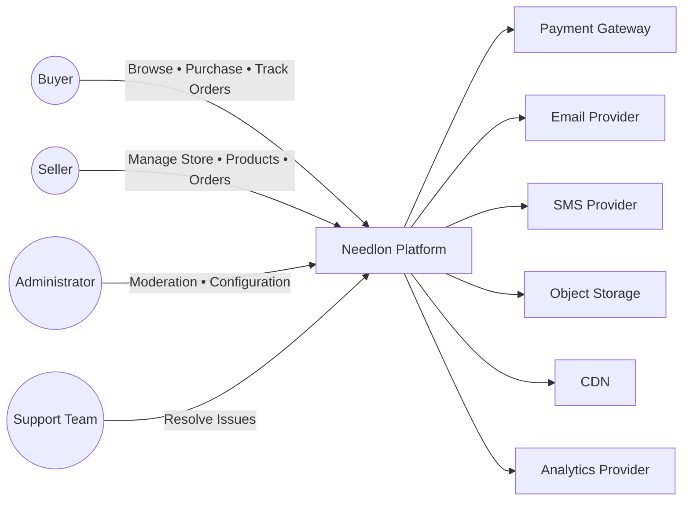

# Chapter 2 — System Context & Ecosystem (C4 Level 1)

> Parent Document: `docs/02-ARCHITECTURE.md`

---

# Document Information

| Property | Value |
|----------|-------|
| Chapter | 2 |
| Title | System Context & Ecosystem |
| Version | 1.0 |
| Status | DRAFT |
| Depends On | Chapter 1 – Architecture Charter |
| References | 00-PROJECT-CONSTITUTION.md, 01-PRODUCT-VISION.md |
| ADRs | ADR-001, ADR-002, ADR-003 |

---

# 1. Purpose

This chapter defines the highest-level view of Needlon.

It identifies:

- the system boundary
- external actors
- external integrations
- internal platform
- trust boundaries
- ownership boundaries

This chapter intentionally avoids implementation details.

Implementation belongs to later chapters.

---

# 2. System Overview

Needlon is a production-grade digital commerce platform dedicated to the fashion ecosystem.

The platform enables sellers to:

- create stores
- publish products
- manage inventory
- receive orders
- communicate with buyers
- grow their business

while enabling buyers to discover and purchase fashion products from trusted sellers.

Needlon acts as the platform connecting all participants.

---

# 3. Platform Responsibility

Needlon owns:

- Identity
- Seller Platform
- Marketplace
- Catalog
- Product Management
- Inventory
- Order Lifecycle
- Subscription Management
- Analytics
- Notifications
- Administration

Needlon does NOT own:

- Banking systems
- Payment gateway infrastructure
- Email infrastructure
- SMS infrastructure
- Cloud infrastructure
- Browser
- Operating systems

---

# 4. Primary Actors

## Seller

Primary business user.

Responsible for:

- onboarding
- store management
- catalog management
- inventory
- pricing
- orders

---

## Buyer

Marketplace customer.

Responsible for:

- browsing
- searching
- ordering
- reviewing
- communication

---

## Administrator

Internal platform operator.

Responsible for:

- moderation
- support
- compliance
- analytics
- seller verification
- platform configuration

---

## Support Team

Internal operational users.

Responsible for:

- issue resolution
- customer assistance
- dispute handling

---

# 5. External Systems

Needlon integrates with external providers but does not own them.

Examples include:

## Payment Gateway

Processes online payments.

Needlon never implements banking infrastructure.

---

## Email Provider

Used for:

- OTP
- verification
- notifications
- transactional emails

---

## SMS Provider

Used for:

- OTP
- alerts
- critical notifications

---

## Object Storage

Stores:

- product images
- seller logos
- banners
- documents

---

## Analytics Provider

Collects operational metrics.

---

## CDN

Accelerates static asset delivery.

---

## Cloud Infrastructure

Provides compute, networking and storage.

---

# 6. Internal Platform

The platform consists of multiple business capabilities.

These are architectural modules.

Identity

↓

Seller

↓

Store

↓

Catalog

↓

Product

↓

Inventory

↓

Orders

↓

Payments

↓

Subscription

↓

Marketplace

↓

Notifications

↓

Analytics

↓

Administration

Every capability has clear ownership.

---

# 7. System Boundary

Inside Needlon

- Business Rules
- APIs
- Authentication
- Authorization
- Database
- UI
- Business Modules
- Background Jobs
- Internal Events

Outside Needlon

- Payment Provider
- SMTP
- SMS
- Browser
- Cloud Services
- CDN
- External APIs

Anything outside the system boundary is treated as an integration.

---

# 8. Trust Boundaries

Needlon defines multiple trust zones.

## Public Zone

Unauthenticated traffic.

Examples:

Landing page

Public marketplace

Authentication pages

---

## Authenticated User Zone

Buyer

Seller

---

## Administrative Zone

Platform administrators.

Requires elevated permissions.

---

## Infrastructure Zone

Database

Storage

Queue

Secrets

Never directly accessible by end users.

---

## Third-Party Zone

External providers.

Communication occurs through controlled integrations only.

---

# 9. Business Capability Map

| Capability | Owner |
|------------|-------|
| Identity | Platform |
| Seller | Seller Module |
| Store | Seller Module |
| Catalog | Catalog Module |
| Product | Product Module |
| Inventory | Inventory Module |
| Orders | Order Module |
| Payments | Payment Module |
| Subscription | Subscription Module |
| Marketplace | Marketplace Module |
| Analytics | Analytics Module |
| Notifications | Notification Module |
| Administration | Admin Module |

Ownership is exclusive.

No capability may have multiple owning modules.

---

[//]: # ()
[//]: # (# 10. C4 Level 1 Context)

[//]: # ()
[//]: # (```text)

[//]: # (                    +----------------------+)

[//]: # (                    |      Buyer           |)

[//]: # (                    +----------+-----------+)

[//]: # (                               |)

[//]: # (                               |)

[//]: # (                    Browse / Purchase)

[//]: # (                               |)

[//]: # (                               v)

[//]: # ()
[//]: # (+-----------------------------------------------------------+)

[//]: # (|                                                           |)

[//]: # (|                    NEEDLON PLATFORM                       |)

[//]: # (|                                                           |)

[//]: # (|  Seller │ Catalog │ Products │ Orders │ Subscription      |)

[//]: # (|  Inventory │ Marketplace │ Notifications │ Admin          |)

[//]: # (|                                                           |)

[//]: # (+-----------------------------------------------------------+)

[//]: # (       ^              ^             ^             ^)

[//]: # (       |              |             |             |)

[//]: # (       |              |             |             |)

[//]: # ( Seller Portal   Payment      Email/SMS      Object Storage)

[//]: # (                 Gateway       Providers)

[//]: # ()
[//]: # (```)

[//]: # ()
[//]: # (The platform is represented as a single system because C4 Level 1 focuses on external relationships rather than internal implementation.)

[//]: # ()
[//]: # (---)

## 10. C4 Level 1 — System Context



---

# Context Interaction Matrix

| Actor   | Identity | Seller | Store  | Catalog  | Product  | Inventory | Orders      | Subscription | Marketplace | Admin   |
| ------- | -------- | ------ | ------ | -------- | -------- | --------- | ----------- | ------------ | ----------- | ------- |
| Buyer   | Login    | —      | View   | Browse   | View     | —         | Place Order | —            | Browse      | —       |
| Seller  | Login    | Manage | Manage | Manage   | Manage   | Manage    | Fulfill     | Manage       | Sell        | —       |
| Admin   | Login    | Verify | Review | Moderate | Moderate | Monitor   | Manage      | Manage       | Moderate    | Manage  |
| Support | Login    | Assist | Assist | —        | —        | —         | Assist      | Assist       | —           | Limited |


### Purpose

This matrix answers

Which business capability is used by which actor?

before writing a single line of code.

Later,

permission design,

RBAC,

navigation,

and UI

all derive from this matrix.

---

# Trust Boundary Matrix

| Zone               | Owner           | Trust Level | Authentication                | Examples                        | Failure Strategy                     |
| ------------------ | --------------- | ----------- | ----------------------------- | ------------------------------- | ------------------------------------ |
| Public             | Internet        | None        | No                            | Landing Page, Marketplace       | Validate Every Request               |
| Authenticated User | Needlon         | Medium      | JWT Session                   | Seller Dashboard, Buyer Account | Session Validation                   |
| Administrative     | Needlon         | High        | Elevated Roles + MFA (Future) | Admin Panel                     | Audit + Strict Authorization         |
| Internal Platform  | Needlon         | High        | Service/Internal              | Modules, Queue                  | Internal Monitoring                  |
| Infrastructure     | Needlon         | Critical    | Secrets                       | Database, Redis, Storage        | Restricted Network Access            |
| Third Party        | External Vendor | External    | API Keys / OAuth              | Payment, Email, SMS             | Retry + Circuit Breaker + Monitoring |


### Benefits

This table later drives

- middleware
- API security
- secret management
- infrastructure
- incident response

---

# External Integration Catalog

| Integration     | Purpose             | Mandatory | Replaceable | Owner               |
| --------------- | ------------------- | --------- | ----------- | ------------------- |
| Payment Gateway | Payments            | Yes       | Yes         | Payments Module     |
| Email Provider  | Transactional Email | Yes       | Yes         | Notification Module |
| SMS Provider    | OTP                 | Optional  | Yes         | Notification Module |
| Object Storage  | Images              | Yes       | Yes         | Media Module        |
| CDN             | Static Assets       | Yes       | Yes         | Platform            |
| Analytics       | Metrics             | Optional  | Yes         | Analytics Module    |


---

# System Ownership Matrix

| Resource   | Owning Module | Other Modules            |
| ---------- | ------------- | ------------------------ |
| Sellers    | Seller        | Read Only via Public API |
| Stores     | Seller        | Read Only                |
| Categories | Catalog       | Read Only                |
| Products   | Product       | Read Only                |
| Inventory  | Inventory     | Product (Query Only)     |
| Orders     | Orders        | Seller (Query Only)      |
| Payments   | Payments      | Orders (Query Only)      |


---


# 11. Architectural Constraints

The system context introduces the following constraints.

- External systems are never trusted implicitly.
- Business logic remains inside Needlon.
- Third-party services remain replaceable.
- External failures must not corrupt internal state.
- Internal modules must not expose implementation details externally.

---

# 12. Architecture Decisions

| ADR | Decision |
|------|----------|
| ADR-001 | Modular Monolith |
| ADR-002 | C4 Documentation |
| ADR-003 | Architecture Decision Records |

No new ADRs are introduced in this chapter.

---

# 13. Success Criteria

This chapter is successful if every engineer can answer:

- What belongs to Needlon?
- What does Needlon not own?
- Who interacts with Needlon?
- Which systems are external?
- Where are the trust boundaries?
- What business capabilities exist?

without reading implementation code.

---

# 14. Summary

Needlon is a modular commerce platform with clearly defined system boundaries, business capabilities, and external integrations.

This chapter establishes the ecosystem in which the architecture operates.

Subsequent chapters progressively zoom into the internal architecture using the C4 model.