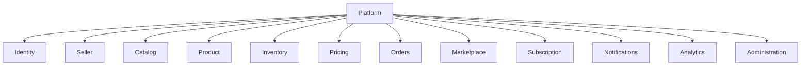
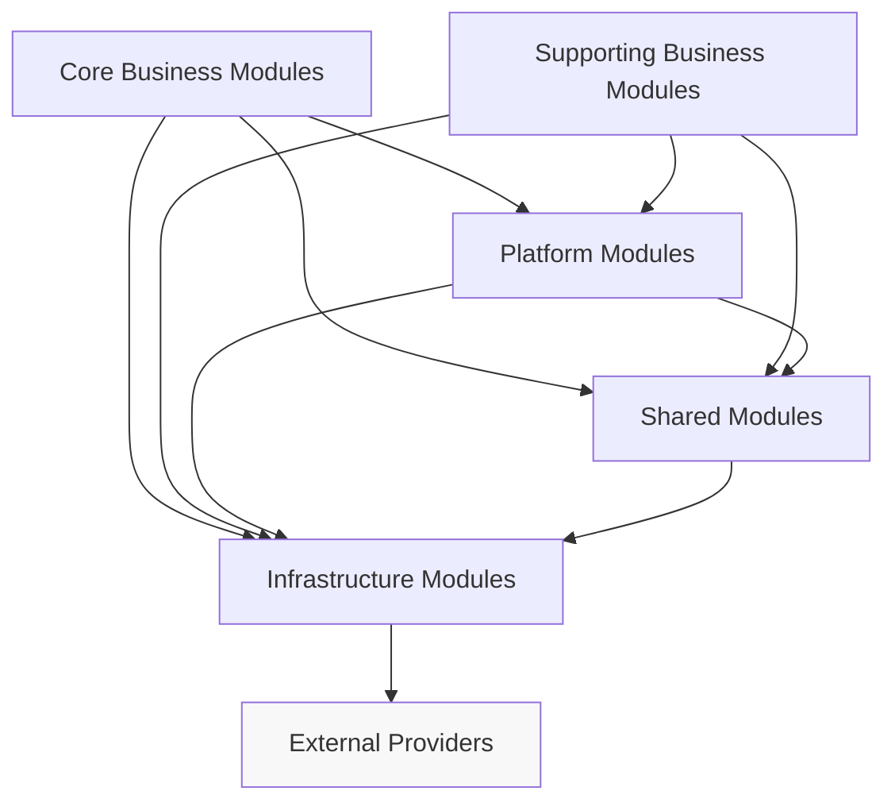

# Chapter 4 — Platform Architecture (Module Architecture)

> Parent Document: `docs/02-ARCHITECTURE.md`

---

# Document Information

| Property | Value |
|----------|-------|
| Chapter | 4 |
| Title | Platform Architecture (Module Architecture) |
| Version | 1.0 |
| Status | DRAFT |
| Depends On | Chapter 1, Chapter 2, Chapter 3 |
| References | ADR-001~011 |

---

# 1. Purpose

This chapter defines the internal organization of the Needlon platform.

It introduces the architectural decomposition of the Web Application into independently owned business modules.

These modules represent business capabilities rather than technical layers.

This chapter intentionally avoids implementation details.

Repository structure, source code organization, database schemas, and APIs are documented in later chapters.

---

# 2. Architectural Philosophy

Needlon follows a **Business Capability Architecture**.

Every architectural module exists because of a business responsibility.

Modules are **not** created around:

- Framework features
- Database tables
- UI pages
- Services
- Teams

Instead,

they are created around stable business capabilities.

Business capability is the highest level of organization inside the platform.

---

# 3. Platform Decomposition

The platform is divided into five architectural groups.

```
Needlon Platform

├── Core Business Modules
├── Supporting Business Modules
├── Platform Modules
├── Shared Modules
└── Infrastructure Modules
```

Each group has a distinct responsibility.

---

# 4. Module Classification

## 4.1 Core Business Modules

These modules directly deliver business value.

Examples:

- Identity
- Seller
- Store
- Catalog
- Product
- Inventory
- Pricing
- Orders
- Subscription
- Marketplace

Characteristics

- Own business rules
- Own business data
- Expose public interfaces
- Independently evolvable

---

## 4.2 Supporting Business Modules

Provide supporting capabilities.

Examples

- Notifications
- Analytics
- Search
- Reviews
- Recommendation (Future)

These modules enhance the platform but are not the primary business workflow.

---

## 4.3 Platform Modules

Platform-wide capabilities.

Examples

- Authentication
- Authorization
- Configuration
- Feature Flags
- Audit
- Health

These modules support every business module.

---

## 4.4 Shared Modules

Reusable code.

Examples

- UI Components
- Validation
- Utilities
- Common Types
- Constants

Shared modules never contain business logic.

(AC-005)

---

## 4.5 Infrastructure Modules

External integrations.

Examples

- PostgreSQL
- Redis
- Storage
- Payment
- Email
- SMS

Infrastructure modules encapsulate technology.

Business modules never directly depend on vendors.

---

# 5. Platform Capability Map

```
Platform

│

├── Identity

├── Seller

│      ├── Profile

│      ├── Store

│      ├── Address

│      ├── Bank

│      └── Settings

├── Catalog

├── Product

├── Inventory

├── Pricing

├── Orders

├── Marketplace

├── Subscription

├── Notification

├── Analytics

└── Administration
```

This capability map is authoritative.

Future modules require ADR approval.

---

# 6. Platform Module Diagram



This diagram intentionally shows ownership rather than communication.

---

# 7. Module Responsibilities

Every module has one owner.

| Module | Responsibility |
|----------|---------------|
| Identity | Authentication & Identity |
| Seller | Seller Lifecycle |
| Store | Store Management |
| Catalog | Categories |
| Product | Product Management |
| Inventory | Inventory Control |
| Pricing | Pricing Rules |
| Orders | Order Lifecycle |
| Marketplace | Discovery |
| Subscription | Plans & Billing |
| Notifications | Communication |
| Analytics | Business Insights |
| Administration | Platform Operations |

No responsibility may have multiple owning modules.

---

# 8. Module Ownership Rules

Ownership is exclusive.

Each module owns

- Business rules
- Database tables
- APIs
- Validation
- Domain events

Other modules access data only through public contracts.

Direct database access across modules is prohibited.

(AC-003)

---

# 9. Module Dependency Rules

Modules communicate through approved interfaces.

Allowed

```
Module

↓

Public API

↓

Another Module
```

Forbidden

```
Module

↓

Repository

↓

Another Module Database
```

Dependencies must always point inward.

Circular dependencies are prohibited.

(AC-004)

---

# 10. Module Communication Model

Needlon currently uses synchronous communication.

Patterns

- Method Calls
- Public Services
- Internal APIs

Future asynchronous messaging requires ADR approval.

---

# 11. Internal Public Contracts

Every module exposes only:

- Commands
- Queries
- Events (Future)
- DTOs

Implementation details remain private.

Consumers depend only on contracts.

---

# 12. Cross-Cutting Services

Platform-wide services include:

- Authentication
- Authorization
- Validation
- Logging
- Auditing
- Error Handling
- Configuration
- Observability

These services are consumed by modules but do not own business workflows.

---

# 13. Module Lifecycle

Every module progresses through the following lifecycle:

1. Proposal (RFC)
2. Architecture Review
3. ADR Approval
4. Implementation
5. Production
6. Evolution
7. Deprecation
8. Removal

Modules cannot bypass this lifecycle.

---

# 14. Architecture Fitness Functions

The following architectural rules are continuously enforced.

AFF-001

No circular module dependencies.

AFF-002

Business logic never exists inside Shared modules.

AFF-003

Infrastructure is replaceable.

AFF-004

Every table has exactly one owning module.

AFF-005

Every public API validates input.

AFF-006

Cross-module communication occurs only through public contracts.

---

# 15. Module Evolution Policy

Adding a new module requires:

- Business justification
- Architecture Review
- RFC
- ADR
- Capability ownership
- Dependency review

No engineer may introduce a new module without approval.

---

# 16. Architectural Boundaries

Modules own:

- Business logic
- Domain models
- Persistence
- Validation
- Public contracts

Modules never own:

- Another module's database
- Another module's services
- Another module's repositories

---

# 17. Success Criteria

This chapter is successful when every engineer can answer:

- What modules exist?
- Why does each module exist?
- Who owns each capability?
- How do modules communicate?
- What dependencies are allowed?
- How are new modules introduced?

without reading implementation code.

---

# 18. Summary

Needlon is internally organized as a business-capability-driven modular platform.

Each module owns a clearly defined business responsibility, evolves independently, communicates through explicit contracts, and follows strict ownership and dependency rules.

This architecture provides the foundation for all repository structure, source code organization, APIs, database design, and implementation details described in subsequent chapters.


# 19. Platform Dependency Graph



### Dependency Rules

| From           | Allowed To                       |
| -------------- | -------------------------------- |
| Core Business  | Platform, Shared, Infrastructure |
| Supporting     | Platform, Shared, Infrastructure |
| Platform       | Shared, Infrastructure           |
| Shared         | Infrastructure only              |
| Infrastructure | External Providers only          |


### Forbidden

- Shared → Core
- Shared → Supporting
- Infrastructure → Core
- Infrastructure → Supporting
- Circular dependencies

---

# 20. Module Interaction Matrix

| From Module | To Module                 | Interaction Type         | Contract             | Allowed |
|-------------|---------------------------|--------------------------|----------------------|---------|
| Seller      | Store                     | Command                  | Public Service       | ✅      |
| Seller      | Product                   | Command                  | Public Service       | ✅      |
| Product     | Inventory                 | Query                    | Public Query         | ✅      |
| Orders      | Inventory                 | Command                  | Reservation Service  | ✅      |
| Orders      | Pricing                   | Query                    | Price Service        | ✅      |
| Orders      | Notifications             | Event / Command          | Notification Service | ✅      |
| Marketplace | Catalog                   | Query                    | Public Query         | ✅      |
| Marketplace | Product                   | Query                    | Public Query         | ✅      |
| Analytics   | Orders                    | Read Model               | Public Analytics API | ✅      |
| Any Module  | Another Module Repository | Direct Repository Access | —                    | ❌      |

### Rule

All cross-module interaction must pass through a published contract.

---

# 21. Capability Ownership Matrix

| Business Capability | Owning Module | Owns Database | Owns API | Owns UI  | Public Contract      |
|---------------------|---------------|---------------|----------|----------|----------------------|
| Identity            | Identity      | ✅            | ✅       | ✅       | Identity API         |
| Seller Profile      | Seller        | ✅            | ✅       | ✅       | Seller Service       |
| Store               | Store         | ✅            | ✅       | ✅       | Store Service        |
| Catalog             | Catalog       | ✅            | ✅       | ✅       | Catalog Service      |
| Product             | Product       | ✅            | ✅       | ✅       | Product Service      |
| Inventory           | Inventory     | ✅            | ✅       | Optional | Inventory Service    |
| Pricing             | Pricing       | ✅            | ✅       | Optional | Pricing Service      |
| Orders              | Orders        | ✅            | ✅       | ✅       | Order Service        |
| Subscription        | Subscription  | ✅            | ✅       | ✅       | Subscription Service |
| Notifications       | Notification  | Optional      | ✅       | ❌       | Notification Service |
| Analytics           | Analytics     | Read Models   | ✅       | ✅       | Analytics Service    |


### Ownership Rule

Each capability has exactly one owning module.

No exceptions.

---

# 22. Module Maturity Model

| Stage      | Description           | Entry Criteria                     | Exit Criteria          |
| ---------- | --------------------- | ---------------------------------- | ---------------------- |
| Proposed   | RFC created           | Business need identified           | ADR approved           |
| Planned    | Architecture approved | ADR accepted                       | Implementation started |
| Active     | Under development     | Repository created                 | Production deployment  |
| Stable     | Production ready      | Monitoring + Tests + Documentation | Major redesign         |
| Deprecated | Scheduled for removal | Replacement exists                 | Removal completed      |
| Retired    | Removed               | Data migrated                      | Documentation archived |


### Rule

Every module must have exactly one maturity state.

---

# 23. Module Blueprint Template

``` 
Module Name

Purpose

Business Capability

Responsibilities

Public Contracts

Commands

Queries

Events (Future)

Owned Database Tables

Owned APIs

Owned UI

Dependencies

Allowed Consumers

Security Model

Validation Rules

Observability

Testing Requirements

Performance Requirements

Scalability Considerations

Future Roadmap

```

### This blueprint becomes mandatory for:

- Seller
- Store
- Product
- Orders
- Inventory
- Pricing
- Subscription
- Notifications
- Analytics
- Administration

---

# 24. Platform Fitness Dashboard

| Metric                           | Target                   | Enforcement                      |
| -------------------------------- | ------------------------ | -------------------------------- |
| Circular Dependencies            | 0                        | Static Analysis                  |
| Cross-Module Repository Access   | 0                        | Code Review + Architecture Tests |
| Shared Business Logic Violations | 0                        | Architecture Tests               |
| Module Ownership Violations      | 0                        | ADR Review                       |
| Public API Validation Coverage   | 100%                     | Automated Tests                  |
| Authentication Coverage          | 100%                     | Security Tests                   |
| Authorization Coverage           | 100%                     | Security Tests                   |
| Logging Coverage                 | 100% Critical Operations | Observability Review             |
| Audit Coverage                   | 100% Sensitive Actions   | Audit Tests                      |
| Documentation Coverage           | 100% Modules             | Architecture Review              |


### Architecture Health Levels

| Score  | Status             |
| ------ | ------------------ |
| 95–100 | Excellent          |
| 85–94  | Healthy            |
| 70–84  | Needs Review       |
| <70    | Architectural Debt |

This allows architecture quality to be tracked over time.
