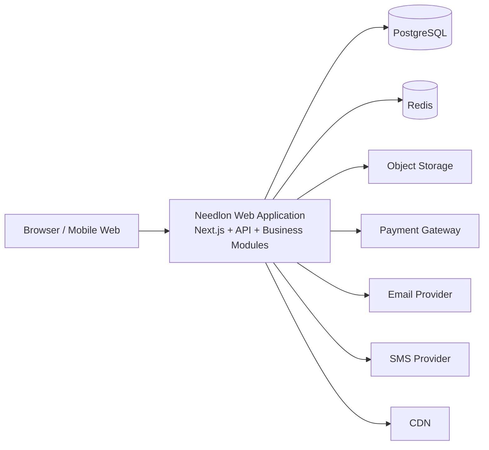
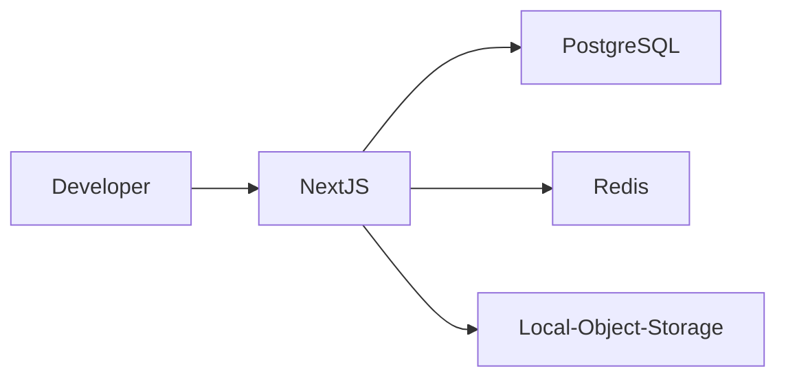
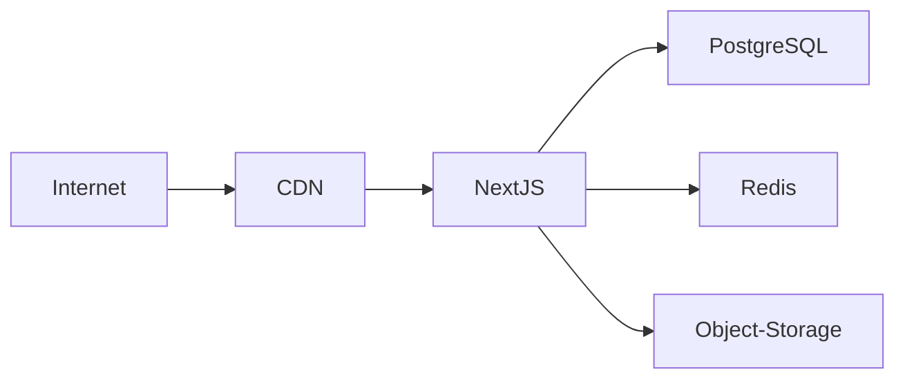
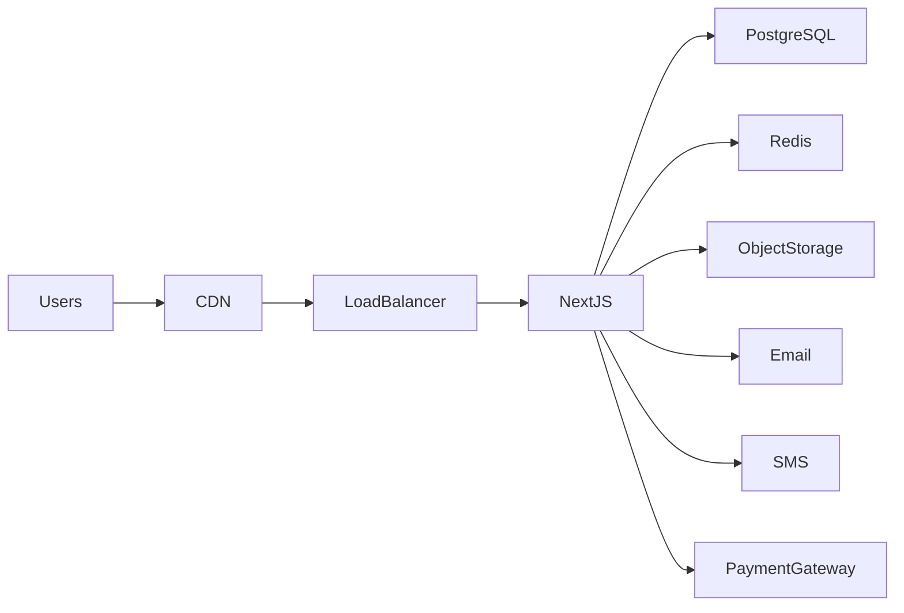

# Chapter 3 — Container Architecture (C4 Level 2)

> Parent Document: `docs/02-ARCHITECTURE.md`

---

# Document Information

| Property | Value |
|----------|-------|
| Chapter | 3 |
| Title | Container Architecture (C4 Level 2) |
| Version | 1.0 |
| Status | DRAFT |
| Depends On | Chapter 1, Chapter 2 |
| References | ADR-001, ADR-002, ADR-003, AP-001~010, AC-001~008 |

---

# 1. Purpose

This chapter defines the deployable containers that collectively form the Needlon platform.

Unlike Chapter 2, which defines the system boundary, this chapter identifies the major runtime containers, their responsibilities, communication paths, ownership, and deployment constraints.

Each container represents a deployable or independently managed runtime boundary—not a business module.

Business modules are defined in later chapters.

---

# 2. Architectural Philosophy

Needlon is deployed as a **single production application** composed of multiple logical runtime containers.

These containers cooperate to deliver the complete marketplace platform while preserving clear operational responsibilities.

This architecture satisfies:

- AC-001 Single Deployable Application
- AC-002 Single Primary Database
- AP-002 Modularity
- QA-001 Maintainability
- QA-002 Scalability

---

# 3. Runtime Containers

Needlon consists of the following primary containers.

| Container | Type | Ownership | Purpose |
|------------|------|-----------|----------|
| Web Application | Internal | Platform | UI, API, Business Logic |
| PostgreSQL | Internal | Platform | Primary relational database |
| Redis | Internal | Platform | Cache, Rate Limit, Session Support |
| Object Storage | External Managed | Platform | Images & Documents |
| Email Service | External | Notification | Transactional Email |
| SMS Provider | External | Notification | OTP & Alerts |
| Payment Gateway | External | Payments | Payment Processing |
| CDN | External | Platform | Static Asset Delivery |

No additional runtime containers may be introduced without an approved ADR.

---

# 4. Primary Container

## Web Application

The Web Application is the core runtime of Needlon.

It hosts:

- Next.js App Router
- API Routes
- Server Components
- Client Components
- Authentication
- Business Modules
- Background Schedulers (lightweight)
- Validation
- Authorization

This is the only business container.

All business rules execute here.

---

# 5. Database Container

## PostgreSQL

PostgreSQL is the single source of truth.

Responsibilities include:

- Seller Data
- Buyer Data
- Products
- Orders
- Inventory
- Subscriptions
- Analytics Metadata
- Platform Configuration

Constraints:

- AC-002
- AC-003

No business logic exists inside the database.

---

# 6. Cache Container

## Redis

Redis provides transient storage.

Responsibilities:

- Rate Limiting
- OTP Storage
- Temporary Verification
- Token Blacklisting
- Distributed Locks (future)
- Short-lived Cache

Redis must never become the primary source of business data.

---

# 7. Object Storage Container

Object Storage manages binary assets.

Examples:

- Product Images
- Store Logos
- Store Banners
- Seller Documents

Business metadata remains in PostgreSQL.

Files remain in Object Storage.

---

# 8. External Service Containers

Needlon integrates with external providers.

These providers remain replaceable.

## Email

Purpose:

- Verification
- Notifications
- Password Reset

---

## SMS

Purpose:

- OTP
- Critical Alerts

---

## Payment Gateway

Purpose:

- Payment Authorization
- Payment Confirmation
- Refund Events

Business rules remain inside Needlon.

The gateway only processes transactions.

---

# 9. Container Communication

Containers communicate using well-defined interfaces.

```text
Browser
      │
      ▼
Next.js Application
      │
      ├────────► PostgreSQL
      │
      ├────────► Redis
      │
      ├────────► Object Storage
      │
      ├────────► Email Provider
      │
      ├────────► SMS Provider
      │
      └────────► Payment Gateway
```

Containers never communicate through shared databases owned by third parties.

---

# 10. C4 Level 2 Container Diagram



---

# 11. Container Responsibility Matrix

| Responsibility | Container |
|---------------|-----------|
| UI Rendering | Web Application |
| API Execution | Web Application |
| Business Logic | Web Application |
| Authentication | Web Application |
| Authorization | Web Application |
| Database | PostgreSQL |
| Caching | Redis |
| File Storage | Object Storage |
| Payments | Payment Gateway |
| Email | Email Provider |
| SMS | SMS Provider |
| Static Assets | CDN |

Responsibilities must remain exclusive.

---

# 12. Data Flow

Typical request lifecycle:

Browser

↓

Next.js Middleware

↓

Authentication

↓

Validation

↓

Business Module

↓

Repository

↓

PostgreSQL

↓

Response

External integrations occur only when required by business logic.

---

# 13. Failure Isolation

| Failure | Platform Behaviour |
|----------|-------------------|
| Redis Down | Continue with degraded caching where possible |
| Email Down | Queue / Retry notifications |
| SMS Down | Retry / Alternate provider (future) |
| Payment Gateway Down | Reject payment operations gracefully |
| Storage Down | Prevent uploads, preserve metadata |
| CDN Down | Serve assets directly if feasible |

A failure in one external container must not corrupt business data.

---

# 14. Security Boundaries

Each container has explicit trust boundaries.

| Container | Trust Level |
|-----------|-------------|
| Browser | Untrusted |
| Web Application | Trusted |
| PostgreSQL | Highly Trusted |
| Redis | Highly Trusted |
| Object Storage | Trusted |
| Payment Gateway | External Trusted Integration |
| Email | External Trusted Integration |
| SMS | External Trusted Integration |

All communication must use authenticated and encrypted channels where applicable.

---

# 15. Container Constraints

The following rules are mandatory.

- No business logic inside Redis.
- No business logic inside PostgreSQL.
- External services remain replaceable.
- Object Storage stores files only.
- Web Application owns orchestration.
- Single relational database.
- No direct browser access to infrastructure containers.

---

# 16. ADR References

| ADR | Description |
|------|-------------|
| ADR-001 | Modular Monolith |
| ADR-002 | C4 Documentation |
| ADR-003 | ADR Process |
| ADR-004 | Architecture Governance |

---

# 17. Success Criteria

This chapter is successful if every engineer can answer:

- What containers exist?
- Which container owns which responsibility?
- How do containers communicate?
- What happens when a dependency fails?
- Which data belongs where?
- Which systems are replaceable?

without reading implementation code.

---

# 18. Summary

Needlon is deployed as a modular monolithic web application supported by dedicated infrastructure containers for persistence, caching, storage, messaging, and payment integration.

Business logic remains centralized within the Web Application, while infrastructure containers provide specialized operational capabilities through well-defined interfaces.

---

# 19. Container Decision Table (ADR Mapping)

| Container       | Why It Exists                   | Alternatives Considered         | ADR     | Decision |
| --------------- | ------------------------------- | ------------------------------- | ------- | -------- |
| Web Application | Centralize business logic       | Backend API + Separate Frontend | ADR-001 | Accepted |
| PostgreSQL      | ACID business data              | MongoDB, MySQL                  | ADR-005 | Accepted |
| Redis           | Ephemeral cache & rate limiting | In-memory cache                 | ADR-006 | Accepted |
| Object Storage  | Binary asset storage            | Database BLOBs                  | ADR-007 | Accepted |
| Email Provider  | Transactional email             | Self-hosted SMTP                | ADR-008 | Accepted |
| SMS Provider    | OTP & alerts                    | Self-hosted gateway             | ADR-009 | Accepted |
| Payment Gateway | Secure payment processing       | Direct banking integration      | ADR-010 | Accepted |
| CDN             | Global asset delivery           | Direct origin serving           | ADR-011 | Accepted |


---


# Environment Deployment Topology

### Local Development


### Staging



### Production



---

# Container Communication Matrix

| From    | To         | Protocol  | Authentication      | Sync / Async    | Retry       |
| ------- | ---------- | --------- | ------------------- | --------------- | ----------- |
| Browser | Web App    | HTTPS     | JWT / Cookies       | Sync            | Browser     |
| Web App | PostgreSQL | TCP       | DB Credentials      | Sync            | Transaction |
| Web App | Redis      | TCP       | Redis Auth          | Sync            | Optional    |
| Web App | Storage    | HTTPS     | Service Credentials | Sync            | Yes         |
| Web App | Email      | HTTPS API | API Key             | Async Preferred | Yes         |
| Web App | SMS        | HTTPS API | API Key             | Async Preferred | Yes         |
| Web App | Payment    | HTTPS API | Signed Request      | Sync            | Idempotent  |


# Non-Functional Requirements (NFR)

| Container       | Availability | Backup               | Monitoring           | Scaling                           |
| --------------- | ------------ | -------------------- | -------------------- | --------------------------------- |
| Web Application | High         | Deployment Artifacts | APM + Logs           | Horizontal                        |
| PostgreSQL      | Critical     | Daily + PITR         | Metrics + Slow Query | Vertical + Read Replicas (Future) |
| Redis           | Medium       | None                 | Memory + Latency     | Horizontal (Future)               |
| Object Storage  | High         | Provider Managed     | Storage Metrics      | Provider Managed                  |
| Email           | Medium       | N/A                  | Delivery Metrics     | Provider Managed                  |
| SMS             | Medium       | N/A                  | Delivery Metrics     | Provider Managed                  |
| Payment         | Critical     | Provider Managed     | Webhook Monitoring   | Provider Managed                  |


# Operational Ownership Matrix

| Container       | Technical Owner     | Business Owner    |
| --------------- | ------------------- | ----------------- |
| Web Application | Platform Team       | Product           |
| PostgreSQL      | Platform            | Platform          |
| Redis           | Platform            | Platform          |
| Storage         | Platform            | Seller Experience |
| Email           | Notification Module | Platform          |
| SMS             | Notification Module | Platform          |
| Payment         | Payments Module     | Finance           |


# Failure Recovery Strategy

| Failure    | Detection       | Recovery                            | User Experience                      |
| ---------- | --------------- | ----------------------------------- | ------------------------------------ |
| Redis      | Health Check    | Reconnect                           | Temporary performance degradation    |
| PostgreSQL | Health Check    | Failover (Future)                   | Read-only / maintenance if necessary |
| Storage    | Upload Failure  | Retry                               | Inform user and preserve metadata    |
| Email      | API Failure     | Retry Queue                         | Notification delayed                 |
| SMS        | API Failure     | Retry / Alternate Provider (Future) | OTP delayed                          |
| Payment    | Webhook Timeout | Idempotent Retry                    | Payment status pending               |


# Secrets Management Policy

| Resource   | Secret Type       | Rotation  |
| ---------- | ----------------- | --------- |
| PostgreSQL | Connection String | Scheduled |
| Redis      | Password          | Scheduled |
| Payment    | API Keys          | Scheduled |
| Email      | API Keys          | Scheduled |
| SMS        | API Keys          | Scheduled |
| Storage    | Service Keys      | Scheduled |
| JWT        | Signing Keys      | Scheduled |


# Scalability Roadmap

| Stage   | Expected Scale       | Architecture                                |
| ------- | -------------------- | ------------------------------------------- |
| Stage 1 | MVP                  | Single Next.js Instance                     |
| Stage 2 | Thousands of Sellers | Multiple Web Instances + Managed PostgreSQL |
| Stage 3 | National Scale       | Read Replicas + Dedicated Workers           |
| Stage 4 | Very Large Scale     | Evaluate service extraction via RFC/ADR     |

