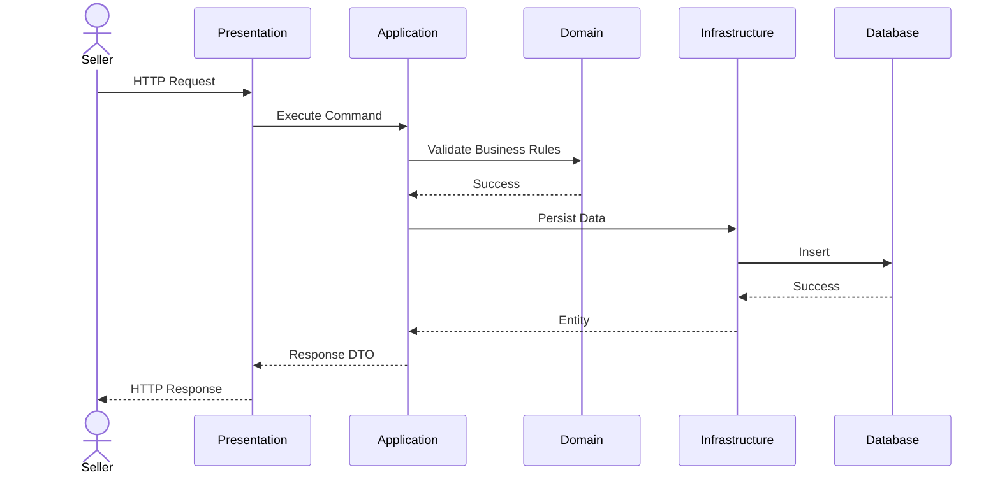
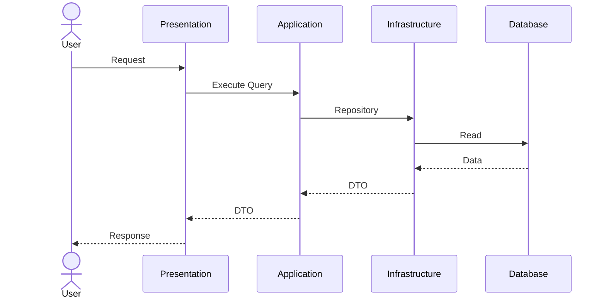
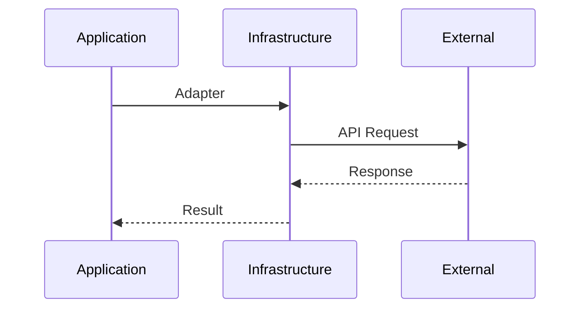

# Chapter 5 — Engineering Module Standard

## Part I — Foundation

> Architecture Layer: Application / Domain
>
> Depends On:
>
> - Chapter 1 — Architecture Charter
> - Chapter 2 — System Context & Ecosystem
> - Chapter 3 — Container Architecture
> - Chapter 4 — Platform Architecture
>
> Architecture Stability Check
>
> Reviewed Against:
>
> ✅ Constitution
> ✅ Product Vision
> ✅ Chapter 1
> ✅ Chapter 2
> ✅ Chapter 3
> ✅ Chapter 4
>
> Result:
>
> No architectural conflicts detected.
>
> New ADR Required:
>
> No

---

# 1. Purpose

This chapter defines the engineering standard that every business module within Needlon must follow.

A module is the smallest independently owned architectural unit of the platform.

Every current and future module—including Seller, Store, Product, Inventory, Orders, Pricing, Subscription, Notifications, Analytics, and Administration—must comply with this standard.

This chapter establishes **how modules are designed**, not how individual features are implemented.

---

# 2. Definition of a Module

A module is a cohesive business capability that owns its own rules, data, contracts, and lifecycle.

A module is **not**:

- a folder
- a UI page
- a database table
- a service
- a collection of APIs
- a React component

A module exists only when it represents a stable business capability.

Examples of valid modules:

- Seller
- Store
- Product
- Inventory
- Orders
- Pricing
- Subscription

Examples of invalid modules:

- Forms
- Buttons
- Utils
- CRUD
- API
- Database

Modules represent the language of the business, not the language of the framework.

---

# 3. Engineering Objectives

Every module must satisfy the following objectives.

| Objective | Description |
|------------|-------------|
| EO-001 | Encapsulate one business capability. |
| EO-002 | Own its business rules. |
| EO-003 | Own its persistence model. |
| EO-004 | Expose explicit public contracts. |
| EO-005 | Prevent leakage of internal implementation. |
| EO-006 | Remain independently testable. |
| EO-007 | Remain replaceable internally without affecting consumers. |
| EO-008 | Support long-term evolution. |

These objectives are mandatory.

---

# 4. Module Philosophy

Needlon follows **Business Capability Engineering**.

Each module is treated as a small application within the platform.

A module should be understandable in isolation.

An engineer should be able to answer the following questions without reading another module:

- What problem does this module solve?
- What data does it own?
- Which rules does it enforce?
- Which contracts does it expose?
- Which modules may communicate with it?

If these questions cannot be answered, the module boundary is considered incorrect.

---

# 5. Core Characteristics

Every production module must exhibit the following characteristics.

| Characteristic | Requirement |
|----------------|-------------|
| Single Responsibility | One business capability only. |
| High Cohesion | Closely related logic remains together. |
| Low Coupling | Dependencies remain explicit and minimal. |
| Encapsulation | Internal implementation is private. |
| Explicit Contracts | Public interfaces are documented and stable. |
| Replaceability | Internal changes do not break consumers. |
| Testability | Business logic can be tested independently. |
| Observability | Module behavior can be monitored. |

---

# 6. Module Responsibilities

Every module owns:

- Business rules
- Domain concepts
- Validation rules
- Persistence model
- Public contracts
- Business workflows
- Business policies
- Domain-specific errors
- Module documentation

A module never owns another module's responsibilities.

---

# 7. Module Non-Responsibilities

A module must never:

- access another module's database directly
- modify another module's persistence layer
- expose internal repositories
- bypass public contracts
- contain unrelated business logic
- depend on implementation details of another module
- duplicate business rules already owned elsewhere

Violations of these rules constitute architectural defects.

---

# 8. Module Boundary

Every module has an explicit boundary.

The boundary separates:

- public behavior
- private implementation

Only the public boundary may be consumed by other modules.

Everything else is considered an implementation detail.

Changing internal implementation must not require changes in consuming modules.

---

# 9. Public Surface

Each module exposes a minimal public surface.

Permitted public elements include:

- Commands
- Queries
- DTOs
- Public Services
- Published Events (future)

Everything else remains private.

A smaller public surface reduces coupling and improves maintainability.

---

# 10. Ownership Model

Each module owns exactly one business capability.

Ownership includes:

- Business logic
- Database schema
- APIs
- UI flows
- Validation
- Domain policies
- Documentation

No ownership may be shared.

Cross-module ownership is prohibited.

---

# 11. Module Lifecycle

Every module follows the same lifecycle.

```text
Business Need
        ↓
RFC
        ↓
Architecture Review
        ↓
ADR Approval
        ↓
Implementation
        ↓
Testing
        ↓
Production
        ↓
Evolution
        ↓
Deprecation
        ↓
Retirement
```

Skipping lifecycle stages is not permitted.

---

# 12. Module Acceptance Criteria

A module is considered production-ready only when all of the following are true.

### Architecture

- Business capability is clearly defined.
- Responsibilities are exclusive.
- Boundaries are explicit.
- Dependencies follow Chapter 4.

### Engineering

- Public contracts documented.
- Internal implementation encapsulated.
- Validation complete.
- Authorization enforced.
- Error handling defined.
- Logging implemented.
- Observability configured.

### Quality

- Unit tests passing.
- Integration tests passing.
- Performance acceptable.
- Documentation complete.

A module failing any mandatory criterion cannot be classified as production-ready.

---

# 13. Module Evolution Principles

Modules are expected to evolve.

Evolution must preserve:

- public contracts
- business ownership
- dependency rules
- architectural boundaries

Breaking changes require:

- Architecture Review
- ADR (if architectural)
- Migration strategy
- Backward compatibility assessment

---

# 14. Module Engineering Principles

Every module inherits the platform principles defined in Chapter 1.

Additionally, every module must satisfy:

| Principle | Description |
|------------|-------------|
| MP-001 | Business capability first. |
| MP-002 | Minimize public surface. |
| MP-003 | Keep implementation private. |
| MP-004 | Depend on contracts, not implementations. |
| MP-005 | Prefer composition over duplication. |
| MP-006 | Avoid unnecessary abstractions. |
| MP-007 | Optimize for maintainability before cleverness. |
| MP-008 | Design for change without breaking consumers. |

These principles are mandatory for all modules.

---

# 15. Success Criteria

This foundation is successful if every engineer can answer:

- What is a module?
- Why does the module exist?
- What does it own?
- What must it never own?
- How does it evolve?
- When is it production-ready?

without referring to implementation details.

---

# 16. Summary

A Needlon module is an independently owned business capability with explicit boundaries, exclusive ownership, stable public contracts, and a defined engineering lifecycle.

This foundation establishes the standards that every module in the platform must follow.

All remaining sections of Chapter 5 build upon these principles.


## Part II — Internal Architecture

> Architecture Layer: Module
>
> Depends On:
>
> - Part I — Foundation
> - Chapter 4 — Platform Architecture
>
> Architecture Stability Check
>
> Reviewed Against:
>
> ✅ Constitution
> ✅ Product Vision
> ✅ Chapter 1
> ✅ Chapter 2
> ✅ Chapter 3
> ✅ Chapter 4
> ✅ Chapter 5 Part I
>
> Result:
>
> No architectural conflicts detected.
>
> New ADR Required:
>
> No

---

# 17. Purpose

This section defines the canonical internal architecture that every Needlon module must follow.

The architecture is independent of frameworks, libraries, and repository structure.

Its purpose is to ensure every module is built using the same engineering model.

---

# 18. Architectural Layers

Every module consists of four architectural layers.

```text
Presentation
      │
      ▼
Application
      │
      ▼
Domain
      │
      ▼
Infrastructure
```

Dependencies always flow downward.

Reverse dependencies are prohibited.

---

# 19. Layer Responsibilities

| Layer | Responsibility |
|--------|----------------|
| Presentation | Accept external requests and return responses. |
| Application | Coordinate business use cases and workflows. |
| Domain | Contain business rules and policies. |
| Infrastructure | Interact with external technologies. |

Each layer has one responsibility.

---

# 20. Presentation Layer

Purpose:

Provide the module's public entry points.

Examples:

- Route Handlers
- Server Actions
- UI Entry Points
- Webhooks
- Scheduled Jobs
- Public APIs

Presentation does **not** contain business rules.

Responsibilities:

- Authentication
- Authorization
- Request parsing
- Input validation trigger
- DTO conversion
- Response formatting

Presentation orchestrates but never decides business policy.

---

# 21. Application Layer

The Application layer implements business use cases.

Examples:

- Create Seller
- Update Store
- Publish Product
- Reserve Inventory
- Create Order

Responsibilities:

- Use case orchestration
- Transaction boundaries
- Calling domain services
- Calling repositories through interfaces
- Publishing module events (future)

Application coordinates.

It does not own business rules.

---

# 22. Domain Layer

The Domain layer is the heart of the module.

Responsibilities:

- Business rules
- Policies
- Invariants
- Domain services
- Domain models
- Value objects
- Business validation

The Domain layer must not know:

- HTTP
- React
- Database
- PostgreSQL
- Redis
- Supabase
- Next.js

It contains only business knowledge.

---

# 23. Infrastructure Layer

Infrastructure connects the module to technology.

Examples:

- Database implementation
- Redis implementation
- Storage implementation
- Email implementation
- Payment adapters
- External APIs

Responsibilities:

- Repository implementations
- ORM mapping
- Third-party SDKs
- Network communication
- Persistence

Infrastructure never owns business rules.

---

# 24. Dependency Rule

Allowed dependency direction

```text
Presentation
      │
      ▼
Application
      │
      ▼
Domain
      │
      ▼
Infrastructure
```

Forbidden

```text
Infrastructure
        │
        ▼
Presentation
```

```text
Domain
      │
      ▼
Presentation
```

```text
Presentation
      │
      ▼
Database
```

Every dependency violation is an architecture defect.

---

# 25. Layer Interaction Matrix

| From | To | Allowed | Reason |
|------|----|----------|--------|
| Presentation | Application | ✅ | Execute use cases |
| Application | Domain | ✅ | Apply business rules |
| Application | Infrastructure | ✅ (through contracts) | Persistence and integrations |
| Domain | Infrastructure | ❌ | Preserve business purity |
| Infrastructure | Domain | ❌ Direct dependency on implementation | Use domain contracts only |
| Presentation | Domain | ❌ | Prevent bypassing use cases |
| Presentation | Infrastructure | ❌ | Prevent technology coupling |

---

# 26. Internal Flow

Every request follows the same lifecycle.

```text
Request
    │
    ▼
Presentation
    │
    ▼
Application
    │
    ▼
Domain
    │
    ▼
Infrastructure
    │
    ▼
Persistence / External System
    │
    ▼
Response
```

No layer may skip another layer unless explicitly documented by an ADR.

---

# 27. Cross-Layer Rules

The following rules are mandatory.

- Layers communicate only with adjacent layers.
- Each layer exposes only its intended contracts.
- Business decisions occur only in the Domain layer.
- Workflows are coordinated only in the Application layer.
- Technology-specific code remains in Infrastructure.
- Presentation remains framework-facing, not business-facing.

---

# 28. Layer Ownership Matrix

| Concern | Presentation | Application | Domain | Infrastructure |
|---------|--------------|-------------|---------|----------------|
| HTTP | ✅ | ❌ | ❌ | ❌ |
| Authentication Context | ✅ | ❌ | ❌ | ❌ |
| Workflow | ❌ | ✅ | ❌ | ❌ |
| Business Rules | ❌ | ❌ | ✅ | ❌ |
| Domain Models | ❌ | ❌ | ✅ | ❌ |
| Transactions | ❌ | ✅ | ❌ | ❌ |
| Database | ❌ | ❌ | ❌ | ✅ |
| Third-party APIs | ❌ | ❌ | ❌ | ✅ |

---

# 29. Layer Fitness Functions

Every module must satisfy:

LFF-001

Business rules outside Domain = 0

LFF-002

Presentation directly accessing persistence = 0

LFF-003

Infrastructure containing business policies = 0

LFF-004

Cross-layer violations = 0

LFF-005

Public workflows implemented in Application = 100%

---

# 30. Success Criteria

Every engineer can answer:

- Which layer owns business rules?
- Which layer owns workflows?
- Which layer owns persistence?
- Which layer owns external integrations?
- Which layer owns HTTP?

without reading implementation code.

---

# 31. Summary

Every Needlon module follows a four-layer architecture.

Presentation receives requests.

Application coordinates workflows.

Domain enforces business rules.

Infrastructure integrates with technology.

This structure provides a consistent engineering model for every module in the platform while preserving maintainability, testability, and clear architectural boundaries.

# 32. Canonical Module Sequence Diagrams

Every module interaction must follow approved request lifecycles.

These diagrams define the canonical execution order.

---

## 32.1 Standard Command Flow

Example: Create Product



---

## 32.2 Standard Query Flow



Queries never execute business state changes.

---

## 32.3 Standard External Integration Flow



Business modules never communicate directly with vendors.

---

# 33. Transaction Ownership Policy

Transactions are owned exclusively by the **Application Layer**.

## Ownership Rules

| Layer | May Start Transaction | May Commit | May Rollback |
|--------|-----------------------|------------|--------------|
| Presentation | ❌ | ❌ | ❌ |
| Application | ✅ | ✅ | ✅ |
| Domain | ❌ | ❌ | ❌ |
| Infrastructure | ❌ | ❌ | ❌ |

---

## Transaction Rules

TR-001

One business use case = one transaction.

TR-002

Nested transactions are prohibited unless explicitly approved by ADR.

TR-003

Infrastructure never starts transactions.

TR-004

Domain never knows a transaction exists.

TR-005

Failed business validation aborts the transaction.

TR-006

External API failures must not leave partially committed business state.

---

# 34. Domain Purity Rules

The Domain Layer represents pure business knowledge.

It must remain completely independent of frameworks and infrastructure.

## Forbidden Dependencies

The Domain Layer must never depend on:

- Next.js
- React
- Drizzle ORM
- PostgreSQL
- Redis
- Supabase
- Browser APIs
- HTTP
- Cookies
- Headers
- Request objects
- Response objects
- Environment variables
- Third-party SDKs

---

## Allowed Concepts

The Domain Layer may contain:

- Entities
- Value Objects
- Aggregates (future)
- Business Policies
- Domain Services
- Specifications
- Business Exceptions
- Domain Events (future)

---

## Domain Purity Principle

If the Domain Layer cannot be unit tested without infrastructure, it violates architectural purity.

---

# 35. Application Service Classification

The Application Layer exposes four standardized service categories.

---

## Command Services

Purpose

Modify business state.

Examples

- Create Seller
- Publish Product
- Reserve Inventory
- Place Order

Commands may start transactions.

---

## Query Services

Purpose

Read business information.

Queries never modify business state.

---

## Background Services

Purpose

Internal asynchronous work.

Examples

- Cleanup
- Retry
- Synchronization

Background services must still respect module boundaries.

---

## Scheduled Services

Purpose

Time-driven execution.

Examples

- Subscription Renewal
- Expired OTP Cleanup
- Analytics Aggregation

Scheduled services are initiated by the platform scheduler, not users.

---

# 36. Architecture Test Specification

Architecture is enforceable.

Every module must satisfy automated architectural tests.

## Required Architecture Rules

| Rule | Expected Result |
|------|-----------------|
| No Circular Dependencies | PASS |
| No Shared Business Logic | PASS |
| Domain Framework Dependency | NONE |
| Presentation Direct Repository Access | NONE |
| Cross Module Repository Access | NONE |
| Business Rules Outside Domain | NONE |
| Infrastructure Business Logic | NONE |
| Public Contracts Documented | 100% |
| Public Commands Tested | 100% |
| Public Queries Tested | 100% |

---

## Continuous Verification

Architecture validation should execute in CI.

Violations fail the pipeline.

Architecture quality is treated as a build requirement rather than documentation.

---

# 37. Internal Architecture Compliance Checklist

Before a module is approved for production, verify:

### Layering

- [ ] Four-layer architecture implemented
- [ ] No forbidden dependencies
- [ ] Dependency direction validated

### Domain

- [ ] Business rules isolated
- [ ] Framework-independent
- [ ] Domain unit tests passing

### Application

- [ ] Use cases implemented
- [ ] Transactions correctly owned
- [ ] Public contracts documented

### Infrastructure

- [ ] External integrations isolated
- [ ] Repository implementations complete
- [ ] Vendor abstractions respected

### Presentation

- [ ] Authentication enforced
- [ ] Authorization enforced
- [ ] Request validation completed
- [ ] Response contracts documented

A module cannot progress to production unless every mandatory item is satisfied.


## Part III — Engineering Standards

> Architecture Layer: Cross-Cutting Engineering
>
> Depends On:
>
> - Chapter 1 — Architecture Charter
> - Chapter 4 — Platform Architecture
> - Chapter 5 Part I
> - Chapter 5 Part II
>
> Architecture Stability Check
>
> Reviewed Against
>
> ✅ Constitution
> ✅ Product Vision
> ✅ Chapter 1
> ✅ Chapter 2
> ✅ Chapter 3
> ✅ Chapter 4
> ✅ Chapter 5 Part I
> ✅ Chapter 5 Part II
>
> Result
>
> No architectural conflicts detected.
>
> New ADR Required
>
> No

---

# 38. Purpose

Engineering Standards define mandatory implementation rules that apply to every Needlon module.

These standards are technology-independent and remain valid even if frameworks or libraries change.

No module may opt out of these standards.

---

# 39. Request Processing Standard

Every external request must follow the same lifecycle.

```text
Request
    │
    ▼
Authentication
    │
    ▼
Authorization
    │
    ▼
Input Validation
    │
    ▼
Application Use Case
    │
    ▼
Domain Rules
    │
    ▼
Persistence / Integration
    │
    ▼
Output Mapping
    │
    ▼
Response
```

No step may be skipped.

---

# 40. Validation Standard

Validation is performed at multiple levels.

| Validation Type | Layer | Purpose |
|-----------------|-------|----------|
| Transport Validation | Presentation | Request format |
| Business Validation | Domain | Business invariants |
| Persistence Validation | Infrastructure | Database constraints |

### Rules

VS-001

Never trust client input.

VS-002

Business validation belongs only in the Domain layer.

VS-003

Database constraints complement—not replace—business validation.

---

# 41. Authentication Standard

Authentication establishes identity.

Responsibilities:

- Verify credentials
- Establish session
- Resolve current user
- Reject anonymous requests where required

Authentication is completed **before** entering the Application layer.

---

# 42. Authorization Standard

Authorization determines what an authenticated user may do.

Rules:

- Authorization is explicit.
- Default deny.
- Least privilege.
- Module ownership respected.
- Sensitive operations require authorization checks.

Business rules are not authorization rules.

---

# 43. Error Handling Standard

Errors are classified into categories.

| Type | Example |
|------|---------|
| Validation Error | Invalid input |
| Business Error | Out of stock |
| Authorization Error | Forbidden action |
| Infrastructure Error | Database unavailable |
| External Integration Error | Payment timeout |
| Unexpected Error | Unknown failure |

Rules:

- Errors must be structured.
- Internal details must never leak to clients.
- Business errors are recoverable.
- Unexpected errors must be logged.

---

# 44. Logging Standard

Logging supports debugging and auditing.

Mandatory logging:

- Authentication events
- Authorization failures
- Business-critical actions
- External integrations
- System failures

Rules:

- No sensitive data in logs.
- Correlation identifiers included.
- Logs are structured.

---

# 45. Observability Standard

Every module must expose operational visibility.

Required telemetry:

- Metrics
- Structured logs
- Health checks
- Error rates
- Latency
- Success rates

Observability is a production requirement.

---

# 46. Configuration Standard

Configuration is externalized.

Rules:

- No hardcoded environment values.
- Configuration is immutable at runtime unless explicitly designed otherwise.
- Business rules are not configuration.
- Secrets are never stored in source code.

---

# 47. Secret Management Standard

Secrets include:

- API keys
- JWT signing keys
- Database credentials
- Storage credentials
- Payment credentials

Rules:

- Read from secure configuration.
- Rotate periodically.
- Never expose to clients.
- Never commit to version control.

---

# 48. Idempotency Standard

Operations that may be retried must be idempotent.

Examples:

- Payment confirmation
- Webhook processing
- Subscription renewal
- Order confirmation

Repeated execution must not create inconsistent business state.

---

# 49. Resilience Standard

External dependencies are unreliable by default.

Rules:

- Timeouts are mandatory.
- Retries are controlled.
- Failures are isolated.
- Graceful degradation where appropriate.
- Critical operations are recoverable.

---

# 50. Cross-Cutting Engineering Principles

| Principle | Description |
|-----------|-------------|
| ES-001 | Validate all external input. |
| ES-002 | Authenticate before authorizing. |
| ES-003 | Authorize before executing business logic. |
| ES-004 | Log significant events. |
| ES-005 | Never expose sensitive information. |
| ES-006 | Fail safely. |
| ES-007 | Prefer deterministic behavior. |
| ES-008 | Design for observability. |
| ES-009 | Externalize configuration. |
| ES-010 | Keep infrastructure concerns out of the Domain layer. |

---

# 51. Engineering Success Criteria

Every module satisfies:

- Validation complete.
- Authentication enforced.
- Authorization enforced.
- Structured errors implemented.
- Logging implemented.
- Observability available.
- Configuration externalized.
- Secrets protected.
- Idempotency where required.
- Resilience for external integrations.

These standards are mandatory for production readiness.

---

# 52. Summary

Engineering Standards define the mandatory operational behavior of every Needlon module.

Regardless of the feature being implemented, every module must process requests, validate data, authenticate users, authorize actions, handle failures, log events, expose telemetry, manage configuration securely, and integrate with external systems using consistent engineering practices.


# 53. Error Catalog & Error Code Convention

Every error exposed by a module must follow a standardized taxonomy.

Errors are classified by domain rather than implementation.

## Error Categories

| Category | Prefix | Example |
|----------|--------|---------|
| Validation | VAL | VAL-1001 |
| Authentication | AUTH | AUTH-1001 |
| Authorization | PERM | PERM-1001 |
| Business Rule | BIZ | BIZ-1001 |
| Resource | RES | RES-1001 |
| Infrastructure | INF | INF-1001 |
| External Integration | EXT | EXT-1001 |
| Concurrency | CON | CON-1001 |
| Configuration | CFG | CFG-1001 |
| Unexpected | SYS | SYS-0001 |

---

## Error Structure

Every error must include:

```json
{
  "code": "BIZ-1003",
  "category": "BusinessRule",
  "message": "Product is already published.",
  "correlationId": "...",
  "retryable": false,
  "timestamp": "...",
  "details": {}
}
```

---

## Error Rules

EC-001

Error codes are immutable.

EC-002

Messages are user-friendly.

EC-003

Stack traces never leave the server.

EC-004

Errors are machine-readable.

EC-005

Every public API documents possible error codes.

---

# 54. Structured Logging Standard

Logging exists for diagnostics, operations, and auditing.

Logs must be structured rather than free-form text.

## Mandatory Fields

| Field | Required |
|--------|----------|
| Timestamp | ✅ |
| Correlation ID | ✅ |
| Request ID | ✅ |
| Module | ✅ |
| Layer | ✅ |
| Operation | ✅ |
| Actor | Optional |
| Outcome | ✅ |
| Duration | Optional |
| Severity | ✅ |
| Environment | ✅ |

---

## Severity Levels

- TRACE
- DEBUG
- INFO
- WARN
- ERROR
- FATAL

---

## Logging Rules

LS-001

Sensitive data is never logged.

LS-002

Passwords, OTPs, tokens, secrets, and payment credentials are prohibited.

LS-003

Every external integration includes correlation identifiers.

LS-004

Business events are logged once.

LS-005

Unexpected failures always generate ERROR or FATAL logs.

---

# 55. Audit Trail Standard

Auditing is different from logging.

Logs explain **what happened**.

Audit records explain **who changed what and when**.

---

## Mandatory Audit Events

- Login
- Logout
- Password Reset
- Email Verification
- Permission Changes
- Seller Verification
- Store Creation
- Product Publish
- Product Delete
- Order Cancellation
- Refund
- Subscription Purchase
- Subscription Cancellation
- Bank Account Update
- Sensitive Configuration Changes

---

## Audit Record

Every audit entry contains:

- Timestamp
- Actor
- Action
- Target Resource
- Before State (when applicable)
- After State (when applicable)
- IP Address (if applicable)
- Correlation ID

Audit records are immutable.

---

# 56. Observability SLO & SLI Standard

Every production module defines measurable objectives.

## Core SLIs

| Indicator | Description |
|-----------|-------------|
| Availability | Successful requests |
| Latency | Response time |
| Error Rate | Failed requests |
| Throughput | Requests per second |
| Queue Time | Async processing delay |
| External Dependency Success | Third-party reliability |

---

## Default SLO Targets

| Metric | Target |
|---------|--------|
| Availability | ≥99.9% |
| API Success Rate | ≥99.5% |
| P95 Latency | ≤300 ms (internal target) |
| Critical Operations | ≥99.99% success |
| Error Budget | Defined per release |

---

## Alerting Principles

Alerts are based on user impact.

Avoid alert fatigue.

Critical alerts require on-call notification.

---

# 57. Configuration Classification Matrix

Configuration is classified by purpose.

| Type | Examples | Storage | Runtime Change |
|------|----------|----------|----------------|
| Static Configuration | Application constants | Source | No |
| Runtime Configuration | Timezone, currency | Database / Config Service | Yes |
| Feature Flags | New functionality rollout | Feature Flag Service | Yes |
| Secrets | API Keys, JWT Secrets | Secret Manager | Yes (rotation) |
| Environment Configuration | Database URL | Environment | Restart Required (unless designed otherwise) |

---

## Configuration Rules

CFG-001

Business rules are not configuration.

CFG-002

Secrets are never exposed to clients.

CFG-003

Configuration must have sane defaults where appropriate.

CFG-004

Feature flags are temporary and must include an owner and planned removal date.

---

# 58. Resilience Pattern Catalog

External systems are unreliable.

Modules must use appropriate resilience patterns.

## Supported Patterns

| Pattern | Use Case |
|----------|----------|
| Timeout | Prevent hanging requests |
| Retry | Transient failures |
| Exponential Backoff | Controlled retries |
| Circuit Breaker | Repeated dependency failures |
| Fallback | Graceful degradation |
| Bulkhead | Isolate failures between resources |
| Idempotency | Safe request replay |
| Health Checks | Dependency monitoring |

---

## Resilience Rules

RP-001

Retries are never infinite.

RP-002

Retries are idempotent.

RP-003

Circuit breakers protect critical dependencies.

RP-004

Fallback behavior is explicitly documented.

RP-005

Failures degrade gracefully whenever possible.

---

# 59. Data Classification & Privacy Standard

Every data element belongs to exactly one classification.

## Data Classes

| Classification | Examples | Logging | Encryption |
|---------------|----------|---------|------------|
| Public | Product catalog | Allowed | Optional |
| Internal | Operational metrics | Limited | Recommended |
| Confidential | Seller profile | Masked | Required |
| Restricted | Passwords, tokens, payment secrets | Never | Mandatory |

---

## Privacy Rules

DP-001

Collect only necessary data.

DP-002

Sensitive fields are masked in logs.

DP-003

Restricted data is never exposed through public APIs.

DP-004

Retention policies are defined per data class.

DP-005

Deletion and anonymization must comply with applicable legal and business requirements.

DP-006

Data access follows the principle of least privilege.

---

# 60. Engineering Standards Compliance Matrix

Every module must satisfy the following before production deployment.

| Standard | Mandatory |
|----------|-----------|
| Validation Standard | ✅ |
| Authentication Standard | ✅ |
| Authorization Standard | ✅ |
| Error Code Convention | ✅ |
| Structured Logging | ✅ |
| Audit Trail | ✅ |
| Observability | ✅ |
| Configuration Management | ✅ |
| Secret Management | ✅ |
| Idempotency | ✅ |
| Resilience Patterns | ✅ |
| Data Classification | ✅ |

Failure to comply with any mandatory standard blocks production readiness.


## Part IV — Engineering Quality & Production Readiness

> Architecture Layer: Engineering Governance
>
> Depends On:
>
> - Chapter 1
> - Chapter 4
> - Chapter 5 Parts I–III
>
> Architecture Stability Check
>
> Reviewed Against
>
> ✅ Constitution
> ✅ Product Vision
> ✅ Chapter 1
> ✅ Chapter 2
> ✅ Chapter 3
> ✅ Chapter 4
> ✅ Chapter 5 Part I
> ✅ Chapter 5 Part II
> ✅ Chapter 5 Part III
>
> Result
>
> No architectural conflicts detected.
>
> New ADR Required
>
> No

---

# 61. Purpose

Engineering quality defines the minimum standards that every Needlon module must satisfy before it can be deployed to production.

Quality is evaluated across architecture, correctness, security, performance, maintainability, observability, accessibility, and operational readiness.

Passing tests alone does not constitute production readiness.

---

# 62. Engineering Quality Model

Every module is evaluated across nine quality dimensions.

| Dimension | Objective |
|-----------|-----------|
| Functional Correctness | Features work as intended |
| Architecture Compliance | Follows approved architecture |
| Security | Protects users and platform |
| Reliability | Handles failures predictably |
| Performance | Meets response-time objectives |
| Maintainability | Easy to understand and evolve |
| Observability | Supports monitoring and diagnosis |
| Accessibility | Inclusive user experience |
| Documentation | Accurate and complete engineering documentation |

Every dimension is mandatory.

---

# 63. Testing Strategy

Needlon adopts a layered testing strategy.

| Test Type | Purpose | Owner |
|-----------|----------|-------|
| Unit Tests | Business logic | Module |
| Integration Tests | Module boundaries | Module |
| Contract Tests | Public interfaces | Platform |
| End-to-End Tests | User journeys | QA / Platform |
| Performance Tests | Response characteristics | Platform |
| Security Tests | Vulnerability detection | Security |
| Regression Tests | Prevent feature breakage | Platform |

---

## Testing Principles

TS-001

Business rules require unit tests.

TS-002

Public APIs require integration tests.

TS-003

Critical user journeys require E2E tests.

TS-004

Public contracts require contract tests.

TS-005

Security-sensitive functionality requires dedicated security testing.

---

# 64. Code Quality Standards

Every module must satisfy the following:

- No compiler errors.
- No linter errors.
- No circular dependencies.
- No dead code.
- No duplicated business logic.
- No undocumented public APIs.
- No ignored errors.
- No TODOs in production code without linked work items.

---

# 65. Static Analysis Requirements

Static analysis is mandatory.

Required automated checks include:

- Type checking
- Linting
- Dependency analysis
- Secret scanning
- License compliance
- Formatting validation

Build pipelines fail on mandatory violations.

---

# 66. Test Coverage Policy

Coverage is a quality signal, not the quality goal.

Minimum expectations:

| Artifact | Target |
|----------|--------|
| Domain Logic | High coverage |
| Application Services | High coverage |
| Critical Workflows | Comprehensive coverage |
| Infrastructure Adapters | Risk-based coverage |
| UI Components | Risk-based coverage |

Coverage percentages must not be used to justify poor test quality.

---

# 67. Performance Standards

Performance is defined through measurable objectives.

Examples include:

- Fast page rendering
- Efficient database access
- Minimal unnecessary network calls
- Predictable memory usage
- Stable response times under expected load

Performance regressions must be detected before release.

---

# 68. Accessibility Standards

All user-facing experiences must meet accessibility requirements.

Requirements include:

- Keyboard navigation
- Visible focus indicators
- Semantic HTML
- Accessible forms
- Sufficient color contrast
- Screen reader compatibility
- Meaningful error messaging

Accessibility is a release requirement, not an enhancement.

---

# 69. Security Verification

Every module undergoes security verification.

Checklist includes:

- Input validation
- Output encoding where applicable
- Authorization testing
- Authentication testing
- Dependency vulnerability scanning
- Secret scanning
- Session security validation

Critical findings block release.

---

# 70. Architecture Compliance Verification

Every module is validated against the approved architecture.

Mandatory checks:

- Layer boundaries respected.
- Dependency rules followed.
- No cross-module repository access.
- Domain purity maintained.
- Public contracts documented.

Architecture violations are treated as build failures where automated enforcement exists.

---

# 71. Documentation Requirements

Before release, every module must provide:

- Module overview
- Public contracts
- Configuration requirements
- Operational considerations
- Known limitations
- Change history

Documentation is version-controlled alongside the code.

---

# 72. Release Readiness Checklist

A production release requires confirmation that:

- Architecture checks pass.
- Tests pass.
- Security verification passes.
- Performance validation passes.
- Accessibility verification passes.
- Documentation is complete.
- Monitoring and alerting are configured.
- Rollback strategy exists.
- Migration steps (if any) are documented.

No module may be released if any mandatory gate fails.

---

# 73. Engineering Quality Scorecard

Each module is evaluated using a weighted score.

| Category | Weight |
|----------|-------:|
| Architecture | 20% |
| Functional Correctness | 20% |
| Security | 15% |
| Reliability | 10% |
| Performance | 10% |
| Maintainability | 10% |
| Observability | 5% |
| Accessibility | 5% |
| Documentation | 5% |

Suggested interpretation:

| Score | Status |
|-------:|--------|
| 95–100 | Production Excellence |
| 90–94 | Production Ready |
| 80–89 | Requires Improvement |
| <80 | Release Blocked |

The scorecard supports engineering reviews but does not override mandatory release gates.

---

# 74. Continuous Improvement

Quality is continuously measured.

Every release should improve at least one of:

- Maintainability
- Performance
- Reliability
- Security
- Developer Experience
- Operational Excellence

Engineering quality is treated as an ongoing practice rather than a one-time certification.

---

# 75. Summary

Engineering Quality & Production Readiness establishes the objective standards that every Needlon module must satisfy before production deployment.

By combining architecture compliance, testing, security, performance, accessibility, observability, documentation, and operational readiness into a unified governance model, Needlon ensures consistent engineering excellence across every module throughout the platform lifecycle.


# 76. CI/CD Quality Gates Matrix

Every change passes predefined engineering gates before reaching production.

## Deployment Pipeline

```text
Developer
      │
      ▼
Pull Request
      │
      ▼
Quality Gates
      │
      ▼
Merge
      │
      ▼
Staging
      │
      ▼
Operational Review
      │
      ▼
Production
```

---

## Mandatory Gates

| Stage | Required Gates |
|---------|----------------|
| Pull Request | Type Check, Lint, Formatting, Unit Tests, Secret Scan |
| Merge | Integration Tests, Architecture Tests, Contract Tests |
| Staging | E2E Tests, Performance Tests, Security Tests |
| Production | Operational Readiness Review, Monitoring Verification |

---

## CI Rules

CI-001

No failed quality gate may be bypassed.

CI-002

Production deployments originate only from approved branches.

CI-003

Every deployment is traceable to a reviewed commit.

CI-004

Every deployment generates a release record.

CI-005

Emergency bypasses require documented approval.

---

# 77. Performance Budget Policy

Performance is treated as an engineering budget rather than an optimization task.

---

## Frontend Budget

| Metric | Target |
|---------|---------|
| Initial JS | Project-defined budget |
| Largest Contentful Paint | Within UX target |
| Interaction Responsiveness | Within UX target |
| Cumulative Layout Shift | Minimal |

Budgets should be defined per application and reviewed as the product evolves rather than hard-coded in this handbook.

---

## Backend Budget

| Metric | Target |
|---------|---------|
| P95 Internal API | ≤300 ms (default target) |
| P99 Internal API | ≤800 ms (default target) |
| Database Round Trips | Minimized |
| External API Timeout | Defined per integration |

---

## Performance Rules

PB-001

Performance regressions fail release review.

PB-002

Database queries must be measured.

PB-003

Expensive operations require benchmarking.

PB-004

Caching requires documented invalidation strategy.

PB-005

Performance budgets are reviewed every release.

---

# 78. Database Engineering Standard

Database quality is part of software quality.

---

## Migration Policy

Every schema change must be:

- Versioned
- Reversible where practical
- Reviewed
- Tested before production

---

## Query Standards

Every query should be evaluated for:

- Correctness
- Index usage
- Expected execution plan
- Scalability
- Locking behavior

---

## Index Policy

Indexes exist to support actual access patterns.

Unused or duplicate indexes should be periodically reviewed.

---

## Database Rules

DB-001

No manual production schema changes.

DB-002

All schema modifications use migrations.

DB-003

Destructive migrations require an approved rollout strategy.

DB-004

Large data migrations should be executed in controlled batches where appropriate.

DB-005

Database ownership remains with the owning module.

---

# 79. API Compatibility Policy

Public APIs are long-term contracts.

Compatibility is preserved whenever reasonably possible.

---

## Versioning Principles

- Prefer additive changes.
- Avoid breaking existing consumers.
- Deprecate before removal.
- Publish migration guidance.

---

## API Rules

API-001

Breaking changes require an approved migration strategy.

API-002

Deprecated endpoints include removal timelines.

API-003

Public contracts are version controlled.

API-004

Contract tests protect compatibility.

API-005

Consumers receive advance notice of planned removals.

---

# 80. Dependency Management Policy

Third-party libraries introduce operational and security risk.

Dependencies are managed intentionally.

---

## Evaluation Criteria

Every dependency should be reviewed for:

- Maintenance activity
- Community adoption
- Security history
- License compatibility
- Long-term sustainability

---

## Update Policy

| Dependency Type | Review Frequency |
|-----------------|------------------|
| Security Updates | As soon as practical based on severity |
| Minor Updates | Regular engineering cadence |
| Major Updates | Architecture review |

---

## Dependency Rules

DEP-001

Duplicate libraries should be avoided.

DEP-002

Unmaintained libraries require replacement planning.

DEP-003

Every dependency has an identified owner within the engineering team.

---

# 81. Release Strategy Standard

Releases prioritize user safety over deployment speed.

---

## Supported Strategies

- Rolling Deployment
- Blue-Green Deployment
- Canary Release
- Feature Flag Rollout

The appropriate strategy depends on system risk and deployment context.

---

## Rollback Policy

Every production deployment must have:

- Rollback procedure
- Monitoring window
- Verification checklist
- Responsible engineer

Rollback capability is validated before production rollout.

---

# 82. Operational Readiness Review (ORR)

Every production release requires an Operational Readiness Review.

---

## ORR Checklist

Architecture

- [ ] Approved architecture

Testing

- [ ] All required tests passing

Security

- [ ] Security review complete

Performance

- [ ] Performance validated

Observability

- [ ] Dashboards available
- [ ] Alerts configured

Operations

- [ ] Runbook updated
- [ ] Rollback plan verified

Documentation

- [ ] Release notes prepared
- [ ] Operational documentation updated

Business

- [ ] Stakeholder approval obtained where required

Production deployment may proceed only after mandatory ORR items are complete.

---

# 83. Engineering Maturity Model

Modules continuously improve over time.

---

## Bronze

Characteristics

- Functional
- Basic tests
- Meets minimum architecture

Suitable for controlled internal use.

---

## Silver

Characteristics

- Stable
- Reliable
- Good observability
- Automated testing
- Production deployment

Suitable for general production use.

---

## Gold

Characteristics

- High reliability
- Excellent documentation
- Strong performance
- Comprehensive automation
- Operational excellence

Suitable for business-critical workloads.

---

## Platinum

Characteristics

- Proven scalability
- Advanced resilience
- Exceptional engineering quality
- Mature operational practices
- Continuous optimization

Represents the target standard for mature core platform modules.

---

## Maturity Principles

EM-001

Modules advance based on demonstrated engineering quality.

EM-002

Maturity assessments are evidence-based.

EM-003

Regression in engineering quality may reduce maturity level.

EM-004

Core platform modules should target Gold or Platinum over time.


## Part V — Canonical Module Blueprint

> Architecture Layer: Reference Architecture
>
> Depends On:
>
> - Chapter 1
> - Chapter 4
> - Chapter 5 Parts I–IV
>
> This blueprint is mandatory for every business module.

---

# 84. Purpose

This blueprint defines the canonical structure for every Needlon business module.

Every module—current and future—must conform to this standard unless an Architecture Decision Record (ADR) explicitly approves an exception.

The blueprint is intentionally technology-independent. It describes architectural responsibilities rather than framework-specific directories or files.

---

# 85. Canonical Module Structure

Every module is composed of seven architectural areas.

```text
Module

├── Public Interface
│
├── Presentation
│
├── Application
│
├── Domain
│
├── Infrastructure
│
├── Quality
│
└── Documentation
```

Each area has a single, well-defined responsibility.

---

# 86. Module Responsibility Map

| Area | Owns |
|-------|------|
| Public Interface | Commands, Queries, DTOs, Public Contracts |
| Presentation | External entry points |
| Application | Use cases & workflows |
| Domain | Business rules |
| Infrastructure | Persistence & integrations |
| Quality | Tests & architecture verification |
| Documentation | Module documentation |

Responsibilities never overlap.

---

# 87. Canonical Request Flow

Every command follows the same execution path.

```text
Client
        │
        ▼
Presentation
        │
Authentication
        │
Authorization
        │
Validation
        │
Application Use Case
        │
Domain Rules
        │
Infrastructure
        │
Persistence / External System
        │
Response Mapping
        │
Client
```

No business logic may bypass this flow.

---

# 88. Canonical Query Flow

Read operations follow a simplified path.

```text
Client
      │
Presentation
      │
Authorization
      │
Application Query
      │
Infrastructure
      │
Read Model / Repository
      │
Response DTO
      │
Client
```

Queries must not modify business state.

---

# 89. Public Contract Blueprint

Every module publishes only stable contracts.

Allowed contract types:

- Commands
- Queries
- Response DTOs
- Public Services
- Published Events (future)

Everything else remains private.

Public contracts are versioned and documented.

---

# 90. Repository Contract Blueprint

Repository interfaces belong to the business module.

Rules:

- Business-oriented methods only.
- No framework-specific abstractions.
- No HTTP concerns.
- No UI concerns.
- No business workflows.

Repositories abstract persistence, not business policy.

---

# 91. Application Service Blueprint

Application services coordinate use cases.

Responsibilities include:

- Orchestrating workflows
- Managing transactions
- Calling domain logic
- Invoking repositories
- Preparing responses

Application services never contain core business policy.

---

# 92. Domain Blueprint

The Domain layer contains:

- Entities
- Value Objects
- Domain Services
- Business Policies
- Specifications
- Business Exceptions

The Domain layer must remain independent of frameworks and infrastructure.

---

# 93. Infrastructure Blueprint

Infrastructure implements technical concerns.

Examples include:

- Database access
- Storage
- Messaging
- Cache
- Email
- Payment providers
- External APIs

Infrastructure implements contracts defined by the module; it does not define business behavior.

---

# 94. Testing Blueprint

Every module maintains tests appropriate to its responsibilities.

Minimum expectations include:

- Domain unit tests
- Application integration tests
- Public contract tests
- End-to-end coverage for critical user journeys
- Architecture rule verification

Testing strategy follows the standards defined in Part IV.

---

# 95. Module Documentation Blueprint

Every module maintains:

- Purpose
- Business capability
- Public contracts
- Dependencies
- Configuration
- Operational notes
- Known limitations
- Change history

Documentation evolves with the module.

---

# 96. New Module Creation Checklist

Before implementation begins:

- [ ] Business capability identified
- [ ] Module owner assigned
- [ ] Responsibilities defined
- [ ] Public contracts designed
- [ ] Dependencies reviewed
- [ ] ADR completed (if required)

Before production release:

- [ ] Parts I–IV standards satisfied
- [ ] Architecture verification passed
- [ ] Quality gates passed
- [ ] Documentation completed
- [ ] Operational readiness approved

---

# 97. Module Review Checklist

During architecture review, confirm:

### Business

- [ ] Single business capability
- [ ] Clear ownership
- [ ] No responsibility overlap

### Architecture

- [ ] Correct layer separation
- [ ] Approved dependency direction
- [ ] Stable public contracts

### Engineering

- [ ] Validation complete
- [ ] Security requirements met
- [ ] Observability implemented
- [ ] Error handling standardized

### Quality

- [ ] Testing complete
- [ ] Documentation complete
- [ ] Performance reviewed

---

# 98. Canonical Module Lifecycle

```text
Business Need
        │
RFC
        │
Architecture Review
        │
ADR (if required)
        │
Module Design
        │
Implementation
        │
Verification
        │
Operational Readiness Review
        │
Production
        │
Continuous Improvement
        │
Retirement
```

Every module follows the same lifecycle.

---

# 99. Module Acceptance Standard

A module is accepted only when it:

- Complies with Chapters 1–5.
- Owns exactly one business capability.
- Exposes only approved public contracts.
- Passes all engineering quality gates.
- Meets operational readiness requirements.
- Includes complete documentation.

---

# 100. Engineering Commitment

Every Needlon module represents a long-term business capability rather than a temporary implementation.

Modules are designed to be:

- Understandable
- Testable
- Replaceable internally
- Observable
- Secure
- Maintainable
- Evolvable

The blueprint in this chapter is the canonical reference for all current and future modules.

Deviation from this blueprint requires an approved Architecture Decision Record (ADR).