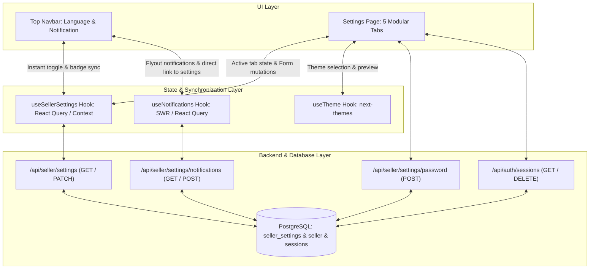

# Implementation Plan — Production-Grade Settings & Synchronization Architecture

## 1. Executive Summary & Current State Analysis

Based on the live browser inspection and codebase audit of **Needlon Seller**:
- The current **Settings Page** ([`packages/modules/modules/settings/section/setting-page.tsx`](file:///d:/web%20development/project/needlon_sellor-main/needlon_sellor-main/packages/modules/modules/settings/section/setting-page.tsx)) features an isolated layout split into a navigation rail and content workspace, but consists of static, disconnected UI elements without data fetching, mutations, or feedback.
- The **Top Navbar** ([`packages/modules/modules/top-navbar/components/lagnuagesAndNotification.tsx`](file:///d:/web%20development/project/needlon_sellor-main/needlon_sellor-main/packages/modules/modules/top-navbar/components/lagnuagesAndNotification.tsx)) contains a lonely `<Globe />` button with no dropdown or state, and a `<Bell />` notification flyout that is not synchronized with the seller's notification preferences.
- Existing database infrastructure already includes:
  - [`sellerSettings`](file:///d:/web%20development/project/needlon_sellor-main/needlon_sellor-main/packages/db/db/schema/seller/seller-setting.ts) with columns for `languageCode`, `currencyCode`, `timezone`, `theme`, notification channels (`emailNotifications`, `smsNotifications`, `pushNotifications`), and event triggers (`orderNotifications`, `payoutNotifications`, `lowInventoryNotifications`, `marketingNotifications`).
  - API endpoints at [`/api/seller/settings`](file:///d:/web%20development/project/needlon_sellor-main/needlon_sellor-main/apps/seller/app/api/seller/settings/route.ts), [`/api/seller/settings/notifications`](file:///d:/web%20development/project/needlon_sellor-main/needlon_sellor-main/apps/seller/app/api/seller/settings/notifications/route.ts), and [`/api/auth/sessions`](file:///d:/web%20development/project/needlon_sellor-main/needlon_sellor-main/apps/seller/app/api/auth/sessions/route.ts).

This plan establishes a complete, production-grade implementation that aligns the Settings interface with the design language of the rest of the application (e.g., `modules/seller-profile`, `modules/delivery`, and `modules/subscription`), while providing seamless real-time synchronization between the Top Navbar and Settings page.

---

## 2. Architecture & Dual-Position Synchronization

---

## 3. Feature Breakdown by Section

### Tab 1: Language & Localization (`language`)
- **Dual-Position Interaction**:
  - **In Navbar**: Clicking `<Globe />` opens an interactive dropdown showing the current selected language & currency, with quick-select options (English, Spanish, French, German, Hindi, Arabic, Japanese, Mandarin) and currency quick-switcher.
  - **In Settings Page**: A comprehensive localization card featuring:
    - Primary Language selector with country flags and native dialect names.
    - Primary Store Currency (`INR ₹`, `USD $`, `EUR €`, `GBP £`, `JPY ¥`, `CAD $`, `AUD $`) with live price format preview.
    - Timezone selector (`Asia/Kolkata`, `UTC`, `America/New_York`, `Europe/London`, `Asia/Tokyo`, etc.) with a live digital clock showing the current time in that timezone.
    - Automatic two-way synchronization: updating in the Navbar updates Settings instantly, and saving in Settings updates the Navbar immediately.

### Tab 2: Theme & Appearance (`theme`)
- **Next-Themes & Tailwind v4 Integration**:
  - Wrap the seller application in [`ThemeProvider`](file:///d:/web%20development/project/needlon_sellor-main/needlon_sellor-main/apps/seller/provider/theme-provider.tsx) supporting `system`, `light`, `dark`, and high-contrast modes.
  - Four visual theme selector cards with real-time active borders, checkmarks, and icons (`Sun`, `Moon`, `Monitor`, `Sparkles`).
  - Interactive live preview container demonstrating how buttons, badges, tables, and cards render in the chosen theme.
  - Theme selection persists immediately to `document.documentElement` and is saved to the database via `/api/seller/settings`.

### Tab 3: Security & Credentials (`security`)
- **Password Management**:
  - Form with Current Password, New Password, and Confirm Password.
  - Password strength meter (calculating length, lowercase, uppercase, numbers, symbols).
  - Validation with Zod and bcrypt comparison.
  - Dedicated API endpoint: [`/api/seller/settings/password`](file:///d:/web%20development/project/needlon_sellor-main/needlon_sellor-main/apps/seller/app/api/seller/settings/password/route.ts).
- **Active Sessions Management**:
  - Reads active seller sessions from [`/api/auth/sessions`](file:///d:/web%20development/project/needlon_sellor-main/needlon_sellor-main/apps/seller/app/api/auth/sessions/route.ts).
  - Shows current device badge ("Current Session"), IP address, user-agent/browser, and last active timestamp.
  - Action button: "Log out other sessions" with instant invalidation.

### Tab 4: Notifications & Alerts (`notifications`)
- **Dual-Position Interaction**:
  - **In Navbar**: Shows notification count badge, rich list of alerts, and a direct "⚙️ Notification Preferences" link that switches to `/settings?tab=notifications`.
  - **In Settings Page**:
    - **Channels Card**: Toggle Email notifications, SMS notifications, and Browser Push notifications with permission request integration.
    - **Events Matrix Card**: Toggle alerts for New Orders, Low Inventory, Payout Updates, Buyer Messages, Reviews, and Marketing Updates.
    - **Test Notification Button**: Clicking "Send Test Notification" immediately inserts an in-app alert and updates the top navbar bell with an unread badge and sound/visual cue.

### Tab 5: Account Management & Store Controls (`account`)
- **Store Status & Vacation Mode**:
  - Switch to toggle store visibility between `ACTIVE` and `VACATION_MODE` (pauses new checkouts while keeping existing orders manageable).
- **Data Export**:
  - "Download Store Settings Data" (exports JSON configuration).
- **Danger Zone / Account Deletion**:
  - Red accent safety zone with descriptive consequences.
  - Confirmation modal requiring the seller to type `"DELETE MY ACCOUNT"` to unlock the permanent deletion button.

---

## 4. UI/UX Design System Enhancement

To match [`modules/seller-profile`](file:///d:/web%20development/project/needlon_sellor-main/needlon_sellor-main/packages/modules/modules/seller-profile/view/seller-foundation-page.tsx) and [`modules/delivery`](file:///d:/web%20development/project/needlon_sellor-main/needlon_sellor-main/packages/modules/modules/delivery/view/delivery-setting-tab.tsx):
1. **Container Styling**:
   - High-contrast rounded card frame (`rounded-3xl border border-gray-200/80 bg-white shadow-xs dark:bg-neutral-900 dark:border-neutral-800`).
   - Breadcrumb navigation and header badge showing synchronization status (`Saved ✓`, `Saving...`).
2. **Navigation Rail**:
   - Modern active state with brand blue gradient pill (`bg-blue-600 text-white shadow-sm shadow-blue-600/20 dark:bg-blue-500`).
   - Badge counts or indicator dots for active alerts.
3. **Form Elements & Micro-Animations**:
   - Framer-motion / Tailwind animation transitions between tabs (`animate-in fade-in duration-200`).
   - Clean switch toggles with smooth transition physics.
   - Sonner toast notifications for all save and error states.

---

## 5. Detailed Implementation Tasks

| Phase | Component / File | Purpose |
| :--- | :--- | :--- |
| **Phase 1: Providers & Hook Layer** | `provider/theme-provider.tsx` `hooks/use-seller-settings.ts` | Setup `next-themes` provider in root layout. Create custom hook with React Query for fetching and updating `/api/seller/settings`. |
| **Phase 2: Navbar Dual-Position** | `modules/top-navbar/components/lagnuagesAndNotification.tsx` | Add interactive Language & Currency dropdown with quick switcher. Add "Notification Settings" navigation link in notification flyout. |
| **Phase 3: Backend Routes** | `/api/seller/settings/password/route.ts` `/api/seller/settings/test-notification/route.ts` | Password verification and bcrypt hash update with session revoke. Test notification trigger for real-time validation. |
| **Phase 4: Settings Page Refactor** | `modules/settings/section/setting-page.tsx` `modules/settings/view/setting-nav.tsx` `modules/settings/view/setting-content.tsx` | Modularize content workspace into clean sub-components: `LanguageTab`, `ThemeTab`, `SecurityTab`, `NotificationsTab`, `AccountTab`. |
| **Phase 5: Sub-Views & Modals** | `modules/settings/components/*` | Password strength component, Active sessions viewer, Test notification trigger, Account deletion confirmation modal. |
| **Phase 6: Testing & Verification** | `packages/modules/modules/settings/settings.test.ts` | Automated unit & integration tests for settings services, password hashing, and notification preference schemas. |

---

## 6. Testing & Quality Assurance Plan

1. **Automated Unit Tests**:
   - Schema validation tests for `updateSellerSettingsSchema` and `changePasswordSchema`.
   - Repository tests for `sellerSettingsRepository.findBySellerId` and `update`.
   - Password hashing verification and incorrect password rejection.
2. **Interactive Browser Testing**:
   - Switching language in Top Navbar verifies instant update in Settings tab.
   - Changing theme in Settings toggles `.dark` class on root HTML and persists across page reloads.
   - Updating notification toggles updates the database and the navbar alerts behavior.
   - Submitting password form validates requirements and rejects invalid current password.
   - Triggering test notification increments navbar unread badge immediately.
